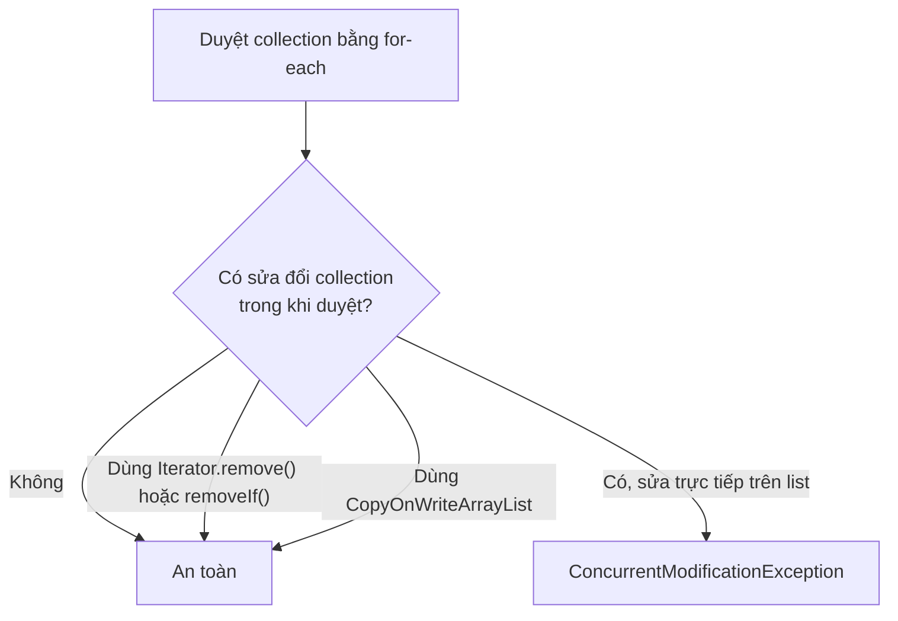

# Tránh lỗi ConcurrentModificationException trong Java

**ConcurrentModificationException** (ngoại lệ sửa đổi đồng thời — xảy ra khi một collection bị thay đổi trong khi đang được duyệt qua) là lỗi thường gặp khi làm việc với danh sách và vòng lặp trong Java.

Sơ đồ dưới đây tóm tắt khi nào việc duyệt và sửa đổi collection là an toàn, và khi nào sẽ ném ra ngoại lệ này.



Đọc sơ đồ: nguyên nhân gây lỗi là sửa trực tiếp collection trong lúc `for-each` đang duyệt; các cách an toàn đều tránh đụng chạm trực tiếp tới cấu trúc mà Iterator đang theo dõi.

---

## 1. Nguyên nhân

```java
import java.util.ArrayList;
import java.util.List;

public class LoiCME {
    public static void main(String[] args) {
        List<String> danhSach = new ArrayList<>();
        danhSach.add("cam");
        danhSach.add("xoai");
        danhSach.add("chuoi");

        // LỖI: Xóa phần tử trong khi đang duyệt bằng for-each
        for (String phanTu : danhSach) {
            if ("xoai".equals(phanTu)) {
                danhSach.remove(phanTu); // ConcurrentModificationException!
            }
        }
    }
}
```

Vòng lặp `for-each` sử dụng **Iterator** (bộ duyệt) nội bộ. Khi collection bị thay đổi ngoài Iterator đó, Java phát hiện sự không nhất quán và ném ra lỗi này.

---

## 2. Các cách khắc phục

### 2.1. Dùng Iterator trực tiếp và gọi iterator.remove()

```java
import java.util.ArrayList;
import java.util.Iterator;
import java.util.List;

public class DungIterator {
    public static void main(String[] args) {
        List<String> danhSach = new ArrayList<>();
        danhSach.add("cam");
        danhSach.add("xoai");
        danhSach.add("chuoi");

        Iterator<String> it = danhSach.iterator();
        while (it.hasNext()) {
            String phanTu = it.next();
            if ("xoai".equals(phanTu)) {
                it.remove(); // An toàn: dùng remove() của chính Iterator
            }
        }

        System.out.println(danhSach); // [cam, chuoi]
    }
}
```

### 2.2. Dùng removeIf() (từ Java 8)

```java
import java.util.ArrayList;
import java.util.List;

public class DungRemoveIf {
    public static void main(String[] args) {
        List<String> danhSach = new ArrayList<>();
        danhSach.add("cam");
        danhSach.add("xoai");
        danhSach.add("chuoi");

        // Gọn gàng và an toàn
        danhSach.removeIf(phanTu -> "xoai".equals(phanTu));

        System.out.println(danhSach); // [cam, chuoi]
    }
}
```

### 2.3. Dùng CopyOnWriteArrayList (trong môi trường đa luồng)

**`CopyOnWriteArrayList`** (danh sách sao chép khi ghi — mỗi lần sửa đổi tạo ra một bản sao mới) an toàn trong môi trường **multi-thread** (đa luồng):

```java
import java.util.List;
import java.util.concurrent.CopyOnWriteArrayList;

public class DungCopyOnWrite {
    public static void main(String[] args) {
        List<String> danhSach = new CopyOnWriteArrayList<>();
        danhSach.add("cam");
        danhSach.add("xoai");
        danhSach.add("chuoi");

        // An toàn: for-each duyệt trên bản snapshot, không bị ảnh hưởng khi xóa
        for (String phanTu : danhSach) {
            if ("xoai".equals(phanTu)) {
                danhSach.remove(phanTu); // Không ném ConcurrentModificationException
            }
        }

        System.out.println(danhSach); // [cam, chuoi]
    }
}
```

### 2.4. Dùng vòng lặp for thông thường với chỉ số (duyệt ngược)

```java
import java.util.ArrayList;
import java.util.List;

public class DuyetNguoc {
    public static void main(String[] args) {
        List<String> danhSach = new ArrayList<>();
        danhSach.add("cam");
        danhSach.add("xoai");
        danhSach.add("chuoi");

        // Duyệt ngược để tránh lệch chỉ số sau khi xóa
        for (int i = danhSach.size() - 1; i >= 0; i--) {
            if ("xoai".equals(danhSach.get(i))) {
                danhSach.remove(i);
            }
        }

        System.out.println(danhSach); // [cam, chuoi]
    }
}
```

---

## 3. Tóm tắt nhanh

| Cách xử lý | Ưu điểm | Dùng khi |
|---|---|---|
| `Iterator.remove()` | Tương thích mọi phiên bản Java | Xóa phần tử đơn giản |
| `removeIf()` | Ngắn gọn, dễ đọc | Java 8+, điều kiện xóa rõ ràng |
| `CopyOnWriteArrayList` | An toàn đa luồng | Môi trường multi-thread |
| Vòng lặp `for` ngược | Không cần import thêm | Khi cần kiểm soát chỉ số |
