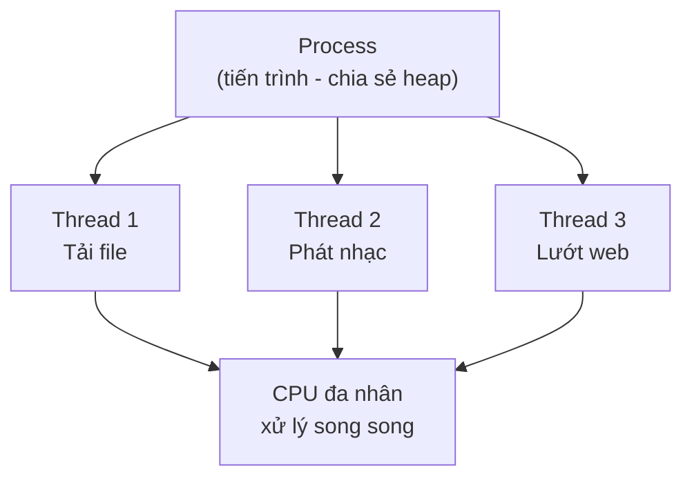
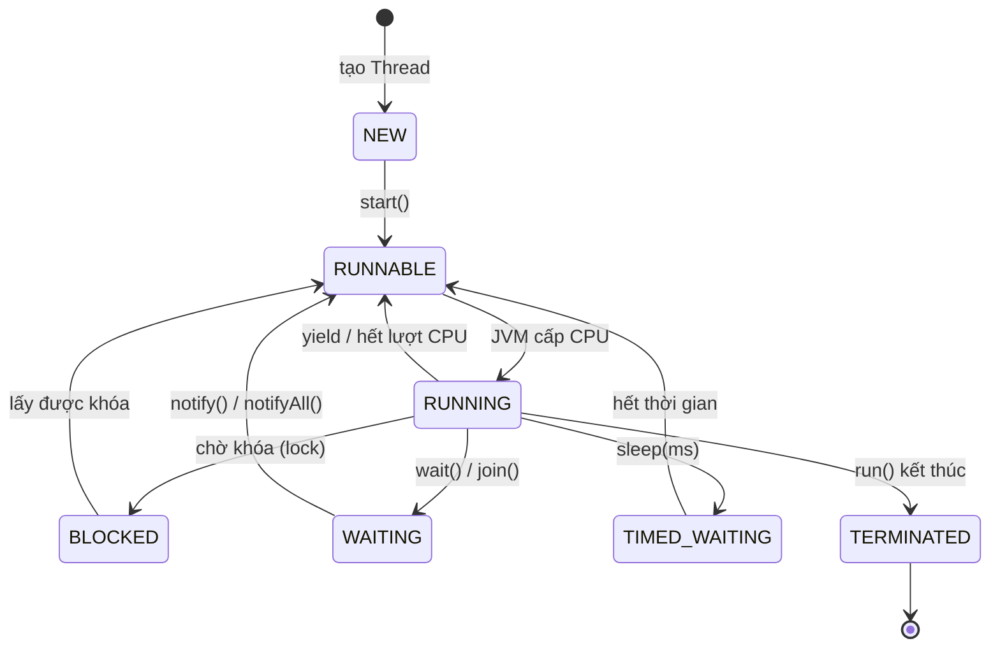

# Lập trình đa luồng trong Java - Java Multi-threading

Lập trình đa luồng là kỹ thuật cho phép một chương trình chạy nhiều tác vụ cùng lúc, giúp tận dụng CPU đa nhân và xử lý đồng thời hiệu quả. Bài này giới thiệu khái niệm Thread, vì sao cần đa luồng, các cách tạo luồng trong Java (kế thừa `Thread`, dùng `Runnable`, lambda) cùng vòng đời và các phương thức điều khiển luồng. Đây là nền tảng quan trọng trước khi học các chủ đề nâng cao như đồng bộ hóa hay thread pool.

:::note[Ghi nhớ nhanh]

- ⭐ **Ưu tiên `Runnable`/lambda hơn kế thừa `Thread`** — Java không hỗ trợ đa kế thừa nên `Runnable` linh hoạt hơn.
- ⭐ **Luôn gọi `start()`, không gọi `run()` trực tiếp** — gọi `run()` chỉ chạy trên luồng hiện tại, không tạo luồng mới.
- **Vòng đời luồng**: `NEW` → `RUNNABLE` → (`RUNNING`) → `BLOCKED`/`WAITING`/`TIMED_WAITING` → `TERMINATED`.
- **`join()`** để luồng chính chờ luồng khác kết thúc; **`sleep(ms)`** tạm dừng luồng có thời hạn.
- **Dữ liệu dùng chung cần đồng bộ hóa** để tránh lỗi `Race Condition`.

:::

## Giới thiệu

**Multi-threading** (lập trình đa luồng) là kỹ thuật cho phép một chương trình thực thi nhiều **Thread** (luồng — đơn vị thực thi nhỏ nhất của một tiến trình) cùng một lúc. Mỗi luồng chạy độc lập nhưng chia sẻ chung vùng nhớ (heap) của tiến trình (**Process** — chương trình đang chạy).

Hiểu đơn giản: khi bạn vừa nghe nhạc, vừa tải file, vừa lướt web — máy tính đang dùng đa luồng để xử lý song song các tác vụ đó.

Sơ đồ dưới đây minh họa một tiến trình (Process) chứa nhiều luồng (Thread) cùng chia sẻ vùng nhớ và được CPU đa nhân xử lý song song:



## Tại sao cần lập trình đa luồng?

- **Tận dụng CPU đa nhân**: các nhân CPU có thể xử lý các luồng song song thực sự.
- **Cải thiện hiệu năng**: tác vụ nặng (đọc file, gọi API) không chặn toàn bộ chương trình.
- **Tăng trải nghiệm người dùng**: giao diện vẫn phản hồi khi xử lý nền.
- **Xử lý đồng thời**: máy chủ web cần phục vụ hàng nghìn yêu cầu cùng lúc.

## Khi nào nên dùng?

- Tác vụ I/O nặng: đọc/ghi file, gọi mạng, truy vấn cơ sở dữ liệu.
- Tính toán phức tạp có thể chia nhỏ song song.
- Ứng dụng cần xử lý nhiều yêu cầu đồng thời (server, game, ...).

## Hai cách tạo Thread trong Java

### Cách 1: Kế thừa lớp `Thread`

```java
public class MyThread extends Thread {

    private String tenNhiemVu;

    public MyThread(String tenNhiemVu) {
        this.tenNhiemVu = tenNhiemVu;
    }

    // Ghi đè phương thức run() — đây là phần code chạy trong luồng
    @Override
    public void run() {
        for (int i = 1; i <= 5; i++) {
            System.out.println(tenNhiemVu + " - bước " + i
                    + " | Luồng: " + Thread.currentThread().getName());
            try {
                // sleep(ms) — tạm dừng luồng hiện tại (mô phỏng xử lý)
                Thread.sleep(500);
            } catch (InterruptedException e) {
                System.out.println(tenNhiemVu + " bị gián đoạn!");
                Thread.currentThread().interrupt(); // khôi phục trạng thái interrupt
            }
        }
    }

    public static void main(String[] args) {
        MyThread luong1 = new MyThread("Tải file");
        MyThread luong2 = new MyThread("Phát nhạc");

        // start() — khởi động luồng, JVM sẽ gọi run() trong luồng mới
        luong1.start();
        luong2.start();

        System.out.println("Luồng chính tiếp tục chạy...");
    }
}
```

**Kết quả mẫu** (thứ tự có thể thay đổi mỗi lần chạy):
```
Luồng chính tiếp tục chạy...
Tải file - bước 1 | Luồng: Thread-0
Phát nhạc - bước 1 | Luồng: Thread-1
Tải file - bước 2 | Luồng: Thread-0
Phát nhạc - bước 2 | Luồng: Thread-1
...
```

### Cách 2: Implement interface `Runnable` (khuyến nghị)

```java
public class NhiemVuInAn implements Runnable {

    private String tenTaiLieu;

    public NhiemVuInAn(String tenTaiLieu) {
        this.tenTaiLieu = tenTaiLieu;
    }

    // Runnable yêu cầu implement phương thức run()
    @Override
    public void run() {
        System.out.println("Đang in: " + tenTaiLieu
                + " trên luồng " + Thread.currentThread().getName());
        try {
            Thread.sleep(1000); // mô phỏng thời gian in
        } catch (InterruptedException e) {
            Thread.currentThread().interrupt();
        }
        System.out.println("Hoàn thành in: " + tenTaiLieu);
    }

    public static void main(String[] args) {
        // Truyền Runnable vào Thread
        Thread t1 = new Thread(new NhiemVuInAn("Báo cáo tháng 1"));
        Thread t2 = new Thread(new NhiemVuInAn("Hóa đơn khách hàng"));
        Thread t3 = new Thread(new NhiemVuInAn("Bảng lương"));

        t1.start();
        t2.start();
        t3.start();

        // join() — luồng chính chờ t1, t2, t3 hoàn thành rồi mới tiếp tục
        try {
            t1.join();
            t2.join();
            t3.join();
        } catch (InterruptedException e) {
            Thread.currentThread().interrupt();
        }

        System.out.println("Tất cả tài liệu đã được in xong!");
    }
}
```

### Cách 3: Dùng Lambda (Java 8+)

```java
public class LambdaThread {
    public static void main(String[] args) throws InterruptedException {
        // Runnable là functional interface — có thể dùng lambda
        Thread luongTinhToan = new Thread(() -> {
            long tong = 0;
            for (int i = 0; i <= 1_000_000; i++) {
                tong += i;
            }
            System.out.println("Tổng = " + tong);
        });

        luongTinhToan.start();
        luongTinhToan.join(); // chờ kết quả
        System.out.println("Tính toán hoàn tất!");
    }
}
```

## Vòng đời của một Thread

Một luồng đi qua nhiều trạng thái từ khi được tạo đến khi kết thúc. Sơ đồ trạng thái sau mô tả các bước chuyển tiếp và phương thức gây ra chúng — đọc theo mũi tên: nhãn trên mũi tên là sự kiện/phương thức làm luồng đổi trạng thái.



| Trạng thái | Mô tả |
|---|---|
| **NEW** | Luồng được tạo nhưng chưa gọi `start()` |
| **RUNNABLE** | Đang chạy hoặc sẵn sàng chạy (chờ CPU) |
| **BLOCKED** | Đang chờ khóa (lock) của đối tượng |
| **WAITING** | Đang chờ vô thời hạn (do `wait()`, `join()`) |
| **TIMED_WAITING** | Đang chờ có giới hạn thời gian (`sleep(ms)`) |
| **TERMINATED** | Đã hoàn thành hoặc bị dừng |

## Một số phương thức quan trọng

| Phương thức | Ý nghĩa |
|---|---|
| `start()` | Khởi động luồng, JVM tạo luồng mới và gọi `run()` |
| `run()` | Phần code thực thi trong luồng |
| `sleep(ms)` | Tạm dừng luồng trong số mili-giây chỉ định |
| `join()` | Chờ luồng khác kết thúc |
| `interrupt()` | Gửi tín hiệu gián đoạn tới luồng |
| `isAlive()` | Kiểm tra luồng còn đang chạy không |
| `getName()` | Lấy tên luồng |
| `getPriority()` | Lấy độ ưu tiên của luồng (1-10) |

## Lưu ý quan trọng

- **Không gọi trực tiếp `run()`** — gọi `run()` chỉ thực thi trong luồng hiện tại, không tạo luồng mới. Phải gọi `start()`.
- **Ưu tiên dùng `Runnable`** thay vì kế thừa `Thread` vì Java không hỗ trợ đa kế thừa — dùng `Runnable` linh hoạt hơn.
- **Truy cập biến dùng chung** giữa các luồng cần đồng bộ hóa (xem bài Synchronized) để tránh lỗi **Race Condition** (điều kiện tranh chấp — nhiều luồng đọc/ghi cùng dữ liệu gây kết quả sai).

## Tổng kết

Multi-threading giúp chương trình Java tận dụng tối đa phần cứng và xử lý đồng thời nhiều tác vụ. Hai cách tạo luồng phổ biến là kế thừa `Thread` và implement `Runnable`, trong đó `Runnable` (hoặc lambda) được khuyến nghị hơn. Cần nắm vững vòng đời luồng và các phương thức điều khiển để lập trình đa luồng hiệu quả và an toàn.
