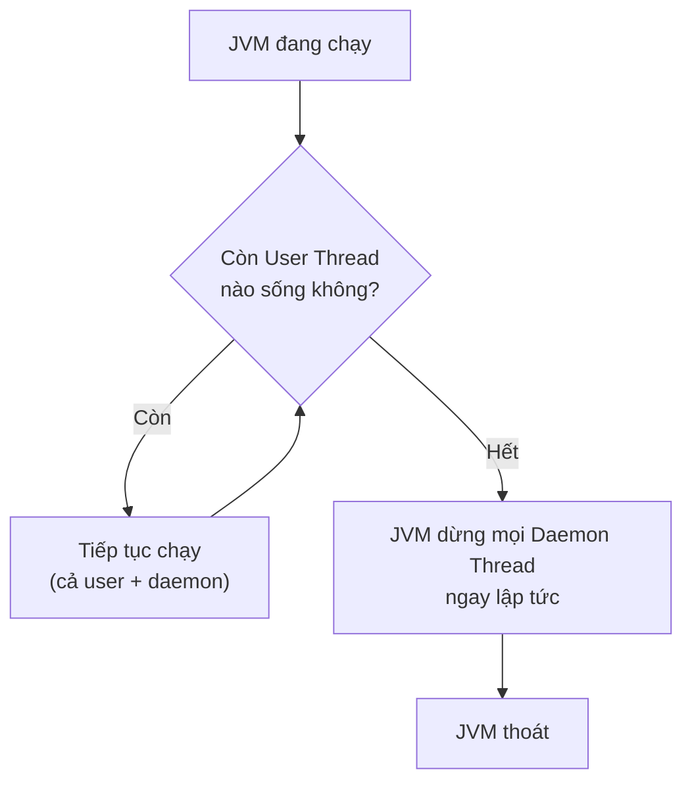

# Luồng Daemon (Daemon Thread) trong Java

Daemon Thread là loại luồng chạy ngầm để phục vụ các tác vụ phụ trợ, và JVM sẽ tự dừng chúng khi mọi luồng người dùng đã kết thúc. Bài này giải thích sự khác nhau giữa user thread và daemon thread, cách tạo daemon thread đúng cách bằng `setDaemon(true)`, cùng các ví dụ và lỗi thường gặp. Hiểu khái niệm này giúp bạn biết khi nào nên dùng luồng nền và khi nào tuyệt đối không nên.

:::note[Ghi nhớ nhanh]

- ⭐ **Gọi `setDaemon(true)` TRƯỚC `start()`** — gọi sau sẽ ném `IllegalThreadStateException`.
- ⭐ **JVM không chờ daemon thread** — khi mọi user thread kết thúc, daemon bị dừng đột ngột.
- **Daemon dùng cho tác vụ nền phụ trợ** (GC, giám sát, ghi log nền), KHÔNG dùng cho tác vụ quan trọng.
- **Luồng con kế thừa trạng thái daemon từ luồng cha**; luồng `main` luôn là user thread.
- **Kiểm tra bằng `isDaemon()`**.

:::

## Daemon Thread là gì?

Trong Java, có hai loại luồng:

- **User Thread** (luồng người dùng): luồng thông thường, JVM sẽ chờ tất cả user thread kết thúc trước khi thoát chương trình.
- **Daemon Thread** (luồng nền — luồng hỗ trợ): luồng chạy ngầm, JVM **không chờ** daemon thread — khi tất cả user thread kết thúc, JVM tự động dừng toàn bộ daemon thread và thoát, dù chúng chưa hoàn thành.

Hình dung: daemon thread giống nhân viên phục vụ trong nhà hàng. Khi tất cả khách (user thread) rời đi, nhà hàng đóng cửa — nhân viên cũng phải dừng việc ngay lập tức.

Sơ đồ dưới mô tả cách JVM quyết định thoát: JVM chỉ quan tâm tới user thread, khi không còn user thread nào sống thì dừng ngay mọi daemon thread rồi thoát.



## Khi nào nên dùng Daemon Thread?

- Các tác vụ **phụ trợ** không quan trọng về kết quả: thu gom rác (**Garbage Collector** — bộ thu gom rác tự động của JVM), giám sát hệ thống, ghi log nền, cache tự động làm mới.
- Các tác vụ chỉ có ý nghĩa khi chương trình còn đang chạy.
- **Không dùng** cho tác vụ cần đảm bảo hoàn thành: lưu dữ liệu vào cơ sở dữ liệu, ghi file quan trọng — vì JVM có thể dừng đột ngột.

## Cách tạo Daemon Thread

Gọi `setDaemon(true)` **trước khi** gọi `start()`. Nếu gọi sau `start()` sẽ ném `IllegalThreadStateException`.

### Ví dụ cơ bản

```java
public class DaemonThreadDemo {

    public static void main(String[] args) throws InterruptedException {

        // User Thread — luồng người dùng thông thường
        Thread luongNguoiDung = new Thread(() -> {
            for (int i = 1; i <= 5; i++) {
                System.out.println("User Thread - bước " + i);
                try {
                    Thread.sleep(300);
                } catch (InterruptedException e) {
                    Thread.currentThread().interrupt();
                }
            }
            System.out.println("User Thread hoàn thành.");
        });

        // Daemon Thread — luồng nền
        Thread luongNen = new Thread(() -> {
            int buoc = 1;
            while (true) { // chạy mãi mãi
                System.out.println("Daemon Thread - nhịp tim " + buoc++);
                try {
                    Thread.sleep(200);
                } catch (InterruptedException e) {
                    Thread.currentThread().interrupt();
                    break;
                }
            }
            // Dòng này có thể KHÔNG BAO GIỜ được in nếu JVM thoát sớm
            System.out.println("Daemon Thread kết thúc bình thường.");
        });

        // Đánh dấu là daemon TRƯỚC khi start()
        luongNen.setDaemon(true);

        luongNen.start();
        luongNguoiDung.start();

        luongNguoiDung.join(); // chờ user thread xong
        System.out.println("Luồng chính kết thúc — JVM sẽ thoát ngay.");
        // Daemon thread bị dừng đột ngột tại đây
    }
}
```

**Kết quả mẫu:**
```
Daemon Thread - nhịp tim 1
User Thread - bước 1
Daemon Thread - nhịp tim 2
User Thread - bước 2
...
User Thread hoàn thành.
Luồng chính kết thúc — JVM sẽ thoát ngay.
```
Dòng "Daemon Thread kết thúc bình thường." không xuất hiện vì JVM đã thoát.

## Ví dụ thực tế: Giám sát bộ nhớ nền

```java
public class GiamSatBonNho {

    // Daemon thread giám sát bộ nhớ định kỳ
    static void khoiDongGiamSat() {
        Thread giamSat = new Thread(() -> {
            Runtime runtime = Runtime.getRuntime();
            while (!Thread.currentThread().isInterrupted()) {
                long tongBonNho = runtime.totalMemory() / 1024 / 1024;   // MB
                long bonNhoRanh = runtime.freeMemory() / 1024 / 1024;    // MB
                long dangDung = tongBonNho - bonNhoRanh;

                System.out.printf("[Giám sát] Bộ nhớ đang dùng: %d MB / %d MB%n",
                        dangDung, tongBonNho);

                try {
                    Thread.sleep(2000); // kiểm tra mỗi 2 giây
                } catch (InterruptedException e) {
                    Thread.currentThread().interrupt();
                }
            }
        });

        giamSat.setDaemon(true);          // đây là daemon
        giamSat.setName("MemoryMonitor"); // đặt tên dễ nhận biết
        giamSat.start();
    }

    public static void main(String[] args) throws InterruptedException {
        khoiDongGiamSat(); // khởi động giám sát nền

        // Mô phỏng công việc chính của ứng dụng
        System.out.println("Ứng dụng bắt đầu xử lý...");
        for (int i = 1; i <= 3; i++) {
            System.out.println("Xử lý tác vụ " + i);
            Thread.sleep(3000);
        }
        System.out.println("Ứng dụng hoàn thành. Thoát.");
        // Daemon giám sát tự động dừng khi main() kết thúc
    }
}
```

## Kiểm tra trạng thái Daemon

```java
public class KiemTraDaemon {
    public static void main(String[] args) {
        Thread t1 = new Thread(() -> {});
        Thread t2 = new Thread(() -> {});

        t2.setDaemon(true);

        System.out.println("t1 là daemon? " + t1.isDaemon()); // false
        System.out.println("t2 là daemon? " + t2.isDaemon()); // true

        // Luồng chính (main) luôn là user thread
        System.out.println("main là daemon? "
                + Thread.currentThread().isDaemon()); // false

        // Luồng con kế thừa trạng thái daemon từ luồng cha
        Thread t3 = new Thread(() -> {
            Thread luongCon = new Thread(() -> {});
            System.out.println("Luồng con của daemon: " + luongCon.isDaemon()); // true
        });
        t3.setDaemon(true);
        t3.start();
    }
}
```

## Gọi setDaemon() sau start() — lỗi phổ biến

```java
public class LuuYDaemon {
    public static void main(String[] args) {
        Thread t = new Thread(() -> {
            try { Thread.sleep(1000); } catch (InterruptedException e) {}
        });

        t.start();

        // LỖI: IllegalThreadStateException — không thể thay đổi sau khi start()
        try {
            t.setDaemon(true);
        } catch (IllegalThreadStateException e) {
            System.out.println("Lỗi: " + e.getMessage());
            // Lỗi: Thread already started.
        }
    }
}
```

## So sánh User Thread và Daemon Thread

| Tiêu chí | User Thread | Daemon Thread |
|---|---|---|
| JVM thoát khi | Tất cả user thread kết thúc | Không chờ daemon thread |
| Mục đích | Tác vụ chính của ứng dụng | Tác vụ hỗ trợ, phục vụ nền |
| Thiết lập | Mặc định | `setDaemon(true)` trước `start()` |
| Khi JVM thoát | Chạy đến hoàn thành | Bị dừng đột ngột |
| Ví dụ | Xử lý đơn hàng, giao diện | GC, giám sát, cache |

## Tổng kết

Daemon Thread là công cụ hữu ích cho các tác vụ chạy nền, hỗ trợ ứng dụng mà không cần đảm bảo hoàn thành. Điểm mấu chốt cần nhớ: **thiết lập `setDaemon(true)` trước `start()`** và **không dùng daemon cho tác vụ quan trọng** vì JVM có thể dừng chúng bất cứ lúc nào mà không có cơ chế dọn dẹp.
