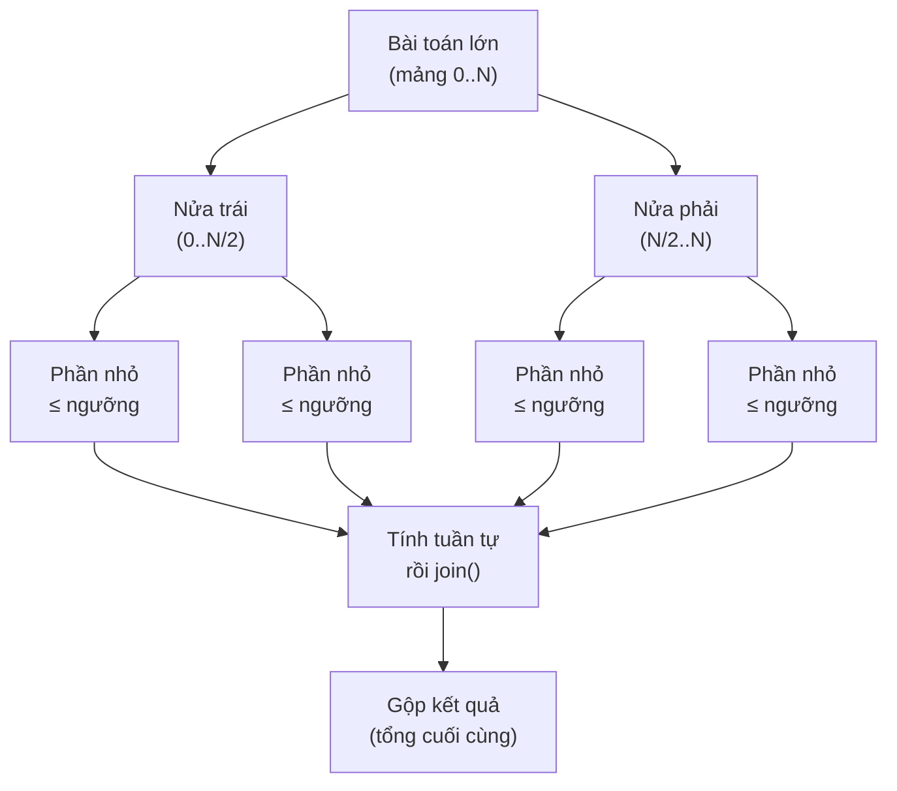

# Sử dụng Fork/Join Framework với ForkJoinPool trong Java

Fork/Join là cách Java giúp ta xử lý các bài toán lớn bằng kiểu "chia để trị": tách bài toán thành nhiều phần nhỏ chạy song song trên nhiều nhân CPU rồi gộp kết quả lại. Đây là công cụ rất hữu ích khi cần tăng tốc các tác vụ tính toán nặng trên dữ liệu lớn. Bài này giới thiệu khái niệm tổng quan cùng các ví dụ thực tế; chi tiết nằm bên dưới.

:::note[Ghi nhớ nhanh]

- ⭐ **Fork/Join áp dụng chiến lược chia để trị**: `fork()` chia tác vụ, `join()` gộp kết quả; tối ưu cho tác vụ CPU-bound.
- **`RecursiveTask<V>`** khi tác vụ có trả về; **`RecursiveAction`** khi không trả về (void).
- **`ForkJoinPool`** dùng kỹ thuật Work Stealing, mặc định số luồng bằng số nhân CPU.
- ⭐ **Chọn ngưỡng chia (threshold) hợp lý** — quá nhỏ tốn chi phí quản lý, quá lớn không tận dụng hết CPU.
- **Java 8+ `parallelStream()`** dùng `ForkJoinPool.commonPool()` ngầm bên dưới.

:::

## Fork/Join Framework là gì?

**Fork/Join Framework** (khung chia-gộp) là cơ chế xử lý song song được thiết kế cho bài toán có thể áp dụng chiến lược **Divide and Conquer** (chia để trị — chia bài toán lớn thành các bài toán nhỏ hơn, giải song song rồi gộp kết quả).

Hai khái niệm cốt lõi:
- **Fork** (chia): tách bài toán thành hai bài toán con nhỏ hơn, giao cho các luồng khác xử lý.
- **Join** (gộp): đợi tất cả bài toán con hoàn thành rồi gộp kết quả.

**ForkJoinPool** (bể luồng chia-gộp) là `ExecutorService` đặc biệt dùng kỹ thuật **Work Stealing** (đánh cắp công việc — luồng nhàn rỗi lấy việc từ hàng đợi của luồng bận) để tối ưu hiệu năng. Mặc định số luồng bằng số nhân CPU.

Sơ đồ dưới minh họa chiến lược chia để trị: bài toán lớn được **fork** (chia) xuống các phần nhỏ đến khi đạt ngưỡng, tính tuần tự, rồi **join** (gộp) ngược lên thành kết quả cuối:



## Khi nào nên dùng?

- Bài toán tính toán nặng có thể chia nhỏ đệ quy: sắp xếp, tìm kiếm, xử lý mảng lớn.
- Xử lý song song trên tập dữ liệu lớn (parallel streams trong Java 8+ dùng ForkJoinPool ngầm).
- **Không phù hợp** với tác vụ I/O (đọc file, gọi mạng) — Fork/Join tối ưu cho CPU-bound.

## Hai lớp cơ bản

| Lớp | Khi nào dùng |
|---|---|
| `RecursiveTask<V>` | Tác vụ **có trả về** kết quả |
| `RecursiveAction` | Tác vụ **không trả về** (void) |

## Ví dụ 1: Tính tổng mảng với RecursiveTask

```java
import java.util.concurrent.*;

public class TinhTongSongSong extends RecursiveTask<Long> {

    private static final int NGUONG = 1000; // chia khi mảng con > 1000 phần tử
    private final int[] mang;
    private final int batDau;
    private final int ketThuc;

    public TinhTongSongSong(int[] mang, int batDau, int ketThuc) {
        this.mang = mang;
        this.batDau = batDau;
        this.ketThuc = ketThuc;
    }

    @Override
    protected Long compute() {
        int kichThuoc = ketThuc - batDau;

        // Trường hợp cơ sở — mảng nhỏ, tính tuần tự
        if (kichThuoc <= NGUONG) {
            long tong = 0;
            for (int i = batDau; i < ketThuc; i++) {
                tong += mang[i];
            }
            return tong;
        }

        // Chia đôi mảng
        int giua = batDau + kichThuoc / 2;

        TinhTongSongSong nua1 = new TinhTongSongSong(mang, batDau, giua);
        TinhTongSongSong nua2 = new TinhTongSongSong(mang, giua, ketThuc);

        // fork() — gửi nua2 cho luồng khác xử lý bất đồng bộ
        nua2.fork();

        // compute() — xử lý nua1 trực tiếp trên luồng hiện tại
        long ketQua1 = nua1.compute();

        // join() — chờ nua2 hoàn thành và lấy kết quả
        long ketQua2 = nua2.join();

        return ketQua1 + ketQua2;
    }

    public static void main(String[] args) {
        // Tạo mảng 10 triệu phần tử
        int soLuong = 10_000_000;
        int[] mang = new int[soLuong];
        for (int i = 0; i < soLuong; i++) {
            mang[i] = i + 1; // 1, 2, 3, ..., 10_000_000
        }

        // ForkJoinPool.commonPool() — pool dùng chung, số luồng = số nhân CPU
        ForkJoinPool pool = ForkJoinPool.commonPool();
        System.out.println("Số luồng trong pool: " + pool.getParallelism());

        TinhTongSongSong tacVu = new TinhTongSongSong(mang, 0, soLuong);

        long batDau = System.currentTimeMillis();
        Long tongSongSong = pool.invoke(tacVu);
        long thoiGianSongSong = System.currentTimeMillis() - batDau;

        System.out.println("Tổng (song song): " + tongSongSong);
        System.out.println("Thời gian (song song): " + thoiGianSongSong + "ms");

        // So sánh với tính tuần tự
        batDau = System.currentTimeMillis();
        long tongTuanTu = 0;
        for (int x : mang) tongTuanTu += x;
        long thoiGianTuanTu = System.currentTimeMillis() - batDau;

        System.out.println("Tổng (tuần tự): " + tongTuanTu);
        System.out.println("Thời gian (tuần tự): " + thoiGianTuanTu + "ms");
    }
}
```

## Ví dụ 2: Sắp xếp MergeSort song song với RecursiveAction

```java
import java.util.Arrays;
import java.util.concurrent.*;

public class MergeSortSongSong extends RecursiveAction {

    private static final int NGUONG = 500;
    private final int[] mang;
    private final int batDau;
    private final int ketThuc;

    public MergeSortSongSong(int[] mang, int batDau, int ketThuc) {
        this.mang = mang;
        this.batDau = batDau;
        this.ketThuc = ketThuc;
    }

    @Override
    protected void compute() {
        if (ketThuc - batDau <= NGUONG) {
            // Sắp xếp tuần tự phần nhỏ
            Arrays.sort(mang, batDau, ketThuc);
            return;
        }

        int giua = batDau + (ketThuc - batDau) / 2;

        MergeSortSongSong nua1 = new MergeSortSongSong(mang, batDau, giua);
        MergeSortSongSong nua2 = new MergeSortSongSong(mang, giua, ketThuc);

        // invokeAll() — fork cả hai và chờ cả hai hoàn thành
        invokeAll(nua1, nua2);

        // Gộp hai nửa đã sắp xếp
        merge(mang, batDau, giua, ketThuc);
    }

    private void merge(int[] mang, int batDau, int giua, int ketThuc) {
        int[] tam = Arrays.copyOfRange(mang, batDau, ketThuc);
        int i = 0, j = giua - batDau, k = batDau;
        int lenRight = ketThuc - batDau;

        while (i < giua - batDau && j < lenRight) {
            if (tam[i] <= tam[j]) {
                mang[k++] = tam[i++];
            } else {
                mang[k++] = tam[j++];
            }
        }
        while (i < giua - batDau) mang[k++] = tam[i++];
        while (j < lenRight) mang[k++] = tam[j++];
    }

    public static void main(String[] args) {
        int[] mang = new int[100_000];
        for (int i = 0; i < mang.length; i++) {
            mang[i] = (int) (Math.random() * 1_000_000);
        }

        ForkJoinPool pool = new ForkJoinPool(); // mặc định = số nhân CPU
        pool.invoke(new MergeSortSongSong(mang, 0, mang.length));

        // Kiểm tra đã sắp xếp đúng chưa
        boolean daSapXep = true;
        for (int i = 1; i < mang.length; i++) {
            if (mang[i] < mang[i - 1]) { daSapXep = false; break; }
        }
        System.out.println("Sắp xếp đúng: " + daSapXep);

        pool.shutdown();
    }
}
```

## Ví dụ 3: Tìm số lớn nhất trong mảng

```java
import java.util.concurrent.*;

public class TimSoLonNhat extends RecursiveTask<Integer> {

    private static final int NGUONG = 200;
    private final int[] mang;
    private final int batDau;
    private final int ketThuc;

    public TimSoLonNhat(int[] mang, int batDau, int ketThuc) {
        this.mang = mang;
        this.batDau = batDau;
        this.ketThuc = ketThuc;
    }

    @Override
    protected Integer compute() {
        if (ketThuc - batDau <= NGUONG) {
            int max = mang[batDau];
            for (int i = batDau + 1; i < ketThuc; i++) {
                if (mang[i] > max) max = mang[i];
            }
            return max;
        }

        int giua = batDau + (ketThuc - batDau) / 2;
        TimSoLonNhat nua1 = new TimSoLonNhat(mang, batDau, giua);
        TimSoLonNhat nua2 = new TimSoLonNhat(mang, giua, ketThuc);

        nua2.fork();
        int max1 = nua1.compute();
        int max2 = nua2.join();

        return Math.max(max1, max2);
    }

    public static void main(String[] args) {
        int[] mang = {5, 3, 8, 2, 9, 1, 7, 4, 6, 10, 15, 11, 13, 12, 14};

        ForkJoinPool pool = ForkJoinPool.commonPool();
        Integer max = pool.invoke(new TimSoLonNhat(mang, 0, mang.length));
        System.out.println("Số lớn nhất: " + max); // 15
    }
}
```

## Ngưỡng chia (Threshold) — quan trọng khi tối ưu

Ngưỡng chia (**threshold**) quyết định khi nào dừng chia và tính tuần tự. Cần cân bằng:

- **Ngưỡng quá nhỏ**: tạo ra quá nhiều tác vụ nhỏ — chi phí quản lý tác vụ lớn hơn lợi ích song song.
- **Ngưỡng quá lớn**: ít tác vụ — không tận dụng hết CPU.
- **Quy tắc thực tế**: thường đặt ngưỡng từ 100 đến 10,000 tùy kích thước dữ liệu và phép tính.

## Tổng kết

Fork/Join Framework là công cụ mạnh mẽ cho bài toán **chia để trị song song**:
- `RecursiveTask<V>` — dùng khi tác vụ cần trả về giá trị.
- `RecursiveAction` — dùng khi tác vụ chỉ xử lý, không trả về.
- Kỹ thuật Work Stealing đảm bảo các CPU luôn bận rộn, không lãng phí tài nguyên.
- Luôn chọn ngưỡng chia phù hợp — quá nhỏ hay quá lớn đều làm giảm hiệu năng.
- Java 8+ `parallelStream()` sử dụng `ForkJoinPool.commonPool()` ngầm bên dưới.
