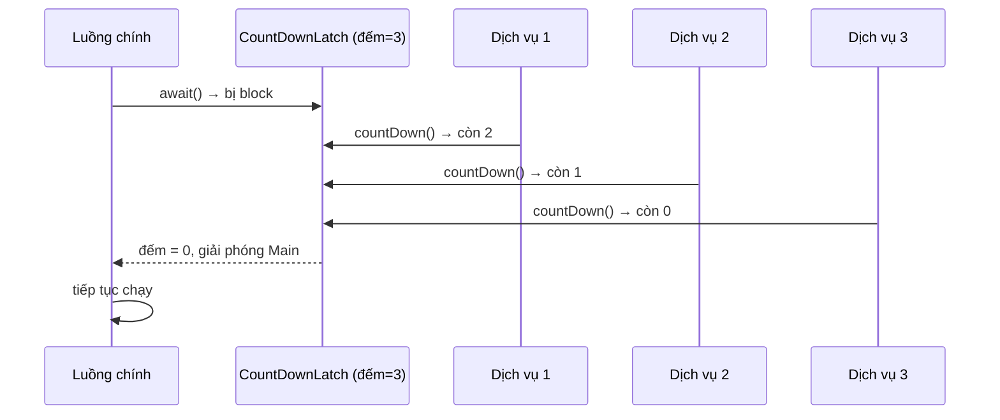

# Sử dụng CountDownLatch trong Java

`CountDownLatch` là một công cụ đồng bộ hóa giúp một luồng chờ cho đến khi nhiều luồng khác hoàn thành công việc. Nó hoạt động như một chiếc chốt có bộ đếm: mỗi tác vụ xong thì giảm đếm đi một, khi đếm về 0 thì luồng đang chờ được tiếp tục. Bài này giới thiệu khái niệm và cách dùng phổ biến; chi tiết nằm bên dưới.

## CountDownLatch là gì?

**CountDownLatch** (chốt đếm ngược — cơ chế đồng bộ hóa cho phép một hoặc nhiều luồng chờ đến khi một tập hợp thao tác hoàn thành) nằm trong gói `java.util.concurrent`.

Nguyên lý hoạt động giống chiếc chốt cửa có bộ đếm:
- Khởi tạo với số đếm `N`.
- Mỗi khi một tác vụ hoàn thành, gọi `countDown()` — giảm đếm đi 1.
- Khi đếm về 0, tất cả luồng đang `await()` được giải phóng đồng thời.
- **Một chiều**: sau khi đếm về 0 thì không reset lại được — nếu cần reset hãy dùng `CyclicBarrier`.

Sơ đồ tuần tự sau minh họa luồng chính gọi `await()` và bị block; mỗi dịch vụ hoàn thành gọi `countDown()` giảm bộ đếm, khi về 0 thì luồng chính được giải phóng:



## Khi nào nên dùng?

- Chờ tất cả dịch vụ (database, cache, message queue) khởi động xong trước khi bắt đầu xử lý.
- Khởi động nhiều luồng cùng một lúc (như súng phát tín hiệu).
- Chờ tất cả tác vụ song song hoàn thành trước khi gộp kết quả.
- Kiểm thử — đồng bộ hóa các luồng test.

## Ví dụ 1: Ứng dụng chờ dịch vụ khởi động

```java
import java.util.concurrent.*;

public class KhoiDongUngDung {

    public static void main(String[] args) throws InterruptedException {
        // 3 dịch vụ cần khởi động trước khi ứng dụng chạy
        CountDownLatch chot = new CountDownLatch(3);

        // Dịch vụ 1: Kết nối Database
        Thread database = new Thread(() -> {
            try {
                System.out.println("[Database] Đang kết nối...");
                Thread.sleep(2000);
                System.out.println("[Database] Kết nối thành công!");
            } catch (InterruptedException e) {
                Thread.currentThread().interrupt();
            } finally {
                chot.countDown(); // Giảm đếm từ 3 xuống 2
                System.out.println("[Database] countDown() — còn lại: " + chot.getCount());
            }
        });

        // Dịch vụ 2: Kết nối Redis Cache
        Thread redis = new Thread(() -> {
            try {
                System.out.println("[Redis] Đang kết nối...");
                Thread.sleep(1000);
                System.out.println("[Redis] Kết nối thành công!");
            } catch (InterruptedException e) {
                Thread.currentThread().interrupt();
            } finally {
                chot.countDown(); // Giảm đếm từ 2 xuống 1
                System.out.println("[Redis] countDown() — còn lại: " + chot.getCount());
            }
        });

        // Dịch vụ 3: Tải cấu hình
        Thread config = new Thread(() -> {
            try {
                System.out.println("[Config] Đang tải cấu hình...");
                Thread.sleep(1500);
                System.out.println("[Config] Tải xong!");
            } catch (InterruptedException e) {
                Thread.currentThread().interrupt();
            } finally {
                chot.countDown(); // Giảm đếm từ 1 xuống 0 → mở chốt
                System.out.println("[Config] countDown() — còn lại: " + chot.getCount());
            }
        });

        database.start();
        redis.start();
        config.start();

        System.out.println("[Main] Đang chờ tất cả dịch vụ khởi động...");

        // await() — luồng main bị block đến khi đếm về 0
        chot.await();
        System.out.println("[Main] Tất cả dịch vụ sẵn sàng! Ứng dụng bắt đầu chạy.");
    }
}
```

**Kết quả mẫu:**
```
[Main] Đang chờ tất cả dịch vụ khởi động...
[Database] Đang kết nối...
[Redis] Đang kết nối...
[Config] Đang tải cấu hình...
[Redis] Kết nối thành công!
[Redis] countDown() — còn lại: 2
[Config] Tải xong!
[Config] countDown() — còn lại: 1
[Database] Kết nối thành công!
[Database] countDown() — còn lại: 0
[Main] Tất cả dịch vụ sẵn sàng! Ứng dụng bắt đầu chạy.
```

## Ví dụ 2: Tín hiệu khởi động — nhiều luồng cùng xuất phát

Dùng **hai** CountDownLatch:
- Latch 1 (`ready`): mỗi vận động viên đăng ký "đã sẵn sàng".
- Latch 2 (`start`): trọng tài đếm ngược, tất cả vận động viên chờ rồi cùng chạy.

```java
import java.util.concurrent.*;

public class CuocDuaXuatPhat {

    public static void main(String[] args) throws InterruptedException {
        int soVanDongVien = 5;
        // Latch chờ tất cả vận động viên sẵn sàng
        CountDownLatch sanSang = new CountDownLatch(soVanDongVien);
        // Latch tín hiệu xuất phát (1 = chưa bắn súng, 0 = xuất phát)
        CountDownLatch xuatPhat = new CountDownLatch(1);

        for (int i = 1; i <= soVanDongVien; i++) {
            final int soThu = i;
            new Thread(() -> {
                try {
                    System.out.println("Vận động viên " + soThu + " vào vạch xuất phát...");
                    Thread.sleep((long) (Math.random() * 1000));

                    System.out.println("Vận động viên " + soThu + " sẵn sàng!");
                    sanSang.countDown(); // báo hiệu đã sẵn sàng

                    // Chờ tín hiệu xuất phát từ trọng tài
                    xuatPhat.await();

                    System.out.println("Vận động viên " + soThu + " CHẠY! "
                            + Thread.currentThread().getName());

                } catch (InterruptedException e) {
                    Thread.currentThread().interrupt();
                }
            }).start();
        }

        // Trọng tài chờ tất cả vào vị trí
        sanSang.await();
        System.out.println("\nTrọng tài: Tất cả sẵn sàng! Chuẩn bị...");
        Thread.sleep(1000);
        System.out.println("Trọng tài: BẮN SÚNG! XUẤT PHÁT!\n");

        // Mở latch — tất cả luồng chờ được giải phóng đồng thời
        xuatPhat.countDown();
    }
}
```

## Ví dụ 3: Chờ nhiều tác vụ song song rồi gộp kết quả

```java
import java.util.*;
import java.util.concurrent.*;
import java.util.concurrent.atomic.AtomicLong;

public class XuLySongSongVoiLatch {

    public static void main(String[] args) throws InterruptedException {
        int soTacVu = 6;
        CountDownLatch latch = new CountDownLatch(soTacVu);

        // AtomicLong — biến long an toàn với đa luồng (không cần synchronized)
        AtomicLong tongDoanhThu = new AtomicLong(0);

        ExecutorService executor = Executors.newFixedThreadPool(3);

        String[] chiNhanh = {"Hà Nội", "TP.HCM", "Đà Nẵng",
                             "Cần Thơ", "Hải Phòng", "Huế"};

        for (String chiNhanh1 : chiNhanh) {
            executor.submit(() -> {
                try {
                    // Mô phỏng truy vấn doanh thu từng chi nhánh
                    Thread.sleep((long) (Math.random() * 2000 + 500));
                    long doanhThu = (long) (Math.random() * 100_000_000);
                    System.out.printf("%-12s: %,d VND%n", chiNhanh1, doanhThu);
                    tongDoanhThu.addAndGet(doanhThu);

                } catch (InterruptedException e) {
                    Thread.currentThread().interrupt();
                } finally {
                    latch.countDown(); // luôn đếm ngược dù thành công hay lỗi
                }
            });
        }

        // Chờ có timeout — tối đa 10 giây
        boolean tatCaXong = latch.await(10, TimeUnit.SECONDS);

        if (tatCaXong) {
            System.out.printf("%nTổng doanh thu toàn quốc: %,d VND%n",
                    tongDoanhThu.get());
        } else {
            System.out.println("Một số chi nhánh chưa báo cáo sau 10 giây!");
        }

        executor.shutdown();
    }
}
```

## Các phương thức quan trọng

| Phương thức | Mô tả |
|---|---|
| `new CountDownLatch(n)` | Tạo latch với đếm ban đầu là n |
| `countDown()` | Giảm đếm đi 1 (không block, không throw exception) |
| `await()` | Block cho đến khi đếm về 0 |
| `await(timeout, unit)` | Block tối đa thời gian chỉ định, trả về `false` nếu timeout |
| `getCount()` | Lấy giá trị đếm hiện tại |

## Lưu ý quan trọng

- **Luôn gọi `countDown()` trong khối `finally`** — đảm bảo đếm ngược ngay cả khi có exception, tránh trường hợp `await()` chờ mãi mãi.
- **Không thể tái sử dụng** — khi đếm về 0 thì latch "hết hạn", không reset được. Dùng `CyclicBarrier` nếu cần tái sử dụng.
- **Một chiều** — chỉ đếm ngược, không đếm lên.

## Tổng kết

`CountDownLatch` là công cụ đơn giản và hiệu quả để:
- Chờ nhiều tác vụ hoàn thành trước khi tiếp tục.
- Đồng bộ hóa điểm xuất phát của nhiều luồng.
- Tích hợp kết quả từ các luồng song song.

Điểm mấu chốt: **luôn đặt `countDown()` trong `finally`** và nhớ rằng latch chỉ dùng một lần.
