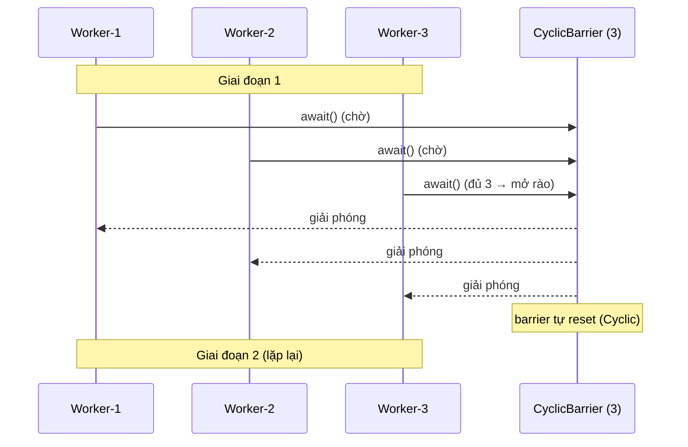

# Sử dụng CyclicBarrier trong Java

`CyclicBarrier` là cơ chế giúp một nhóm luồng chờ nhau tại một điểm gặp chung, rồi cùng nhau đi tiếp. Khác với `CountDownLatch`, nó có thể tái sử dụng nhiều lần nên rất hợp với các bài toán xử lý theo nhiều vòng hoặc nhiều giai đoạn. Bài này giới thiệu khái niệm tổng quan và so sánh với `CountDownLatch`; chi tiết nằm bên dưới.

## CyclicBarrier là gì?

**CyclicBarrier** (rào chắn chu kỳ — cơ chế đồng bộ cho phép một nhóm luồng chờ nhau tại một điểm gặp chung, rồi cùng tiến về phía trước) là class trong `java.util.concurrent`.

Điểm gặp chung này gọi là **Barrier Point** (điểm rào chắn). Mỗi luồng khi đến điểm này sẽ gọi `await()` và chờ. Khi đủ số luồng đã chờ, tất cả được giải phóng đồng thời.

Từ **Cyclic** (chu kỳ) nghĩa là có thể **tái sử dụng** — sau khi barrier được kích hoạt, nó tự động reset và sẵn sàng cho chu kỳ tiếp theo.

Sơ đồ tuần tự sau minh họa 3 luồng chờ nhau tại barrier: luồng nào đến trước gọi `await()` và chờ, khi đủ 3 luồng thì rào mở, tất cả cùng đi tiếp; sau đó barrier tự reset cho giai đoạn kế:



## So sánh CyclicBarrier và CountDownLatch

| Tiêu chí | CountDownLatch | CyclicBarrier |
|---|---|---|
| Tái sử dụng | Không (dùng 1 lần) | Có (tự reset sau mỗi lần kích hoạt) |
| Ai đếm ngược | Bất kỳ luồng nào | Chỉ các luồng tham gia barrier |
| Luồng chờ | Một hoặc nhiều luồng chờ N sự kiện | N luồng chờ lẫn nhau |
| Hành động khi kích hoạt | Không | Có thể chạy Runnable `barrierAction` |

## Khi nào nên dùng?

- Bài toán tính toán **nhiều vòng** (iteration) cần đồng bộ giữa các vòng.
- Game nhiều người chơi — chờ tất cả người chơi sẵn sàng trước mỗi lượt.
- Kiểm tra hiệu năng (benchmark) — khởi động tất cả luồng cùng lúc.
- Xử lý dữ liệu theo **giai đoạn**: tất cả luồng xong giai đoạn 1 mới được vào giai đoạn 2.

## Ví dụ 1: Ba giai đoạn xử lý dữ liệu

```java
import java.util.concurrent.*;

public class XuLyNhieuGiaiDoan {

    public static void main(String[] args) {
        int soLuong = 3; // 3 luồng tham gia

        // Hành động chạy khi barrier kích hoạt (optional)
        Runnable hanhDongGiaiDoan = () ->
                System.out.println("\n>>> Tất cả hoàn thành giai đoạn này. Chuyển giai đoạn!\n");

        CyclicBarrier barrier = new CyclicBarrier(soLuong, hanhDongGiaiDoan);

        for (int i = 1; i <= soLuong; i++) {
            final int id = i;
            new Thread(() -> {
                try {
                    // --- GIAI ĐOẠN 1: Thu thập dữ liệu ---
                    System.out.println("Luồng " + id + " đang thu thập dữ liệu...");
                    Thread.sleep((long) (Math.random() * 1000 + 500));
                    System.out.println("Luồng " + id + " xong giai đoạn 1. Chờ...");
                    barrier.await(); // Chờ tất cả xong giai đoạn 1

                    // --- GIAI ĐOẠN 2: Xử lý dữ liệu ---
                    System.out.println("Luồng " + id + " đang xử lý dữ liệu...");
                    Thread.sleep((long) (Math.random() * 1000 + 500));
                    System.out.println("Luồng " + id + " xong giai đoạn 2. Chờ...");
                    barrier.await(); // Chờ tất cả xong giai đoạn 2

                    // --- GIAI ĐOẠN 3: Lưu kết quả ---
                    System.out.println("Luồng " + id + " đang lưu kết quả...");
                    Thread.sleep((long) (Math.random() * 500 + 200));
                    System.out.println("Luồng " + id + " xong giai đoạn 3. Chờ...");
                    barrier.await(); // Chờ tất cả xong giai đoạn 3

                    System.out.println("Luồng " + id + " hoàn thành tất cả giai đoạn!");

                } catch (InterruptedException | BrokenBarrierException e) {
                    Thread.currentThread().interrupt();
                    System.out.println("Luồng " + id + " bị gián đoạn: " + e.getMessage());
                }
            }, "Worker-" + id).start();
        }
    }
}
```

**Kết quả mẫu:**
```
Luồng 1 đang thu thập dữ liệu...
Luồng 2 đang thu thập dữ liệu...
Luồng 3 đang thu thập dữ liệu...
Luồng 3 xong giai đoạn 1. Chờ...
Luồng 1 xong giai đoạn 1. Chờ...
Luồng 2 xong giai đoạn 1. Chờ...

>>> Tất cả hoàn thành giai đoạn này. Chuyển giai đoạn!

Luồng 1 đang xử lý dữ liệu...
...
```

## Ví dụ 2: Game đa người chơi — chờ tất cả sẵn sàng

```java
import java.util.concurrent.*;

public class GameNhieuNguoiChoi {

    static final int SO_NGUOI_CHOI = 4;

    // Barrier với hành động thông báo khi tất cả sẵn sàng
    static final CyclicBarrier barrierSanSang =
            new CyclicBarrier(SO_NGUOI_CHOI, () ->
                    System.out.println("\n=== TẤT CẢ SẴN SÀNG! BẮT ĐẦU LƯỢT MỚI ===\n"));

    static void chayLuot(String tenNguoi, int luot) throws InterruptedException, BrokenBarrierException {
        System.out.println(tenNguoi + " đang chơi lượt " + luot + "...");
        Thread.sleep((long) (Math.random() * 2000 + 500));
        System.out.println(tenNguoi + " hoàn thành lượt " + luot + ". Chờ bạn chơi...");

        // Chờ tất cả người chơi xong lượt này
        barrierSanSang.await();
    }

    public static void main(String[] args) {
        String[] nguoiChoi = {"Alice", "Bob", "Charlie", "Diana"};
        int soLuot = 3;

        for (String ten : nguoiChoi) {
            new Thread(() -> {
                try {
                    for (int luot = 1; luot <= soLuot; luot++) {
                        chayLuot(ten, luot);
                    }
                    System.out.println(ten + " kết thúc game!");
                } catch (InterruptedException | BrokenBarrierException e) {
                    Thread.currentThread().interrupt();
                }
            }, ten).start();
        }
    }
}
```

## Ví dụ 3: Benchmark — đo hiệu năng nhiều luồng cùng xuất phát

```java
import java.util.concurrent.*;
import java.util.concurrent.atomic.AtomicLong;

public class BenchmarkSongSong {

    static final int SO_LUONG = 5;
    // Barrier để tất cả luồng xuất phát cùng lúc
    static final CyclicBarrier startBarrier = new CyclicBarrier(SO_LUONG + 1); // +1 cho main
    static final AtomicLong tongThoiGian = new AtomicLong(0);

    public static void main(String[] args) throws InterruptedException, BrokenBarrierException {

        for (int i = 1; i <= SO_LUONG; i++) {
            final int id = i;
            new Thread(() -> {
                try {
                    System.out.println("Luồng " + id + " sẵn sàng benchmark...");
                    startBarrier.await(); // Chờ tất cả sẵn sàng

                    // Bắt đầu đo thời gian
                    long t0 = System.currentTimeMillis();

                    // Tác vụ cần benchmark
                    long sum = 0;
                    for (int j = 0; j < 10_000_000; j++) sum += j;

                    long thoiGian = System.currentTimeMillis() - t0;
                    System.out.println("Luồng " + id + " xong: " + thoiGian + "ms (sum=" + sum + ")");
                    tongThoiGian.addAndGet(thoiGian);

                } catch (InterruptedException | BrokenBarrierException e) {
                    Thread.currentThread().interrupt();
                }
            }).start();
        }

        // Luồng main cũng tham gia barrier để kick off tất cả
        System.out.println("Tất cả sẵn sàng. Bắt đầu!");
        startBarrier.await();

        Thread.sleep(5000); // Chờ kết quả
        System.out.println("Tổng thời gian: " + tongThoiGian.get() + "ms");
        System.out.printf("Trung bình: %.1f ms/luồng%n", tongThoiGian.get() / (double) SO_LUONG);
    }
}
```

## Xử lý BrokenBarrierException

**BrokenBarrierException** (ngoại lệ rào chắn vỡ) xảy ra khi:
- Một luồng đang `await()` bị **interrupt**.
- **Timeout** khi dùng `await(timeout, unit)`.
- Lúc đó barrier chuyển sang trạng thái **broken** — tất cả luồng đang chờ đều nhận `BrokenBarrierException`.

```java
CyclicBarrier barrier = new CyclicBarrier(3);

// Kiểm tra barrier có bị vỡ không
if (barrier.isBroken()) {
    System.out.println("Barrier đã bị vỡ, không thể dùng tiếp!");
    barrier.reset(); // Reset về trạng thái ban đầu
}

// await với timeout
try {
    barrier.await(5, TimeUnit.SECONDS); // Chờ tối đa 5 giây
} catch (TimeoutException e) {
    System.out.println("Timeout — barrier bị vỡ!");
} catch (BrokenBarrierException e) {
    System.out.println("Barrier đã vỡ từ trước: " + e.getMessage());
}
```

## Tổng kết

`CyclicBarrier` lý tưởng cho bài toán nhiều luồng cần **đồng bộ tại nhiều điểm** trong quá trình xử lý:
- Tự động reset sau mỗi lần kích hoạt — phù hợp cho vòng lặp nhiều giai đoạn.
- Hỗ trợ `barrierAction` — chạy một tác vụ khi tất cả luồng tập hợp đủ.
- Phân biệt với `CountDownLatch`: dùng khi các luồng cần **chờ nhau** (không phải chờ sự kiện bên ngoài) và cần **tái sử dụng**.
- Luôn xử lý `BrokenBarrierException` và `InterruptedException` đúng cách.
