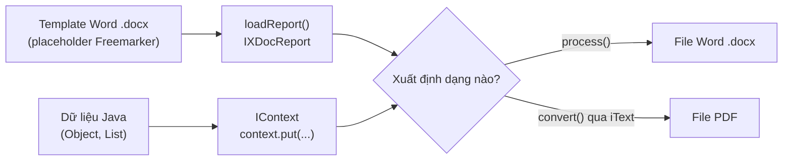

# Hướng dẫn xuất dữ liệu ra file Word, PDF với xDocReport

xDocReport là thư viện giúp tạo file Word và PDF từ một template (mẫu) Word có sẵn các chỗ trống để điền dữ liệu. Cách làm này rất tiện khi cần xuất hợp đồng, hóa đơn hay báo cáo có bố cục phức tạp mà khó dựng bằng code thuần. Bài này giới thiệu khái niệm tổng quan cùng các bước tạo template và xuất file; chi tiết nằm bên dưới.

## xDocReport là gì?

**xDocReport** (Extended Document Report — thư viện Java tạo tài liệu Word/PDF từ template) là thư viện mã nguồn mở cho phép:
- Tạo file Word (`.docx`) hoặc ODP từ **template** (mẫu — file có sẵn với các placeholder)
- Xuất file PDF từ file Word
- Hỗ trợ engine mẫu **Freemarker** và **Velocity**

Sơ đồ dưới đây minh họa luồng tạo tài liệu với xDocReport: nạp template Word, đưa dữ liệu vào context, rồi xuất ra Word (`process`) hoặc PDF (`convert`).



---

## Dependency Maven

```xml
<!-- xDocReport core -->
<dependency>
    <groupId>fr.opensagres.xdocreport</groupId>
    <artifactId>fr.opensagres.xdocreport.document.docx</artifactId>
    <version>2.0.5</version>
</dependency>

<!-- Template engine Freemarker -->
<dependency>
    <groupId>fr.opensagres.xdocreport</groupId>
    <artifactId>fr.opensagres.xdocreport.template.freemarker</artifactId>
    <version>2.0.5</version>
</dependency>

<!-- Converter sang PDF (dùng iText) -->
<dependency>
    <groupId>fr.opensagres.xdocreport</groupId>
    <artifactId>fr.opensagres.xdocreport.converter.docx.xwpf</artifactId>
    <version>2.0.5</version>
</dependency>

<!-- iText để tạo PDF -->
<dependency>
    <groupId>com.lowagie</groupId>
    <artifactId>itext</artifactId>
    <version>2.1.7</version>
</dependency>
```

---

## Bước 1: Tạo template Word (.docx)

Tạo file Word (`bao-cao-template.docx`) với nội dung mẫu dùng cú pháp **Freemarker**:

```
BÁO CÁO NHÂN VIÊN

Kính gửi: ${tenCongTy}
Ngày lập: ${ngayLap}

Thông tin nhân viên:
  - Họ tên:   ${nhanVien.hoTen}
  - Chức vụ:  ${nhanVien.chucVu}
  - Phòng ban: ${nhanVien.phongBan}
  - Lương:    ${nhanVien.luong}

Danh sách dự án:
<#list cacDuAn as da>
  ${da_index + 1}. ${da.ten} - Trạng thái: ${da.trangThai}
</#list>

Người lập báo cáo: ______________
```

> **Freemarker** (thư viện template engine — bộ máy tạo tài liệu từ mẫu): `${biến}` để chèn giá trị, `<#list>` để lặp danh sách.

---

## Bước 2: Tạo dữ liệu và xuất Word

```java
import fr.opensagres.xdocreport.core.XDocReportException;
import fr.opensagres.xdocreport.document.IXDocReport;
import fr.opensagres.xdocreport.document.registry.XDocReportRegistry;
import fr.opensagres.xdocreport.template.IContext;
import fr.opensagres.xdocreport.template.TemplateEngineKind;
import fr.opensagres.xdocreport.template.formatter.FieldsMetadata;
import java.io.*;
import java.time.LocalDate;
import java.time.format.DateTimeFormatter;
import java.util.*;

public class XuatBaoCaoWord {
    // Model dữ liệu
    public static class NhanVien {
        private String hoTen, chucVu, phongBan, luong;
        public NhanVien(String hoTen, String chucVu, String phongBan, String luong) {
            this.hoTen = hoTen; this.chucVu = chucVu;
            this.phongBan = phongBan; this.luong = luong;
        }
        public String getHoTen() { return hoTen; }
        public String getChucVu() { return chucVu; }
        public String getPhongBan() { return phongBan; }
        public String getLuong() { return luong; }
    }

    public static class DuAn {
        private String ten, trangThai;
        public DuAn(String ten, String trangThai) {
            this.ten = ten; this.trangThai = trangThai;
        }
        public String getTen() { return ten; }
        public String getTrangThai() { return trangThai; }
    }

    public static void main(String[] args) throws XDocReportException, IOException {
        // 1. Tải template từ classpath hoặc file
        InputStream templateStream = new FileInputStream("bao-cao-template.docx");

        // 2. Đăng ký report với engine Freemarker
        IXDocReport report = XDocReportRegistry.getRegistry()
            .loadReport(templateStream, TemplateEngineKind.Freemarker);

        // 3. Khai báo metadata cho danh sách (để xử lý <#list>)
        FieldsMetadata metadata = report.createFieldsMetadata();
        metadata.load("cacDuAn", DuAn.class, true); // true = là danh sách

        // 4. Tạo context và đưa dữ liệu vào
        IContext context = report.createContext();
        context.put("tenCongTy", "Công ty TNHH Công nghệ ABC");
        context.put("ngayLap", LocalDate.now().format(
            DateTimeFormatter.ofPattern("dd/MM/yyyy")));

        NhanVien nv = new NhanVien(
            "Nguyễn Thị Hương", "Kỹ sư phần mềm", "R&D", "25.000.000 VNĐ/tháng");
        context.put("nhanVien", nv);

        List<DuAn> danhSachDA = List.of(
            new DuAn("Hệ thống ERP", "Đang thực hiện"),
            new DuAn("Ứng dụng di động", "Hoàn thành"),
            new DuAn("API tích hợp", "Lên kế hoạch")
        );
        context.put("cacDuAn", danhSachDA);

        // 5. Xuất ra file Word
        try (OutputStream outputWord = new FileOutputStream("bao-cao-nhan-vien.docx")) {
            report.process(context, outputWord);
        }
        System.out.println("Đã xuất file Word: bao-cao-nhan-vien.docx");
    }
}
```

---

## Bước 3: Xuất PDF từ template Word

```java
import fr.opensagres.xdocreport.converter.ConverterTypeTo;
import fr.opensagres.xdocreport.converter.ConverterTypeVia;
import fr.opensagres.xdocreport.converter.Options;
import fr.opensagres.xdocreport.core.XDocReportException;
import fr.opensagres.xdocreport.document.IXDocReport;
import fr.opensagres.xdocreport.document.registry.XDocReportRegistry;
import fr.opensagres.xdocreport.template.IContext;
import fr.opensagres.xdocreport.template.TemplateEngineKind;
import java.io.*;

public class XuatBaoCaoPDF {
    public static void main(String[] args) throws XDocReportException, IOException {
        InputStream templateStream = new FileInputStream("bao-cao-template.docx");

        IXDocReport report = XDocReportRegistry.getRegistry()
            .loadReport(templateStream, TemplateEngineKind.Freemarker);

        IContext context = report.createContext();
        context.put("tenCongTy", "Công ty TNHH Công nghệ ABC");
        context.put("ngayLap", "04/06/2026");
        // ... thêm dữ liệu khác ...

        // Options: tùy chọn chuyển đổi — chỉ định đầu ra là PDF, qua iText
        Options options = Options.getTo(ConverterTypeTo.PDF)
            .via(ConverterTypeVia.XWPF);

        // Xuất thẳng ra PDF
        try (OutputStream outputPDF = new FileOutputStream("bao-cao-nhan-vien.pdf")) {
            report.convert(context, options, outputPDF);
        }
        System.out.println("Đã xuất file PDF: bao-cao-nhan-vien.pdf");
    }
}
```

---

## Tạo template Word có bảng dữ liệu

Trong file Word template, tạo một bảng với hàng lặp:

```
| STT          | Họ tên          | Phòng ban       | Lương             |
|--------------|-----------------|-----------------|-------------------|
| ${nv_index+1}| ${nv.hoTen}     | ${nv.phongBan}  | ${nv.luong}       |
```

```java
import fr.opensagres.xdocreport.template.formatter.FieldsMetadata;
import fr.opensagres.xdocreport.document.IXDocReport;

public class XuatBangDuLieu {
    public static class NhanVien {
        private String hoTen, phongBan, luong;
        public NhanVien(String hoTen, String phongBan, String luong) {
            this.hoTen = hoTen; this.phongBan = phongBan; this.luong = luong;
        }
        public String getHoTen() { return hoTen; }
        public String getPhongBan() { return phongBan; }
        public String getLuong() { return luong; }
    }

    public static void xuatBang(IXDocReport report, String fileDau) throws Exception {
        // Khai báo "nv" là danh sách NhanVien để xử lý lặp trong bảng
        FieldsMetadata metadata = report.createFieldsMetadata();
        metadata.load("nv", NhanVien.class, true);

        var context = report.createContext();
        context.put("tieuDe", "DANH SÁCH NHÂN VIÊN THÁNG 6/2026");
        context.put("nv", java.util.List.of(
            new NhanVien("Nguyễn Văn An", "Kỹ thuật", "25.000.000"),
            new NhanVien("Trần Thị Bình", "Kinh doanh", "20.000.000"),
            new NhanVien("Lê Minh Chi", "Kế toán", "18.000.000")
        ));

        try (var out = new java.io.FileOutputStream(fileDau)) {
            report.process(context, out);
        }
        System.out.println("Xuất xong: " + fileDau);
    }
}
```

---

## Lưu ý khi dùng xDocReport

1. **Font chữ tiếng Việt trong PDF:** Cần nhúng font vào template Word hoặc cấu hình iText với font hỗ trợ Unicode.

2. **Template phải được mở bởi Word/LibreOffice** để kiểm tra cú pháp Freemarker trước khi dùng.

3. **Cache template:** `XDocReportRegistry` tự động cache report theo ID — tránh nạp lại template mỗi request.

4. **Thay thế bằng Jasper Reports hoặc Apache FOP** khi cần báo cáo phức tạp với biểu đồ, watermark, header/footer động.

---

## Tóm tắt

| Bước | Mô tả |
|------|-------|
| 1 | Tạo file `.docx` template với cú pháp Freemarker |
| 2 | Nạp template vào `IXDocReport` |
| 3 | Tạo `IContext` và đưa dữ liệu vào |
| 4 | Gọi `report.process()` để xuất Word |
| 5 | Gọi `report.convert()` với `Options.getTo(PDF)` để xuất PDF |

xDocReport phù hợp khi cần **xuất tài liệu từ mẫu Word**, đặc biệt khi thiết kế tài liệu phức tạp (hợp đồng, báo cáo, hóa đơn) không thể mô tả bằng code đơn thuần.
