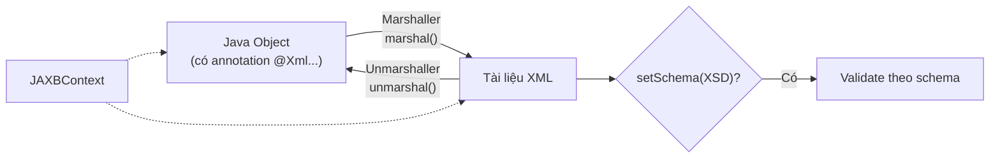

# Chuyển đổi Java Object sang XML và XML sang Java Object với JAXB

JAXB là API giúp chuyển đổi qua lại giữa object Java và dữ liệu XML một cách tự động, chỉ bằng cách đánh dấu các annotation lên class. Nó thường được dùng khi làm việc với Web Service SOAP hoặc các file cấu hình dạng XML. Bài này giới thiệu khái niệm tổng quan cùng ví dụ marshalling và unmarshalling; chi tiết nằm bên dưới.

## JAXB là gì?

**JAXB** (Java Architecture for XML Binding — kiến trúc Java để ràng buộc với XML) là API cho phép:
- **Marshalling** (tuần tự hóa XML — chuyển Java Object thành XML)
- **Unmarshalling** (giải tuần tự hóa XML — chuyển XML thành Java Object)

JAXB sử dụng **annotation** (chú thích — metadata đánh dấu trên class/field) để ánh xạ giữa Java và XML.

> Từ Java 11, JAXB bị loại khỏi JDK. Cần thêm dependency để sử dụng.

Sơ đồ dưới đây minh họa hai chiều chuyển đổi của JAXB: **Marshalling** (Java Object thành XML) và **Unmarshalling** (XML thành Java Object), đều đi qua `JAXBContext`.



---

## Dependency Maven

```xml
<dependency>
    <groupId>jakarta.xml.bind</groupId>
    <artifactId>jakarta.xml.bind-api</artifactId>
    <version>4.0.2</version>
</dependency>
<dependency>
    <groupId>com.sun.xml.bind</groupId>
    <artifactId>jaxb-impl</artifactId>
    <version>4.0.5</version>
    <scope>runtime</scope>
</dependency>
```

---

## Annotation JAXB thường dùng

| Annotation | Vị trí áp dụng | Ý nghĩa |
|-----------|---------------|---------|
| `@XmlRootElement` | Class | Đánh dấu class là phần tử gốc của XML |
| `@XmlElement` | Field/Method | Ánh xạ thành phần tử XML con |
| `@XmlAttribute` | Field/Method | Ánh xạ thành thuộc tính XML |
| `@XmlTransient` | Field/Method | Bỏ qua, không đưa vào XML |
| `@XmlElementWrapper` | Collection | Bọc danh sách trong một phần tử XML |
| `@XmlType` | Class | Đặt thứ tự phần tử trong XML |

---

## Tạo Java Class với JAXB Annotation

```java
import jakarta.xml.bind.annotation.*;
import java.util.List;

// @XmlRootElement: đây là phần tử gốc khi marshal/unmarshal
@XmlRootElement(name = "cong-ty")
@XmlType(propOrder = {"ten", "diaChi", "nhanViens"}) // Thứ tự phần tử trong XML
public class CongTy {

    @XmlElement(name = "ten-cong-ty")
    private String ten;

    @XmlElement(name = "dia-chi")
    private String diaChi;

    // @XmlElementWrapper: bọc danh sách trong thẻ <danh-sach-nv>
    // @XmlElement: mỗi phần tử trong danh sách dùng tên <nhan-vien>
    @XmlElementWrapper(name = "danh-sach-nv")
    @XmlElement(name = "nhan-vien")
    private List<NhanVien> nhanViens;

    // JAXB yêu cầu constructor không tham số (no-arg constructor)
    public CongTy() {}

    public CongTy(String ten, String diaChi, List<NhanVien> nhanViens) {
        this.ten = ten;
        this.diaChi = diaChi;
        this.nhanViens = nhanViens;
    }

    // Getters và Setters (cần thiết cho JAXB)
    public String getTen() { return ten; }
    public void setTen(String ten) { this.ten = ten; }
    public String getDiaChi() { return diaChi; }
    public void setDiaChi(String diaChi) { this.diaChi = diaChi; }
    public List<NhanVien> getNhanViens() { return nhanViens; }
    public void setNhanViens(List<NhanVien> nhanViens) { this.nhanViens = nhanViens; }
}
```

```java
import jakarta.xml.bind.annotation.*;

@XmlRootElement(name = "nhan-vien")
@XmlType(propOrder = {"maNV", "hoTen", "tuoi", "phongBan"})
public class NhanVien {

    @XmlAttribute(name = "ma") // Trở thành thuộc tính XML: <nhan-vien ma="NV001">
    private String maNV;

    @XmlElement(name = "ho-ten")
    private String hoTen;

    @XmlElement
    private int tuoi;

    @XmlElement(name = "phong-ban")
    private String phongBan;

    @XmlTransient // Không đưa vào XML
    private String matKhau;

    public NhanVien() {}

    public NhanVien(String maNV, String hoTen, int tuoi, String phongBan) {
        this.maNV = maNV; this.hoTen = hoTen;
        this.tuoi = tuoi; this.phongBan = phongBan;
    }

    // Getters và Setters
    public String getMaNV() { return maNV; }
    public void setMaNV(String maNV) { this.maNV = maNV; }
    public String getHoTen() { return hoTen; }
    public void setHoTen(String hoTen) { this.hoTen = hoTen; }
    public int getTuoi() { return tuoi; }
    public void setTuoi(int tuoi) { this.tuoi = tuoi; }
    public String getPhongBan() { return phongBan; }
    public void setPhongBan(String phongBan) { this.phongBan = phongBan; }
}
```

---

## Marshalling — Chuyển Java Object sang XML

```java
import jakarta.xml.bind.*;
import java.io.*;
import java.util.*;

public class MarshalViDu {
    public static void main(String[] args) throws JAXBException {
        // Tạo dữ liệu
        List<NhanVien> nhanViens = List.of(
            new NhanVien("NV001", "Nguyễn Văn An", 28, "Kỹ thuật"),
            new NhanVien("NV002", "Trần Thị Bình", 32, "Kinh doanh")
        );
        CongTy congTy = new CongTy("Công ty ABC", "123 Nguyễn Trãi, Hà Nội", nhanViens);

        // JAXBContext: ngữ cảnh JAXB cho class cần xử lý
        JAXBContext jaxbContext = JAXBContext.newInstance(CongTy.class);

        // Marshaller: đối tượng thực hiện chuyển đổi Java → XML
        Marshaller marshaller = jaxbContext.createMarshaller();
        marshaller.setProperty(Marshaller.JAXB_FORMATTED_OUTPUT, true); // Định dạng đẹp
        marshaller.setProperty(Marshaller.JAXB_ENCODING, "UTF-8");

        // Xuất ra System.out
        System.out.println("=== XML ra màn hình ===");
        marshaller.marshal(congTy, System.out);

        // Xuất ra file
        marshaller.marshal(congTy, new File("cong-ty.xml"));
        System.out.println("\nĐã ghi file cong-ty.xml");

        // Xuất ra String
        StringWriter sw = new StringWriter();
        marshaller.marshal(congTy, sw);
        String xmlStr = sw.toString();
        System.out.println("\nĐộ dài XML: " + xmlStr.length() + " ký tự");
    }
}
```

**Kết quả XML:**
```xml
<?xml version="1.0" encoding="UTF-8" standalone="yes"?>
<cong-ty>
    <ten-cong-ty>Công ty ABC</ten-cong-ty>
    <dia-chi>123 Nguyễn Trãi, Hà Nội</dia-chi>
    <danh-sach-nv>
        <nhan-vien ma="NV001">
            <ho-ten>Nguyễn Văn An</ho-ten>
            <tuoi>28</tuoi>
            <phong-ban>Kỹ thuật</phong-ban>
        </nhan-vien>
        <nhan-vien ma="NV002">
            <ho-ten>Trần Thị Bình</ho-ten>
            <tuoi>32</tuoi>
            <phong-ban>Kinh doanh</phong-ban>
        </nhan-vien>
    </danh-sach-nv>
</cong-ty>
```

---

## Unmarshalling — Chuyển XML sang Java Object

```java
import jakarta.xml.bind.*;
import java.io.*;

public class UnmarshalViDu {
    public static void main(String[] args) throws JAXBException {
        JAXBContext jaxbContext = JAXBContext.newInstance(CongTy.class);

        // Unmarshaller: đối tượng thực hiện chuyển đổi XML → Java
        Unmarshaller unmarshaller = jaxbContext.createUnmarshaller();

        // Đọc từ file
        CongTy congTy = (CongTy) unmarshaller.unmarshal(new File("cong-ty.xml"));
        System.out.println("Tên công ty: " + congTy.getTen());
        System.out.println("Địa chỉ:     " + congTy.getDiaChi());
        System.out.println("Số nhân viên: " + congTy.getNhanViens().size());

        congTy.getNhanViens().forEach(nv ->
            System.out.printf("  - [%s] %s | %d tuổi | %s%n",
                nv.getMaNV(), nv.getHoTen(), nv.getTuoi(), nv.getPhongBan()));

        // Đọc từ String XML
        String xml = "<cong-ty><ten-cong-ty>Công ty XYZ</ten-cong-ty></cong-ty>";
        CongTy congTy2 = (CongTy) unmarshaller.unmarshal(new StringReader(xml));
        System.out.println("\nCông ty từ String XML: " + congTy2.getTen());
    }
}
```

---

## Validate XML với Schema (XSD)

```java
import jakarta.xml.bind.*;
import javax.xml.validation.*;
import javax.xml.transform.stream.StreamSource;
import java.io.*;

public class ValidateXSD {
    public static void main(String[] args) throws Exception {
        // Tạo Schema validator từ file XSD
        SchemaFactory sf = SchemaFactory.newInstance(
            javax.xml.XMLConstants.W3C_XML_SCHEMA_NS_URI);
        Schema schema = sf.newSchema(new File("cong-ty.xsd"));

        JAXBContext ctx = JAXBContext.newInstance(CongTy.class);
        Unmarshaller um = ctx.createUnmarshaller();

        // Gắn schema validator để kiểm tra khi unmarshal
        um.setSchema(schema);

        // Xử lý lỗi validation
        um.setEventHandler(event -> {
            System.out.println("Lỗi XML: " + event.getMessage());
            return false; // false = dừng khi có lỗi
        });

        try {
            CongTy ct = (CongTy) um.unmarshal(new File("cong-ty.xml"));
            System.out.println("XML hợp lệ. Đọc thành công: " + ct.getTen());
        } catch (JAXBException e) {
            System.err.println("XML không hợp lệ: " + e.getMessage());
        }
    }
}
```

---

## Tóm tắt

| Khái niệm | Mô tả |
|-----------|-------|
| `@XmlRootElement` | Đánh dấu class là gốc XML |
| `@XmlElement` | Trường → phần tử XML con |
| `@XmlAttribute` | Trường → thuộc tính XML |
| `@XmlTransient` | Bỏ qua khi marshal/unmarshal |
| `JAXBContext` | Ngữ cảnh JAXB |
| `Marshaller` | Chuyển Java → XML |
| `Unmarshaller` | Chuyển XML → Java |

JAXB phù hợp khi làm việc với **Web Service SOAP** hoặc **file cấu hình XML**. Với JSON, dùng **Jackson** hoặc **Gson** thay thế.
