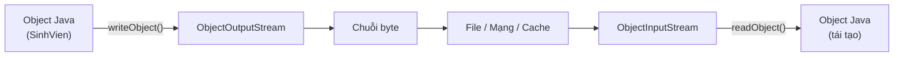

# Serialization và Deserialization trong Java

Serialization là cách chuyển một object Java thành chuỗi byte để lưu xuống file, cho vào cache hoặc gửi qua mạng; còn Deserialization là quá trình ngược lại để dựng lại object từ chuỗi byte đó. Đây là kiến thức nền tảng khi cần lưu trạng thái đối tượng hoặc truyền đối tượng giữa các hệ thống. Bài này giới thiệu khái niệm tổng quan cùng ví dụ thực tế; chi tiết nằm bên dưới.

## Giới thiệu

**Serialization** (tuần tự hóa — quá trình chuyển đổi một object Java thành chuỗi byte để lưu trữ hoặc truyền qua mạng) và **Deserialization** (giải tuần tự hóa — quá trình tái tạo lại object Java từ chuỗi byte) là hai cơ chế quan trọng trong Java I/O.

### Ứng dụng thực tế
- Lưu trạng thái đối tượng xuống file hoặc cơ sở dữ liệu
- Truyền đối tượng qua mạng (ví dụ: RMI — Remote Method Invocation)
- Bộ nhớ đệm phân tán (Distributed Cache như Redis)
- Sao chép đối tượng (deep copy)

Sơ đồ dưới đây minh họa hai chiều của quá trình: **Serialization** (chiều đi — object thành byte) và **Deserialization** (chiều về — byte thành object).



Trường `transient` sẽ bị bỏ qua ở chiều đi nên khi tái tạo lại sẽ nhận giá trị mặc định (ví dụ `null`).

---

## Interface Serializable

Để một class có thể được tuần tự hóa, nó phải **implements** interface `java.io.Serializable`. Đây là **marker interface** (interface đánh dấu — interface không có phương thức, chỉ dùng để đánh dấu).

```java
import java.io.Serializable;

public class SinhVien implements Serializable {
    // serialVersionUID: định danh phiên bản của class
    // Dùng để kiểm tra tính tương thích khi deserialize
    private static final long serialVersionUID = 1L;

    private String ten;
    private int tuoi;
    private String maSV;

    // Trường transient: KHÔNG được tuần tự hóa
    private transient String matKhau; // Dữ liệu nhạy cảm, bỏ qua khi serialize

    public SinhVien(String ten, int tuoi, String maSV, String matKhau) {
        this.ten = ten;
        this.tuoi = tuoi;
        this.maSV = maSV;
        this.matKhau = matKhau;
    }

    @Override
    public String toString() {
        return "SinhVien{ten='" + ten + "', tuoi=" + tuoi
               + ", maSV='" + maSV + "', matKhau='" + matKhau + "'}";
    }
}
```

---

## Serialization — Ghi Object vào file

**ObjectOutputStream** (luồng ghi đối tượng — ghi byte đại diện cho object):

```java
import java.io.*;

public class VidụSerialize {
    public static void main(String[] args) {
        SinhVien sv = new SinhVien("Nguyễn Văn An", 20, "SV001", "mat-khau-bi-mat");
        System.out.println("Trước khi lưu: " + sv);

        // Ghi object vào file binary
        try (ObjectOutputStream oos = new ObjectOutputStream(
                new FileOutputStream("sinhvien.ser"))) {

            oos.writeObject(sv);
            System.out.println("Đã lưu object thành công vào sinhvien.ser");

        } catch (IOException e) {
            System.err.println("Lỗi khi serialize: " + e.getMessage());
        }
    }
}
```

---

## Deserialization — Đọc Object từ file

**ObjectInputStream** (luồng đọc đối tượng — tái tạo object từ chuỗi byte):

```java
import java.io.*;

public class VidụDeserialize {
    public static void main(String[] args) {
        try (ObjectInputStream ois = new ObjectInputStream(
                new FileInputStream("sinhvien.ser"))) {

            // Cast về đúng kiểu — lưu ý: cần xử lý ClassCastException
            SinhVien sv = (SinhVien) ois.readObject();
            System.out.println("Sau khi tải lại: " + sv);
            // matKhau sẽ là null vì đã khai báo transient

        } catch (IOException e) {
            System.err.println("Lỗi I/O: " + e.getMessage());
        } catch (ClassNotFoundException e) {
            System.err.println("Không tìm thấy class: " + e.getMessage());
        }
    }
}
```

**Kết quả:**
```
Trước khi lưu: SinhVien{ten='Nguyễn Văn An', tuoi=20, maSV='SV001', matKhau='mat-khau-bi-mat'}
Sau khi tải lại: SinhVien{ten='Nguyễn Văn An', tuoi=20, maSV='SV001', matKhau='null'}
```

> Trường `matKhau` là `null` sau khi deserialize vì được khai báo `transient`.

---

## serialVersionUID

`serialVersionUID` là định danh phiên bản. Nếu class thay đổi (thêm/xóa trường) mà không cập nhật `serialVersionUID`, Java sẽ ném `InvalidClassException` khi deserialize từ file cũ.

```java
// Phiên bản 1
public class SanPham implements Serializable {
    private static final long serialVersionUID = 1L;
    private String ten;
    private double gia;
}

// Phiên bản 2: thêm trường mới — cần tăng serialVersionUID
public class SanPham implements Serializable {
    private static final long serialVersionUID = 2L; // Tăng lên 2
    private String ten;
    private double gia;
    private String danhMuc; // Trường mới
}
```

> **Khuyến nghị:** Luôn khai báo `serialVersionUID` tường minh để kiểm soát tính tương thích.

---

## Serialize nhiều Object

```java
import java.io.*;
import java.util.ArrayList;
import java.util.List;

public class SerializeList {
    public static void main(String[] args) throws IOException, ClassNotFoundException {
        List<SinhVien> danhSach = new ArrayList<>();
        danhSach.add(new SinhVien("An", 20, "SV001", "pass1"));
        danhSach.add(new SinhVien("Bình", 21, "SV002", "pass2"));
        danhSach.add(new SinhVien("Chi", 19, "SV003", "pass3"));

        // Ghi toàn bộ danh sách (ArrayList cũng implements Serializable)
        try (ObjectOutputStream oos = new ObjectOutputStream(
                new FileOutputStream("ds-sinhvien.ser"))) {
            oos.writeObject(danhSach);
        }

        // Đọc lại
        try (ObjectInputStream ois = new ObjectInputStream(
                new FileInputStream("ds-sinhvien.ser"))) {
            @SuppressWarnings("unchecked")
            List<SinhVien> dsDoc = (List<SinhVien>) ois.readObject();
            dsDoc.forEach(sv -> System.out.println(sv));
        }
    }
}
```

---

## Tùy chỉnh quá trình Serialize

Override hai phương thức `writeObject` và `readObject` để kiểm soát quá trình:

```java
import java.io.*;

public class TaiKhoan implements Serializable {
    private static final long serialVersionUID = 1L;

    private String tenDangNhap;
    private transient String matKhau; // Không serialize mật khẩu gốc

    public TaiKhoan(String tenDangNhap, String matKhau) {
        this.tenDangNhap = tenDangNhap;
        this.matKhau = matKhau;
    }

    // Ghi tùy chỉnh: mã hóa mật khẩu trước khi lưu
    private void writeObject(ObjectOutputStream oos) throws IOException {
        oos.defaultWriteObject(); // Ghi các trường không transient
        String matKhauMaHoa = maHoa(matKhau); // Mã hóa đơn giản
        oos.writeObject(matKhauMaHoa);
    }

    // Đọc tùy chỉnh: giải mã mật khẩu sau khi tải
    private void readObject(ObjectInputStream ois)
            throws IOException, ClassNotFoundException {
        ois.defaultReadObject(); // Đọc các trường không transient
        String matKhauMaHoa = (String) ois.readObject();
        this.matKhau = giaiMa(matKhauMaHoa); // Giải mã
    }

    private String maHoa(String s) {
        return new StringBuilder(s).reverse().toString(); // Ví dụ đơn giản
    }

    private String giaiMa(String s) {
        return new StringBuilder(s).reverse().toString();
    }

    @Override
    public String toString() {
        return "TaiKhoan{ten='" + tenDangNhap + "', matKhau='" + matKhau + "'}";
    }
}
```

---

## Lưu ý bảo mật

- **Không deserialize dữ liệu từ nguồn không tin cậy** — có thể bị tấn công **Deserialization Attack** (tấn công giải tuần tự hóa — kẻ tấn công tạo chuỗi byte độc hại để thực thi mã tùy ý).
- Các class nhạy cảm nên dùng `transient` cho trường chứa thông tin mật.
- Cân nhắc dùng **JSON** (Jackson, Gson) hoặc **Protocol Buffers** thay thế cho Serialization nhị phân trong ứng dụng hiện đại.

---

## Tóm tắt

| Khái niệm | Mô tả |
|-----------|-------|
| `Serializable` | Interface đánh dấu cho phép tuần tự hóa |
| `serialVersionUID` | Định danh phiên bản của class |
| `transient` | Từ khóa loại trừ trường khỏi quá trình serialize |
| `ObjectOutputStream` | Ghi object thành chuỗi byte |
| `ObjectInputStream` | Tái tạo object từ chuỗi byte |
| `writeObject`/`readObject` | Override để tùy chỉnh quá trình |
