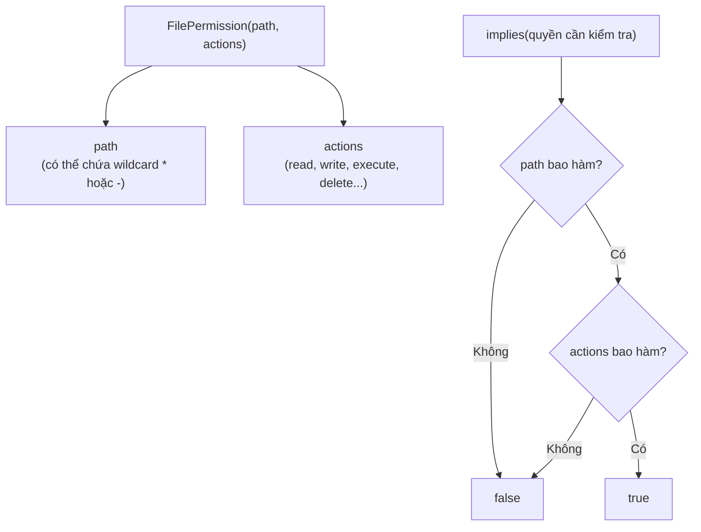

# Hướng dẫn sử dụng lớp FilePermission trong Java

FilePermission là lớp đại diện cho quyền truy cập file và thư mục trong hệ thống bảo mật của Java. Hiểu về nó giúp bạn kiểm soát ứng dụng được phép đọc, ghi hay thực thi những file nào. Bài này giới thiệu cấu trúc FilePermission, cách kiểm tra quyền, và cả cách kiểm tra quyền file hiện đại hơn bằng NIO.2.

:::note[Ghi nhớ nhanh]

- ⭐ **`FilePermission(path, actions)` mô tả quyền truy cập file** — thuộc Java Security Architecture / Security Manager (đã deprecated từ Java 17).
- **`actions` gồm `read`, `write`, `execute`, `delete`, `readlink`** — nhiều hành động ngăn cách bởi dấu phẩy.
- **Wildcard trong path: `*` (file trong thư mục), `-` (đệ quy thư mục con), `<<ALL FILES>>` (toàn hệ thống)**.
- **`implies()` kiểm tra một quyền có bao hàm quyền khác** — quyền rộng hơn bao hàm quyền hẹp hơn.
- ⭐ **Thực tế nên dùng `file.canRead/Write/Execute()` hoặc NIO.2 `PosixFilePermission`** — thay cho `SecurityManager`/`FilePermission` để kiểm tra quyền file.

:::

## FilePermission là gì?

**`FilePermission`** (quyền tập tin — lớp đại diện cho quyền truy cập file hoặc thư mục trong hệ thống bảo mật Java) là một phần của **Java Security Architecture** (kiến trúc bảo mật Java). Lớp này thuộc gói `java.io` và được dùng trong **Security Manager** (bộ quản lý bảo mật — cơ chế kiểm soát quyền truy cập tài nguyên của ứng dụng Java).

> **Lưu ý:** Security Manager đã bị **deprecated** (đánh dấu lỗi thời) từ Java 17 và sẽ bị loại bỏ. Tuy nhiên, hiểu về `FilePermission` vẫn hữu ích trong các môi trường Java cũ và khi làm việc với security policy.

Sơ đồ dưới đây minh họa cách một `FilePermission` được cấu thành từ đường dẫn và hành động, cùng cách phương thức `implies()` kiểm tra một quyền có bao hàm quyền khác hay không.



---

## Cấu trúc FilePermission

```java
import java.io.FilePermission;

// FilePermission(path, actions)
// path: đường dẫn file/thư mục, có thể dùng wildcard
// actions: chuỗi hành động, ngăn cách bởi dấu phẩy
FilePermission permission = new FilePermission("/home/user/data.txt", "read,write");
```

### Các hành động (actions)

| Hành động | Ý nghĩa |
|-----------|---------|
| `read` | Đọc file |
| `write` | Ghi, tạo, xóa file |
| `execute` | Thực thi file |
| `delete` | Xóa file |
| `readlink` | Đọc symbolic link (liên kết tượng trưng) |

### Wildcard trong đường dẫn

| Ký tự đặc biệt | Ý nghĩa |
|---------------|---------|
| `*` | Tất cả file trong thư mục (không đệ quy) |
| `-` | Tất cả file trong thư mục và các thư mục con (đệ quy) |
| `<<ALL FILES>>` | Tất cả file trên hệ thống |

---

## Tạo và kiểm tra FilePermission

```java
import java.io.FilePermission;

public class VidụFilePermission {
    public static void main(String[] args) {
        // Quyền đọc một file cụ thể
        FilePermission docFile = new FilePermission("/etc/config.txt", "read");

        // Quyền đọc/ghi thư mục /data và tất cả file trong đó (không đệ quy)
        FilePermission thuMuc = new FilePermission("/data/*", "read,write");

        // Quyền thực thi toàn bộ thư mục /bin và các thư mục con (đệ quy)
        FilePermission binAll = new FilePermission("/bin/-", "execute");

        // Quyền đọc mọi file trên hệ thống
        FilePermission tatCa = new FilePermission("<<ALL FILES>>", "read");

        // In thông tin
        System.out.println("Tên:     " + docFile.getName());
        System.out.println("Hành động: " + docFile.getActions());

        // implies(): kiểm tra xem một permission có bao gồm permission khác không
        // (kiểm tra bao hàm — permission A bao hàm B nếu A cho phép mọi thứ B cho phép)
        FilePermission kiemTra = new FilePermission("/data/file.txt", "read");
        System.out.println("thuMuc bao hàm /data/file.txt read? " + thuMuc.implies(kiemTra));

        FilePermission kiemTra2 = new FilePermission("/data/file.txt", "delete");
        System.out.println("thuMuc bao hàm /data/file.txt delete? " + thuMuc.implies(kiemTra2));
    }
}
```

**Kết quả:**
```
Tên:       /etc/config.txt
Hành động: read
thuMuc bao hàm /data/file.txt read? true
thuMuc bao hàm /data/file.txt delete? false
```

---

## So sánh hai FilePermission

```java
import java.io.FilePermission;

public class SoSanhPermission {
    public static void main(String[] args) {
        FilePermission p1 = new FilePermission("/home/user/docs/-", "read,write");
        FilePermission p2 = new FilePermission("/home/user/docs/report.pdf", "read");
        FilePermission p3 = new FilePermission("/home/user/docs/-", "read,write");

        // equals(): hai permission hoàn toàn giống nhau
        System.out.println("p1.equals(p2): " + p1.equals(p2)); // false
        System.out.println("p1.equals(p3): " + p1.equals(p3)); // true

        // implies(): p1 có bao hàm p2 không?
        System.out.println("p1.implies(p2): " + p1.implies(p2)); // true (rộng hơn bao hàm hẹp hơn)
        System.out.println("p2.implies(p1): " + p2.implies(p1)); // false
    }
}
```

---

## Kiểm tra quyền file thực tế bằng java.io.File

Trong thực tế, để kiểm tra quyền truy cập file, ta thường dùng phương thức trực tiếp từ lớp `File`:

```java
import java.io.File;
import java.io.IOException;

public class KiemTraQuyenFile {
    public static void main(String[] args) throws IOException {
        File file = new File("/etc/hosts");

        System.out.println("=== Thông tin quyền: " + file.getAbsolutePath() + " ===");
        System.out.println("Tồn tại:     " + file.exists());
        System.out.println("Có thể đọc:  " + file.canRead());
        System.out.println("Có thể ghi:  " + file.canWrite());
        System.out.println("Có thể chạy: " + file.canExecute());

        // Thay đổi quyền (trên Unix/Linux/macOS)
        File fileGhi = new File("output.txt");
        fileGhi.createNewFile();

        fileGhi.setReadable(true, false);   // (readable, ownerOnly=false: cho tất cả)
        fileGhi.setWritable(true, true);    // (writable, ownerOnly=true: chỉ chủ sở hữu)
        fileGhi.setExecutable(false, false); // Không cho thực thi

        System.out.println("\nSau khi đặt quyền cho output.txt:");
        System.out.println("Đọc:  " + fileGhi.canRead());
        System.out.println("Ghi:  " + fileGhi.canWrite());
        System.out.println("Chạy: " + fileGhi.canExecute());
    }
}
```

---

## Kiểm tra quyền với NIO.2 (Java 7+)

**NIO.2** cung cấp `PosixFilePermission` (quyền POSIX — chuẩn quyền file Unix/Linux/macOS) để kiểm soát quyền chi tiết hơn:

```java
import java.nio.file.*;
import java.nio.file.attribute.*;
import java.util.Set;
import java.io.IOException;

public class NIO2Quyen {
    public static void main(String[] args) throws IOException {
        Path path = Paths.get("thu-nghiem.txt");
        Files.createFile(path);

        // Đọc quyền POSIX hiện tại (chỉ hỗ trợ trên Unix/Linux/macOS)
        try {
            Set<PosixFilePermission> quyen = Files.getPosixFilePermissions(path);
            System.out.println("Quyền hiện tại: " + PosixFilePermissions.toString(quyen));

            // Thiết lập quyền mới (tương đương chmod 644)
            // OWNER_READ, OWNER_WRITE: chủ sở hữu được đọc và ghi
            // GROUP_READ, OTHERS_READ: nhóm và người khác chỉ được đọc
            Set<PosixFilePermission> quyenMoi = PosixFilePermissions.fromString("rw-r--r--");
            Files.setPosixFilePermissions(path, quyenMoi);

            System.out.println("Quyền mới: " + PosixFilePermissions.toString(
                Files.getPosixFilePermissions(path)));

        } catch (UnsupportedOperationException e) {
            System.out.println("Hệ điều hành không hỗ trợ POSIX permissions (Windows).");
        }

        Files.deleteIfExists(path);
    }
}
```

---

## PermissionCollection — Tập hợp quyền

**`PermissionCollection`** (tập hợp quyền — nhóm các permission lại để kiểm tra tổng hợp):

```java
import java.io.FilePermission;
import java.security.PermissionCollection;

public class NhomQuyen {
    public static void main(String[] args) {
        FilePermission goc = new FilePermission("/app/*", "read");

        // newPermissionCollection(): tạo collection phù hợp cho loại permission này
        PermissionCollection nhom = goc.newPermissionCollection();
        nhom.add(new FilePermission("/app/*", "read"));
        nhom.add(new FilePermission("/tmp/*", "read,write"));
        nhom.add(new FilePermission("/log/*", "write"));

        // Kiểm tra xem collection có cho phép hành động cụ thể không
        System.out.println("Đọc /app/config.xml?   " +
            nhom.implies(new FilePermission("/app/config.xml", "read")));   // true
        System.out.println("Ghi /tmp/temp.dat?     " +
            nhom.implies(new FilePermission("/tmp/temp.dat", "write")));    // true
        System.out.println("Xóa /app/config.xml?  " +
            nhom.implies(new FilePermission("/app/config.xml", "delete"))); // false
    }
}
```

---

## Tóm tắt

| Khái niệm | Ý nghĩa |
|-----------|---------|
| `FilePermission(path, actions)` | Tạo đối tượng quyền truy cập file |
| `implies(p)` | Kiểm tra một permission có bao hàm permission khác |
| `*` trong path | Wildcard cho file trong thư mục |
| `-` trong path | Wildcard đệ quy (thư mục con) |
| `PosixFilePermission` | Quyền Unix/Linux/macOS (chmod) |
| `file.canRead/Write/Execute()` | Kiểm tra quyền thực tế của file |

Trong ứng dụng hiện đại, nên dùng `file.canRead()`/`file.canWrite()` hoặc **NIO.2** `PosixFilePermission` thay vì `SecurityManager`/`FilePermission` để kiểm tra quyền file.
