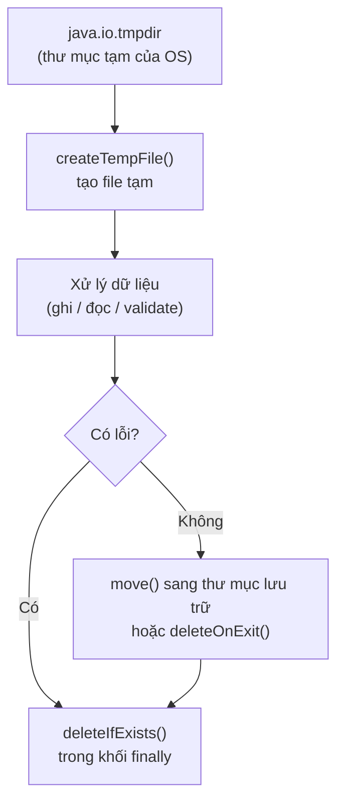

# Giới thiệu java.io.tmpdir

Khi cần lưu dữ liệu tạm thời, ứng dụng Java thường ghi vào thư mục tạm của hệ điều hành, và `java.io.tmpdir` chính là thuộc tính cho biết đường dẫn thư mục đó. Hiểu cách dùng nó giúp bạn tạo và dọn dẹp file tạm an toàn, ví dụ khi xử lý file upload. Bài này hướng dẫn cách lấy thư mục tạm, tạo file/thư mục tạm và các thực hành tốt cần lưu ý.

## java.io.tmpdir là gì?

**`java.io.tmpdir`** là một **system property** (thuộc tính hệ thống — giá trị cấu hình được JVM cung cấp sẵn) chứa đường dẫn tới **thư mục tạm** (temporary directory — nơi lưu file/thư mục tạm thời của hệ điều hành).

Giá trị của `java.io.tmpdir` thay đổi theo hệ điều hành:
- **Linux/macOS:** `/tmp` hoặc `/var/folders/...`
- **Windows:** `C:\Users\<user>\AppData\Local\Temp`

Sơ đồ dưới đây minh họa vòng đời an toàn của một file tạm: lấy thư mục tạm, tạo file, xử lý, rồi luôn dọn dẹp dù thành công hay có lỗi.



---

## Lấy đường dẫn thư mục tạm

```java
public class LayThuMucTam {
    public static void main(String[] args) {
        // Cách 1: Dùng System.getProperty
        String tmpDir = System.getProperty("java.io.tmpdir");
        System.out.println("Thư mục tạm: " + tmpDir);

        // Cách 2: Dùng System.getenv (chỉ áp dụng cho TMPDIR trên Unix)
        String tmpEnv = System.getenv("TMPDIR");
        System.out.println("TMPDIR env: " + tmpEnv);

        // Cách 3: Dùng File.createTempFile để tự động lấy thư mục tạm
        // (xem ví dụ bên dưới)
    }
}
```

---

## Tạo file tạm thời

**`File.createTempFile(prefix, suffix)`** tạo file tạm trong thư mục `java.io.tmpdir`:

```java
import java.io.File;
import java.io.IOException;

public class TaoFileTam {
    public static void main(String[] args) throws IOException {
        // createTempFile(prefix, suffix): tên file = prefix + số_ngẫu_nhiên + suffix
        File fileTam = File.createTempFile("bao-cao-", ".tmp");

        System.out.println("Tên file tạm:    " + fileTam.getName());
        System.out.println("Đường dẫn đầy đủ: " + fileTam.getAbsolutePath());
        System.out.println("Thư mục chứa:     " + fileTam.getParent());

        // Đánh dấu xóa khi JVM thoát (JVM shutdown hook)
        fileTam.deleteOnExit();

        // Tạo file tạm trong thư mục chỉ định
        File thuMucTam = new File(System.getProperty("java.io.tmpdir"), "my-app-temp");
        thuMucTam.mkdirs();

        File fileTamTuyChinh = File.createTempFile("upload-", ".jpg", thuMucTam);
        System.out.println("File trong thư mục tùy chỉnh: " + fileTamTuyChinh.getAbsolutePath());
        fileTamTuyChinh.deleteOnExit();
    }
}
```

---

## Tạo thư mục tạm thời

```java
import java.io.IOException;
import java.nio.file.*;

public class TaoThuMucTam {
    public static void main(String[] args) throws IOException {
        // Java 7+ NIO.2: tạo thư mục tạm
        Path thuMucTam1 = Files.createTempDirectory("xu-ly-anh-");
        System.out.println("Thư mục tạm 1: " + thuMucTam1);

        // Tạo thư mục tạm trong thư mục chỉ định
        Path goc = Paths.get(System.getProperty("java.io.tmpdir"), "my-app");
        Files.createDirectories(goc);

        Path thuMucTam2 = Files.createTempDirectory(goc, "phien-lam-viec-");
        System.out.println("Thư mục tạm 2: " + thuMucTam2);

        // Dọn dẹp thư mục tạm khi kết thúc
        Runtime.getRuntime().addShutdownHook(new Thread(() -> {
            xoaThuMucDuqui(thuMucTam1.toFile());
            xoaThuMucDuqui(thuMucTam2.toFile());
            System.out.println("Đã dọn dẹp thư mục tạm.");
        }));
    }

    private static void xoaThuMucDuqui(java.io.File item) {
        if (item.isDirectory()) {
            java.io.File[] con = item.listFiles();
            if (con != null) {
                for (java.io.File c : con) xoaThuMucDuqui(c);
            }
        }
        item.delete();
    }
}
```

---

## Ứng dụng thực tế: Xử lý file upload

```java
import java.io.*;
import java.nio.file.*;

public class XuLyFileUpload {

    // Giả lập xử lý file upload: lưu tạm → xử lý → xóa
    public static void xuLyUpload(byte[] duLieuFile, String tenFile) {
        Path fileTam = null;
        try {
            // Lưu dữ liệu upload vào file tạm
            String phanMoRong = tenFile.substring(tenFile.lastIndexOf('.'));
            fileTam = Files.createTempFile("upload-", phanMoRong);

            Files.write(fileTam, duLieuFile);
            System.out.println("Lưu file tạm: " + fileTam);

            // Thực hiện xử lý (ví dụ: nén, resize ảnh, validate...)
            long kichThuoc = Files.size(fileTam);
            System.out.println("Kích thước: " + kichThuoc + " byte");

            if (kichThuoc > 10 * 1024 * 1024) { // Giới hạn 10MB
                throw new IllegalArgumentException("File vượt quá 10MB!");
            }

            // Di chuyển đến thư mục lưu trữ chính thức
            Path thuMucLuu = Paths.get("uploads", "2024");
            Files.createDirectories(thuMucLuu);
            Path dich = thuMucLuu.resolve(tenFile);
            Files.move(fileTam, dich, StandardCopyOption.REPLACE_EXISTING);

            System.out.println("Đã lưu chính thức: " + dich);

        } catch (IOException e) {
            System.err.println("Lỗi xử lý upload: " + e.getMessage());
        } finally {
            // Đảm bảo xóa file tạm dù có lỗi hay không
            if (fileTam != null) {
                try {
                    Files.deleteIfExists(fileTam);
                } catch (IOException e) {
                    System.err.println("Không xóa được file tạm: " + e.getMessage());
                }
            }
        }
    }

    public static void main(String[] args) throws IOException {
        // Giả lập dữ liệu file upload
        byte[] duLieu = "Nội dung file CSV của người dùng...".getBytes("UTF-8");
        xuLyUpload(duLieu, "bao-cao-2024.csv");
    }
}
```

---

## Đặt lại java.io.tmpdir

Có thể thay đổi thư mục tạm khi khởi chạy JVM:

```bash
# Đặt thư mục tạm tùy chỉnh qua tham số JVM
java -Djava.io.tmpdir=/custom/temp MyApplication

# Hoặc trong code (chỉ nên làm khi khởi động ứng dụng)
System.setProperty("java.io.tmpdir", "/custom/temp");
```

```java
public class DatThuMucTam {
    public static void main(String[] args) {
        // Đọc từ biến môi trường (không hardcode đường dẫn)
        String customTmp = System.getenv("APP_TEMP_DIR");
        if (customTmp != null && !customTmp.isEmpty()) {
            System.setProperty("java.io.tmpdir", customTmp);
        }

        System.out.println("Thư mục tạm hiệu lực: " + System.getProperty("java.io.tmpdir"));
    }
}
```

---

## Thực hành tốt (Best Practices)

```java
import java.io.*;
import java.nio.file.*;

public class ThucHanhTot {
    public static void main(String[] args) throws IOException {
        // 1. Luôn dùng try-finally hoặc try-with-resources để xóa file tạm
        Path tam = Files.createTempFile("xu-ly-", ".dat");
        try {
            // ... xử lý file tạm ...
            Files.write(tam, "dữ liệu".getBytes());
        } finally {
            Files.deleteIfExists(tam); // Luôn xóa dù có lỗi
        }

        // 2. Không đoán tên file tạm; luôn dùng createTempFile
        // SAIA: new File(System.getProperty("java.io.tmpdir") + "/mytemp.txt")
        // ĐÚNG:
        File dungCach = File.createTempFile("mytemp-", ".txt");
        dungCach.deleteOnExit();

        // 3. Dùng prefix có ý nghĩa để dễ debug
        Path tamXuLyAnh   = Files.createTempFile("img-resize-", ".jpg");
        Path tamXuatExcel = Files.createTempFile("export-excel-", ".xlsx");

        Files.deleteIfExists(tamXuLyAnh);
        Files.deleteIfExists(tamXuatExcel);

        System.out.println("Hoàn tất.");
    }
}
```

---

## Tóm tắt

- `java.io.tmpdir` là thuộc tính hệ thống chứa đường dẫn thư mục tạm của OS.
- Dùng `File.createTempFile()` hoặc `Files.createTempFile()` để tạo file tạm an toàn.
- Luôn **xóa file tạm** sau khi dùng bằng `deleteOnExit()`, `Files.deleteIfExists()`, hoặc trong khối `finally`.
- Không hardcode đường dẫn thư mục tạm — dùng `System.getProperty("java.io.tmpdir")`.
- Dùng **prefix có ý nghĩa** khi tạo file tạm để dễ debug và theo dõi.
