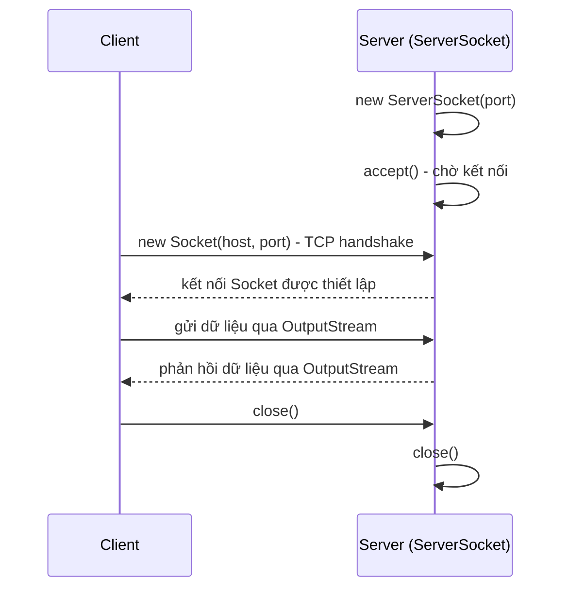

# Xây dựng ứng dụng Client-Server với Socket trong Java

Mô hình Client-Server là kiến trúc mạng phổ biến nhất, nơi máy chủ lắng nghe và xử lý yêu cầu còn máy khách chủ động kết nối tới. Trong Java, ta hiện thực mô hình này bằng hai lớp Socket và ServerSocket để truyền dữ liệu qua TCP. Bài này hướng dẫn xây dựng từ Echo Server cơ bản đến ứng dụng chat nhiều client qua các ví dụ đầy đủ.

:::note[Ghi nhớ nhanh]

- ⭐ **`ServerSocket` lắng nghe, `Socket` là kênh hai chiều** — server gọi `accept()` (chặn tới khi có client), client tạo `new Socket(host, port)` để bắt tay TCP.
- ⭐ **Nhiều client dùng mô hình Thread-per-Connection** — tạo một `Thread` mới cho mỗi `Socket` để các client không chặn nhau.
- **Trao đổi văn bản qua `BufferedReader` / `PrintWriter`** — lấy từ `getInputStream()` / `getOutputStream()`; `readLine()` trả `null` khi kết nối đóng.
- **Thread-per-Connection tốn bộ nhớ khi client tăng cao** — nâng cao bằng `ExecutorService` (thread pool) hoặc NIO với `Selector`.
- **Luôn `close()` socket để giải phóng tài nguyên** — thường đặt trong `finally` hoặc dùng try-with-resources.

:::

## 1. Tổng quan mô hình Client-Server

**Client-Server** (máy khách – máy chủ) là mô hình kiến trúc mạng phổ biến nhất:

- **Server** (máy chủ): lắng nghe kết nối đến, xử lý yêu cầu và trả kết quả.
- **Client** (máy khách): chủ động kết nối tới server, gửi yêu cầu và nhận phản hồi.

Trong Java, giao tiếp TCP giữa client và server được thực hiện qua hai lớp chính:

- **ServerSocket** (socket máy chủ): mở một cổng và chờ kết nối đến.
- **Socket** (socket — đầu nối mạng hai chiều): đại diện cho một kết nối TCP đã được thiết lập giữa hai điểm cuối.

Sơ đồ tuần tự sau minh hoạ trình tự thiết lập kết nối và trao đổi dữ liệu giữa client và server:



Server phải `accept()` trước và bị chặn cho đến khi client gọi `new Socket(...)`; sau bắt tay TCP, hai bên trao đổi dữ liệu hai chiều rồi lần lượt đóng kết nối.

---

## 2. Luồng hoạt động cơ bản

```
Server                              Client
------                              ------
ServerSocket(port)                  
accept()  <--- TCP handshake ---   new Socket(host, port)
getInputStream() / getOutputStream()  getInputStream() / getOutputStream()
Đọc / Ghi dữ liệu                  Ghi / Đọc dữ liệu
close()                             close()
```

**Three-way handshake** (bắt tay ba bước): cơ chế TCP để thiết lập kết nối — SYN → SYN-ACK → ACK.

---

## 3. Ví dụ cơ bản: Echo Server

**Echo Server** (máy chủ phản vọng): nhận chuỗi từ client rồi gửi nguyên văn lại.

### EchoServer.java

```java
import java.io.BufferedReader;
import java.io.InputStreamReader;
import java.io.PrintWriter;
import java.net.ServerSocket;
import java.net.Socket;

public class EchoServer {
    public static void main(String[] args) {
        int port = 8080;

        // ServerSocket lắng nghe trên cổng 8080
        try (ServerSocket serverSocket = new ServerSocket(port)) {
            System.out.println("Echo Server đang chờ kết nối trên cổng " + port + "...");

            // accept() — chặn luồng hiện tại cho đến khi có client kết nối
            // Trả về đối tượng Socket đại diện cho kết nối với client đó
            Socket clientSocket = serverSocket.accept();
            System.out.println("Client đã kết nối: "
                    + clientSocket.getInetAddress().getHostAddress());

            // PrintWriter — bộ ghi ký tự, autoFlush=true tự đẩy dữ liệu ngay khi println
            PrintWriter out = new PrintWriter(clientSocket.getOutputStream(), true);
            // BufferedReader — bộ đọc có vùng đệm để nhận dữ liệu từ client
            BufferedReader in = new BufferedReader(
                    new InputStreamReader(clientSocket.getInputStream()));

            String inputLine;
            while ((inputLine = in.readLine()) != null) {
                System.out.println("Nhận từ client: " + inputLine);
                out.println("ECHO: " + inputLine); // Phản hồi lại client

                if ("bye".equalsIgnoreCase(inputLine)) {
                    break; // Kết thúc phiên khi client gửi "bye"
                }
            }

            clientSocket.close();
            System.out.println("Đã đóng kết nối.");

        } catch (Exception e) {
            System.err.println("Lỗi server: " + e.getMessage());
        }
    }
}
```

### EchoClient.java

```java
import java.io.BufferedReader;
import java.io.InputStreamReader;
import java.io.PrintWriter;
import java.net.Socket;
import java.util.Scanner;

public class EchoClient {
    public static void main(String[] args) {
        String host = "localhost";
        int port = 8080;

        // new Socket(host, port) — khởi tạo kết nối TCP tới server
        try (Socket socket = new Socket(host, port);
             PrintWriter out = new PrintWriter(socket.getOutputStream(), true);
             BufferedReader in = new BufferedReader(
                     new InputStreamReader(socket.getInputStream()));
             Scanner scanner = new Scanner(System.in)) {

            System.out.println("Đã kết nối tới server " + host + ":" + port);
            System.out.println("Nhập văn bản (gõ 'bye' để thoát):");

            String userInput;
            while (scanner.hasNextLine()) {
                userInput = scanner.nextLine();
                out.println(userInput);                   // Gửi tới server
                System.out.println(in.readLine());        // Nhận phản hồi
                if ("bye".equalsIgnoreCase(userInput)) break;
            }

        } catch (Exception e) {
            System.err.println("Lỗi client: " + e.getMessage());
        }
    }
}
```

**Cách chạy:** Mở hai terminal — chạy `EchoServer` trước, sau đó chạy `EchoClient`.

---

## 4. Ứng dụng Chat đơn giản với Multi-Client (Đa máy khách)

Server phục vụ nhiều client đồng thời bằng cách tạo một **Thread** (luồng) mới cho mỗi kết nối.

### ChatServer.java

```java
import java.io.BufferedReader;
import java.io.InputStreamReader;
import java.io.PrintWriter;
import java.net.ServerSocket;
import java.net.Socket;
import java.util.Collections;
import java.util.HashSet;
import java.util.Set;

public class ChatServer {

    // Set đồng bộ hoá chứa tất cả PrintWriter của các client đang kết nối
    // Collections.synchronizedSet — bọc HashSet thành thread-safe set
    private static final Set<PrintWriter> clientWriters =
            Collections.synchronizedSet(new HashSet<>());

    public static void main(String[] args) throws Exception {
        int port = 9000;
        System.out.println("Chat Server khởi động trên cổng " + port);

        try (ServerSocket serverSocket = new ServerSocket(port)) {
            while (true) {
                // Chờ client mới, sau đó giao cho ClientHandler xử lý song song
                Socket clientSocket = serverSocket.accept();
                System.out.println("Client mới: "
                        + clientSocket.getInetAddress().getHostAddress());

                // Tạo thread riêng cho mỗi client — mô hình Thread-per-Connection
                Thread handler = new Thread(new ClientHandler(clientSocket));
                handler.start();
            }
        }
    }

    /**
     * Phát tin nhắn tới TẤT CẢ client đang kết nối (broadcast).
     * Broadcast — phát quảng bá: gửi một thông điệp tới nhiều người nhận cùng lúc.
     */
    static void broadcast(String message) {
        synchronized (clientWriters) {
            for (PrintWriter writer : clientWriters) {
                writer.println(message);
            }
        }
    }

    /**
     * ClientHandler — Runnable xử lý một client cụ thể trong thread riêng.
     * Runnable — giao diện đánh dấu một tác vụ có thể chạy trong thread.
     */
    static class ClientHandler implements Runnable {
        private final Socket socket;

        ClientHandler(Socket socket) {
            this.socket = socket;
        }

        @Override
        public void run() {
            PrintWriter out = null;
            try {
                out = new PrintWriter(socket.getOutputStream(), true);
                BufferedReader in = new BufferedReader(
                        new InputStreamReader(socket.getInputStream()));

                // Đăng ký writer để nhận broadcast
                clientWriters.add(out);

                // Yêu cầu client gửi tên người dùng
                out.println("Nhập tên của bạn:");
                String name = in.readLine();
                broadcast("*** " + name + " đã tham gia phòng chat ***");

                String message;
                while ((message = in.readLine()) != null) {
                    if ("bye".equalsIgnoreCase(message)) break;
                    broadcast("[" + name + "]: " + message);
                }

                broadcast("*** " + name + " đã rời phòng chat ***");

            } catch (Exception e) {
                System.err.println("Lỗi xử lý client: " + e.getMessage());
            } finally {
                // finally — khối luôn chạy dù có lỗi hay không, dùng để giải phóng tài nguyên
                if (out != null) clientWriters.remove(out);
                try { socket.close(); } catch (Exception ignored) {}
            }
        }
    }
}
```

### ChatClient.java

```java
import java.io.BufferedReader;
import java.io.InputStreamReader;
import java.io.PrintWriter;
import java.net.Socket;

public class ChatClient {
    public static void main(String[] args) throws Exception {
        String host = "localhost";
        int port = 9000;

        try (Socket socket = new Socket(host, port);
             PrintWriter out = new PrintWriter(socket.getOutputStream(), true);
             BufferedReader in = new BufferedReader(
                     new InputStreamReader(socket.getInputStream()))) {

            // Thread riêng để liên tục nhận tin nhắn từ server mà không chặn luồng nhập
            Thread receiver = new Thread(() -> {
                try {
                    String serverMsg;
                    while ((serverMsg = in.readLine()) != null) {
                        System.out.println(serverMsg);
                    }
                } catch (Exception e) {
                    System.out.println("Đã ngắt kết nối khỏi server.");
                }
            });
            // daemon = true — thread phụ, tự dừng khi main thread kết thúc
            receiver.setDaemon(true);
            receiver.start();

            // Luồng chính xử lý nhập liệu từ bàn phím
            BufferedReader keyboard = new BufferedReader(
                    new InputStreamReader(System.in));
            String userInput;
            while ((userInput = keyboard.readLine()) != null) {
                out.println(userInput);
                if ("bye".equalsIgnoreCase(userInput)) break;
            }
        }
    }
}
```

---

## 5. Giải thích mô hình Thread-per-Connection

**Thread-per-Connection** (một luồng cho mỗi kết nối) là mô hình đơn giản nhất để xử lý nhiều client:

1. Server tạo một `Thread` mới ngay khi `accept()` trả về `Socket`.
2. Mỗi thread độc lập, có stack riêng — các client không chặn nhau.
3. **Nhược điểm**: khi số lượng client tăng lên hàng nghìn, số lượng thread tăng theo gây tốn bộ nhớ.
4. **Giải pháp nâng cao**: dùng `ExecutorService` (nhóm luồng có giới hạn) hoặc NIO với `Selector` (vào/ra không chặn).

```java
// Thay thế new Thread(...).start() bằng thread pool
import java.util.concurrent.ExecutorService;
import java.util.concurrent.Executors;

// ExecutorService — dịch vụ thực thi, quản lý nhóm thread tái sử dụng
// newFixedThreadPool(50) — tối đa 50 thread đồng thời
ExecutorService pool = Executors.newFixedThreadPool(50);
pool.execute(new ClientHandler(clientSocket)); // Thay vì new Thread(...).start()
```

---

## 6. Các lớp và phương thức quan trọng tóm tắt

| Lớp / Phương thức | Vai trò |
|---|---|
| `ServerSocket(port)` | Tạo socket lắng nghe trên cổng chỉ định |
| `serverSocket.accept()` | Chặn và chờ kết nối mới, trả về `Socket` |
| `new Socket(host, port)` | Client kết nối TCP tới server |
| `socket.getInputStream()` | Lấy luồng nhận dữ liệu từ đầu kia |
| `socket.getOutputStream()` | Lấy luồng gửi dữ liệu tới đầu kia |
| `socket.close()` | Đóng kết nối và giải phóng tài nguyên |
| `PrintWriter(out, true)` | Ghi chuỗi, `true` = tự flush sau println |
| `BufferedReader.readLine()` | Đọc một dòng văn bản, trả về `null` khi kết nối đóng |

---

## 7. Tóm tắt

- **ServerSocket** chờ kết nối; **Socket** là kênh giao tiếp hai chiều sau khi kết nối thành công.
- Dùng `BufferedReader` / `PrintWriter` để gửi nhận văn bản qua TCP.
- Với nhiều client đồng thời, tạo một **Thread** riêng cho mỗi `Socket` — mô hình Thread-per-Connection.
- Nâng cao hiệu năng bằng `ExecutorService` (thread pool) để giới hạn số luồng đồng thời.
