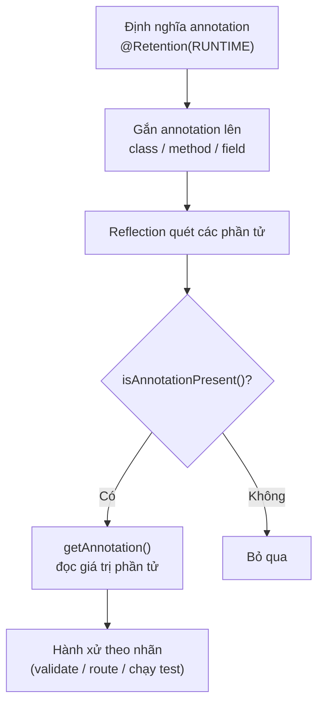

# Kết hợp Java Reflection và Java Annotations

Annotation là cách gắn thêm thông tin (metadata) vào class, method hay field mà không làm thay đổi logic chương trình. Khi kết hợp với Reflection, chương trình có thể đọc các annotation này lúc chạy và hành xử khác nhau tuỳ theo nhãn. Bài này hướng dẫn cách tự tạo annotation, đọc nó bằng Reflection và xây dựng một framework validation nhỏ, qua đó hiểu nguyên lý đằng sau Spring MVC, JUnit hay Hibernate.

:::note[Ghi nhớ nhanh]

- ⭐ **Annotation phải có `@Retention(RUNTIME)` để Reflection đọc được lúc chạy** — đây là điều kiện bắt buộc cho mọi framework đọc annotation runtime.
- ⭐ **Đọc annotation bằng `isAnnotationPresent()` + `getAnnotation()`** — kiểm tra sự tồn tại rồi lấy object để đọc giá trị các phần tử.
- **`@Target` giới hạn nơi đặt annotation** — `METHOD`, `FIELD`, `TYPE` (class/interface)...
- **Tạo annotation tùy chỉnh bằng `@interface`** — phần tử có thể có giá trị `default`.
- **Đây là nguyên lý nền của Spring MVC, JUnit, Hibernate, Jackson** — ví dụ `@Controller` + `@GetMapping` hoạt động như một mini dispatcher trong bài.

:::

## Annotation là gì?

**Annotation** (chú thích — nhãn metadata gắn vào class, method, field hoặc tham số) là cách Java cho phép lập trình viên gắn thêm **siêu thông tin (metadata)** vào code mà không ảnh hưởng đến logic chương trình. Trình biên dịch, công cụ build hoặc framework có thể đọc annotation này để thực hiện hành động phù hợp.

Khi kết hợp với **Reflection** (phản chiếu), annotation trở nên cực kỳ mạnh: chương trình có thể **đọc annotation lúc runtime** và hành xử khác nhau tuỳ theo nhãn đó.

Sơ đồ dưới đây mô tả luồng đọc annotation lúc runtime và ra quyết định dựa trên nhãn:



Chỉ những phần tử có annotation với `@Retention(RUNTIME)` mới được xử lý; đây chính là nguyên lý nền tảng của Spring MVC, JUnit hay Hibernate Validator.

---

## 1. Tạo Annotation tùy chỉnh

Để annotation tồn tại lúc runtime, phải dùng `@Retention(RetentionPolicy.RUNTIME)`:

```java
import java.lang.annotation.ElementType;
import java.lang.annotation.Retention;
import java.lang.annotation.RetentionPolicy;
import java.lang.annotation.Target;

// @Retention — xác định thời điểm annotation còn tồn tại
// RetentionPolicy.RUNTIME — giữ annotation sau khi biên dịch, đọc được lúc chạy
@Retention(RetentionPolicy.RUNTIME)

// @Target — xác định nơi annotation có thể được đặt
// ElementType.METHOD — chỉ được đặt trên method
@Target(ElementType.METHOD)
public @interface KiemThu {
    String mo_ta() default ""; // phần tử của annotation, có giá trị mặc định
    boolean boQua() default false;
}
```

```java
import java.lang.annotation.ElementType;
import java.lang.annotation.Retention;
import java.lang.annotation.RetentionPolicy;
import java.lang.annotation.Target;

// Annotation dùng cho field — tương tự @NotNull của Bean Validation
@Retention(RetentionPolicy.RUNTIME)
@Target(ElementType.FIELD)
public @interface KhongDuocNull {
    String thongBao() default "Trường này không được để trống!";
}
```

---

## 2. Đọc Annotation lúc Runtime bằng Reflection

```java
import java.lang.reflect.Method;

public class DocAnnotationRuntime {

    static class BaiToanHoc {
        @KiemThu(mo_ta = "Kiểm tra phép cộng")
        public void testCong() {
            int ketQua = 2 + 3;
            System.out.println("2 + 3 = " + ketQua);
            assert ketQua == 5 : "Sai kết quả!";
        }

        @KiemThu(mo_ta = "Kiểm tra phép chia", boQua = true)
        public void testChia() {
            System.out.println("Bài test này bị bỏ qua.");
        }

        public void phuongThucBinhThuong() {
            System.out.println("Không có @KiemThu — không chạy.");
        }
    }

    public static void main(String[] args) throws Exception {
        Class<?> clazz = BaiToanHoc.class;
        Object instance = clazz.getDeclaredConstructor().newInstance();

        for (Method method : clazz.getDeclaredMethods()) {
            // isAnnotationPresent() — kiểm tra method có annotation cụ thể không
            if (method.isAnnotationPresent(KiemThu.class)) {
                KiemThu annotation = method.getAnnotation(KiemThu.class);

                if (annotation.boQua()) {
                    System.out.println("[BỎ QUA] " + method.getName()
                            + " — " + annotation.mo_ta());
                    continue;
                }

                System.out.println("[CHẠY] " + method.getName()
                        + " — " + annotation.mo_ta());
                // invoke() — gọi method động không cần biết tên lúc viết code
                method.invoke(instance);
            }
        }
    }
}
```

**Kết quả mẫu:**
```
[BỎ QUA] testChia — Kiểm tra phép chia
[CHẠY] testCong — Kiểm tra phép cộng
2 + 3 = 5
```

---

## 3. Xây dựng Framework Validation nhỏ (tương tự @NotNull)

Đây là ví dụ thực tế minh hoạ cách Spring hoặc Hibernate Validator hoạt động bên dưới:

```java
import java.lang.reflect.Field;

// Bước 1: Khai báo model với annotation
class DonHang {
    @KhongDuocNull(thongBao = "Tên khách hàng không được trống!")
    private String tenKhachHang;

    @KhongDuocNull(thongBao = "Địa chỉ giao hàng không được trống!")
    private String diaChiGiaoHang;

    private int soLuong; // không có annotation — bỏ qua

    public DonHang(String tenKhachHang, String diaChiGiaoHang, int soLuong) {
        this.tenKhachHang = tenKhachHang;
        this.diaChiGiaoHang = diaChiGiaoHang;
        this.soLuong = soLuong;
    }
}

// Bước 2: Viết engine validation dùng Reflection
public class ValidationEngine {

    /**
     * Kiểm tra tất cả field có @KhongDuocNull trong object đầu vào.
     * Trả về danh sách lỗi; rỗng nghĩa là hợp lệ.
     */
    public static java.util.List<String> validate(Object obj) throws IllegalAccessException {
        java.util.List<String> loiList = new java.util.ArrayList<>();
        Class<?> clazz = obj.getClass();

        // getDeclaredFields() — lấy tất cả field, kể cả private
        for (Field field : clazz.getDeclaredFields()) {
            if (field.isAnnotationPresent(KhongDuocNull.class)) {
                field.setAccessible(true); // mở quyền truy cập field private
                Object giaTri = field.get(obj); // đọc giá trị thực tế của field

                if (giaTri == null || giaTri.toString().trim().isEmpty()) {
                    KhongDuocNull ann = field.getAnnotation(KhongDuocNull.class);
                    loiList.add("[" + field.getName() + "] " + ann.thongBao());
                }
            }
        }
        return loiList;
    }

    public static void main(String[] args) throws Exception {
        // Trường hợp 1: Dữ liệu thiếu
        DonHang donHangLoi = new DonHang(null, "", 5);
        java.util.List<String> loiList = validate(donHangLoi);

        if (loiList.isEmpty()) {
            System.out.println("Đơn hàng hợp lệ!");
        } else {
            System.out.println("Lỗi validation:");
            loiList.forEach(l -> System.out.println("  - " + l));
        }

        System.out.println();

        // Trường hợp 2: Dữ liệu đầy đủ
        DonHang donHangOk = new DonHang("Nguyễn Văn A", "123 Lê Lợi, TP.HCM", 2);
        java.util.List<String> ok = validate(donHangOk);
        System.out.println(ok.isEmpty() ? "Đơn hàng hợp lệ!" : "Có lỗi: " + ok);
    }
}
```

**Kết quả mẫu:**
```
Lỗi validation:
  - [tenKhachHang] Tên khách hàng không được trống!
  - [diaChiGiaoHang] Địa chỉ giao hàng không được trống!

Đơn hàng hợp lệ!
```

---

## 4. Annotation nhiều mức — kết hợp Method và Class

```java
import java.lang.annotation.*;
import java.lang.reflect.*;

// Annotation đặt trên class — đánh dấu đây là controller HTTP
@Retention(RetentionPolicy.RUNTIME)
@Target(ElementType.TYPE) // ElementType.TYPE — áp dụng cho class/interface/enum
@interface Controller {
    String duongDanGoc() default "/"; // base path của controller
}

// Annotation đặt trên method — map với HTTP GET
@Retention(RetentionPolicy.RUNTIME)
@Target(ElementType.METHOD)
@interface GetMapping {
    String duongDan();
}

// Sử dụng annotation
@Controller(duongDanGoc = "/api/sanpham")
class SanPhamController {
    @GetMapping(duongDan = "/danh-sach")
    public String layDanhSach() {
        return "[{\"id\":1,\"ten\":\"Bút bi\"}]";
    }

    @GetMapping(duongDan = "/chi-tiet")
    public String layChiTiet() {
        return "{\"id\":1,\"ten\":\"Bút bi\",\"gia\":5000}";
    }
}

// Mini dispatcher đọc annotation và route request
public class MiniDispatcher {
    public static void dispatch(Class<?> controllerClass, String duongDan) throws Exception {
        // getAnnotation() — lấy annotation đặt trực tiếp trên class
        Controller ctrl = controllerClass.getAnnotation(Controller.class);
        if (ctrl == null) {
            System.out.println("Không phải Controller!");
            return;
        }

        String duongDanDay = ctrl.duongDanGoc() + duongDan;
        Object instance = controllerClass.getDeclaredConstructor().newInstance();

        for (Method m : controllerClass.getDeclaredMethods()) {
            if (m.isAnnotationPresent(GetMapping.class)) {
                GetMapping gm = m.getAnnotation(GetMapping.class);
                String fullPath = ctrl.duongDanGoc() + gm.duongDan();

                if (fullPath.equals(duongDanDay)) {
                    System.out.println("Route: GET " + fullPath);
                    Object ketQua = m.invoke(instance);
                    System.out.println("Response: " + ketQua);
                    return;
                }
            }
        }
        System.out.println("Không tìm thấy route: " + duongDanDay);
    }

    public static void main(String[] args) throws Exception {
        dispatch(SanPhamController.class, "/danh-sach");
        dispatch(SanPhamController.class, "/chi-tiet");
        dispatch(SanPhamController.class, "/khong-ton-tai");
    }
}
```

**Kết quả mẫu:**
```
Route: GET /api/sanpham/danh-sach
Response: [{"id":1,"ten":"Bút bi"}]
Route: GET /api/sanpham/chi-tiet
Response: {"id":1,"ten":"Bút bi","gia":5000}
Không tìm thấy route: /api/sanpham/khong-ton-tai
```

---

## Tổng kết

| Khái niệm | Giải thích |
|---|---|
| `@Retention(RUNTIME)` | Giữ annotation đến lúc runtime để Reflection đọc được |
| `@Target(METHOD)` | Giới hạn annotation chỉ đặt được trên method |
| `@Target(FIELD)` | Giới hạn annotation chỉ đặt được trên field |
| `@Target(TYPE)` | Giới hạn annotation chỉ đặt được trên class/interface |
| `isAnnotationPresent()` | Kiểm tra sự tồn tại của annotation |
| `getAnnotation()` | Lấy annotation object để đọc các phần tử |

**Ứng dụng thực tế:**
- **Spring MVC** dùng `@Controller`, `@GetMapping`, `@PostMapping` theo cách tương tự ví dụ trên
- **JUnit** dùng `@Test`, `@BeforeEach`, `@AfterEach` để tự động tìm và chạy test
- **Hibernate** dùng `@Entity`, `@Column`, `@Id` để map class với bảng database
- **Jackson** dùng `@JsonProperty`, `@JsonIgnore` để tuỳ chỉnh quá trình serialize JSON
