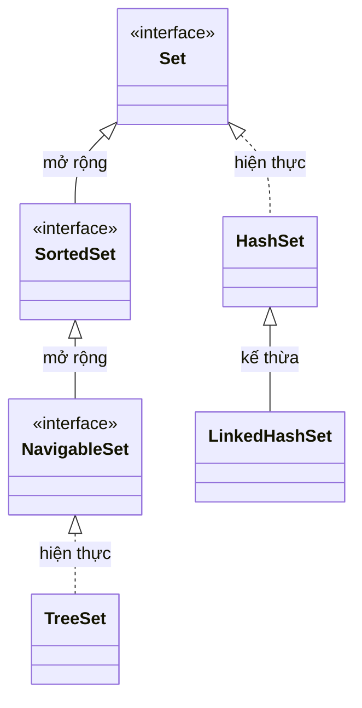

# So sánh HashSet, LinkedHashSet và TreeSet trong Java

Ba lớp `HashSet`, `LinkedHashSet` và `TreeSet` đều cài đặt `Set` interface — tức là không cho phép phần tử trùng lặp (duplicate). Điểm khác biệt chính nằm ở **thứ tự lưu trữ** và **hiệu năng**.

Sơ đồ phân cấp dưới đây cho thấy quan hệ giữa ba lớp và các interface của chúng:



Đáng chú ý: `LinkedHashSet` kế thừa trực tiếp `HashSet`, còn `TreeSet` đi theo nhánh `SortedSet`/`NavigableSet` nên có thêm khả năng sắp xếp và điều hướng.

## Tổng quan nhanh

| Tiêu chí | HashSet | LinkedHashSet | TreeSet |
|---|---|---|---|
| Thứ tự phần tử | Không đảm bảo | Theo thứ tự chèn vào (insertion order) | Sắp xếp tự nhiên (natural order) hoặc theo Comparator |
| Cho phép `null` | Có (1 phần tử) | Có (1 phần tử) | Không (ném NullPointerException) |
| Tốc độ `add/remove/contains` | O(1) trung bình | O(1) trung bình | O(log n) |
| Bộ nhớ | Thấp nhất | Cao hơn HashSet | Cao hơn HashSet |
| Luồng an toàn (thread-safe) | Không | Không | Không |
| Cấu trúc nội tại | Hash table | Hash table + Linked list | Red-Black Tree |

## Ví dụ minh họa thứ tự phần tử

```java
import java.util.HashSet;
import java.util.LinkedHashSet;
import java.util.Set;
import java.util.TreeSet;

public class SetCompareDemo {
    public static void main(String[] args) {
        Set<String> hashSet = new HashSet<>();
        Set<String> linkedHashSet = new LinkedHashSet<>();
        Set<String> treeSet = new TreeSet<>();

        String[] names = {"Chuối", "Táo", "Xoài", "Bưởi", "Ổi"};
        for (String name : names) {
            hashSet.add(name);
            linkedHashSet.add(name);
            treeSet.add(name);
        }

        System.out.println("HashSet (không theo thứ tự): " + hashSet);
        // Ví dụ: [Bưởi, Xoài, Táo, Ổi, Chuối]

        System.out.println("LinkedHashSet (theo thứ tự chèn): " + linkedHashSet);
        // [Chuối, Táo, Xoài, Bưởi, Ổi]

        System.out.println("TreeSet (sắp xếp tự nhiên): " + treeSet);
        // [Bưởi, Chuối, Ổi, Táo, Xoài]
    }
}
```

## Chi tiết từng lớp

### HashSet

- Dựa trên **hash table** (bảng băm) — sử dụng `HashMap` nội bộ.
- Thứ tự phần tử không được đảm bảo và có thể thay đổi khi thêm/xóa.
- Phù hợp khi chỉ cần kiểm tra sự tồn tại của phần tử với tốc độ cao nhất.

```java
Set<Integer> set = new HashSet<>();
set.add(3);
set.add(1);
set.add(2);
set.add(1); // bị bỏ qua vì trùng lặp
System.out.println(set); // thứ tự không xác định, ví dụ: [1, 2, 3]
```

### LinkedHashSet

- Kế thừa `HashSet`, bổ sung một **danh sách liên kết đôi** (doubly linked list) để duy trì thứ tự chèn.
- Chạy chậm hơn `HashSet` một chút do phải cập nhật thêm danh sách liên kết.
- Phù hợp khi cần loại bỏ trùng lặp nhưng vẫn giữ thứ tự ban đầu.

```java
Set<String> set = new LinkedHashSet<>();
set.add("ba");
set.add("một");
set.add("hai");
System.out.println(set); // [ba, một, hai] - đúng thứ tự chèn
```

### TreeSet

- Dựa trên **Red-Black Tree** (cây đỏ-đen) — một cây nhị phân tìm kiếm tự cân bằng.
- Phần tử luôn được sắp xếp theo thứ tự tự nhiên (comparable) hoặc theo `Comparator` tùy chỉnh.
- Cung cấp thêm các phương thức điều hướng: `first()`, `last()`, `floor()`, `ceiling()`, `headSet()`, `tailSet()`.
- Không chấp nhận `null`.

```java
TreeSet<Integer> treeSet = new TreeSet<>();
treeSet.add(5);
treeSet.add(1);
treeSet.add(3);
System.out.println(treeSet);             // [1, 3, 5]
System.out.println(treeSet.first());     // 1
System.out.println(treeSet.last());      // 5
System.out.println(treeSet.floor(4));    // 3 - phần tử lớn nhất <= 4
System.out.println(treeSet.ceiling(2));  // 3 - phần tử nhỏ nhất >= 2
```

## Khi nào dùng cái nào?

- **`HashSet`**: Mặc định cho mọi trường hợp cần tập hợp không trùng lặp, khi thứ tự không quan trọng.
- **`LinkedHashSet`**: Khi cần loại bỏ trùng lặp và giữ nguyên thứ tự chèn (ví dụ: lưu lịch sử thao tác).
- **`TreeSet`**: Khi cần tập hợp không trùng lặp và luôn được sắp xếp, hoặc cần duyệt theo khoảng giá trị.
