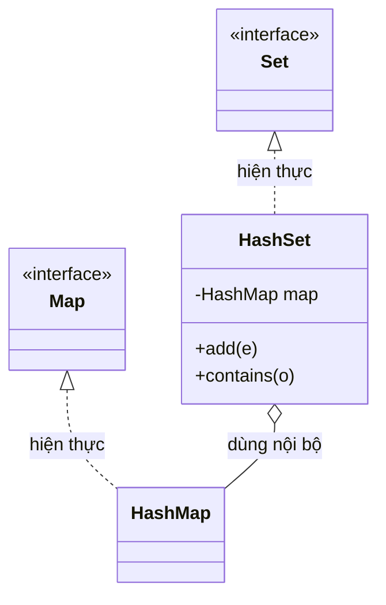

# So sánh HashMap và HashSet trong Java

`HashMap` và `HashSet` đều sử dụng cơ chế băm (hashing) bên trong, nhưng phục vụ hai mục đích khác nhau hoàn toàn.

Sơ đồ dưới đây cho thấy mối quan hệ cốt lõi: `HashSet` thực chất bọc một `HashMap` bên trong để lưu phần tử.



Vì `HashSet` ủy quyền việc lưu trữ cho `HashMap`, cả hai chia sẻ đặc tính hiệu năng O(1) trung bình của cơ chế băm.

:::note[Ghi nhớ nhanh]

- ⭐ **`HashSet` thực chất là một `HashMap` bên trong** — khi `add(e)` nó gọi `map.put(e, PRESENT)` với object giả `PRESENT` làm value.
- **Mục đích khác nhau** — `HashMap` lưu cặp key-value (`put`/`get`), `HashSet` chỉ lưu các phần tử duy nhất (`add`/`contains`).
- **Cho phép `null`** — `HashMap` nhận 1 null key và nhiều null value; `HashSet` nhận 1 null value.
- **Hiệu năng** — cả hai đạt O(1) trung bình nhờ cơ chế băm.
- **Khi nào dùng** — `HashMap` khi cần ánh xạ (cache, đếm tần suất); `HashSet` khi chỉ cần tập hợp không trùng.

:::

## Điểm khác biệt cốt lõi

| Tiêu chí | HashMap | HashSet |
|---|---|---|
| Lưu trữ | Cặp key-value (khóa-giá trị) | Chỉ các giá trị đơn lẻ (value) |
| Interface cài đặt | `Map` | `Set` |
| Phần tử trùng lặp | Key không được trùng; value có thể trùng | Không cho phép phần tử trùng |
| Cho phép `null` | 1 null key, nhiều null value | 1 null value |
| Phương thức thêm | `put(key, value)` | `add(value)` |
| Phương thức lấy | `get(key)` | Không có get theo index; dùng `contains()` |
| Cấu trúc nội tại | Array of Entry nodes | Dùng `HashMap` nội bộ (value lưu ở key, PRESENT lưu ở value) |
| Tốc độ | O(1) trung bình | O(1) trung bình |

## HashSet thực ra là HashMap

Điều thú vị: `HashSet` bên trong thực sự là một `HashMap`. Khi bạn thêm phần tử vào `HashSet`, nó gọi `map.put(element, PRESENT)` với một object giả `PRESENT` làm value.

```java
// Mã nguồn rút gọn của HashSet trong JDK
public class HashSet<E> {
    private HashMap<E, Object> map;
    private static final Object PRESENT = new Object(); // giá trị giả

    public boolean add(E e) {
        return map.put(e, PRESENT) == null;
    }

    public boolean contains(Object o) {
        return map.containsKey(o);
    }
}
```

## Ví dụ sử dụng

```java
import java.util.HashMap;
import java.util.HashSet;
import java.util.Map;
import java.util.Set;

public class HashMapVsHashSet {
    public static void main(String[] args) {
        // HashMap: ánh xạ tên sinh viên → điểm số
        Map<String, Integer> scores = new HashMap<>();
        scores.put("Alice", 95);
        scores.put("Bob", 87);
        scores.put("Alice", 99); // ghi đè key "Alice"
        System.out.println("Điểm Alice: " + scores.get("Alice")); // 99
        System.out.println("Số sinh viên: " + scores.size());     // 2

        // HashSet: tập hợp các thành phố không trùng
        Set<String> cities = new HashSet<>();
        cities.add("Hà Nội");
        cities.add("HCM");
        cities.add("Hà Nội"); // bị bỏ qua vì đã tồn tại
        System.out.println("Số thành phố: " + cities.size());         // 2
        System.out.println("Có HCM không? " + cities.contains("HCM")); // true
    }
}
```

## Khi nào dùng cái nào?

- **`HashMap`**: Khi cần ánh xạ từ key sang value, ví dụ: cache, bảng tần suất, từ điển.
- **`HashSet`**: Khi chỉ cần lưu tập hợp các phần tử duy nhất, không cần gán giá trị kèm theo, ví dụ: kiểm tra phần tử đã tồn tại chưa, loại bỏ trùng lặp.

## Ví dụ thực tế

```java
import java.util.HashMap;
import java.util.HashSet;
import java.util.Map;
import java.util.Set;

public class PracticalExample {
    public static void main(String[] args) {
        String[] words = {"java", "python", "java", "go", "python", "java"};

        // HashMap: đếm tần suất từ
        Map<String, Integer> frequency = new HashMap<>();
        for (String word : words) {
            frequency.put(word, frequency.getOrDefault(word, 0) + 1);
        }
        System.out.println("Tần suất: " + frequency);
        // {java=3, python=2, go=1}

        // HashSet: lấy danh sách từ duy nhất
        Set<String> uniqueWords = new HashSet<>();
        for (String word : words) {
            uniqueWords.add(word);
        }
        System.out.println("Từ duy nhất: " + uniqueWords);
        // [java, python, go] (thứ tự không xác định)
    }
}
```
