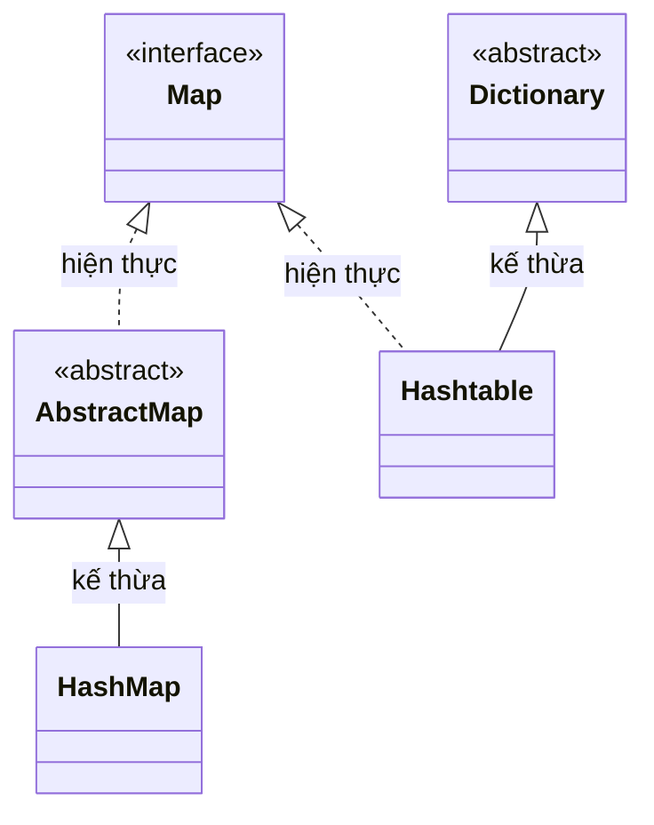

# So sánh HashMap và Hashtable trong Java

`HashMap` và `Hashtable` đều là cài đặt của `Map` interface lưu trữ dữ liệu theo cặp key-value. Tuy nhiên, có nhiều sự khác biệt quan trọng giữa hai lớp này.

Sơ đồ dưới đây cho thấy hai lớp tuy cùng hiện thực `Map` nhưng thừa kế từ hai nhánh khác nhau — `HashMap` từ `AbstractMap` (hiện đại), `Hashtable` từ `Dictionary` (lỗi thời):



## Bảng so sánh

| Tiêu chí | HashMap | Hashtable |
|---|---|---|
| Phiên bản ra đời | Java 2 (1998) | Java 1.0 (1996) |
| Thread-safe (an toàn đa luồng) | Không | Có (synchronized) |
| Cho phép null key | Có (tối đa 1) | Không |
| Cho phép null value | Có (nhiều) | Không |
| Hiệu năng | Nhanh hơn | Chậm hơn (do synchronized) |
| Kế thừa từ | `AbstractMap` | `Dictionary` (lỗi thời) |
| Iterator | Fail-fast iterator | Fail-safe Enumeration |
| Dùng trong code mới | Khuyến khích | Không khuyến khích |

> **Fail-fast iterator** (bộ duyệt phát hiện lỗi nhanh): ném `ConcurrentModificationException` nếu collection bị sửa đổi trong khi đang duyệt.

## Ví dụ minh họa sự khác biệt về null

```java
import java.util.HashMap;
import java.util.Hashtable;

public class NullDifference {
    public static void main(String[] args) {
        // HashMap chấp nhận null
        HashMap<String, String> hashMap = new HashMap<>();
        hashMap.put(null, "giá trị null key"); // OK
        hashMap.put("key1", null);             // OK
        System.out.println("HashMap null key: " + hashMap.get(null));
        System.out.println("HashMap null value: " + hashMap.get("key1"));

        // Hashtable không chấp nhận null
        Hashtable<String, String> hashtable = new Hashtable<>();
        try {
            hashtable.put(null, "value"); // NullPointerException!
        } catch (NullPointerException e) {
            System.out.println("Hashtable: không chấp nhận null key");
        }
        try {
            hashtable.put("key", null); // NullPointerException!
        } catch (NullPointerException e) {
            System.out.println("Hashtable: không chấp nhận null value");
        }
    }
}
```

## Ví dụ minh họa sự khác biệt về thread-safety

```java
import java.util.Collections;
import java.util.HashMap;
import java.util.Hashtable;
import java.util.Map;
import java.util.concurrent.ConcurrentHashMap;

public class ThreadSafetyDemo {
    public static void main(String[] args) {
        // Hashtable: thread-safe nhưng kém hiệu năng
        Map<String, Integer> hashtable = new Hashtable<>();

        // HashMap: không thread-safe, cần đồng bộ hóa thủ công nếu cần
        Map<String, Integer> hashMap = new HashMap<>();

        // Cách 1: đồng bộ hóa HashMap thủ công
        Map<String, Integer> syncMap = Collections.synchronizedMap(new HashMap<>());

        // Cách 2 (khuyến nghị): ConcurrentHashMap - hiệu năng cao hơn cả hai
        Map<String, Integer> concurrentMap = new ConcurrentHashMap<>();

        System.out.println("Trong ứng dụng đa luồng hiện đại, hãy dùng ConcurrentHashMap");
    }
}
```

## Sự khác biệt về Iterator

```java
import java.util.ConcurrentModificationException;
import java.util.HashMap;
import java.util.Iterator;
import java.util.Map;

public class IteratorDemo {
    public static void main(String[] args) {
        Map<String, Integer> map = new HashMap<>();
        map.put("a", 1);
        map.put("b", 2);
        map.put("c", 3);

        // HashMap dùng fail-fast Iterator
        try {
            Iterator<String> it = map.keySet().iterator();
            while (it.hasNext()) {
                String key = it.next();
                if (key.equals("b")) {
                    map.put("d", 4); // Sửa đổi trong khi duyệt
                }
            }
        } catch (ConcurrentModificationException e) {
            System.out.println("HashMap: ConcurrentModificationException khi sửa trong lúc duyệt");
        }
    }
}
```

## Nên dùng cái nào?

**Trong ứng dụng hiện đại:**
- **Đơn luồng**: Dùng `HashMap`.
- **Đa luồng**: Dùng `ConcurrentHashMap` (không dùng `Hashtable`).
- **Cần giữ thứ tự chèn**: Dùng `LinkedHashMap`.
- **Cần sắp xếp theo key**: Dùng `TreeMap`.

`Hashtable` hiện nay chỉ còn xuất hiện trong code kế thừa (legacy code). Các dự án mới không nên dùng.
