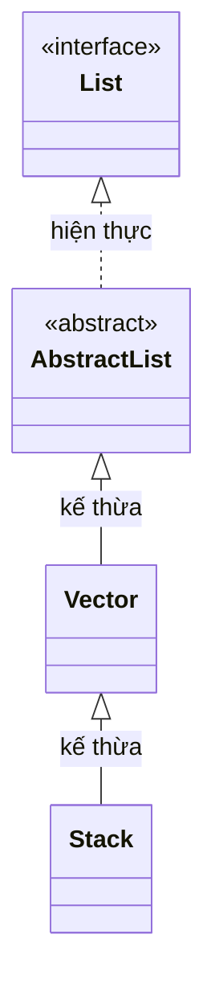

# Vector trong Java

`Vector` là một lớp collection có trong Java từ phiên bản 1.0, đại diện cho một mảng động (dynamic array) tương tự `ArrayList`. Điểm khác biệt chính là `Vector` được đồng bộ hóa (synchronized) — tức là thread-safe theo mặc định.

Sơ đồ phân cấp dưới đây cho thấy vị trí của `Vector` trong cây kế thừa `List` và mối quan hệ với `Stack`:



Lưu ý: `Stack` cũng kế thừa từ `Vector`, nên thừa hưởng cả tính thread-safe lẫn nhược điểm hiệu năng của lớp cha.

## Đặc điểm của Vector

- **Thread-safe**: tất cả phương thức đều `synchronized`.
- **Tăng kích thước theo hệ số nhân** (capacity increment): mặc định gấp đôi khi đầy (ArrayList tăng 50%).
- Kế thừa từ `AbstractList` và cài đặt `List` interface.
- Hỗ trợ cả `Iterator` (hiện đại) và `Enumeration` (cũ).

## Ví dụ cơ bản

```java
import java.util.Vector;

public class VectorBasic {
    public static void main(String[] args) {
        Vector<String> vector = new Vector<>();

        // Thêm phần tử
        vector.add("Java");
        vector.add("Python");
        vector.add("Go");
        vector.addElement("Rust"); // phương thức riêng của Vector (cũ)

        System.out.println("Kích thước: " + vector.size());       // 4
        System.out.println("Capacity: " + vector.capacity());      // 10 (mặc định)
        System.out.println("Phần tử thứ 2: " + vector.get(1));    // Python

        // Xóa phần tử
        vector.remove("Go");
        System.out.println("Sau khi xóa: " + vector);             // [Java, Python, Rust]

        // Kiểm tra
        System.out.println("Có Java không? " + vector.contains("Java")); // true
    }
}
```

## Quản lý capacity (dung lượng nội tại)

```java
import java.util.Vector;

public class VectorCapacity {
    public static void main(String[] args) {
        // Vector với capacity ban đầu = 5, tăng mỗi lần thêm 3 phần tử
        Vector<Integer> v = new Vector<>(5, 3);
        System.out.println("Capacity ban đầu: " + v.capacity()); // 5

        for (int i = 0; i < 6; i++) {
            v.add(i);
        }
        // Sau khi thêm phần tử thứ 6 (vượt 5), tăng thêm 3 → capacity = 8
        System.out.println("Capacity sau khi thêm 6 phần tử: " + v.capacity()); // 8

        // Thu hẹp capacity về đúng kích thước hiện tại
        v.trimToSize();
        System.out.println("Capacity sau trimToSize: " + v.capacity()); // 6
    }
}
```

## Duyệt phần tử

```java
import java.util.Enumeration;
import java.util.Iterator;
import java.util.Vector;

public class VectorIteration {
    public static void main(String[] args) {
        Vector<String> v = new Vector<>();
        v.add("Alpha");
        v.add("Beta");
        v.add("Gamma");

        // Cách 1: Iterator (hiện đại, khuyến nghị)
        Iterator<String> it = v.iterator();
        while (it.hasNext()) {
            System.out.println("Iterator: " + it.next());
        }

        // Cách 2: Enumeration (cũ, tránh dùng trong code mới)
        Enumeration<String> en = v.elements();
        while (en.hasMoreElements()) {
            System.out.println("Enumeration: " + en.nextElement());
        }

        // Cách 3: For-each (đơn giản nhất)
        for (String s : v) {
            System.out.println("For-each: " + s);
        }
    }
}
```

## Các phương thức đặc trưng của Vector

| Phương thức | Mô tả |
|---|---|
| `addElement(e)` | Thêm phần tử (tương đương `add`) |
| `removeElement(o)` | Xóa phần tử (tương đương `remove`) |
| `elementAt(index)` | Lấy phần tử theo chỉ số (tương đương `get`) |
| `firstElement()` | Lấy phần tử đầu tiên |
| `lastElement()` | Lấy phần tử cuối cùng |
| `capacity()` | Lấy dung lượng hiện tại |
| `trimToSize()` | Thu hẹp capacity về đúng size |
| `elements()` | Trả về `Enumeration` |

## Lưu ý quan trọng

Trong các ứng dụng hiện đại, `Vector` ít được sử dụng vì:
1. Đồng bộ hóa toàn phương thức gây giảm hiệu năng không cần thiết.
2. `ArrayList` nhanh hơn trong môi trường đơn luồng.
3. `CopyOnWriteArrayList` hoặc `Collections.synchronizedList()` phù hợp hơn cho môi trường đa luồng.

```java
import java.util.ArrayList;
import java.util.Collections;
import java.util.List;
import java.util.concurrent.CopyOnWriteArrayList;

// Thay thế hiện đại cho Vector
List<String> syncList = Collections.synchronizedList(new ArrayList<>());

// Hoặc dùng CopyOnWriteArrayList cho trường hợp đọc nhiều hơn ghi
List<String> cowList = new CopyOnWriteArrayList<>();
```
