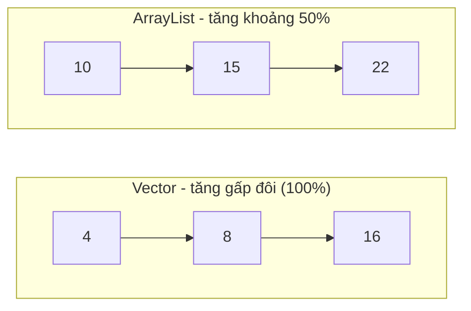

# So sánh ArrayList và Vector trong Java

`ArrayList` và `Vector` đều là mảng động (dynamic array) cài đặt `List` interface, nhưng có những sự khác biệt quan trọng khiến `ArrayList` được ưa chuộng hơn trong phần lớn các trường hợp.

Một khác biệt dễ thấy là cách tăng dung lượng (capacity) khi mảng đầy — sơ đồ dưới đây minh họa: `Vector` tăng gấp đôi, còn `ArrayList` chỉ tăng khoảng 50%, ít lãng phí bộ nhớ hơn:



## Bảng so sánh chi tiết

| Tiêu chí | ArrayList | Vector |
|---|---|---|
| Phiên bản ra đời | Java 2 (1998) | Java 1.0 (1996) |
| Thread-safe | Không | Có (synchronized) |
| Hiệu năng đơn luồng | Cao hơn | Thấp hơn (overhead của synchronized) |
| Tốc độ tăng capacity khi đầy | 50% | 100% (gấp đôi) hoặc theo `capacityIncrement` |
| Iterator | Fail-fast | Fail-fast + hỗ trợ Enumeration |
| Dùng trong code mới | Khuyến nghị | Không khuyến nghị |

> **Overhead** (chi phí phụ trội): chi phí tính toán thêm phát sinh do cơ chế đồng bộ hóa, ngay cả khi không có xung đột luồng.

## Ví dụ minh họa sự khác biệt về tốc độ tăng capacity

```java
import java.util.ArrayList;
import java.util.Vector;

public class CapacityGrowthDemo {
    public static void main(String[] args) {
        // Không thể lấy capacity của ArrayList trực tiếp (private)
        // nhưng có thể quan sát qua Vector

        Vector<Integer> vector = new Vector<>(4); // capacity ban đầu = 4
        System.out.println("Vector capacity ban đầu: " + vector.capacity()); // 4

        for (int i = 0; i < 5; i++) {
            vector.add(i);
        }
        // Sau khi vượt 4, Vector tăng gấp đôi: 4 → 8
        System.out.println("Vector capacity sau khi thêm 5 phần tử: " + vector.capacity()); // 8

        // ArrayList tăng ~50%: 10 (mặc định) → 15 → 22...
        // Ít lãng phí bộ nhớ hơn Vector
    }
}
```

## Ví dụ minh họa sự khác biệt về thread-safety

```java
import java.util.ArrayList;
import java.util.Collections;
import java.util.List;
import java.util.Vector;

public class ThreadSafetyComparison {
    public static void main(String[] args) throws InterruptedException {
        // Vector: thread-safe mặc định
        List<Integer> vector = new Vector<>();

        // ArrayList: không thread-safe
        List<Integer> arrayList = new ArrayList<>();

        // ArrayList có thể bị lỗi trong môi trường đa luồng
        // Để làm ArrayList thread-safe:
        List<Integer> syncArrayList = Collections.synchronizedList(new ArrayList<>());

        Runnable addTask = () -> {
            for (int i = 0; i < 1000; i++) {
                synchronized (syncArrayList) {
                    syncArrayList.add(i);
                }
            }
        };

        Thread t1 = new Thread(addTask);
        Thread t2 = new Thread(addTask);
        t1.start();
        t2.start();
        t1.join();
        t2.join();

        System.out.println("Kích thước sau 2 luồng: " + syncArrayList.size()); // 2000
    }
}
```

## Khi nào dùng cái nào?

**Dùng `ArrayList` khi:**
- Ứng dụng đơn luồng (single-thread) — đây là trường hợp phổ biến nhất.
- Cần hiệu năng cao nhất.
- Đây là lựa chọn mặc định trong hầu hết tình huống.

**Không nên dùng `Vector` trong code mới.** Thay vào đó:
- Đơn luồng → `ArrayList`
- Đa luồng, đọc và ghi đều nhiều → `Collections.synchronizedList(new ArrayList<>())`
- Đa luồng, đọc nhiều hơn ghi → `CopyOnWriteArrayList`

```java
import java.util.ArrayList;
import java.util.Collections;
import java.util.List;
import java.util.concurrent.CopyOnWriteArrayList;

// Đơn luồng
List<String> list = new ArrayList<>();

// Đa luồng - đọc và ghi cân bằng
List<String> syncList = Collections.synchronizedList(new ArrayList<>());

// Đa luồng - đọc nhiều, ghi ít (snapshot khi iterate)
List<String> cowList = new CopyOnWriteArrayList<>();
```

## Tóm tắt

`Vector` tồn tại vì lý do lịch sử. Nó được thiết kế trước khi Java có Java Collections Framework (JCF) đầy đủ. Kể từ Java 2, `ArrayList` thay thế hoàn toàn `Vector` trong hầu hết tình huống. `Vector` hiện còn xuất hiện chủ yếu trong code kế thừa (legacy code) cần duy trì tương thích ngược.
