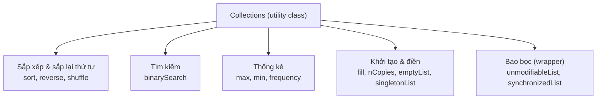

# Lớp Collections trong Java - Collections Utility Class

`Collections` (số nhiều, không phải `Collection`) là một **lớp tiện ích** (utility class) chứa các phương thức static hỗ trợ thao tác trên các collection như sắp xếp, tìm kiếm, đảo ngược, trộn ngẫu nhiên, và đồng bộ hóa.

> **Utility class** (lớp tiện ích): lớp chỉ chứa các phương thức static, không thể khởi tạo đối tượng.

Sơ đồ dưới đây nhóm các phương thức static tiêu biểu của `Collections` theo chức năng:



## Sắp xếp - sort()

```java
import java.util.ArrayList;
import java.util.Collections;
import java.util.List;

public class CollectionsSortDemo {
    public static void main(String[] args) {
        List<Integer> numbers = new ArrayList<>();
        numbers.add(5);
        numbers.add(2);
        numbers.add(8);
        numbers.add(1);
        numbers.add(9);

        // Sắp xếp tăng dần (natural order)
        Collections.sort(numbers);
        System.out.println("Tăng dần: " + numbers); // [1, 2, 5, 8, 9]

        // Sắp xếp giảm dần dùng reverseOrder()
        Collections.sort(numbers, Collections.reverseOrder());
        System.out.println("Giảm dần: " + numbers); // [9, 8, 5, 2, 1]

        // Sắp xếp chuỗi theo độ dài
        List<String> words = new ArrayList<>();
        words.add("Chuối");
        words.add("Ổi");
        words.add("Thanh long");
        words.add("Mít");
        Collections.sort(words, (a, b) -> a.length() - b.length());
        System.out.println("Theo độ dài: " + words); // [Ổi, Mít, Chuối, Thanh long]
    }
}
```

## Tìm kiếm nhị phân - binarySearch()

```java
import java.util.ArrayList;
import java.util.Collections;
import java.util.List;

public class BinarySearchDemo {
    public static void main(String[] args) {
        List<Integer> numbers = new ArrayList<>();
        numbers.add(1);
        numbers.add(3);
        numbers.add(5);
        numbers.add(7);
        numbers.add(9);
        // Danh sách phải được sắp xếp trước khi dùng binarySearch

        int index = Collections.binarySearch(numbers, 5);
        System.out.println("Chỉ số của 5: " + index); // 2

        int notFound = Collections.binarySearch(numbers, 4);
        System.out.println("4 không tìm thấy: " + notFound); // âm (ví dụ: -3)
    }
}
```

## Giá trị lớn nhất, nhỏ nhất - max() và min()

```java
import java.util.Arrays;
import java.util.Collections;
import java.util.List;

public class MinMaxDemo {
    public static void main(String[] args) {
        List<Integer> numbers = Arrays.asList(3, 1, 4, 1, 5, 9, 2, 6);

        System.out.println("Lớn nhất: " + Collections.max(numbers)); // 9
        System.out.println("Nhỏ nhất: " + Collections.min(numbers)); // 1
    }
}
```

## Đảo ngược - reverse()

```java
import java.util.ArrayList;
import java.util.Collections;
import java.util.List;

public class ReverseDemo {
    public static void main(String[] args) {
        List<String> list = new ArrayList<>();
        list.add("a");
        list.add("b");
        list.add("c");
        list.add("d");

        Collections.reverse(list);
        System.out.println("Sau đảo ngược: " + list); // [d, c, b, a]
    }
}
```

## Trộn ngẫu nhiên - shuffle()

```java
import java.util.ArrayList;
import java.util.Collections;
import java.util.List;

public class ShuffleDemo {
    public static void main(String[] args) {
        List<String> cards = new ArrayList<>();
        cards.add("Át");
        cards.add("2");
        cards.add("3");
        cards.add("4");
        cards.add("5");

        Collections.shuffle(cards);
        System.out.println("Sau khi trộn: " + cards); // thứ tự ngẫu nhiên
    }
}
```

## Điền giá trị - fill()

```java
import java.util.ArrayList;
import java.util.Collections;
import java.util.List;

public class FillDemo {
    public static void main(String[] args) {
        List<String> list = new ArrayList<>();
        list.add("a");
        list.add("b");
        list.add("c");

        Collections.fill(list, "X"); // thay tất cả phần tử bằng "X"
        System.out.println("Sau fill: " + list); // [X, X, X]
    }
}
```

## Đếm số lần xuất hiện - frequency()

```java
import java.util.Arrays;
import java.util.Collections;
import java.util.List;

public class FrequencyDemo {
    public static void main(String[] args) {
        List<String> items = Arrays.asList("Java", "Python", "Java", "Go", "Java");

        int count = Collections.frequency(items, "Java");
        System.out.println("Java xuất hiện: " + count + " lần"); // 3
    }
}
```

## Tạo collection không thể sửa đổi - unmodifiableXxx()

```java
import java.util.ArrayList;
import java.util.Collections;
import java.util.List;

public class UnmodifiableDemo {
    public static void main(String[] args) {
        List<String> mutable = new ArrayList<>();
        mutable.add("Java");
        mutable.add("Python");

        // Tạo view không thể sửa đổi
        List<String> immutable = Collections.unmodifiableList(mutable);

        System.out.println("Danh sách: " + immutable);

        try {
            immutable.add("Go"); // UnsupportedOperationException!
        } catch (UnsupportedOperationException e) {
            System.out.println("Không thể thêm vào unmodifiable list");
        }
    }
}
```

## Tạo collection đồng bộ hóa - synchronizedXxx()

```java
import java.util.ArrayList;
import java.util.Collections;
import java.util.List;
import java.util.Map;
import java.util.HashMap;

public class SynchronizedDemo {
    public static void main(String[] args) {
        // Thread-safe List từ ArrayList
        List<String> syncList = Collections.synchronizedList(new ArrayList<>());

        // Thread-safe Map từ HashMap
        Map<String, Integer> syncMap = Collections.synchronizedMap(new HashMap<>());

        System.out.println("Đã tạo synchronized collections");
    }
}
```

## Tóm tắt các phương thức quan trọng

| Phương thức | Chức năng |
|---|---|
| `sort(list)` | Sắp xếp danh sách |
| `sort(list, comparator)` | Sắp xếp theo tiêu chí tùy chỉnh |
| `reverse(list)` | Đảo ngược danh sách |
| `shuffle(list)` | Trộn ngẫu nhiên |
| `binarySearch(list, key)` | Tìm kiếm nhị phân (list phải đã sắp xếp) |
| `max(collection)` | Phần tử lớn nhất |
| `min(collection)` | Phần tử nhỏ nhất |
| `frequency(collection, o)` | Đếm số lần xuất hiện |
| `fill(list, o)` | Điền tất cả bằng một giá trị |
| `copy(dest, src)` | Sao chép danh sách |
| `nCopies(n, o)` | Tạo list với n bản sao của o |
| `unmodifiableList(list)` | Tạo list chỉ đọc |
| `synchronizedList(list)` | Tạo list thread-safe |
| `emptyList()` | Trả về list rỗng bất biến |
| `singletonList(o)` | Trả về list chỉ có 1 phần tử |
