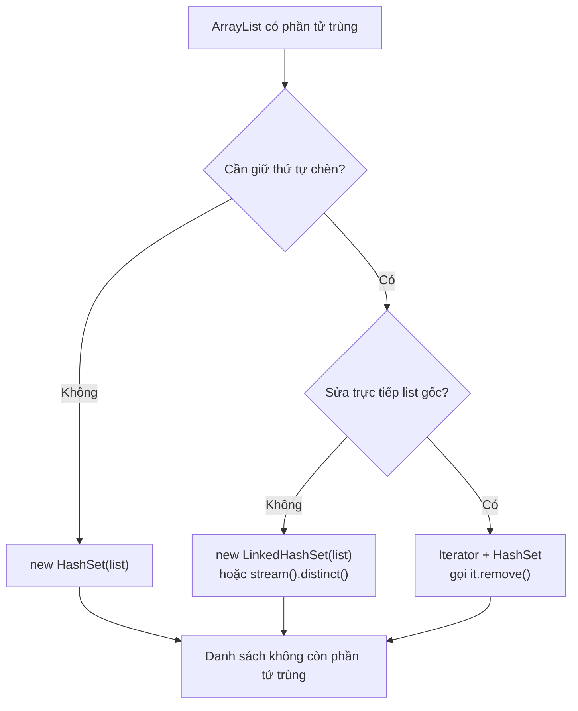

# Loại bỏ các phần tử trùng trong một ArrayList

Đây là một tác vụ thường gặp trong lập trình Java. Có nhiều cách tiếp cận khác nhau tùy thuộc vào yêu cầu về thứ tự và hiệu năng.

Sơ đồ quyết định dưới đây giúp bạn chọn cách phù hợp dựa trên hai câu hỏi: có cần giữ thứ tự không, và có cần thay đổi trực tiếp list gốc không:



:::note[Ghi nhớ nhanh]

- ⭐ **Nhanh nhất: `new HashSet<>(list)`** — rồi đưa lại về `ArrayList`, nhưng KHÔNG giữ thứ tự chèn.
- **Cần giữ thứ tự chèn** — dùng `LinkedHashSet` hoặc `stream().distinct()` (Java 8+).
- **Muốn xóa tại chỗ trên list gốc** — dùng `Iterator` + `HashSet`, gọi `it.remove()` khi `seen.add()` trả về `false`.
- **Với custom object** — bắt buộc override `equals()` và `hashCode()` thì mới loại trùng đúng.

:::

## Cách 1: Dùng HashSet (không giữ thứ tự)

**HashSet** tự động loại bỏ phần tử trùng lặp. Chuyển `ArrayList` sang `HashSet` rồi chuyển ngược lại là cách nhanh nhất.

```java
import java.util.ArrayList;
import java.util.HashSet;
import java.util.List;
import java.util.Set;

public class RemoveDuplicates {
    public static void main(String[] args) {
        List<String> list = new ArrayList<>();
        list.add("Java");
        list.add("Python");
        list.add("Java");
        list.add("Go");
        list.add("Python");

        // Chuyển sang HashSet để loại trùng
        Set<String> set = new HashSet<>(list);
        List<String> result = new ArrayList<>(set);

        System.out.println("Gốc: " + list);   // [Java, Python, Java, Go, Python]
        System.out.println("Kết quả: " + result); // thứ tự không xác định
    }
}
```

## Cách 2: Dùng LinkedHashSet (giữ thứ tự chèn)

Nếu cần giữ nguyên thứ tự xuất hiện đầu tiên của mỗi phần tử, dùng `LinkedHashSet`:

```java
import java.util.ArrayList;
import java.util.LinkedHashSet;
import java.util.List;
import java.util.Set;

public class RemoveDuplicatesOrdered {
    public static void main(String[] args) {
        List<String> list = new ArrayList<>();
        list.add("Java");
        list.add("Python");
        list.add("Java");
        list.add("Go");
        list.add("Python");

        // LinkedHashSet giữ thứ tự chèn đầu tiên
        Set<String> set = new LinkedHashSet<>(list);
        List<String> result = new ArrayList<>(set);

        System.out.println("Gốc: " + list);      // [Java, Python, Java, Go, Python]
        System.out.println("Kết quả: " + result); // [Java, Python, Go]
    }
}
```

## Cách 3: Dùng Stream API (Java 8+)

```java
import java.util.ArrayList;
import java.util.List;
import java.util.stream.Collectors;

public class RemoveDuplicatesStream {
    public static void main(String[] args) {
        List<Integer> numbers = new ArrayList<>();
        numbers.add(3);
        numbers.add(1);
        numbers.add(4);
        numbers.add(1);
        numbers.add(5);
        numbers.add(9);
        numbers.add(2);
        numbers.add(6);
        numbers.add(5);

        // distinct() loại bỏ phần tử trùng, giữ thứ tự xuất hiện đầu
        List<Integer> unique = numbers.stream()
                .distinct()
                .collect(Collectors.toList());

        System.out.println("Gốc: " + numbers);   // [3, 1, 4, 1, 5, 9, 2, 6, 5]
        System.out.println("Kết quả: " + unique); // [3, 1, 4, 5, 9, 2, 6]
    }
}
```

## Cách 4: Dùng Iterator (loại bỏ tại chỗ)

Nếu cần loại bỏ trùng lặp khỏi list gốc (thay đổi trực tiếp):

```java
import java.util.ArrayList;
import java.util.HashSet;
import java.util.Iterator;
import java.util.List;
import java.util.Set;

public class RemoveDuplicatesInPlace {
    public static void main(String[] args) {
        List<String> list = new ArrayList<>();
        list.add("a");
        list.add("b");
        list.add("a");
        list.add("c");
        list.add("b");

        Set<String> seen = new HashSet<>();
        Iterator<String> it = list.iterator();
        while (it.hasNext()) {
            String element = it.next();
            if (!seen.add(element)) {
                // seen.add() trả về false nếu phần tử đã tồn tại
                it.remove(); // xóa phần tử trùng khỏi list gốc
            }
        }

        System.out.println("Sau khi xóa trùng: " + list); // [a, b, c]
    }
}
```

## So sánh các cách

| Cách | Giữ thứ tự | Thay đổi list gốc | Độ phức tạp | Yêu cầu |
|---|---|---|---|---|
| HashSet | Không | Không | O(n) | Java 1.2+ |
| LinkedHashSet | Có (thứ tự chèn) | Không | O(n) | Java 1.4+ |
| Stream `distinct()` | Có (thứ tự chèn) | Không | O(n) | Java 8+ |
| Iterator + Set | Có (thứ tự chèn) | Có | O(n) | Java 1.2+ |

## Ví dụ với đối tượng tùy chỉnh

Khi loại bỏ trùng lặp với custom object, phải override `hashCode()` và `equals()`:

```java
import java.util.ArrayList;
import java.util.LinkedHashSet;
import java.util.List;
import java.util.Objects;

public class RemoveDuplicatesCustomObject {
    static class Product {
        int id;
        String name;

        Product(int id, String name) {
            this.id = id;
            this.name = name;
        }

        @Override
        public boolean equals(Object o) {
            if (this == o) return true;
            if (!(o instanceof Product)) return false;
            Product p = (Product) o;
            return id == p.id;
        }

        @Override
        public int hashCode() {
            return Objects.hash(id);
        }

        @Override
        public String toString() {
            return name + "(" + id + ")";
        }
    }

    public static void main(String[] args) {
        List<Product> products = new ArrayList<>();
        products.add(new Product(1, "Táo"));
        products.add(new Product(2, "Chuối"));
        products.add(new Product(1, "Táo")); // trùng id=1
        products.add(new Product(3, "Xoài"));

        List<Product> unique = new ArrayList<>(new LinkedHashSet<>(products));
        System.out.println("Sản phẩm duy nhất: " + unique);
        // [Táo(1), Chuối(2), Xoài(3)]
    }
}
```
