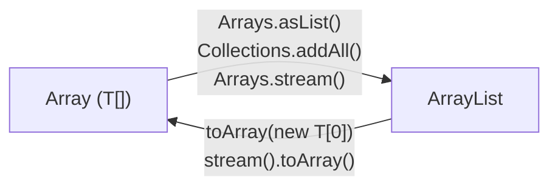

# Chuyển đổi Array sang ArrayList và ngược lại

Việc chuyển đổi qua lại giữa mảng (array) và `ArrayList` là thao tác rất thường gặp trong Java. Dưới đây là tất cả các cách phổ biến.

Sơ đồ dưới đây tóm tắt các phương thức chuyển đổi theo cả hai chiều giữa `Array` và `ArrayList`:



:::note[Ghi nhớ nhanh]

- ⭐ **Array → ArrayList đầy đủ chức năng** — dùng `new ArrayList<>(Arrays.asList(arr))`.
- **`Arrays.asList()` trả về list kích thước cố định** — `set()` được nhưng KHÔNG `add()`/`remove()` được.
- **ArrayList → Array khuyến nghị** — dùng `list.toArray(new T[0])`.
- **Mảng nguyên thủy (`int[]`)** — không dùng `Arrays.asList` trực tiếp; cần `stream().boxed()` hoặc `mapToInt().toArray()`.

:::

## Chuyển Array sang ArrayList

### Cách 1: Arrays.asList() — nhanh nhưng có hạn chế

```java
import java.util.ArrayList;
import java.util.Arrays;
import java.util.List;

public class ArrayToList1 {
    public static void main(String[] args) {
        String[] array = {"Java", "Python", "Go"};

        // Arrays.asList() trả về List có kích thước cố định
        List<String> fixedList = Arrays.asList(array);

        // Có thể thay đổi phần tử nhưng KHÔNG thể thêm/xóa
        fixedList.set(0, "Kotlin"); // OK
        System.out.println("Sau set: " + fixedList); // [Kotlin, Python, Go]

        try {
            fixedList.add("Rust"); // UnsupportedOperationException!
        } catch (UnsupportedOperationException e) {
            System.out.println("Không thể thêm vào fixed list");
        }

        // Để có ArrayList đầy đủ chức năng, bọc thêm:
        List<String> mutableList = new ArrayList<>(Arrays.asList(array));
        mutableList.add("Rust"); // OK
        System.out.println("ArrayList đầy đủ: " + mutableList);
    }
}
```

### Cách 2: Collections.addAll()

```java
import java.util.ArrayList;
import java.util.Collections;
import java.util.List;

public class ArrayToList2 {
    public static void main(String[] args) {
        String[] array = {"Java", "Python", "Go"};
        List<String> list = new ArrayList<>();
        Collections.addAll(list, array);
        System.out.println("Kết quả: " + list); // [Java, Python, Go]
    }
}
```

### Cách 3: Stream API (Java 8+)

```java
import java.util.Arrays;
import java.util.List;
import java.util.stream.Collectors;

public class ArrayToList3 {
    public static void main(String[] args) {
        String[] array = {"Java", "Python", "Go"};

        List<String> list = Arrays.stream(array)
                .collect(Collectors.toList());

        System.out.println("Kết quả: " + list); // [Java, Python, Go]
    }
}
```

### Lưu ý với mảng kiểu nguyên thủy (int[], double[], ...)

`Arrays.asList()` không hoạt động trực tiếp với `int[]`. Cần dùng Stream:

```java
import java.util.Arrays;
import java.util.List;
import java.util.stream.Collectors;

public class PrimitiveArrayToList {
    public static void main(String[] args) {
        int[] intArray = {1, 2, 3, 4, 5};

        // CÁCH SAI: Arrays.asList(intArray) trả về List<int[]>, không phải List<Integer>
        // List<int[]> wrong = Arrays.asList(intArray);

        // CÁCH ĐÚNG: dùng IntStream
        List<Integer> list = Arrays.stream(intArray)
                .boxed() // chuyển int → Integer
                .collect(Collectors.toList());

        System.out.println("Kết quả: " + list); // [1, 2, 3, 4, 5]
    }
}
```

## Chuyển ArrayList sang Array

### Cách 1: toArray(T[] a) — khuyến nghị

```java
import java.util.ArrayList;
import java.util.List;

public class ListToArray1 {
    public static void main(String[] args) {
        List<String> list = new ArrayList<>();
        list.add("Java");
        list.add("Python");
        list.add("Go");

        // Truyền mảng rỗng cùng kiểu — Java tự điều chỉnh kích thước
        String[] array = list.toArray(new String[0]);

        System.out.println("Kích thước: " + array.length); // 3
        for (String s : array) {
            System.out.print(s + " "); // Java Python Go
        }
    }
}
```

### Cách 2: Stream API (Java 8+)

```java
import java.util.Arrays;
import java.util.List;
import java.util.stream.Collectors;

public class ListToArray2 {
    public static void main(String[] args) {
        List<String> list = Arrays.asList("Java", "Python", "Go");

        String[] array = list.stream().toArray(String[]::new);

        System.out.println("Array: " + Arrays.toString(array));
        // [Java, Python, Go]
    }
}
```

### Chuyển sang mảng kiểu nguyên thủy

```java
import java.util.Arrays;
import java.util.List;

public class ListToPrimitiveArray {
    public static void main(String[] args) {
        List<Integer> list = Arrays.asList(1, 2, 3, 4, 5);

        // Chuyển List<Integer> sang int[]
        int[] intArray = list.stream()
                .mapToInt(Integer::intValue) // unbox Integer → int
                .toArray();

        System.out.println("int[]: " + Arrays.toString(intArray));
        // [1, 2, 3, 4, 5]
    }
}
```

## Bảng tổng hợp

| Chuyển đổi | Cách | Ghi chú |
|---|---|---|
| Array → ArrayList | `new ArrayList<>(Arrays.asList(arr))` | Đơn giản, hay dùng nhất |
| Array → ArrayList | `Collections.addAll(list, arr)` | Thêm vào list sẵn có |
| Array → ArrayList | `Arrays.stream(arr).collect(...)` | Linh hoạt, có thể lọc/biến đổi |
| `int[]` → `List<Integer>` | `Arrays.stream(arr).boxed().collect(...)` | Cần unbox |
| ArrayList → Array | `list.toArray(new T[0])` | Khuyến nghị |
| ArrayList → Array | `list.stream().toArray(T[]::new)` | Dùng với Stream |
| `List<Integer>` → `int[]` | `list.stream().mapToInt(...).toArray()` | Cần unbox |
