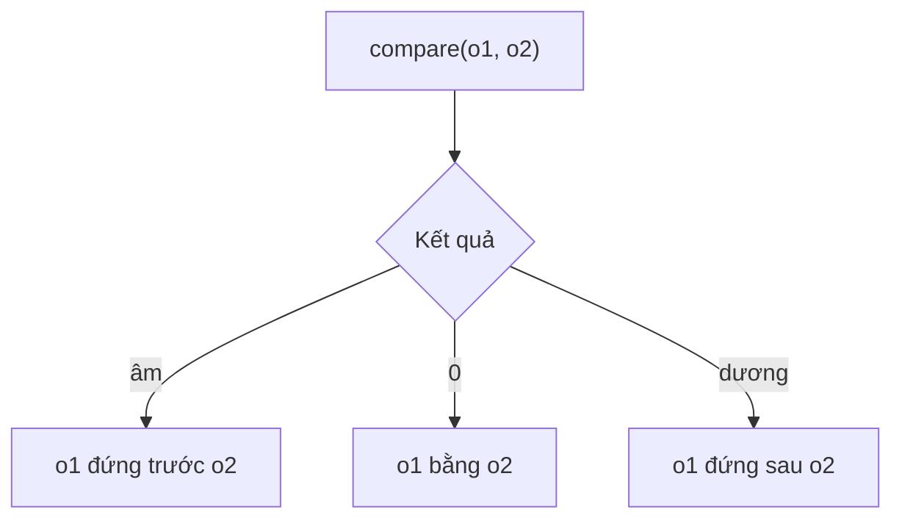

# Sắp xếp trong Java 8 - Comparator

`Comparator<T>` là functional interface dùng để định nghĩa cách so sánh hai đối tượng phục vụ việc sắp xếp. Java 8 bổ sung nhiều phương thức mặc định như `comparing()`, `reversed()`, `thenComparing()` giúp viết logic sắp xếp ngắn gọn và dễ đọc hơn nhiều so với trước. Bài này giới thiệu cách dùng Comparator qua các ví dụ sắp xếp theo một hoặc nhiều tiêu chí.

Sơ đồ sau minh họa ý nghĩa giá trị trả về của `compare(o1, o2)` — quyết định thứ tự sắp xếp giữa hai phần tử.



:::note[Ghi nhớ nhanh]

- ⭐ **`Comparator<T>`** — định nghĩa `int compare(o1, o2)`: âm → o1 trước, 0 → bằng, dương → o1 sau.
- ⭐ **`Comparator.comparing()`** — tạo comparator từ key extractor; `comparingInt/Long/Double` cho kiểu số.
- **Kết hợp** — `reversed()` đảo chiều, `thenComparing()` thêm tiêu chí phụ khi bằng nhau.
- **Tiện ích khác** — `naturalOrder()`, `reverseOrder()`, `nullsFirst()`, `nullsLast()`; dùng được với `min()`/`max()`.

:::

## Comparator trong Java 8

`Comparator<T>` là một **Functional Interface** (giao diện hàm) trong package `java.util`, dùng để định nghĩa cách so sánh hai đối tượng nhằm phục vụ sắp xếp. Java 8 bổ sung nhiều phương thức mặc định mạnh mẽ vào `Comparator`, giúp việc sắp xếp trở nên linh hoạt và dễ đọc hơn nhiều.

Phương thức trừu tượng: `int compare(T o1, T o2)`
- Trả về âm: o1 đứng trước o2
- Trả về 0: o1 bằng o2
- Trả về dương: o1 đứng sau o2

## So sánh cách cũ và cách mới

```java
List<String> ten = Arrays.asList("Cường", "An", "Bình", "Dung");

// Trước Java 8 - Anonymous Class dài dòng
Collections.sort(ten, new Comparator<String>() {
    @Override
    public int compare(String a, String b) {
        return a.compareTo(b);
    }
});

// Java 8 - Lambda ngắn gọn
ten.sort((a, b) -> a.compareTo(b));

// Java 8 - Method Reference - ngắn nhất
ten.sort(Comparator.naturalOrder());
ten.sort(String::compareTo);
```

## Comparator.comparing() — So sánh theo thuộc tính

`comparing()` là phương thức tĩnh tạo `Comparator` từ một hàm trích xuất thuộc tính (key extractor).

```java
import java.util.*;
import java.util.stream.*;

public class SapXepNhanVien {
    record NhanVien(String ten, int tuoi, double luong, String phongBan) {}

    public static void main(String[] args) {
        List<NhanVien> dsNV = Arrays.asList(
            new NhanVien("An", 30, 15_000_000, "IT"),
            new NhanVien("Bình", 25, 12_000_000, "HR"),
            new NhanVien("Cường", 35, 20_000_000, "IT"),
            new NhanVien("Dung", 28, 18_000_000, "Finance"),
            new NhanVien("Em", 30, 15_000_000, "HR")
        );

        // Sắp xếp theo tên
        dsNV.stream()
            .sorted(Comparator.comparing(NhanVien::ten))
            .forEach(nv -> System.out.println(nv.ten()));
        // An, Bình, Cường, Dung, Em

        // Sắp xếp theo tuổi
        dsNV.stream()
            .sorted(Comparator.comparingInt(NhanVien::tuoi))
            .forEach(nv -> System.out.println(nv.ten() + " - " + nv.tuoi()));
    }
}
```

## reversed() — Đảo ngược thứ tự

```java
// Sắp xếp lương giảm dần (cao nhất trước)
dsNV.stream()
    .sorted(Comparator.comparingDouble(NhanVien::luong).reversed())
    .forEach(nv -> System.out.printf("%s: %.0f%n", nv.ten(), nv.luong()));
// Cường: 20000000
// Dung: 18000000
// An: 15000000
// Em: 15000000
// Bình: 12000000
```

## thenComparing() — Sắp xếp theo nhiều tiêu chí

Khi hai phần tử bằng nhau theo tiêu chí đầu, `thenComparing()` dùng tiêu chí tiếp theo để phân biệt.

```java
// Sắp xếp theo phòng ban, nếu cùng phòng ban thì theo tên
Comparator<NhanVien> comparator = Comparator
    .comparing(NhanVien::phongBan)
    .thenComparing(NhanVien::ten);

dsNV.stream()
    .sorted(comparator)
    .forEach(nv -> System.out.println(nv.phongBan() + " - " + nv.ten()));
// Finance - Dung
// HR - Bình
// HR - Em
// IT - An
// IT - Cường

// Sắp xếp theo tuổi giảm dần, nếu bằng tuổi thì theo lương tăng dần
Comparator<NhanVien> phucTap = Comparator
    .comparingInt(NhanVien::tuoi).reversed()
    .thenComparingDouble(NhanVien::luong);

dsNV.stream()
    .sorted(phucTap)
    .forEach(nv -> System.out.printf("%s (tuổi=%d, lương=%.0f)%n",
        nv.ten(), nv.tuoi(), nv.luong()));
// Cường (tuổi=35, lương=20000000)
// An (tuổi=30, lương=15000000)
// Em (tuổi=30, lương=15000000)
// Dung (tuổi=28, lương=18000000)
// Bình (tuổi=25, lương=12000000)
```

## nullsFirst() và nullsLast() — Xử lý giá trị null

```java
List<String> coNull = Arrays.asList("Cường", null, "An", null, "Bình");

// Null đứng đầu
coNull.sort(Comparator.nullsFirst(Comparator.naturalOrder()));
System.out.println(coNull); // [null, null, An, Bình, Cường]

// Null đứng cuối
coNull.sort(Comparator.nullsLast(Comparator.naturalOrder()));
System.out.println(coNull); // [An, Bình, Cường, null, null]
```

## Comparator.naturalOrder() và reverseOrder()

```java
List<Integer> soNguyen = Arrays.asList(5, 2, 8, 1, 9, 3);

// Thứ tự tự nhiên (tăng dần)
soNguyen.sort(Comparator.naturalOrder());
System.out.println(soNguyen); // [1, 2, 3, 5, 8, 9]

// Thứ tự đảo ngược (giảm dần)
soNguyen.sort(Comparator.reverseOrder());
System.out.println(soNguyen); // [9, 8, 5, 3, 2, 1]
```

## Sắp xếp trong Stream với min() và max()

```java
// Tìm nhân viên có lương cao nhất
Optional<NhanVien> luongCaoNhat = dsNV.stream()
    .max(Comparator.comparingDouble(NhanVien::luong));
luongCaoNhat.ifPresent(nv ->
    System.out.println("Lương cao nhất: " + nv.ten())); // Cường

// Tìm nhân viên trẻ nhất
Optional<NhanVien> treTuoi = dsNV.stream()
    .min(Comparator.comparingInt(NhanVien::tuoi));
treTuoi.ifPresent(nv ->
    System.out.println("Trẻ nhất: " + nv.ten())); // Bình
```

## Ví dụ tổng hợp — Xếp hạng học sinh

```java
record HocSinh(String ten, double diemToan, double diemVan, double diemAnh) {
    double diemTB() { return (diemToan + diemVan + diemAnh) / 3.0; }
}

List<HocSinh> dsHS = Arrays.asList(
    new HocSinh("An", 9.0, 8.0, 7.5),
    new HocSinh("Bình", 7.0, 9.5, 8.0),
    new HocSinh("Cường", 9.0, 8.5, 9.0),
    new HocSinh("Dung", 8.5, 8.0, 8.5)
);

System.out.println("Xếp hạng học sinh:");
dsHS.stream()
    .sorted(Comparator.comparingDouble(HocSinh::diemTB).reversed()
        .thenComparing(HocSinh::ten))
    .forEach(hs -> System.out.printf("%-8s TB: %.2f%n", hs.ten(), hs.diemTB()));
// Cường   TB: 8.83
// Dung    TB: 8.33
// Bình    TB: 8.17
// An      TB: 8.17  (An sau Bình vì tên A < B nhưng xếp sau do TB bằng nhau và theo tên)
```

## Tóm tắt các phương thức Comparator quan trọng

| Phương thức | Mô tả |
|---|---|
| `Comparator.comparing(f)` | So sánh theo thuộc tính trích xuất bởi `f` |
| `Comparator.comparingInt/Long/Double(f)` | So sánh theo thuộc tính kiểu số nguyên thủy |
| `comparator.reversed()` | Đảo ngược thứ tự |
| `comparator.thenComparing(f)` | Tiêu chí phụ khi bằng nhau |
| `Comparator.naturalOrder()` | Thứ tự tự nhiên (tăng dần) |
| `Comparator.reverseOrder()` | Thứ tự ngược (giảm dần) |
| `Comparator.nullsFirst(c)` | Null đứng đầu danh sách |
| `Comparator.nullsLast(c)` | Null đứng cuối danh sách |
