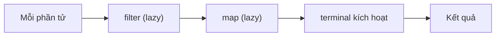

# Tìm hiểu cơ chế Lazy Evaluation của Stream trong Java 8

Lazy Evaluation là cách Stream trong Java 8 trì hoãn việc tính toán cho đến khi thật sự cần kết quả. Hiểu được cơ chế này giúp bạn viết code Stream chạy nhanh hơn, làm việc được với dữ liệu vô hạn và sắp xếp các bước xử lý sao cho tối ưu nhất. Bài này giải thích lazy evaluation, short-circuit và thứ tự xử lý phần tử trong pipeline.

Sơ đồ sau minh họa cơ chế lazy: các thao tác trung gian như `filter()`, `map()` chỉ được thực thi khi thao tác kết cuối kích hoạt toàn bộ pipeline.



## Lazy Evaluation là gì?

**Lazy Evaluation** (đánh giá lười biếng) là cơ chế trong đó các phép tính **không được thực hiện ngay** mà chỉ được thực thi khi kết quả thực sự cần thiết. Ngược lại với **Eager Evaluation** (đánh giá tức thì) — thực thi ngay lập tức khi gặp lệnh.

Trong Stream API, các **Intermediate Operations** (thao tác trung gian) như `filter()`, `map()`, `sorted()` đều **lazy** — chúng không làm gì cả cho đến khi một **Terminal Operation** (thao tác kết cuối) được gọi.

## Minh họa Lazy Evaluation

```java
import java.util.Arrays;
import java.util.List;
import java.util.stream.Stream;

List<Integer> soNguyen = Arrays.asList(1, 2, 3, 4, 5, 6, 7, 8, 9, 10);

// Các intermediate operation KHÔNG chạy ngay
Stream<Integer> stream = soNguyen.stream()
    .filter(n -> {
        System.out.println("filter: " + n);
        return n % 2 == 0;
    })
    .map(n -> {
        System.out.println("map: " + n);
        return n * n;
    });

System.out.println("=== Trước terminal operation - chưa in gì cả! ===");

// CHỈ KHI gọi terminal operation thì mọi thứ mới chạy
System.out.println("=== Sau khi gọi collect() ===");
List<Integer> ketQua = stream.collect(java.util.stream.Collectors.toList());
System.out.println("Kết quả: " + ketQua);
```

Kết quả khi chạy:
```
=== Trước terminal operation - chưa in gì cả! ===
=== Sau khi gọi collect() ===
filter: 1
filter: 2
map: 2
filter: 3
filter: 4
map: 4
...
Kết quả: [4, 16, 36, 64, 100]
```

## Short-circuit Evaluation (Dừng sớm)

Một số terminal operation như `findFirst()`, `findAny()`, `anyMatch()`, `limit()` có khả năng **short-circuit** — dừng xử lý ngay khi đã có đủ kết quả, không cần duyệt hết Stream.

```java
List<Integer> soNguyen = Arrays.asList(1, 2, 3, 4, 5, 6, 7, 8, 9, 10);

System.out.println("Tìm số chẵn đầu tiên:");
int soChangDau = soNguyen.stream()
    .filter(n -> {
        System.out.println("  Kiểm tra: " + n);
        return n % 2 == 0;
    })
    .findFirst()
    .get();

System.out.println("Tìm thấy: " + soChangDau);
```

Kết quả:
```
Tìm số chẵn đầu tiên:
  Kiểm tra: 1
  Kiểm tra: 2
Tìm thấy: 2
```

Chỉ duyệt 2 phần tử thay vì 10 — tiết kiệm tài nguyên đáng kể!

## Thứ tự xử lý Vertical vs Horizontal

Đây là điểm quan trọng cần hiểu: Stream **không** xử lý tất cả phần tử qua bước 1, rồi mới chuyển sang bước 2. Thay vào đó, **mỗi phần tử được đẩy qua toàn bộ pipeline** trước khi sang phần tử tiếp theo (**vertical/depth-first**).

```java
List<String> ten = Arrays.asList("An", "Bình", "Cường", "Dung", "Em");

System.out.println("=== Xử lý từng phần tử qua toàn pipeline ===");
ten.stream()
    .filter(t -> {
        System.out.println("filter(" + t + ")");
        return t.length() > 2;
    })
    .map(t -> {
        System.out.println("map(" + t + ")");
        return t.toUpperCase();
    })
    .forEach(t -> System.out.println("forEach(" + t + ")"));
```

Kết quả:
```
filter(An)         <- An bị loại
filter(Bình)       <- Bình qua filter
map(Bình)          <- Bình được map
forEach(BÌNH)      <- Bình được in
filter(Cường)      <- Cường qua filter
map(Cường)         <- Cường được map
forEach(CƯỜNG)     <- Cường được in
filter(Dung)       <- Dung qua filter
map(Dung)
forEach(DUNG)
filter(Em)         <- Em bị loại
```

## Lợi ích thực tế của Lazy Evaluation

### Tối ưu với Stream vô hạn

Lazy Evaluation cho phép làm việc với Stream **vô hạn** (infinite stream) — điều không thể làm nếu eager:

```java
// Stream vô hạn - không bao giờ kết thúc nếu không có terminal operation giới hạn
Stream.iterate(1, n -> n + 1)       // 1, 2, 3, 4, 5, ...vô tận
    .filter(n -> n % 7 == 0)        // Lọc bội số 7
    .limit(5)                        // Chỉ lấy 5 phần tử
    .forEach(System.out::println);   // In ra: 7, 14, 21, 28, 35

// Tương tự với Stream.generate()
Stream.generate(Math::random)
    .filter(d -> d > 0.9)           // Chỉ giữ số > 0.9
    .limit(3)                        // Lấy 3 số đầu tiên thỏa mãn
    .forEach(d -> System.out.printf("%.4f%n", d));
```

### Tránh tính toán không cần thiết

```java
List<String> urlList = Arrays.asList(
    "https://example.com/page1",
    "https://example.com/page2",
    "https://example.com/page3",
    // ... hàng nghìn URL
    "https://example.com/page999"
);

// Chỉ tải trang đầu tiên có chứa "page2" - không tải tất cả!
Optional<String> trang = urlList.stream()
    .filter(url -> url.contains("page2"))
    .map(url -> "Nội dung của: " + url) // Giả sử đây là tải trang
    .findFirst(); // Dừng ngay khi tìm thấy
```

## Sắp xếp thứ tự operation để tối ưu hiệu năng

Vì Stream lazy, **thứ tự đặt các operation ảnh hưởng đến hiệu năng**:

```java
List<String> dsHoTen = /* hàng nghìn tên */;

// TỐT: filter trước, map sau - ÍT phần tử phải map hơn
long demo1 = dsHoTen.stream()
    .filter(ten -> ten.startsWith("A"))  // Giảm số phần tử
    .map(String::toUpperCase)            // Chỉ map phần còn lại
    .count();

// KÉM HIỆU QUẢ: map trước, filter sau - map TẤT CẢ trước khi lọc
long demo2 = dsHoTen.stream()
    .map(String::toUpperCase)            // Map tất cả!
    .filter(ten -> ten.startsWith("A"))  // Rồi mới lọc
    .count();
```

**Quy tắc tối ưu**: Đặt `filter()` sớm nhất có thể để giảm số phần tử xử lý ở các bước sau.

## Khi nào thì KHÔNG lazy?

Terminal operation như `sorted()` phải **xem toàn bộ Stream** trước khi trả kết quả — đây là **stateful operation** (thao tác có trạng thái). Nó không thể lazy hoàn toàn:

```java
// sorted() phải đọc toàn bộ stream
List<Integer> ketQua = soNguyen.stream()
    .filter(n -> n % 2 == 0)
    .sorted()           // Phải xem hết tất cả số chẵn rồi mới sắp xếp
    .limit(3)
    .collect(Collectors.toList());
```

## Tóm tắt

| Khái niệm | Mô tả |
|---|---|
| Lazy Evaluation | Intermediate operations không thực thi cho đến khi có terminal operation |
| Short-circuit | Một số terminal operations dừng sớm khi đủ kết quả |
| Vertical processing | Mỗi phần tử đi qua toàn pipeline trước khi sang phần tử kế |
| Infinite Stream | Lazy cho phép làm việc với Stream vô hạn |
| Tối ưu thứ tự | Đặt `filter()` trước `map()` để giảm tải |
