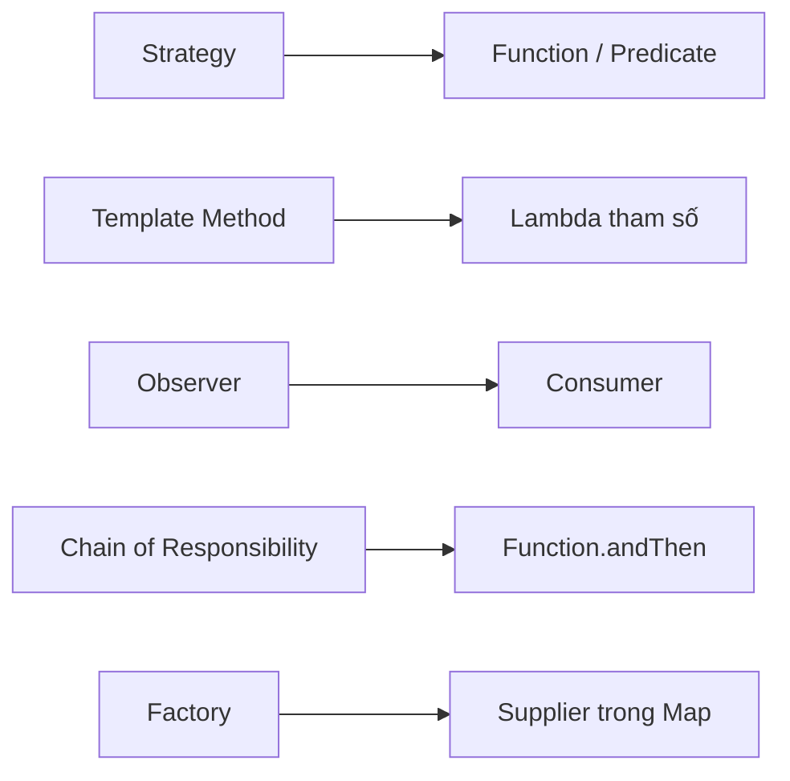

# Refactoring Design Pattern với tính năng mới trong Java 8

Java 8 cung cấp Lambda Expression, Method Reference và Functional Interface giúp triển khai nhiều **Design Pattern** (mẫu thiết kế) ngắn gọn và linh hoạt hơn. Bài này trình bày cách refactor (tái cấu trúc) một số pattern phổ biến.

Sơ đồ sau ánh xạ mỗi Design Pattern trong bài với thành phần tương ứng của Java 8 dùng để triển khai nó gọn hơn.



## 1. Strategy Pattern (Mẫu chiến lược)

**Strategy Pattern** cho phép thay đổi thuật toán (chiến lược) tại runtime mà không sửa client code.

### Trước Java 8

```java
// Interface chiến lược
interface ChienLuocGiam {
    double tinhGia(double gia);
}

// Các implement cụ thể
class KhongGiam implements ChienLuocGiam {
    public double tinhGia(double gia) { return gia; }
}

class GiamPhanTram implements ChienLuocGiam {
    private double phanTram;
    GiamPhanTram(double phanTram) { this.phanTram = phanTram; }
    public double tinhGia(double gia) { return gia * (1 - phanTram / 100); }
}

// Sử dụng
ChienLuocGiam cl = new GiamPhanTram(20);
System.out.println(cl.tinhGia(100_000));
```

### Sau Java 8 — Dùng Lambda thay Anonymous Class

```java
import java.util.function.Function;

// ChienLuocGiam là Functional Interface - dùng trực tiếp Function hoặc Lambda
Function<Double, Double> khongGiam = gia -> gia;
Function<Double, Double> giam20Pct = gia -> gia * 0.8;
Function<Double, Double> giam50K   = gia -> Math.max(0, gia - 50_000);

// Áp dụng linh hoạt
double giaGoc = 200_000.0;
System.out.printf("Không giảm:    %.0f%n", khongGiam.apply(giaGoc));  // 200000
System.out.printf("Giảm 20%%:     %.0f%n", giam20Pct.apply(giaGoc));  // 160000
System.out.printf("Giảm 50K:      %.0f%n", giam50K.apply(giaGoc));    // 150000

// Lưu các chiến lược vào Map
Map<String, Function<Double, Double>> chienlược = new HashMap<>();
chienlược.put("VIP", gia -> gia * 0.7);
chienlược.put("THUONG", gia -> gia * 0.9);
chienlược.put("MOI", gia -> gia * 1.0);

String loaiKhach = "VIP";
double giaTheoLoai = chienlược.get(loaiKhach).apply(giaGoc);
System.out.printf("Giá %s: %.0f%n", loaiKhach, giaTheoLoai); // Giá VIP: 140000
```

## 2. Template Method Pattern (Mẫu phương thức khuôn mẫu)

**Template Method Pattern** định nghĩa khung thuật toán trong phương thức cha, để các bước cụ thể cho lớp con. Java 8 cho phép dùng Lambda thay vì tạo subclass (lớp con).

### Trước Java 8

```java
abstract class XuLyDuLieu {
    // Template method - định nghĩa khung
    public final void xuLy(List<String> dulieu) {
        List<String> daLoc = locDuLieu(dulieu);
        List<String> daXuLy = xuly(daLoc);
        inKetQua(daXuLy);
    }

    protected abstract List<String> locDuLieu(List<String> dulieu);
    protected abstract List<String> xuly(List<String> dulieu);

    protected void inKetQua(List<String> ketQua) {
        ketQua.forEach(System.out::println);
    }
}

class XuLyTen extends XuLyDuLieu {
    protected List<String> locDuLieu(List<String> dulieu) {
        return dulieu.stream().filter(s -> !s.isBlank()).collect(Collectors.toList());
    }
    protected List<String> xuly(List<String> dulieu) {
        return dulieu.stream().map(String::trim).collect(Collectors.toList());
    }
}
```

### Sau Java 8 — Dùng Function và Consumer

```java
import java.util.function.Function;
import java.util.function.Consumer;
import java.util.function.Predicate;

public class XuLyDuLieu {
    // Template method nhận Lambda
    public static <T> void xuLy(
            List<T> dulieu,
            Predicate<T> locDuLieu,
            Function<T, T> bienDoi,
            Consumer<T> inKetQua) {

        dulieu.stream()
              .filter(locDuLieu)
              .map(bienDoi)
              .forEach(inKetQua);
    }

    public static void main(String[] args) {
        List<String> ten = Arrays.asList("  An  ", "", "BÌNH", null, "  Cường  ");

        // Tùy biến hành vi bằng Lambda - không cần tạo subclass!
        xuLy(
            ten,
            s -> s != null && !s.isBlank(),      // locDuLieu
            s -> s.trim().toLowerCase(),          // bienDoi
            s -> System.out.println(">> " + s)   // inKetQua
        );
        // >> an
        // >> bình
        // >> cường
    }
}
```

## 3. Observer Pattern (Mẫu quan sát)

**Observer Pattern** cho phép một đối tượng (subject) thông báo tự động cho danh sách các đối tượng quan sát (observer) khi có sự kiện.

```java
import java.util.ArrayList;
import java.util.List;
import java.util.function.Consumer;

// Subject đơn giản với Lambda
class BoChatLuong {
    private List<Consumer<String>> observers = new ArrayList<>();

    public void dangKy(Consumer<String> observer) {
        observers.add(observer);
    }

    public void phatHienLoai(String loiPhat) {
        System.out.println("\n[SỰ KIỆN] Phát hiện lỗi: " + loiPhat);
        observers.forEach(obs -> obs.accept(loiPhat));
    }
}

public class Demo {
    public static void main(String[] args) {
        BoChatLuong bo = new BoChatLuong();

        // Đăng ký observer bằng Lambda - không cần tạo Observer class!
        bo.dangKy(loi -> System.out.println("[EMAIL] Gửi cảnh báo: " + loi));
        bo.dangKy(loi -> System.out.println("[LOG] Ghi log: " + loi));
        bo.dangKy(loi -> System.out.println("[SMS] Nhắn tin: " + loi));

        bo.phatHienLoai("Nhiệt độ vượt ngưỡng 80°C");
        // [EMAIL] Gửi cảnh báo: Nhiệt độ vượt ngưỡng 80°C
        // [LOG] Ghi log: Nhiệt độ vượt ngưỡng 80°C
        // [SMS] Nhắn tin: Nhiệt độ vượt ngưỡng 80°C
    }
}
```

## 4. Chain of Responsibility Pattern (Chuỗi trách nhiệm)

**Chain of Responsibility Pattern** truyền request qua một chuỗi handler. Java 8 cho phép xây dựng chuỗi bằng `Function.andThen()`.

```java
import java.util.function.UnaryOperator;

public class ChuoiXuLyVanBan {
    public static void main(String[] args) {
        // Mỗi bước xử lý là một UnaryOperator (Function đặc biệt: T -> T)
        UnaryOperator<String> xoaKhoangTrang = String::trim;
        UnaryOperator<String> viethHoa = String::toLowerCase;
        UnaryOperator<String> thayKhoangTrangBangGach = s -> s.replace(" ", "-");
        UnaryOperator<String> themTienTo = s -> "slug:" + s;

        // Nối chuỗi bằng andThen()
        UnaryOperator<String> taoSlug = xoaKhoangTrang
            .andThen(viethHoa)
            .andThen(thayKhoangTrangBangGach)
            .andThen(themTienTo);

        System.out.println(taoSlug.apply("  Xin Chào Java 8  "));
        // slug:xin-chào-java-8
    }
}
```

## 5. Factory Pattern (Mẫu nhà máy)

**Factory Pattern** tạo đối tượng mà không cần biết lớp cụ thể. Java 8 cho phép lưu constructor reference trong Map.

```java
import java.util.Map;
import java.util.function.Supplier;

interface HinhDang {
    double dienTich();
}

record HinhTron(double r) implements HinhDang {
    public double dienTich() { return Math.PI * r * r; }
}

record HinhVuong(double a) implements HinhDang {
    public double dienTich() { return a * a; }
}

public class NhaMayHinh {
    // Map lưu Supplier (factory function) cho từng loại hình
    private static final Map<String, Supplier<HinhDang>> NHA_MAY = Map.of(
        "tron",  () -> new HinhTron(5.0),
        "vuong", () -> new HinhVuong(4.0)
    );

    public static HinhDang tao(String loai) {
        Supplier<HinhDang> supplier = NHA_MAY.get(loai.toLowerCase());
        if (supplier == null) {
            throw new IllegalArgumentException("Không hỗ trợ loại: " + loai);
        }
        return supplier.get();
    }

    public static void main(String[] args) {
        HinhDang hinh = NhaMayHinh.tao("tron");
        System.out.printf("Diện tích hình tròn: %.2f%n", hinh.dienTich()); // 78.54
    }
}
```

## Tóm tắt lợi ích refactoring với Java 8

| Pattern | Cách cũ | Cách Java 8 |
|---|---|---|
| Strategy | Nhiều Anonymous Class / Subclass | Lambda `Function`, `Predicate` |
| Template Method | Kế thừa, override | Lambda truyền vào tham số |
| Observer | Implements Observer interface | `Consumer` Lambda |
| Chain of Responsibility | Linked handler objects | `Function.andThen()` |
| Factory | Switch/if-else | `Supplier` trong `Map` |

Lambda và Functional Interface giúp loại bỏ boilerplate (code mẫu lặp lại), giảm số lượng class, và làm code dễ đọc hơn đáng kể.
