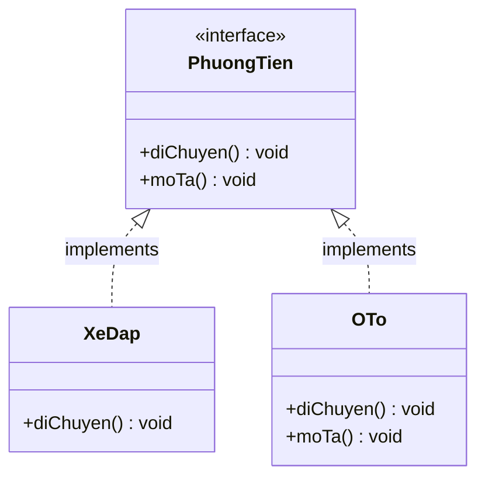

# Interface trong Java 8 - Default method và Static method

Trước Java 8, Interface (giao diện) chỉ được phép khai báo các phương thức trừu tượng (abstract method) — tức là phương thức không có phần thân (body). Java 8 phá vỡ giới hạn này bằng cách giới thiệu **Default Method** và **Static Method** trong Interface.

Sơ đồ sau minh họa một interface có phương thức trừu tượng và default method: lớp `XeDap` dùng lại default method có sẵn, còn `OTo` override để đổi hành vi.



## Default Method

**Default Method** là phương thức có phần thân được khai báo trong Interface với từ khóa `default`. Các lớp (class) implement interface có thể dùng trực tiếp mà không cần override, hoặc override lại nếu muốn thay đổi hành vi.

### Cú pháp

```java
interface TenInterface {
    default KieuTraVe tenPhuongThuc(ThamSo) {
        // phần thân mặc định
    }
}
```

### Ví dụ cơ bản

```java
interface PhuongTien {
    void diChuyen();

    // Default method - có sẵn phần thân
    default void moTa() {
        System.out.println("Đây là một phương tiện di chuyển.");
    }
}

class XeDap implements PhuongTien {
    @Override
    public void diChuyen() {
        System.out.println("Xe đạp di chuyển bằng sức người.");
    }
    // Không cần override moTa() - dùng mặc định từ interface
}

class OTo implements PhuongTien {
    @Override
    public void diChuyen() {
        System.out.println("Ô tô di chuyển bằng động cơ.");
    }

    @Override
    public void moTa() {
        // Override default method
        System.out.println("Đây là ô tô - phương tiện 4 bánh.");
    }
}

public class Demo {
    public static void main(String[] args) {
        PhuongTien xeDap = new XeDap();
        xeDap.diChuyen(); // Xe đạp di chuyển bằng sức người.
        xeDap.moTa();     // Đây là một phương tiện di chuyển.

        PhuongTien oTo = new OTo();
        oTo.diChuyen();   // Ô tô di chuyển bằng động cơ.
        oTo.moTa();       // Đây là ô tô - phương tiện 4 bánh.
    }
}
```

## Static Method trong Interface

**Static Method** (phương thức tĩnh) trong Interface hoạt động tương tự static method trong Class — gọi trực tiếp qua tên interface, không cần đối tượng. Các lớp implement **không kế thừa** static method từ interface.

### Cú pháp

```java
interface TenInterface {
    static KieuTraVe tenPhuongThuc(ThamSo) {
        // phần thân
    }
}
```

### Ví dụ

```java
interface TienIch {
    static String chuanHoaTen(String ten) {
        if (ten == null || ten.isBlank()) {
            return "Không có tên";
        }
        return ten.trim().substring(0, 1).toUpperCase()
               + ten.trim().substring(1).toLowerCase();
    }
}

public class Demo {
    public static void main(String[] args) {
        // Gọi trực tiếp qua tên interface
        System.out.println(TienIch.chuanHoaTen("  aNH "));  // Anh
        System.out.println(TienIch.chuanHoaTen(null));       // Không có tên
    }
}
```

## Xung đột Diamond Problem (Vấn đề kim cương)

Khi một lớp implement **nhiều interface** và cả hai đều có default method **cùng tên**, trình biên dịch (compiler) sẽ báo lỗi. Lớp đó **bắt buộc phải override** để giải quyết xung đột.

```java
interface A {
    default void xinChao() {
        System.out.println("Xin chào từ A");
    }
}

interface B {
    default void xinChao() {
        System.out.println("Xin chào từ B");
    }
}

// Lỗi nếu không override!
class C implements A, B {
    @Override
    public void xinChao() {
        // Chọn dùng một trong hai, hoặc viết mới
        A.super.xinChao(); // Gọi tường minh từ A
    }
}
```

## So sánh Default Method với Abstract Class

| Tiêu chí | Interface (Default Method) | Abstract Class |
|---|---|---|
| Đa kế thừa | Có (implement nhiều interface) | Không (chỉ extends 1 class) |
| Trạng thái (field) | Không có field instance | Có field instance |
| Constructor | Không có | Có |
| Mục đích | Định nghĩa hành vi, hợp đồng | Chia sẻ trạng thái và hành vi |

## Tại sao cần Default Method?

Mục tiêu chính là **backward compatibility** (tương thích ngược) — cho phép Java thêm phương thức mới vào các interface có sẵn (như `Collection`, `Iterable`) mà không làm vỡ hàng triệu dòng code cũ đã implement các interface đó.

Ví dụ: `forEach()` được thêm vào interface `Iterable` như một default method trong Java 8. Nhờ vậy mọi lớp đã implement `Iterable` trước đó vẫn hoạt động bình thường.
