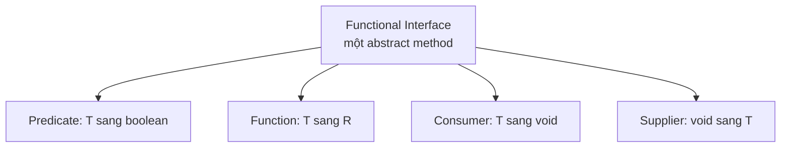

# Functional Interface trong Java 8

Functional Interface là interface chỉ có đúng một phương thức trừu tượng, và chính là nền tảng để dùng Lambda Expression cũng như Method Reference trong Java 8. Hiểu rõ khái niệm này giúp bạn viết code ngắn gọn theo phong cách hàm và tận dụng được bộ interface có sẵn trong `java.util.function`. Bài này giới thiệu cách dùng, các loại phổ biến và cách tự tạo Functional Interface.

Sơ đồ dưới đây phân loại các Functional Interface thông dụng nhất theo kiểu tham số vào và giá trị trả về.



## Functional Interface là gì?

**Functional Interface** (giao diện hàm) là interface có **đúng một phương thức trừu tượng** (Single Abstract Method - SAM). Đây là nền tảng cho Lambda Expression và Method Reference trong Java 8.

Annotation `@FunctionalInterface` được dùng để đánh dấu và nhờ compiler kiểm tra — nếu interface có nhiều hơn một abstract method, compiler sẽ báo lỗi.

```java
@FunctionalInterface
interface TinhToan {
    int tinh(int a, int b); // Chỉ được có 1 abstract method
}
```

> **Lưu ý:** Default method và static method không tính vào giới hạn một abstract method.

## Sử dụng với Lambda Expression

```java
@FunctionalInterface
interface TinhToan {
    int tinh(int a, int b);
}

public class Demo {
    public static void main(String[] args) {
        // Trước Java 8 - Anonymous Class
        TinhToan cong_cu = new TinhToan() {
            @Override
            public int tinh(int a, int b) {
                return a + b;
            }
        };

        // Java 8 - Lambda Expression
        TinhToan cong = (a, b) -> a + b;
        TinhToan tru  = (a, b) -> a - b;
        TinhToan nhan = (a, b) -> a * b;

        System.out.println("Cộng: " + cong.tinh(10, 5));  // 15
        System.out.println("Trừ: "  + tru.tinh(10, 5));   // 5
        System.out.println("Nhân: " + nhan.tinh(10, 5));  // 50
    }
}
```

## Các Functional Interface có sẵn trong Java 8

Java 8 cung cấp sẵn một bộ Functional Interface trong package `java.util.function`. Dưới đây là các interface quan trọng nhất:

### Predicate`<T>` — Kiểm tra điều kiện

Nhận vào một tham số, trả về `boolean`.

```java
import java.util.function.Predicate;

Predicate<Integer> laSoLe = n -> n % 2 != 0;
System.out.println(laSoLe.test(7));  // true
System.out.println(laSoLe.test(4));  // false

// Kết hợp điều kiện
Predicate<Integer> laDuong = n -> n > 0;
Predicate<Integer> laSoLeDuong = laSoLe.and(laDuong);
System.out.println(laSoLeDuong.test(3));   // true
System.out.println(laSoLeDuong.test(-3));  // false
```

### `Function<T,R>` — Chuyển đổi kiểu dữ liệu

Nhận vào một tham số kiểu `T`, trả về kết quả kiểu `R`.

```java
import java.util.function.Function;

Function<String, Integer> layDoDai = str -> str.length();
System.out.println(layDoDai.apply("Xin chào"));  // 8

// Kết hợp nhiều Function
Function<Integer, Integer> nhan2 = x -> x * 2;
Function<Integer, Integer> cong3 = x -> x + 3;
// andThen: nhan2 trước, rồi cong3
Function<Integer, Integer> nhan2RoiCong3 = nhan2.andThen(cong3);
System.out.println(nhan2RoiCong3.apply(5));  // 5*2+3 = 13
```

### `Consumer<T>` — Tiêu thụ dữ liệu, không trả về

Nhận vào một tham số, không trả về giá trị (void).

```java
import java.util.function.Consumer;

Consumer<String> inRa = str -> System.out.println(">> " + str);
inRa.accept("Xin chào Java 8");  // >> Xin chào Java 8

// andThen: thực hiện tiếp sau Consumer đầu tiên
Consumer<String> inHoa = str -> System.out.println(str.toUpperCase());
Consumer<String> inVaInHoa = inRa.andThen(inHoa);
inVaInHoa.accept("hello");
// >> hello
// HELLO
```

### `Supplier<T>` — Cung cấp dữ liệu, không nhận tham số

Không nhận tham số, trả về một giá trị kiểu `T`.

```java
import java.util.function.Supplier;

Supplier<String> laoiChao = () -> "Xin chào từ Supplier!";
System.out.println(laoiChao.get());  // Xin chào từ Supplier!

Supplier<Double> soNgauNhien = () -> Math.random();
System.out.println(soNgauNhien.get());  // Số ngẫu nhiên
```

## Bảng tóm tắt các Functional Interface phổ biến

| Interface | Tham số | Trả về | Phương thức |
|---|---|---|---|
| `Predicate<T>` | T | boolean | `test(T t)` |
| `Function<T,R>` | T | R | `apply(T t)` |
| `Consumer<T>` | T | void | `accept(T t)` |
| `Supplier<T>` | không có | T | `get()` |
| `BiFunction<T,U,R>` | T, U | R | `apply(T t, U u)` |
| `BiConsumer<T,U>` | T, U | void | `accept(T t, U u)` |
| `BiPredicate<T,U>` | T, U | boolean | `test(T t, U u)` |
| `UnaryOperator<T>` | T | T | `apply(T t)` |
| `BinaryOperator<T>` | T, T | T | `apply(T t1, T t2)` |

## Tạo Functional Interface tùy chỉnh

```java
@FunctionalInterface
interface XuLyVanBan {
    String xuLy(String vanBan);

    // Default method - không vi phạm quy tắc SAM
    default XuLyVanBan vaChuyen(XuLyVanBan tiepTheo) {
        return vanBan -> tiepTheo.xuLy(this.xuLy(vanBan));
    }
}

public class Demo {
    public static void main(String[] args) {
        XuLyVanBan xoaKhoangTrang = str -> str.trim();
        XuLyVanBan chuanHoa = str -> str.toLowerCase();

        XuLyVanBan xuLyHoanChinh = xoaKhoangTrang.vaChuyen(chuanHoa);
        System.out.println(xuLyHoanChinh.xuLy("  JAVA 8  "));  // java 8
    }
}
```

## Điểm quan trọng cần nhớ

- Functional Interface chỉ có **một** abstract method.
- Annotation `@FunctionalInterface` là tùy chọn nhưng nên dùng để compiler kiểm tra.
- Default method và static method **không** ảnh hưởng đến tính "functional" của interface.
- `java.util.function` cung cấp đầy đủ các Functional Interface phổ biến, nên ưu tiên dùng thay vì tự tạo.
