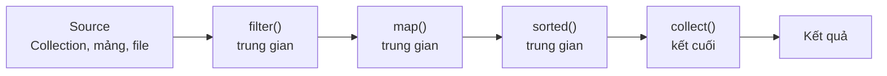

# Giới thiệu về Stream API trong Java 8

Stream API là tính năng nổi bật của Java 8 cho phép xử lý tập hợp dữ liệu theo phong cách khai báo và hàm, tập trung vào việc mô tả điều muốn làm thay vì viết từng bước thủ công. Với Stream, bạn có thể lọc, biến đổi, sắp xếp và tổng hợp dữ liệu chỉ bằng vài dòng code dễ đọc. Bài này giới thiệu pipeline xử lý cùng các thao tác trung gian và kết cuối thường dùng.

## Stream API là gì?

**Stream API** (Luồng xử lý dữ liệu) trong Java 8 cung cấp một cách xử lý tập hợp dữ liệu theo phong cách **khai báo** (declarative) và **hàm** (functional) — tập trung vào **mô tả điều muốn làm** thay vì **cách thực hiện từng bước**.

`Stream<T>` là một chuỗi các phần tử hỗ trợ các thao tác xử lý tuần tự và song song. Quan trọng: Stream **không phải là cấu trúc lưu trữ dữ liệu** — nó không chứa dữ liệu, chỉ xử lý dữ liệu từ nguồn (Collection, mảng, file...).

## Stream Pipeline — Đường ống xử lý

Một Stream thường gồm ba phần:

1. **Source** (Nguồn): Collection, mảng, String, file...
2. **Intermediate Operations** (Thao tác trung gian): `filter()`, `map()`, `sorted()`,... Trả về Stream mới, **lazy** (lười biếng — không thực thi ngay).
3. **Terminal Operation** (Thao tác kết cuối): `collect()`, `forEach()`, `count()`... Kích hoạt toàn bộ pipeline, trả về kết quả.

Sơ đồ dưới minh họa một pipeline Stream: dữ liệu đi từ nguồn qua các thao tác trung gian (lazy) rồi được kích hoạt bởi thao tác kết cuối để tạo ra kết quả.



```java
List<String> ketQua = danhSach.stream()       // Source
    .filter(s -> s.startsWith("A"))            // Intermediate
    .map(String::toUpperCase)                  // Intermediate
    .sorted()                                  // Intermediate
    .collect(Collectors.toList());             // Terminal
```

## Tạo Stream

```java
import java.util.Arrays;
import java.util.List;
import java.util.stream.Stream;

// Từ Collection
List<String> ds = Arrays.asList("An", "Bình", "Cường");
Stream<String> stream1 = ds.stream();

// Stream song song (parallel stream)
Stream<String> streamSongSong = ds.parallelStream();

// Từ mảng
int[] soNguyen = {1, 2, 3, 4, 5};
java.util.stream.IntStream intStream = Arrays.stream(soNguyen);

// Từ giá trị trực tiếp
Stream<String> stream2 = Stream.of("X", "Y", "Z");

// Stream vô hạn - sinh số từ 0
Stream<Integer> voHan = Stream.iterate(0, n -> n + 1);
```

## Các Intermediate Operation (Thao tác trung gian)

### filter() — Lọc phần tử

```java
List<Integer> soNguyen = Arrays.asList(1, 2, 3, 4, 5, 6, 7, 8, 9, 10);

List<Integer> soLe = soNguyen.stream()
    .filter(n -> n % 2 != 0)
    .collect(Collectors.toList());
System.out.println(soLe); // [1, 3, 5, 7, 9]
```

### map() — Biến đổi phần tử

```java
List<String> hoTen = Arrays.asList("nguyễn an", "trần bình", "lê cường");

List<String> chuanHoa = hoTen.stream()
    .map(ten -> ten.substring(0, 1).toUpperCase() + ten.substring(1))
    .collect(Collectors.toList());
System.out.println(chuanHoa); // [Nguyễn an, Trần bình, Lê cường]
```

### flatMap() — Làm phẳng Stream lồng nhau

```java
List<List<Integer>> danhSachLong = Arrays.asList(
    Arrays.asList(1, 2, 3),
    Arrays.asList(4, 5),
    Arrays.asList(6, 7, 8, 9)
);

List<Integer> phangHoa = danhSachLong.stream()
    .flatMap(List::stream)
    .collect(Collectors.toList());
System.out.println(phangHoa); // [1, 2, 3, 4, 5, 6, 7, 8, 9]
```

### sorted() — Sắp xếp

```java
List<String> ten = Arrays.asList("Cường", "An", "Bình", "Dung");

// Sắp xếp tự nhiên
List<String> sapXep = ten.stream()
    .sorted()
    .collect(Collectors.toList());

// Sắp xếp theo tiêu chí tùy chỉnh (Comparator)
List<String> sapXepDoDai = ten.stream()
    .sorted((a, b) -> a.length() - b.length())
    .collect(Collectors.toList());
```

### distinct() — Loại bỏ trùng lặp

```java
List<Integer> soTrungLap = Arrays.asList(1, 2, 2, 3, 3, 3, 4);
List<Integer> duyNhat = soTrungLap.stream()
    .distinct()
    .collect(Collectors.toList());
System.out.println(duyNhat); // [1, 2, 3, 4]
```

### limit() và skip() — Giới hạn và bỏ qua

```java
List<Integer> so = Arrays.asList(1, 2, 3, 4, 5, 6, 7, 8, 9, 10);

// Lấy 3 phần tử đầu
List<Integer> ba = so.stream().limit(3).collect(Collectors.toList());
// [1, 2, 3]

// Bỏ 3 phần tử đầu
List<Integer> boQua3 = so.stream().skip(3).collect(Collectors.toList());
// [4, 5, 6, 7, 8, 9, 10]

// Phân trang: trang 2, mỗi trang 3 phần tử
int trang = 2, kichThuoc = 3;
List<Integer> phanTrang = so.stream()
    .skip((long)(trang - 1) * kichThuoc)
    .limit(kichThuoc)
    .collect(Collectors.toList());
// [4, 5, 6]
```

## Các Terminal Operation (Thao tác kết cuối)

### collect() — Thu thập kết quả

```java
List<String> dsHoTen = Arrays.asList("An", "Bình", "Cường", "An", "Dung");

// Thành List
List<String> list = dsHoTen.stream().collect(Collectors.toList());

// Thành Set (loại bỏ trùng)
Set<String> set = dsHoTen.stream().collect(Collectors.toSet());

// Thành String nối nhau
String noi = dsHoTen.stream().collect(Collectors.joining(", "));
System.out.println(noi); // An, Bình, Cường, An, Dung
```

### count() — Đếm

```java
long soLuong = dsHoTen.stream()
    .filter(ten -> ten.length() > 2)
    .count();
```

### findFirst() / findAny() — Tìm phần tử

```java
Optional<String> phanTuDau = dsHoTen.stream()
    .filter(ten -> ten.startsWith("B"))
    .findFirst();
phanTuDau.ifPresent(System.out::println); // Bình
```

### anyMatch() / allMatch() / noneMatch() — Kiểm tra điều kiện

```java
List<Integer> soNguyen = Arrays.asList(2, 4, 6, 7, 8);

boolean coSoLe = soNguyen.stream().anyMatch(n -> n % 2 != 0);   // true
boolean tatCaChan = soNguyen.stream().allMatch(n -> n % 2 == 0); // false
boolean khongAmNao = soNguyen.stream().noneMatch(n -> n < 0);   // true
```

### reduce() — Tính toán tích lũy

```java
List<Integer> soNguyen = Arrays.asList(1, 2, 3, 4, 5);

// Tính tổng
int tong = soNguyen.stream()
    .reduce(0, (a, b) -> a + b);
System.out.println("Tổng: " + tong); // 15

// Tìm giá trị lớn nhất
Optional<Integer> max = soNguyen.stream()
    .reduce(Integer::max);
System.out.println("Max: " + max.get()); // 5
```

## Ví dụ tổng hợp thực tế

```java
import java.util.*;
import java.util.stream.*;

public class VidThucTe {
    record SinhVien(String ten, double diemTB, String khoa) {}

    public static void main(String[] args) {
        List<SinhVien> dsSV = Arrays.asList(
            new SinhVien("An", 8.5, "CNTT"),
            new SinhVien("Bình", 7.0, "Toán"),
            new SinhVien("Cường", 9.0, "CNTT"),
            new SinhVien("Dung", 6.5, "Văn"),
            new SinhVien("Em", 8.0, "CNTT")
        );

        // Lấy tên SV khoa CNTT, điểm >= 8, sắp xếp theo điểm giảm dần
        System.out.println("SV CNTT xuất sắc:");
        dsSV.stream()
            .filter(sv -> sv.khoa().equals("CNTT"))
            .filter(sv -> sv.diemTB() >= 8.0)
            .sorted((a, b) -> Double.compare(b.diemTB(), a.diemTB()))
            .map(sv -> sv.ten() + " (" + sv.diemTB() + ")")
            .forEach(System.out::println);
        // Cường (9.0)
        // An (8.5)
        // Em (8.0)

        // Điểm trung bình toàn khóa CNTT
        OptionalDouble tbCNTT = dsSV.stream()
            .filter(sv -> sv.khoa().equals("CNTT"))
            .mapToDouble(SinhVien::diemTB)
            .average();
        System.out.printf("Điểm TB CNTT: %.2f%n", tbCNTT.getAsDouble()); // 8.50
    }
}
```

## Stream không thể tái sử dụng

Một khi Terminal Operation đã được gọi, Stream đó **không thể dùng lại**. Mỗi lần cần xử lý, hãy tạo Stream mới từ nguồn.

```java
Stream<String> stream = danhSach.stream();
stream.forEach(System.out::println); // OK
stream.forEach(System.out::println); // LỖI: IllegalStateException
```
