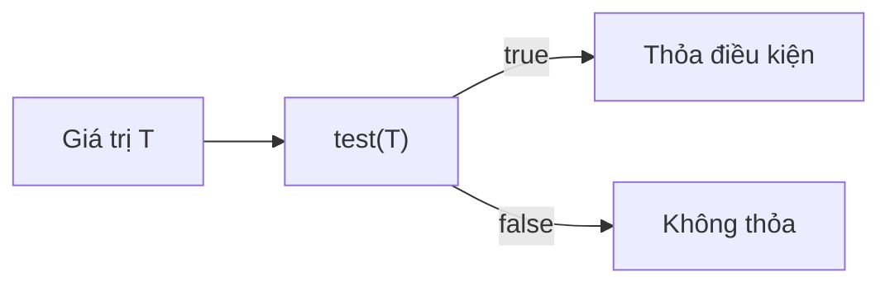

# Predicate trong Java 8

`Predicate<T>` là một Functional Interface trong Java 8 đại diện cho một điều kiện kiểm tra, nhận vào một giá trị và trả về `true` hoặc `false`. Nó được dùng rất nhiều khi lọc dữ liệu với Stream và giúp tách các điều kiện ra để tái sử dụng, kết hợp linh hoạt. Bài này hướng dẫn cách tạo, kết hợp (and/or/negate) và truyền Predicate như tham số phương thức.

Sơ đồ sau mô tả luồng của một Predicate: nhận vào một giá trị, chạy `test()` và rẽ nhánh theo kết quả `true` hoặc `false`.



:::note[Ghi nhớ nhanh]

- ⭐ **`Predicate<T>`** — hàm kiểm tra điều kiện với method `boolean test(T t)`, hay dùng cho `filter()`.
- **Kết hợp điều kiện** — `and()`, `or()`, `negate()`; Java 11 thêm `Predicate.not()`.
- **`BiPredicate<T,U>`** — biến thể kiểm tra với hai tham số.

:::

## Predicate là gì?

`Predicate<T>` là một **Functional Interface** (giao diện hàm) trong package `java.util.function`, đại diện cho một điều kiện (condition) hoặc hàm kiểm tra logic (logic test function). Nó nhận vào một đối số kiểu `T` và trả về `boolean`.

Phương thức trừu tượng duy nhất: `boolean test(T t)`

```java
import java.util.function.Predicate;

// Kiểm tra số chẵn
Predicate<Integer> laSoChan = so -> so % 2 == 0;

System.out.println(laSoChan.test(4));  // true
System.out.println(laSoChan.test(7));  // false
```

## Tạo và sử dụng Predicate

```java
import java.util.function.Predicate;

public class VidPredicate {
    public static void main(String[] args) {
        Predicate<String> rong = str -> str.isEmpty();
        Predicate<String> nganHon5 = str -> str.length() < 5;
        Predicate<Integer> laDuong = n -> n > 0;
        Predicate<Integer> amHon100 = n -> n < 100;

        System.out.println(rong.test(""));        // true
        System.out.println(rong.test("Java"));    // false
        System.out.println(nganHon5.test("Hi"));  // true
        System.out.println(laDuong.test(5));      // true
        System.out.println(laDuong.test(-3));     // false
    }
}
```

## Các phương thức mặc định (Default Methods)

### and() — KẾT HỢP hai điều kiện (logic AND)

```java
Predicate<Integer> laDuong = n -> n > 0;
Predicate<Integer> nhoHon100 = n -> n < 100;

// Kết hợp: dương VÀ nhỏ hơn 100
Predicate<Integer> trong0Den100 = laDuong.and(nhoHon100);

System.out.println(trong0Den100.test(50));  // true
System.out.println(trong0Den100.test(-5));  // false
System.out.println(trong0Den100.test(150)); // false
```

### or() — MỘT TRONG HAI điều kiện (logic OR)

```java
Predicate<String> batDauBangA = str -> str.startsWith("A");
Predicate<String> batDauBangB = str -> str.startsWith("B");

// Bắt đầu bằng A HOẶC B
Predicate<String> abPredicate = batDauBangA.or(batDauBangB);

System.out.println(abPredicate.test("An"));   // true
System.out.println(abPredicate.test("Bình")); // true
System.out.println(abPredicate.test("Cường")); // false
```

### negate() — PHỦ ĐỊNH điều kiện (logic NOT)

```java
Predicate<Integer> laSoLe = n -> n % 2 != 0;

// Phủ định: không phải số lẻ => số chẵn
Predicate<Integer> laSoChan = laSoLe.negate();

System.out.println(laSoChan.test(4)); // true
System.out.println(laSoChan.test(3)); // false
```

### Predicate.not() — Phủ định (Java 11+)

```java
// Java 11 cung cấp Predicate.not() như phương thức tĩnh tiện lợi
List<String> hoTen = Arrays.asList("An", "", "Bình", null, "Cường");

List<String> hopLe = hoTen.stream()
    .filter(ten -> ten != null)
    .filter(Predicate.not(String::isEmpty))
    .collect(Collectors.toList());
System.out.println(hopLe); // [An, Bình, Cường]
```

## Kết hợp nhiều Predicate phức tạp

```java
import java.util.*;
import java.util.function.Predicate;
import java.util.stream.Collectors;

public class LocSinhVien {
    record SinhVien(String ten, int tuoi, double diemTB, String khoa) {}

    public static void main(String[] args) {
        List<SinhVien> dsSV = Arrays.asList(
            new SinhVien("An", 20, 8.5, "CNTT"),
            new SinhVien("Bình", 22, 6.0, "Toán"),
            new SinhVien("Cường", 19, 9.0, "CNTT"),
            new SinhVien("Dung", 21, 7.5, "Văn"),
            new SinhVien("Em", 23, 5.5, "CNTT")
        );

        // Định nghĩa các điều kiện riêng
        Predicate<SinhVien> laCNTT = sv -> sv.khoa().equals("CNTT");
        Predicate<SinhVien> diemCao = sv -> sv.diemTB() >= 8.0;
        Predicate<SinhVien> duoiTuoi22 = sv -> sv.tuoi() < 22;

        // Kết hợp: khoa CNTT VÀ điểm cao VÀ dưới 22 tuổi
        Predicate<SinhVien> svXuatSac = laCNTT.and(diemCao).and(duoiTuoi22);

        System.out.println("SV xuất sắc CNTT dưới 22 tuổi:");
        dsSV.stream()
            .filter(svXuatSac)
            .forEach(sv -> System.out.println("  " + sv.ten() + " - " + sv.diemTB()));
        // An - 8.5
        // Cường - 9.0
    }
}
```

## Predicate như tham số phương thức

Truyền `Predicate` vào phương thức giúp code linh hoạt, tái sử dụng được.

```java
import java.util.List;
import java.util.function.Predicate;
import java.util.stream.Collectors;

public class TieuThuyetFilter {
    public static <T> List<T> loc(List<T> danhSach, Predicate<T> dieuKien) {
        return danhSach.stream()
                       .filter(dieuKien)
                       .collect(Collectors.toList());
    }

    public static void main(String[] args) {
        List<Integer> soNguyen = Arrays.asList(1, 2, 3, 4, 5, 6, 7, 8, 9, 10);

        // Truyền các Predicate khác nhau vào cùng phương thức
        System.out.println(loc(soNguyen, n -> n % 2 == 0));      // [2, 4, 6, 8, 10]
        System.out.println(loc(soNguyen, n -> n > 5));            // [6, 7, 8, 9, 10]
        System.out.println(loc(soNguyen, n -> n % 3 == 0));       // [3, 6, 9]
    }
}
```

## BiPredicate — Predicate với hai tham số

`BiPredicate<T, U>` kiểm tra điều kiện với hai đối số.

```java
import java.util.function.BiPredicate;

BiPredicate<String, Integer> doDaiHonN = (str, n) -> str.length() > n;

System.out.println(doDaiHonN.test("Java", 3));   // true
System.out.println(doDaiHonN.test("Hi", 5));     // false
```

## Tóm tắt các phương thức của Predicate

| Phương thức | Mô tả |
|---|---|
| `test(T t)` | Kiểm tra điều kiện, trả về boolean |
| `and(Predicate other)` | Kết hợp AND với Predicate khác |
| `or(Predicate other)` | Kết hợp OR với Predicate khác |
| `negate()` | Phủ định điều kiện hiện tại |
| `Predicate.not(pred)` | Phủ định tĩnh (Java 11+) |
| `Predicate.isEqual(obj)` | Kiểm tra bằng nhau với đối tượng cho trước |
