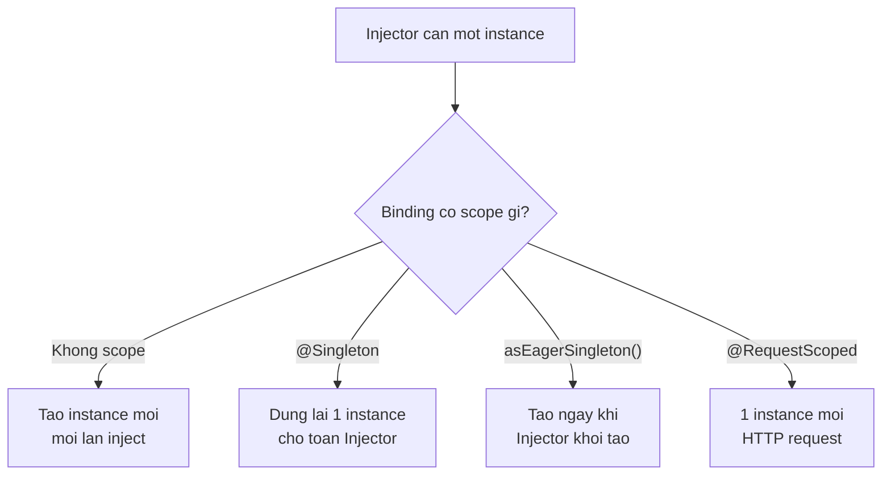

# Giới thiệu Google Guice - Injection và Scope

Injection là quá trình Guice tự động cung cấp các phụ thuộc cho object, còn Scope kiểm soát số lượng instance được tạo và thời gian chúng tồn tại. Hiểu hai khái niệm này giúp bạn quản lý vòng đời đối tượng đúng cách, ví dụ khi nào nên dùng Singleton, khi nào tạo mới mỗi lần. Bài này trình bày các kiểu injection và các loại scope trong Guice.

## Injection trong Guice

**Injection** (tiêm phụ thuộc) là quá trình Guice tự động cung cấp các phụ thuộc cho một object. Guice hỗ trợ ba kiểu injection thông qua annotation `@Inject`.

### 1. Constructor Injection (Khuyến nghị nhất)

```java
public class UserService {
    private final UserRepository userRepository;
    private final PasswordEncoder passwordEncoder;
    private final EventPublisher eventPublisher;

    // Guice sẽ tạo và tiêm tất cả tham số vào constructor này
    @Inject
    public UserService(UserRepository userRepository,
                       PasswordEncoder passwordEncoder,
                       EventPublisher eventPublisher) {
        this.userRepository  = userRepository;
        this.passwordEncoder = passwordEncoder;
        this.eventPublisher  = eventPublisher;
    }

    public void registerUser(String email, String rawPassword) {
        String hashed = passwordEncoder.encode(rawPassword);
        userRepository.save(new User(email, hashed));
        eventPublisher.publish(new UserRegisteredEvent(email));
        System.out.println("Đăng ký thành công: " + email);
    }
}
```

**Lợi ích Constructor Injection:**
- Phụ thuộc rõ ràng và bắt buộc — object không thể tồn tại thiếu dependency.
- Dễ kiểm thử — truyền mock trực tiếp vào constructor.
- Hỗ trợ tạo **immutable** (bất biến) object với `final` fields.

### 2. Field Injection

```java
public class ProductController {

    @Inject
    private ProductService productService; // Guice inject vào field trực tiếp

    @Inject
    private CategoryService categoryService;

    public void listProducts() {
        productService.getAll().forEach(System.out::println);
    }
}
```

Lưu ý: Field injection tiện lợi nhưng các field không thể là `final`, khó kiểm thử hơn Constructor injection.

### 3. Method Injection (Setter Injection)

```java
public class ReportService {
    private AuditLogger auditLogger;

    // Guice gọi method này sau khi tạo object và inject tham số
    @Inject
    public void setAuditLogger(AuditLogger auditLogger) {
        this.auditLogger = auditLogger;
    }

    public void generateReport(String name) {
        System.out.println("Tạo báo cáo: " + name);
        if (auditLogger != null) {
            auditLogger.log("Báo cáo '" + name + "' đã được tạo");
        }
    }
}
```

### Optional Injection — phụ thuộc không bắt buộc

```java
import com.google.inject.Inject;
import com.google.inject.name.Named;

public class NotificationSender {
    private final EmailService emailService;
    private SmsService smsService; // Tùy chọn — có thể null

    @Inject
    public NotificationSender(EmailService emailService) {
        this.emailService = emailService;
    }

    // @Inject(optional = true) — không lỗi nếu SmsService không có binding
    @Inject(optional = true)
    public void setSmsService(SmsService smsService) {
        this.smsService = smsService;
        System.out.println("SMS Service đã được cấu hình");
    }

    public void send(String message) {
        emailService.send(message);
        if (smsService != null) {
            smsService.send(message);
        }
    }
}
```

## Scope trong Guice

**Scope** (phạm vi) kiểm soát **bao nhiêu instance** của một binding được tạo ra và **tồn tại trong bao lâu**.

Sơ đồ dưới đây minh họa cách Guice quyết định tạo instance khác nhau tùy theo scope của binding:



Chọn đúng scope giúp cân bằng giữa tiết kiệm tài nguyên (dùng chung instance) và tránh chia sẻ trạng thái ngoài ý muốn (tạo mới mỗi lần).

### Không có Scope (mặc định) — tạo mới mỗi lần

Mặc định, mỗi lần Guice cần một đối tượng, nó tạo một instance mới:

```java
public class AppModule extends AbstractModule {
    @Override
    protected void configure() {
        // Mỗi lần inject UserService, Guice tạo instance mới
        bind(UserService.class).to(DefaultUserService.class);
        // Tương đương: không khai báo scope
    }
}

// Minh họa
Injector injector = Guice.createInjector(new AppModule());
UserService s1 = injector.getInstance(UserService.class);
UserService s2 = injector.getInstance(UserService.class);
System.out.println(s1 == s2); // false — hai instance khác nhau
```

### @Singleton — một instance duy nhất

```java
import com.google.inject.Singleton;

// Cách 1: Annotation trên lớp
@Singleton
public class ConfigurationService {
    private final Map`<String, String>` config;

    public ConfigurationService() {
        System.out.println("Tải cấu hình — chỉ xảy ra một lần");
        this.config = loadConfigFromFile();
    }

    private Map`<String, String>` loadConfigFromFile() {
        // Mô phỏng đọc file config
        Map`<String, String>` cfg = new HashMap<>();
        cfg.put("appName", "MyShop");
        cfg.put("version", "2.0");
        return cfg;
    }

    public String get(String key) { return config.getOrDefault(key, ""); }
}

// Cách 2: Trong Module binding
public class AppModule extends AbstractModule {
    @Override
    protected void configure() {
        bind(DatabaseConnectionPool.class)
            .to(HikariConnectionPool.class)
            .in(Singleton.class); // Chỉ tạo một pool duy nhất
    }
}

// Cách 3: Trong @Provides method
public class ServiceModule extends AbstractModule {
    @Provides
    @Singleton
    public HttpClient provideHttpClient() {
        return HttpClient.newBuilder()
                .connectTimeout(Duration.ofSeconds(30))
                .build();
    }
}
```

### Kiểm tra Singleton hoạt động

```java
public class SingletonDemo {
    public static void main(String[] args) {
        Injector injector = Guice.createInjector(new AppModule());

        ConfigurationService cfg1 = injector.getInstance(ConfigurationService.class);
        ConfigurationService cfg2 = injector.getInstance(ConfigurationService.class);

        System.out.println(cfg1 == cfg2); // true — cùng instance
        System.out.println(cfg1.get("appName")); // MyShop
    }
}
```

### Custom Scope — ví dụ Request Scope trong Web

```java
import com.google.inject.*;
import com.google.inject.servlet.RequestScoped;

// Đánh dấu service này sống trong phạm vi một HTTP request
@RequestScoped
public class RequestContext {
    private final String requestId;
    private final long startTime;

    public RequestContext() {
        this.requestId = UUID.randomUUID().toString();
        this.startTime = System.currentTimeMillis();
        System.out.println("Tạo RequestContext cho request: " + requestId);
    }

    public String getRequestId() { return requestId; }
    public long getStartTime()   { return startTime;  }
}
```

### Eager Singleton — khởi tạo ngay khi Injector được tạo

```java
public class AppModule extends AbstractModule {
    @Override
    protected void configure() {
        // asEagerSingleton() — tạo instance ngay lập tức, không chờ lần inject đầu tiên
        bind(DatabaseConnectionPool.class)
            .to(HikariConnectionPool.class)
            .asEagerSingleton();

        bind(CacheWarmupService.class)
            .to(RedisCacheWarmupService.class)
            .asEagerSingleton(); // Làm ấm cache ngay khi app khởi động
    }
}
```

## Tóm tắt Scope

| Scope | Annotation | Hành vi |
|---|---|---|
| No Scope (mặc định) | (không có) | Tạo mới mỗi lần inject |
| Singleton | `@Singleton` | Một instance cho toàn bộ Injector |
| Eager Singleton | `asEagerSingleton()` | Singleton, khởi tạo ngay khi app bắt đầu |
| Request Scope | `@RequestScoped` | Một instance mỗi HTTP request (cần Guice Servlet) |
| Session Scope | `@SessionScoped` | Một instance mỗi HTTP session (cần Guice Servlet) |

## Ví dụ tổng hợp Injection và Scope

```java
// Singleton — khởi tạo một lần
@Singleton
public class DatabasePool {
    public DatabasePool() {
        System.out.println("Khởi tạo connection pool — một lần duy nhất");
    }
    public DatabaseConnection getConnection() {
        return new DatabaseConnection();
    }
}

// No Scope — mỗi lần tạo mới
public class ProductRepository {
    private final DatabasePool pool;

    @Inject
    public ProductRepository(DatabasePool pool) {
        this.pool = pool; // Pool là singleton, nhưng Repository tạo mới mỗi lần
    }

    public void save(String product) {
        DatabaseConnection conn = pool.getConnection();
        System.out.println("Lưu sản phẩm: " + product);
    }
}

// Singleton — dùng chung một repository
@Singleton
public class ProductService {
    private final ProductRepository repository;

    @Inject
    public ProductService(ProductRepository repository) {
        this.repository = repository;
    }

    public void addProduct(String name) {
        repository.save(name);
    }
}

public class Main {
    public static void main(String[] args) {
        Injector injector = Guice.createInjector(new AbstractModule() {
            @Override
            protected void configure() {
                // DatabasePool và ProductService là Singleton nhờ @Singleton annotation
                // ProductRepository sẽ tạo mới mỗi lần (không có scope)
            }
        });

        ProductService svc1 = injector.getInstance(ProductService.class);
        ProductService svc2 = injector.getInstance(ProductService.class);
        System.out.println("ProductService singleton: " + (svc1 == svc2)); // true

        svc1.addProduct("Laptop Dell XPS");
        svc1.addProduct("Chuột Logitech MX");
    }
}
```
