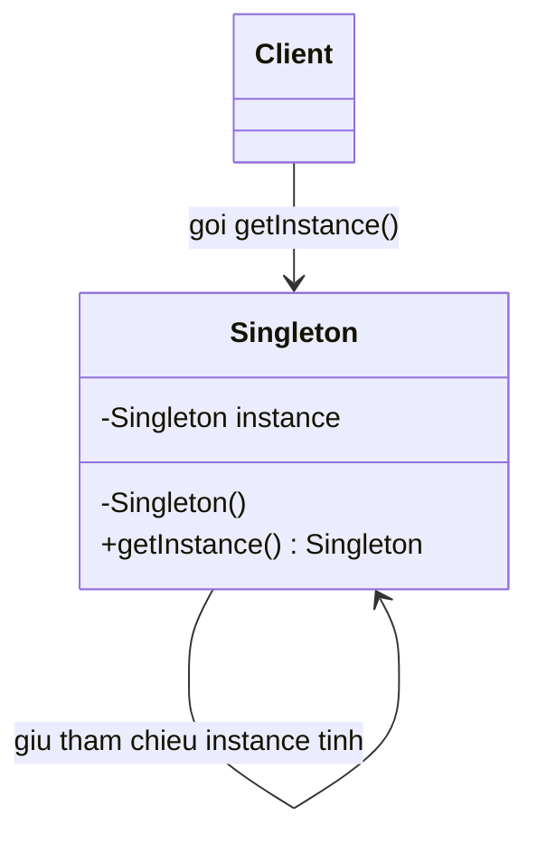

# Java Design Pattern - Singleton

Singleton là mẫu thiết kế khởi tạo đảm bảo một lớp chỉ có duy nhất một thể hiện trong toàn bộ ứng dụng và cung cấp một điểm truy cập chung tới thể hiện đó. Mẫu này rất hữu ích cho những đối tượng dùng chung như kết nối cơ sở dữ liệu, cấu hình hay logger. Bài này trình bày các cách triển khai Singleton trong Java cùng ưu, nhược điểm của chúng.

:::note[Ghi nhớ nhanh]

- ⭐ **`Singleton` đảm bảo chỉ duy nhất một instance** — dùng constructor `private` chặn `new` và điểm truy cập chung `getInstance()`.
- ⭐ **Enum Singleton là cách khuyến nghị** — đơn giản, an toàn đa luồng, chống tạo instance qua Serialization/Reflection.
- **Double-Checked Locking** — lazy init thread-safe cần khai báo field `volatile`.
- **Nhược điểm** — khó unit test và vi phạm Single Responsibility Principle do tạo phụ thuộc toàn cục.
- **Dùng cho** — DB connection pool, cấu hình, logger, cache dùng chung toàn ứng dụng.

:::

## Mục đích

**Singleton Pattern** (mẫu đơn thể) là một **Creational Design Pattern** (mẫu thiết kế khởi tạo) đảm bảo rằng một lớp chỉ có **duy nhất một thể hiện** (instance) trong suốt vòng đời ứng dụng và cung cấp một điểm truy cập toàn cục tới thể hiện đó.

## Vấn đề giải quyết

Trong thực tế, có những tài nguyên hoặc đối tượng mà chúng ta chỉ muốn tạo ra một lần duy nhất, ví dụ:
- Kết nối cơ sở dữ liệu (Database Connection)
- Đối tượng cấu hình ứng dụng (Configuration)
- Logger toàn hệ thống
- Cache Manager

Nếu tạo nhiều instance, sẽ dẫn đến lãng phí tài nguyên, dữ liệu không nhất quán và hành vi không thể đoán trước.

## Cấu trúc

Singleton bao gồm:
- **Constructor private**: ngăn không cho bên ngoài tạo instance mới.
- **Static field**: lưu trữ instance duy nhất.
- **Static method `getInstance()`**: trả về instance duy nhất, tạo mới nếu chưa tồn tại.

Sơ đồ lớp dưới đây minh họa cấu trúc Singleton — constructor private, field tĩnh giữ instance duy nhất và phương thức tĩnh `getInstance()` đóng vai trò điểm truy cập chung:



Client bên ngoài không thể gọi `new` mà chỉ lấy đối tượng qua `getInstance()`, nhờ đó toàn hệ thống luôn dùng chung đúng một thể hiện.

## Ví dụ Java

### Cách 1: Eager Initialization (Khởi tạo sớm)

```java
public class DatabaseConnection {

    // Instance được tạo ngay khi class được load
    private static final DatabaseConnection INSTANCE = new DatabaseConnection();

    // Constructor private ngăn bên ngoài tạo instance
    private DatabaseConnection() {
        System.out.println("Khởi tạo kết nối cơ sở dữ liệu...");
    }

    public static DatabaseConnection getInstance() {
        return INSTANCE;
    }

    public void query(String sql) {
        System.out.println("Thực thi truy vấn: " + sql);
    }
}

// Sử dụng
public class Main {
    public static void main(String[] args) {
        DatabaseConnection db1 = DatabaseConnection.getInstance();
        DatabaseConnection db2 = DatabaseConnection.getInstance();

        System.out.println(db1 == db2); // true — cùng một instance
        db1.query("SELECT * FROM users");
    }
}
```

### Cách 2: Lazy Initialization Thread-safe (Double-Checked Locking)

```java
public class ConfigManager {

    // volatile đảm bảo tính nhất quán giữa các luồng
    private static volatile ConfigManager instance;
    private String appName;

    private ConfigManager() {
        this.appName = "MyApp";
    }

    public static ConfigManager getInstance() {
        if (instance == null) {                    // Kiểm tra lần 1 (không đồng bộ)
            synchronized (ConfigManager.class) {
                if (instance == null) {            // Kiểm tra lần 2 (trong khóa)
                    instance = new ConfigManager();
                }
            }
        }
        return instance;
    }

    public String getAppName() {
        return appName;
    }
}
```

### Cách 3: Enum Singleton (Khuyến nghị)

```java
public enum AppLogger {
    INSTANCE;

    public void log(String message) {
        System.out.println("[LOG] " + message);
    }
}

// Sử dụng
AppLogger.INSTANCE.log("Ứng dụng khởi động");
```

Enum Singleton là cách đơn giản nhất, an toàn với đa luồng và ngăn chặn việc tạo instance qua **Serialization** (tuần tự hóa) hoặc **Reflection** (phản chiếu).

## Ưu điểm

- Đảm bảo chỉ có đúng một instance trong toàn bộ ứng dụng.
- Cung cấp điểm truy cập toàn cục.
- Instance chỉ được tạo khi thực sự cần thiết (Lazy Initialization).

## Nhược điểm

- Khó kiểm thử (**Unit Test**) vì tạo ra sự phụ thuộc toàn cục.
- Vi phạm **Single Responsibility Principle** (nguyên tắc đơn trách nhiệm) — lớp vừa quản lý logic vừa quản lý vòng đời của chính nó.
- Gây khó khăn khi cần mở rộng hoặc thay thế bằng subclass.

## Khi nào nên dùng

- Cần quản lý kết nối cơ sở dữ liệu (connection pool).
- Cấu hình ứng dụng được đọc từ file và dùng xuyên suốt hệ thống.
- Logger, Cache, Thread Pool dùng chung toàn ứng dụng.
- Khi chi phí tạo object lớn và chỉ cần một instance duy nhất.
