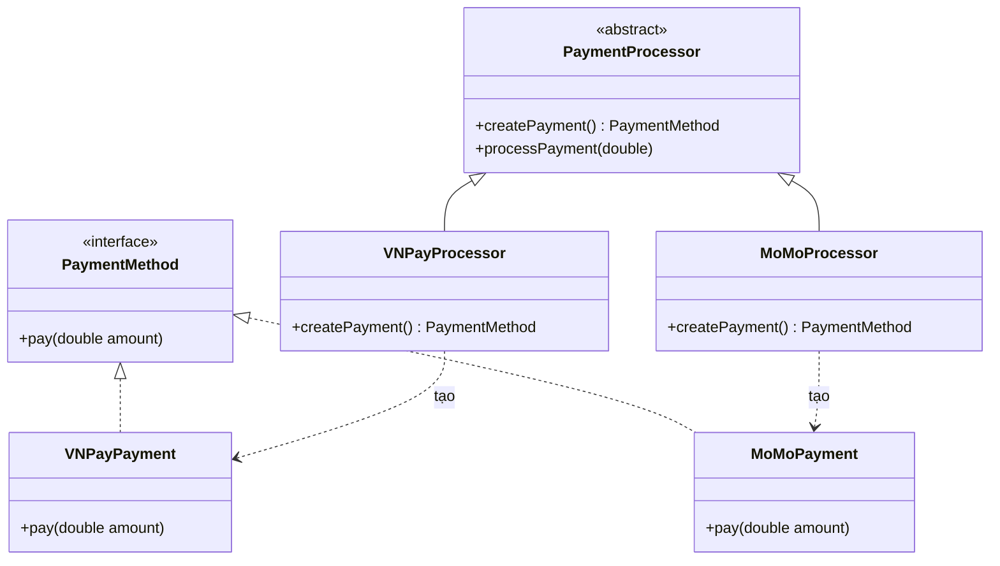

# Java Design Pattern - Factory Method

Factory Method là một mẫu thiết kế khởi tạo (creational) giúp bạn tạo đối tượng mà không cần gọi `new` trực tiếp trong code nghiệp vụ. Thay vào đó, việc quyết định tạo lớp cụ thể nào được giao cho các lớp con. Cách làm này giúp code bớt phụ thuộc cứng, dễ thêm loại đối tượng mới và dễ kiểm thử hơn. Bài này giới thiệu khái niệm tổng quan; phần chi tiết với ví dụ Java nằm bên dưới.

:::note[Ghi nhớ nhanh]

- ⭐ **`Factory Method` để lớp con quyết định lớp cụ thể nào được tạo** — tránh gọi `new` trực tiếp trong code nghiệp vụ, giảm phụ thuộc cứng.
- **Cấu trúc** — `Product`, `ConcreteProduct`, `Creator` (khai báo `factoryMethod()`), `ConcreteCreator` (override để trả về product cụ thể).
- **Biến thể `Static Factory Method`** — dùng một `switch` để tạo product theo tham số đầu vào.
- **Tuân thủ Open/Closed Principle** — dễ thêm loại product mới mà không sửa code cũ.
- **Nhược điểm** — số lượng lớp tăng khi có nhiều `ConcreteCreator`.

:::

## Mục đích

**Factory Method Pattern** (mẫu phương thức nhà máy) là một **Creational Design Pattern** định nghĩa một **interface** (giao diện) hoặc lớp trừu tượng để tạo đối tượng, nhưng cho phép các lớp con quyết định lớp cụ thể nào sẽ được khởi tạo. Factory Method cho phép trì hoãn việc khởi tạo đối tượng cho các lớp con.

## Vấn đề giải quyết

Khi một lớp không thể biết trước kiểu đối tượng cụ thể mà nó cần tạo, hoặc khi muốn các lớp con kiểm soát việc tạo đối tượng, sử dụng `new` trực tiếp trong code làm tăng sự phụ thuộc cứng (**tight coupling** — liên kết chặt) giữa các lớp.

Ví dụ: Một hệ thống thanh toán cần hỗ trợ nhiều phương thức (VNPay, MoMo, ZaloPay) — mỗi loại có cách khởi tạo khác nhau nhưng dùng chung một interface thống nhất.

## Cấu trúc

- **Product**: Interface hoặc lớp trừu tượng định nghĩa đối tượng được tạo ra.
- **ConcreteProduct**: Các lớp cụ thể implement Product.
- **Creator**: Lớp trừu tượng khai báo `factoryMethod()` trả về Product.
- **ConcreteCreator**: Lớp con override `factoryMethod()` để trả về ConcreteProduct cụ thể.



Mỗi `ConcreteCreator` quyết định tạo ra `ConcreteProduct` nào — phần code dùng chung ở `PaymentProcessor` chỉ làm việc với interface `PaymentMethod`.

## Ví dụ Java

```java
// Product — giao diện thanh toán
public interface PaymentMethod {
    void pay(double amount);
    String getName();
}

// ConcreteProduct — thanh toán qua VNPay
public class VNPayPayment implements PaymentMethod {
    @Override
    public void pay(double amount) {
        System.out.printf("Thanh toán %.0f VNĐ qua VNPay%n", amount);
    }

    @Override
    public String getName() {
        return "VNPay";
    }
}

// ConcreteProduct — thanh toán qua MoMo
public class MoMoPayment implements PaymentMethod {
    @Override
    public void pay(double amount) {
        System.out.printf("Thanh toán %.0f VNĐ qua MoMo%n", amount);
    }

    @Override
    public String getName() {
        return "MoMo";
    }
}

// Creator — lớp trừu tượng định nghĩa factory method
public abstract class PaymentProcessor {

    // Factory Method — lớp con sẽ override
    public abstract PaymentMethod createPaymentMethod();

    // Business logic dùng chung
    public void processPayment(double amount) {
        PaymentMethod method = createPaymentMethod();
        System.out.println("Đang xử lý với: " + method.getName());
        method.pay(amount);
    }
}

// ConcreteCreator — xử lý thanh toán VNPay
public class VNPayProcessor extends PaymentProcessor {
    @Override
    public PaymentMethod createPaymentMethod() {
        return new VNPayPayment();
    }
}

// ConcreteCreator — xử lý thanh toán MoMo
public class MoMoProcessor extends PaymentProcessor {
    @Override
    public PaymentMethod createPaymentMethod() {
        return new MoMoPayment();
    }
}

// Sử dụng
public class Main {
    public static void main(String[] args) {
        PaymentProcessor processor;

        String paymentType = "VNPAY"; // lấy từ config hoặc user input

        if ("VNPAY".equals(paymentType)) {
            processor = new VNPayProcessor();
        } else {
            processor = new MoMoProcessor();
        }

        processor.processPayment(150000);
    }
}
```

### Biến thể: Static Factory Method

```java
public class PaymentFactory {

    public static PaymentMethod create(String type) {
        return switch (type.toUpperCase()) {
            case "VNPAY" -> new VNPayPayment();
            case "MOMO"  -> new MoMoPayment();
            default -> throw new IllegalArgumentException("Loại thanh toán không hợp lệ: " + type);
        };
    }
}

// Sử dụng đơn giản hơn
PaymentMethod pm = PaymentFactory.create("MOMO");
pm.pay(200000);
```

## Ưu điểm

- Loại bỏ sự phụ thuộc cứng giữa Creator và ConcreteProduct.
- Tuân thủ **Open/Closed Principle** (nguyên tắc mở/đóng) — dễ thêm loại sản phẩm mới mà không sửa code cũ.
- Dễ kiểm thử vì có thể inject mock object vào Creator.

## Nhược điểm

- Số lượng lớp tăng lên khi có nhiều ConcreteCreator.
- Code có thể trở nên phức tạp hơn cần thiết với các hệ thống nhỏ.

## Khi nào nên dùng

- Không biết trước kiểu đối tượng cụ thể cần tạo tại thời điểm biên dịch.
- Muốn cho phép lớp con mở rộng cách tạo đối tượng.
- Tích hợp nhiều nguồn dữ liệu, nhiều dịch vụ bên thứ ba với interface thống nhất.
- Triển khai các hệ thống plugin hoặc có thể mở rộng linh hoạt.
