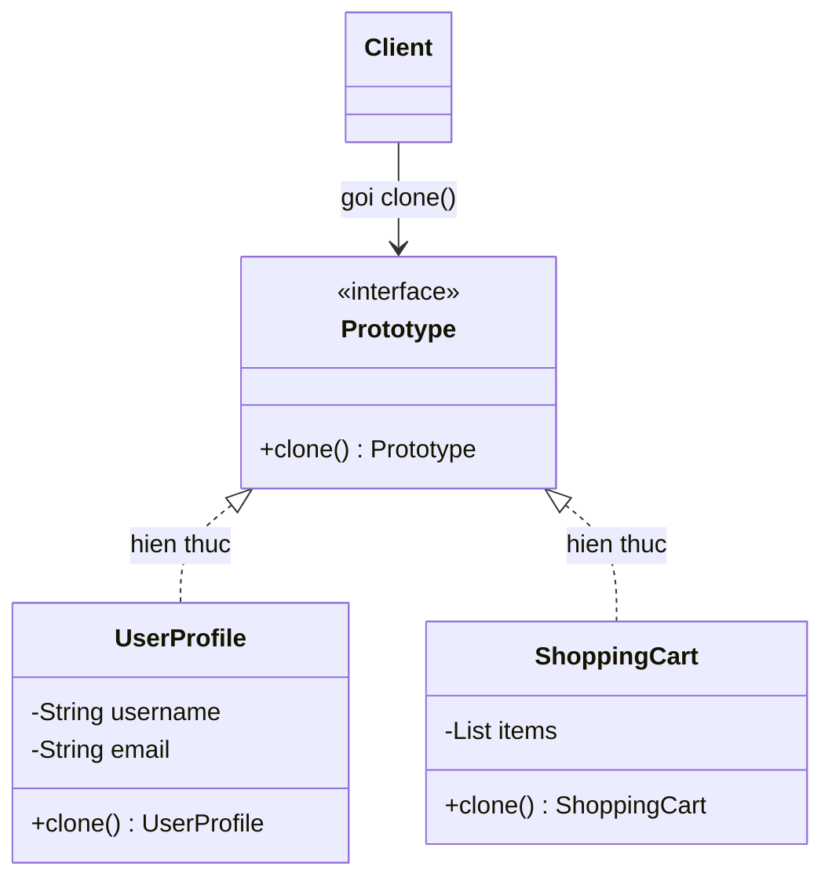

# Java Design Pattern - Prototype

Prototype là một mẫu thiết kế khởi tạo (creational) cho phép tạo đối tượng mới bằng cách sao chép (clone) một đối tượng có sẵn, thay vì khởi tạo lại từ đầu. Cách này rất hữu ích khi việc tạo mới một đối tượng tốn kém tài nguyên hoặc thời gian. Bài này giới thiệu khái niệm tổng quan cùng sự khác nhau giữa sao chép nông và sao chép sâu; phần chi tiết với ví dụ Java nằm bên dưới.

:::note[Ghi nhớ nhanh]

- ⭐ **`Prototype` tạo object mới bằng cách `clone()` object có sẵn** thay vì `new`, tránh chi phí khởi tạo lại tốn kém.
- **Java hỗ trợ sẵn** — qua interface `Cloneable` và phương thức `Object.clone()`.
- ⭐ **Phân biệt Shallow Copy và Deep Copy** — `super.clone()` là sao chép nông; muốn sao chép sâu phải tự tạo mới các collection/đối tượng con.
- **`Prototype Registry`** — lưu sẵn các mẫu (template) để clone nhanh theo tên.
- **Nhược điểm** — `Cloneable` bị nhiều chuyên gia coi là thiết kế không lý tưởng; clone tham chiếu vòng tròn rất phức tạp.

:::

## Mục đích

**Prototype Pattern** (mẫu nguyên mẫu) là một **Creational Design Pattern** cho phép tạo ra đối tượng mới bằng cách **sao chép** (clone) một đối tượng đã tồn tại, thay vì tạo mới từ đầu. Đối tượng gốc được gọi là **prototype** (nguyên mẫu).

## Vấn đề giải quyết

Đôi khi việc tạo một đối tượng mới rất tốn kém (kết nối DB, tính toán phức tạp, đọc file cấu hình). Nếu cần nhiều đối tượng tương tự nhau, sao chép từ một đối tượng đã khởi tạo sẵn sẽ hiệu quả hơn nhiều so với tạo mới từ đầu mỗi lần.

Ngoài ra, đôi khi bạn không biết lớp cụ thể của đối tượng cần tạo (chỉ biết interface), Prototype giúp giải quyết vấn đề này.

## Cấu trúc

- **Prototype**: Interface khai báo phương thức `clone()`.
- **ConcretePrototype**: Lớp cụ thể implement `clone()` để sao chép chính nó.
- **Client**: Tạo đối tượng mới bằng cách gọi `clone()` trên prototype.

Java hỗ trợ sẵn thông qua interface `Cloneable` và phương thức `Object.clone()`.

Sơ đồ lớp dưới đây minh họa cấu trúc Prototype — mỗi lớp cụ thể tự hiện thực `clone()` để sao chép chính nó, còn Client chỉ cần gọi `clone()` mà không phụ thuộc vào lớp cụ thể:



Client tạo đối tượng mới bằng cách sao chép một prototype có sẵn thay vì gọi `new`, nhờ đó tránh được chi phí khởi tạo lại từ đầu.

## Ví dụ Java

### Shallow Copy (Sao chép nông)

```java
public class UserProfile implements Cloneable {
    private String username;
    private String email;
    private String role;

    public UserProfile(String username, String email, String role) {
        this.username = username;
        this.email = email;
        this.role = role;
        // Giả lập: tải dữ liệu từ DB tốn thời gian
        System.out.println("Tải profile từ cơ sở dữ liệu...");
    }

    @Override
    public UserProfile clone() {
        try {
            return (UserProfile) super.clone(); // Shallow copy
        } catch (CloneNotSupportedException e) {
            throw new RuntimeException("Không thể clone UserProfile", e);
        }
    }

    // Getters và setters
    public void setUsername(String username) { this.username = username; }
    public String getUsername() { return username; }
    public String getEmail() { return email; }
    public void setEmail(String email) { this.email = email; }

    @Override
    public String toString() {
        return "UserProfile{username='" + username + "', email='" + email + "', role='" + role + "'}";
    }
}

// Sử dụng
public class Main {
    public static void main(String[] args) {
        // Tạo một lần — tốn thời gian
        UserProfile originalProfile = new UserProfile("admin", "admin@example.com", "ADMIN");

        // Clone nhanh — không tốn thời gian khởi tạo lại
        UserProfile clonedProfile = originalProfile.clone();
        clonedProfile.setUsername("user1");
        clonedProfile.setEmail("user1@example.com");

        System.out.println(originalProfile); // username=admin (không bị thay đổi)
        System.out.println(clonedProfile);   // username=user1
    }
}
```

### Deep Copy (Sao chép sâu) — khi có tham chiếu đến đối tượng khác

```java
import java.util.ArrayList;
import java.util.List;

public class ShoppingCart implements Cloneable {
    private String customerId;
    private List`<String>` items; // Danh sách sản phẩm

    public ShoppingCart(String customerId) {
        this.customerId = customerId;
        this.items = new ArrayList<>();
    }

    public void addItem(String item) {
        items.add(item);
    }

    @Override
    public ShoppingCart clone() {
        try {
            ShoppingCart cloned = (ShoppingCart) super.clone();
            // Deep copy — tạo list mới, tránh chia sẻ tham chiếu
            cloned.items = new ArrayList<>(this.items);
            return cloned;
        } catch (CloneNotSupportedException e) {
            throw new RuntimeException("Không thể clone ShoppingCart", e);
        }
    }

    public void setCustomerId(String customerId) { this.customerId = customerId; }

    @Override
    public String toString() {
        return "ShoppingCart{customerId='" + customerId + "', items=" + items + "}";
    }
}

// Sử dụng Deep Copy
public class DeepCopyExample {
    public static void main(String[] args) {
        ShoppingCart cart1 = new ShoppingCart("customer-001");
        cart1.addItem("Laptop");
        cart1.addItem("Chuột không dây");

        ShoppingCart cart2 = cart1.clone();
        cart2.setCustomerId("customer-002");
        cart2.addItem("Bàn phím cơ"); // Chỉ ảnh hưởng cart2

        System.out.println(cart1); // items=[Laptop, Chuột không dây]
        System.out.println(cart2); // items=[Laptop, Chuột không dây, Bàn phím cơ]
    }
}
```

### Prototype Registry (Kho lưu trữ nguyên mẫu)

```java
import java.util.HashMap;
import java.util.Map;

public class PrototypeRegistry {
    private static final Map`<String, UserProfile>` registry = new HashMap<>();

    static {
        registry.put("admin",   new UserProfile("template_admin", "admin@template.com", "ADMIN"));
        registry.put("viewer",  new UserProfile("template_viewer", "viewer@template.com", "VIEWER"));
    }

    public static UserProfile getPrototype(String type) {
        UserProfile prototype = registry.get(type);
        if (prototype == null) {
            throw new IllegalArgumentException("Không tìm thấy prototype: " + type);
        }
        return prototype.clone();
    }
}

// Tạo user mới từ template — không cần load từ DB
UserProfile newAdmin = PrototypeRegistry.getPrototype("admin");
newAdmin.setUsername("newadmin");
newAdmin.setEmail("newadmin@company.com");
```

## Ưu điểm

- Tăng hiệu năng khi tạo đối tượng phức tạp hoặc tốn kém.
- Giảm số lượng lớp con cần thiết so với Factory Method.
- Cho phép tạo bản sao đối tượng mà không phụ thuộc vào lớp cụ thể của nó.

## Nhược điểm

- Clone đối tượng có tham chiếu vòng tròn (circular reference) rất phức tạp.
- Phân biệt **Shallow Copy** và **Deep Copy** đòi hỏi sự cẩn thận.
- Lớp `Cloneable` trong Java có thiết kế không lý tưởng (nhiều chuyên gia coi là anti-pattern).

## Khi nào nên dùng

- Khởi tạo đối tượng tốn nhiều tài nguyên (kết nối mạng, truy vấn DB, tính toán nặng).
- Cần tạo nhiều đối tượng tương tự từ một mẫu ban đầu.
- Code cần hoạt động với đối tượng mà không biết lớp cụ thể của chúng.
- Cần lưu trạng thái đối tượng để **undo/redo** (hoàn tác/làm lại).
