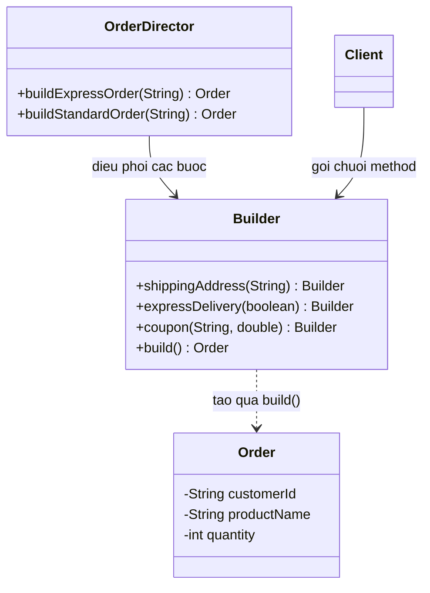

# Java Design Pattern - Builder

Builder là một mẫu thiết kế khởi tạo (creational) giúp xây dựng các đối tượng phức tạp có nhiều thuộc tính theo từng bước, thay vì nhồi tất cả vào một constructor dài và khó đọc. Nhờ đó code khởi tạo trở nên rõ ràng, dễ đọc và đối tượng tạo ra có thể là bất biến (immutable). Bài này giới thiệu khái niệm tổng quan; phần chi tiết với ví dụ Java nằm bên dưới.

## Mục đích

**Builder Pattern** (mẫu xây dựng) là một **Creational Design Pattern** tách rời quá trình **xây dựng** (construction) một đối tượng phức tạp khỏi **biểu diễn** (representation) của nó. Kết quả là cùng một quy trình xây dựng có thể tạo ra các biểu diễn khác nhau.

## Vấn đề giải quyết

Khi một đối tượng có nhiều thuộc tính, đặc biệt là các thuộc tính tùy chọn, việc dùng constructor nhiều tham số gây ra:
- **Telescoping Constructor** (constructor kính thiên văn) — quá nhiều constructor nạp chồng.
- Khó đọc khi truyền nhiều tham số `null` hoặc giá trị mặc định.
- Dễ nhầm thứ tự tham số.

```java
// KHÔNG TỐT: Constructor với quá nhiều tham số
new Order("user1", "Laptop", 2, 15000000, "Hà Nội", null, true, false, null);
// Ai biết tham số thứ 8 là gì?
```

## Cấu trúc

- **Product**: Đối tượng phức tạp cần xây dựng.
- **Builder**: Interface khai báo các bước xây dựng.
- **ConcreteBuilder**: Lớp cụ thể thực hiện các bước xây dựng, lưu trạng thái trung gian.
- **Director** (tùy chọn): Định nghĩa thứ tự gọi các bước xây dựng.

Sơ đồ lớp dưới đây minh họa cấu trúc Builder qua ví dụ tạo `Order` — Builder giữ trạng thái trung gian và trả về `this` để nối chuỗi method, cuối cùng `build()` tạo ra Product:



Client gọi lần lượt các bước trên Builder rồi `build()` để nhận Product bất biến; `OrderDirector` (tùy chọn) đóng gói sẵn các quy trình xây dựng thường dùng.

## Ví dụ Java

### Builder cơ bản (Fluent Builder)

```java
public class Order {
    // Thuộc tính bắt buộc
    private final String customerId;
    private final String productName;
    private final int quantity;

    // Thuộc tính tùy chọn
    private final String shippingAddress;
    private final String note;
    private final boolean expressDelivery;
    private final String couponCode;
    private final double discountPercent;

    // Constructor private — chỉ Builder mới được gọi
    private Order(Builder builder) {
        this.customerId      = builder.customerId;
        this.productName     = builder.productName;
        this.quantity        = builder.quantity;
        this.shippingAddress = builder.shippingAddress;
        this.note            = builder.note;
        this.expressDelivery = builder.expressDelivery;
        this.couponCode      = builder.couponCode;
        this.discountPercent = builder.discountPercent;
    }

    @Override
    public String toString() {
        return String.format(
            "Order{customer='%s', product='%s', qty=%d, express=%b, discount=%.1f%%, address='%s'}",
            customerId, productName, quantity, expressDelivery, discountPercent, shippingAddress
        );
    }

    // Static inner Builder
    public static class Builder {
        // Bắt buộc
        private final String customerId;
        private final String productName;
        private final int quantity;

        // Tùy chọn — có giá trị mặc định
        private String shippingAddress = "";
        private String note            = "";
        private boolean expressDelivery = false;
        private String couponCode      = null;
        private double discountPercent = 0.0;

        // Constructor chỉ nhận thuộc tính bắt buộc
        public Builder(String customerId, String productName, int quantity) {
            if (customerId == null || customerId.isBlank()) {
                throw new IllegalArgumentException("customerId không được để trống");
            }
            if (quantity <= 0) {
                throw new IllegalArgumentException("Số lượng phải lớn hơn 0");
            }
            this.customerId  = customerId;
            this.productName = productName;
            this.quantity    = quantity;
        }

        public Builder shippingAddress(String address) {
            this.shippingAddress = address;
            return this; // Trả về this để chain method
        }

        public Builder note(String note) {
            this.note = note;
            return this;
        }

        public Builder expressDelivery(boolean express) {
            this.expressDelivery = express;
            return this;
        }

        public Builder coupon(String code, double discountPercent) {
            this.couponCode      = code;
            this.discountPercent = discountPercent;
            return this;
        }

        public Order build() {
            return new Order(this);
        }
    }
}

// Sử dụng — rất dễ đọc
public class Main {
    public static void main(String[] args) {
        // Đơn hàng đầy đủ tùy chọn
        Order order1 = new Order.Builder("cust-001", "Laptop Dell", 1)
                .shippingAddress("123 Nguyễn Huệ, Quận 1, TP.HCM")
                .expressDelivery(true)
                .coupon("SALE20", 20.0)
                .note("Giao trước 18:00")
                .build();

        // Đơn hàng đơn giản — chỉ cần thuộc tính bắt buộc
        Order order2 = new Order.Builder("cust-002", "Chuột Logitech", 2)
                .build();

        System.out.println(order1);
        System.out.println(order2);
    }
}
```

### Director Pattern — tái sử dụng quy trình xây dựng

```java
public class OrderDirector {
    private final Order.Builder builder;

    public OrderDirector(Order.Builder builder) {
        this.builder = builder;
    }

    // Tạo đơn hàng giao nhanh theo chuẩn
    public Order buildExpressOrder(String address) {
        return builder
                .shippingAddress(address)
                .expressDelivery(true)
                .note("GIAO NHANH - Ưu tiên xử lý")
                .build();
    }

    // Tạo đơn hàng thường
    public Order buildStandardOrder(String address) {
        return builder
                .shippingAddress(address)
                .expressDelivery(false)
                .build();
    }
}
```

## Ưu điểm

- Code khởi tạo đối tượng rõ ràng, dễ đọc nhờ **Fluent Interface** (giao diện trôi chảy — cho phép gọi chuỗi method).
- Tách biệt quá trình xây dựng và kết quả.
- Dễ validate tham số trong từng bước hoặc trong `build()`.
- Đối tượng Product có thể là **immutable** (bất biến) sau khi build.

## Nhược điểm

- Tăng số lượng code do phải tạo thêm lớp Builder.
- Nếu đối tượng đơn giản, Builder là quá phức tạp (over-engineering).

## Khi nào nên dùng

- Đối tượng có nhiều hơn 4–5 tham số khởi tạo, đặc biệt là tham số tùy chọn.
- Cần kiểm soát từng bước trong quy trình xây dựng đối tượng phức tạp.
- Muốn đối tượng kết quả là bất biến (immutable).
- Xây dựng các đối tượng cấu hình: HTTP Request, SQL Query, Email, Report.
