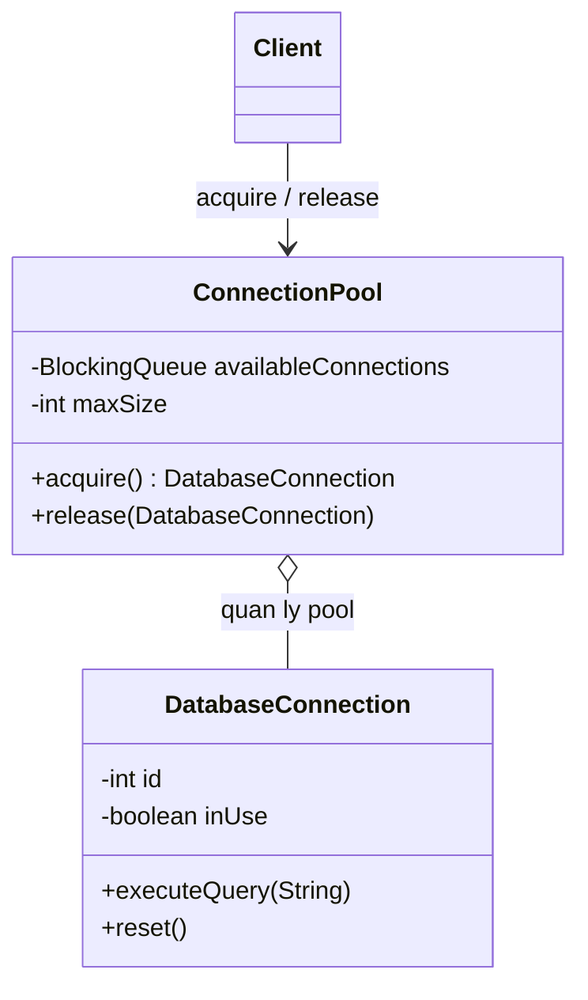
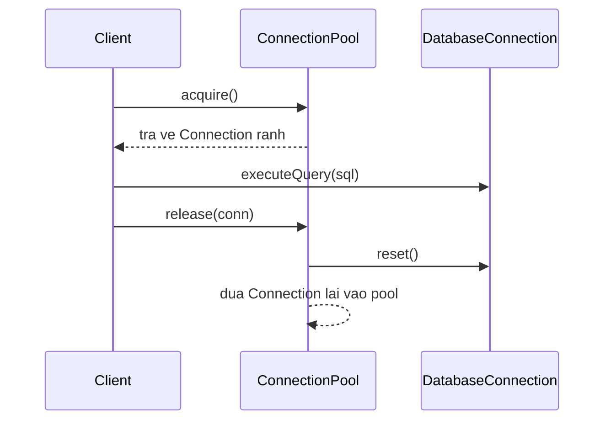

# Java Design Pattern - Object Pool

Object Pool là một mẫu thiết kế khởi tạo (creational) quản lý một bể chứa các đối tượng đã tạo sẵn để tái sử dụng, thay vì liên tục tạo mới rồi hủy. Mẫu này đặc biệt quan trọng với những đối tượng tốn kém để khởi tạo như kết nối cơ sở dữ liệu hay luồng xử lý, giúp cải thiện hiệu năng và giảm áp lực cho bộ thu gom rác. Bài này giới thiệu khái niệm tổng quan; phần chi tiết với ví dụ Java nằm bên dưới.

:::note[Ghi nhớ nhanh]

- ⭐ **`Object Pool` tái sử dụng đối tượng đắt tiền qua một bể chứa** thay vì tạo/hủy liên tục, giảm **GC pressure**.
- **Cơ chế mượn/trả** — client `acquire()` để mượn, `release()` để trả; đối tượng được `reset()` về trạng thái sạch trước khi vào lại pool.
- **Thread-safe** — dùng `BlockingQueue` để đồng bộ và chờ khi pool đang cạn.
- **`try-with-resources`** — bọc bằng `AutoCloseable` để luôn tự động trả về pool dù có exception.
- **Nhược điểm & thực tế** — rủi ro memory leak / trạng thái bẩn; Java đã có sẵn `HikariCP`, `c3p0`, `ThreadPoolExecutor`.

:::

## Mục đích

**Object Pool Pattern** (mẫu hồ đối tượng) là một **Creational Design Pattern** quản lý một tập hợp các đối tượng đã được khởi tạo sẵn (**pool** — bể chứa), cho phép tái sử dụng thay vì tạo mới và hủy liên tục. Khi cần một đối tượng, client lấy từ pool; khi xong, trả lại pool thay vì hủy.

## Vấn đề giải quyết

Việc tạo và hủy một số loại đối tượng rất tốn kém về tài nguyên và thời gian:
- Kết nối cơ sở dữ liệu (Database Connection)
- Luồng xử lý (Thread)
- Kết nối socket mạng
- Đối tượng lớn với nhiều tính toán khởi tạo

Nếu tạo mới mỗi lần dùng và hủy sau khi xong, hiệu suất ứng dụng sẽ giảm nghiêm trọng do **GC pressure** (áp lực từ Garbage Collector — cơ chế thu gom rác của JVM).

## Cấu trúc

- **Pool**: Quản lý vòng đời của các đối tượng (tạo, cấp phát, thu hồi).
- **PooledObject**: Đối tượng được quản lý bởi pool.
- **Client**: Mượn đối tượng từ pool và trả lại sau khi dùng xong.

Sơ đồ lớp dưới đây minh họa cấu trúc Object Pool — Pool quản lý một tập PooledObject và cho Client mượn/trả:



Sơ đồ tuần tự dưới đây minh họa luồng mượn và trả một kết nối — sau khi dùng xong, đối tượng được `reset()` và đưa lại vào pool thay vì bị hủy:



## Ví dụ Java

### Database Connection Pool

```java
import java.util.concurrent.BlockingQueue;
import java.util.concurrent.LinkedBlockingQueue;
import java.util.concurrent.TimeUnit;

// Đối tượng đại diện cho kết nối DB
public class DatabaseConnection {
    private final int id;
    private boolean inUse;

    public DatabaseConnection(int id) {
        this.id = id;
        this.inUse = false;
        // Mô phỏng chi phí kết nối tốn kém
        System.out.println("Tạo kết nối DB #" + id);
    }

    public void executeQuery(String sql) {
        System.out.printf("[Kết nối #%d] Thực thi: %s%n", id, sql);
    }

    public void setInUse(boolean inUse) { this.inUse = inUse; }
    public boolean isInUse() { return inUse; }
    public int getId() { return id; }

    // Dọn dẹp trạng thái trước khi trả về pool
    public void reset() {
        System.out.println("Reset kết nối #" + id + " về trạng thái sạch");
    }
}

// Connection Pool — thread-safe
public class ConnectionPool {
    private final BlockingQueue`<DatabaseConnection>` availableConnections;
    private final int maxSize;

    public ConnectionPool(int maxSize) {
        this.maxSize = maxSize;
        this.availableConnections = new LinkedBlockingQueue<>(maxSize);

        // Khởi tạo tất cả kết nối trước
        for (int i = 1; i <= maxSize; i++) {
            availableConnections.offer(new DatabaseConnection(i));
        }

        System.out.printf("Connection Pool sẵn sàng với %d kết nối%n", maxSize);
    }

    // Mượn kết nối — chờ tối đa 5 giây nếu pool đang cạn
    public DatabaseConnection acquire() throws InterruptedException {
        DatabaseConnection conn = availableConnections.poll(5, TimeUnit.SECONDS);
        if (conn == null) {
            throw new RuntimeException("Hết timeout chờ kết nối từ pool");
        }
        conn.setInUse(true);
        System.out.println("Cấp kết nối #" + conn.getId());
        return conn;
    }

    // Trả kết nối về pool
    public void release(DatabaseConnection conn) {
        if (conn != null) {
            conn.reset();
            conn.setInUse(false);
            availableConnections.offer(conn);
            System.out.println("Trả kết nối #" + conn.getId() + " về pool");
        }
    }

    public int getAvailableCount() {
        return availableConnections.size();
    }
}

// Sử dụng Connection Pool
public class Main {
    public static void main(String[] args) throws InterruptedException {
        ConnectionPool pool = new ConnectionPool(3);

        System.out.println("\n=== Bắt đầu xử lý ===");

        // Lấy kết nối và sử dụng
        DatabaseConnection conn1 = pool.acquire();
        DatabaseConnection conn2 = pool.acquire();

        conn1.executeQuery("SELECT * FROM orders WHERE status = 'pending'");
        conn2.executeQuery("UPDATE products SET stock = stock - 1 WHERE id = 42");

        System.out.println("Kết nối còn lại: " + pool.getAvailableCount()); // 1

        // Trả kết nối về pool sau khi dùng
        pool.release(conn1);
        pool.release(conn2);

        System.out.println("Kết nối còn lại: " + pool.getAvailableCount()); // 3
    }
}
```

### Pattern try-with-resources — đảm bảo luôn trả về pool

```java
public class PooledConnectionWrapper implements AutoCloseable {
    private final DatabaseConnection connection;
    private final ConnectionPool pool;

    public PooledConnectionWrapper(ConnectionPool pool) throws InterruptedException {
        this.pool = pool;
        this.connection = pool.acquire();
    }

    public DatabaseConnection getConnection() {
        return connection;
    }

    @Override
    public void close() {
        pool.release(connection); // Tự động trả về pool
    }
}

// Sử dụng an toàn — tự động release dù có exception
public class SafeUsageExample {
    public static void process(ConnectionPool pool) throws InterruptedException {
        try (PooledConnectionWrapper wrapper = new PooledConnectionWrapper(pool)) {
            wrapper.getConnection().executeQuery("SELECT COUNT(*) FROM users");
        } // connection tự động được trả về pool ở đây
    }
}
```

## Ưu điểm

- Cải thiện hiệu năng đáng kể bằng cách tái sử dụng đối tượng đắt tiền.
- Giảm **GC pressure** — ít đối tượng được tạo/hủy hơn.
- Kiểm soát số lượng tài nguyên đang được sử dụng đồng thời.

## Nhược điểm

- Phức tạp hơn trong việc quản lý trạng thái — phải reset đối tượng trước khi trả về pool.
- Rủi ro **memory leak** (rò rỉ bộ nhớ) nếu đối tượng không được trả về pool.
- Khó debug khi đối tượng mang trạng thái bẩn từ lần dùng trước.

## Khi nào nên dùng

- Đối tượng tốn kém để tạo mới (kết nối DB, socket, thread).
- Đối tượng được dùng thường xuyên và trong thời gian ngắn.
- Cần kiểm soát giới hạn số lượng tài nguyên đang hoạt động.
- Java đã cung cấp sẵn: `HikariCP`, `c3p0` (connection pool), `ThreadPoolExecutor` (thread pool).
