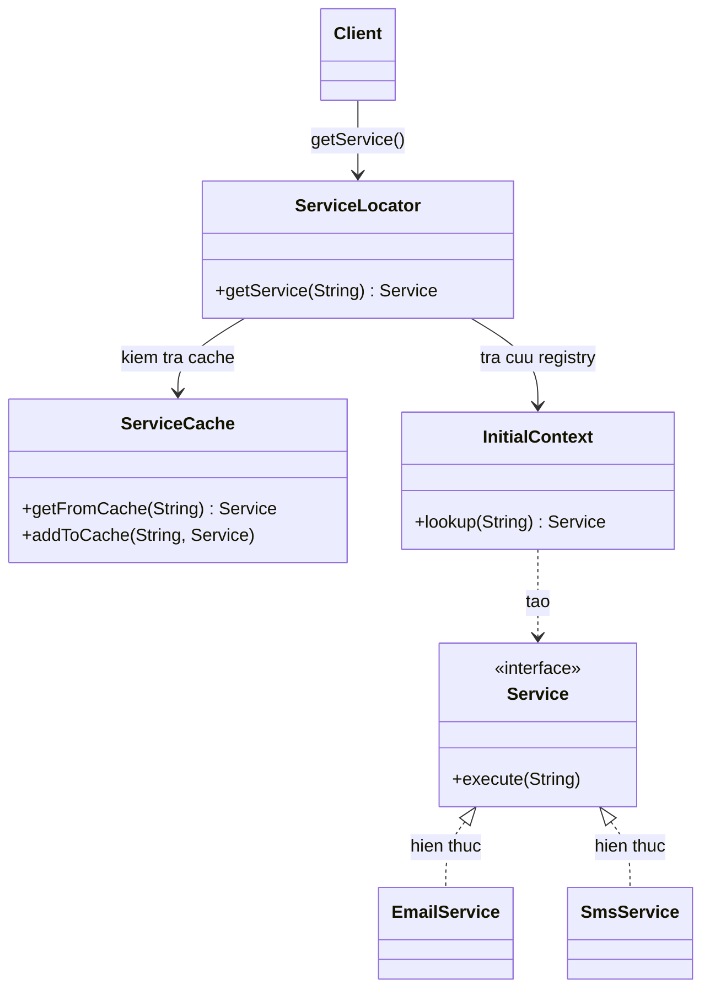
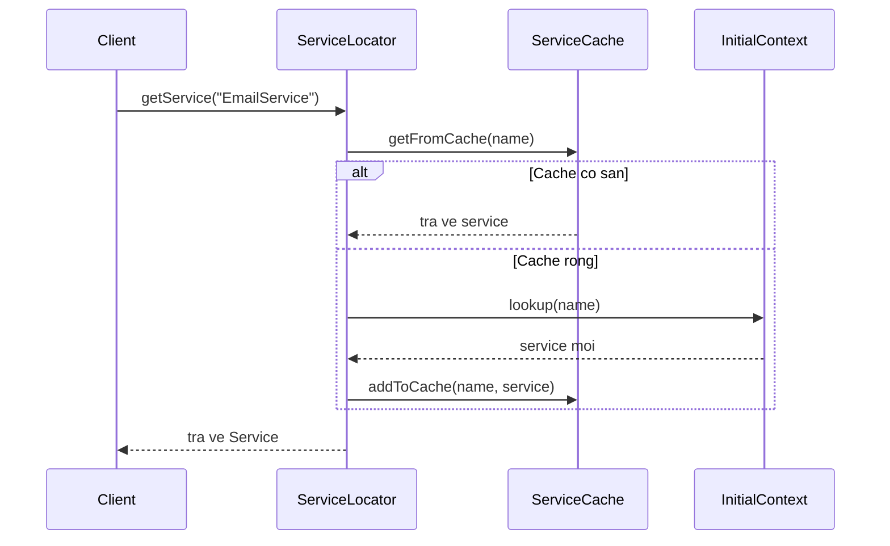

# Java Design Pattern - Service Locator

Service Locator là một mẫu thiết kế khởi tạo (creational) cung cấp một nơi trung tâm để tra cứu và lấy ra các dịch vụ dùng chung theo tên hoặc kiểu, thay vì tự khởi tạo trực tiếp ở khắp nơi. Cách làm này giúp tập trung logic tạo dịch vụ vào một chỗ và dễ thay thế hơn. Bài này giới thiệu khái niệm tổng quan kèm so sánh với Dependency Injection; phần chi tiết với ví dụ Java nằm bên dưới.

## Mục đích

**Service Locator Pattern** (mẫu định vị dịch vụ) là một **Creational Design Pattern** cung cấp một nơi trung tâm (**registry** — kho đăng ký) để tra cứu và lấy các dịch vụ (service) theo tên hoặc kiểu dữ liệu, thay vì hardcode việc khởi tạo trực tiếp.

## Vấn đề giải quyết

Trong các ứng dụng lớn, nhiều component cần truy cập các dịch vụ dùng chung (EmailService, PaymentService, CacheService). Nếu mỗi nơi tự khởi tạo (`new EmailService()`), code sẽ:
- **Tight coupling** (liên kết chặt) — khó thay thế implementation.
- Khó kiểm soát vòng đời của service.
- Trùng lặp code khởi tạo ở nhiều nơi.

Service Locator giải quyết bằng cách tập trung việc tra cứu và khởi tạo dịch vụ vào một chỗ.

## Cấu trúc

- **ServiceLocator**: Lớp trung tâm, cung cấp phương thức `getService(type)`.
- **ServiceRegistry**: Kho lưu trữ các service đã đăng ký (có thể tích hợp vào ServiceLocator).
- **Service**: Interface chung của các dịch vụ.
- **ConcreteService**: Lớp cụ thể triển khai Service.
- **Cache**: Lưu trữ service đã tra cứu để tránh tìm lại.

Sơ đồ lớp dưới đây minh họa cấu trúc Service Locator — điểm trung tâm `ServiceLocator` phối hợp giữa `ServiceCache` và `InitialContext` (registry) để cung cấp Service cho client:



Sơ đồ tuần tự dưới đây minh họa luồng tra cứu — lần đầu tìm trong registry rồi lưu cache, các lần sau lấy thẳng từ cache:



## Ví dụ Java

```java
// Interface chung cho tất cả service
public interface Service {
    String getName();
    void execute(String data);
}

// ConcreteService — Email Service
public class EmailService implements Service {
    @Override
    public String getName() { return "EmailService"; }

    @Override
    public void execute(String data) {
        System.out.println("[EmailService] Gửi email: " + data);
    }
}

// ConcreteService — SMS Service
public class SmsService implements Service {
    @Override
    public String getName() { return "SmsService"; }

    @Override
    public void execute(String data) {
        System.out.println("[SmsService] Gửi SMS: " + data);
    }
}

// ConcreteService — Push Notification
public class PushNotificationService implements Service {
    @Override
    public String getName() { return "PushService"; }

    @Override
    public void execute(String data) {
        System.out.println("[PushService] Gửi thông báo: " + data);
    }
}

// Cache — lưu service đã tìm thấy
import java.util.HashMap;
import java.util.Map;

public class ServiceCache {
    private static final Map`<String, Service>` cache = new HashMap<>();

    public static Service getFromCache(String name) {
        return cache.get(name);
    }

    public static void addToCache(String name, Service service) {
        cache.put(name, service);
        System.out.println("Cache: đã lưu service '" + name + "'");
    }
}

// InitialContext — mô phỏng JNDI hoặc registry bên ngoài
public class InitialContext {
    public Service lookup(String name) {
        System.out.println("Registry: tìm kiếm service '" + name + "'...");
        return switch (name) {
            case "EmailService" -> new EmailService();
            case "SmsService"   -> new SmsService();
            case "PushService"  -> new PushNotificationService();
            default -> throw new IllegalArgumentException("Không tìm thấy service: " + name);
        };
    }
}

// ServiceLocator — điểm trung tâm tra cứu service
public class ServiceLocator {
    private static final InitialContext context = new InitialContext();

    public static Service getService(String name) {
        // Kiểm tra cache trước
        Service cached = ServiceCache.getFromCache(name);
        if (cached != null) {
            System.out.println("Cache hit: trả về '" + name + "' từ cache");
            return cached;
        }

        // Tìm trong registry và lưu vào cache
        Service service = context.lookup(name);
        ServiceCache.addToCache(name, service);
        return service;
    }
}

// Sử dụng
public class NotificationManager {
    public void sendOrderConfirmation(String orderId, String channel) {
        // Không cần biết cách tạo service — chỉ cần tên
        Service notifier = ServiceLocator.getService(channel);
        notifier.execute("Đơn hàng #" + orderId + " đã được xác nhận");
    }
}

public class Main {
    public static void main(String[] args) {
        NotificationManager manager = new NotificationManager();

        manager.sendOrderConfirmation("ORD-001", "EmailService"); // Lookup từ registry
        manager.sendOrderConfirmation("ORD-002", "EmailService"); // Lấy từ cache
        manager.sendOrderConfirmation("ORD-003", "SmsService");
    }
}
```

## Service Locator vs Dependency Injection

| Tiêu chí | Service Locator | Dependency Injection |
|---|---|---|
| Cơ chế | Pull — client chủ động yêu cầu | Push — framework cấp từ ngoài vào |
| Phụ thuộc rõ ràng | Ẩn bên trong method | Hiện rõ qua constructor/field |
| Khả năng kiểm thử | Khó hơn (phải mock locator) | Dễ hơn (inject mock trực tiếp) |
| Phức tạp | Đơn giản hơn setup ban đầu | Cần framework (Spring, Guice) |

## Ưu điểm

- Tập trung logic khởi tạo service vào một chỗ.
- Cache service đã tìm thấy giúp tăng hiệu năng.
- Dễ thay thế implementation — chỉ sửa ở registry.

## Nhược điểm

- **Phụ thuộc ẩn** (hidden dependency) — khó thấy một class cần những service nào.
- Khó kiểm thử vì phải mock ServiceLocator toàn cục.
- Nhiều chuyên gia coi là **anti-pattern** trong thời đại DI framework.

## Khi nào nên dùng

- Ứng dụng legacy không có DI framework.
- Plugin system — các plugin đăng ký và tra cứu nhau qua tên.
- Môi trường không hỗ trợ DI (ví dụ: Android trước khi có Hilt/Dagger).
- Cần một cơ chế đơn giản hơn full DI framework cho dự án nhỏ.
