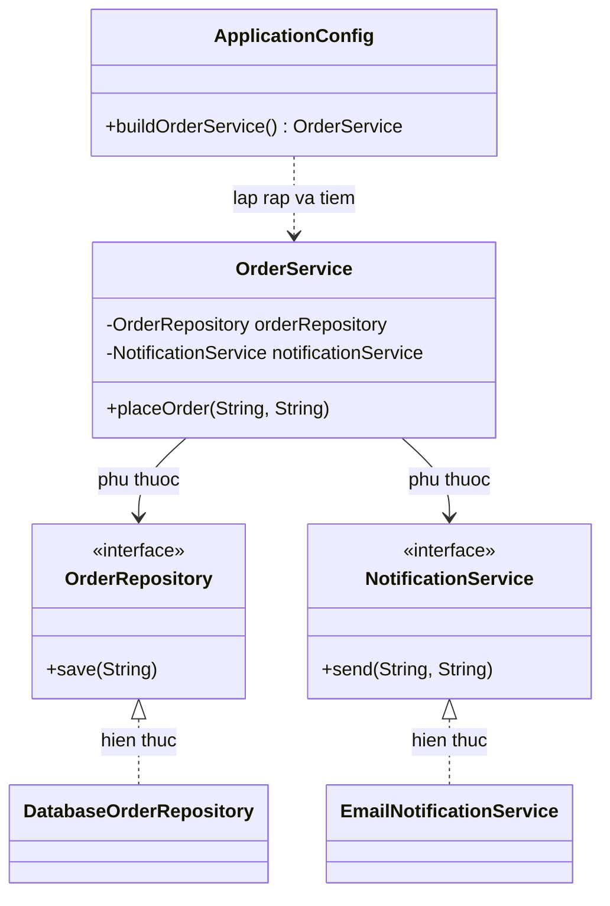

# Java Design Pattern - Dependency Injection

Dependency Injection (DI - tiêm phụ thuộc) là một mẫu thiết kế và nguyên tắc quan trọng, trong đó các phụ thuộc của một đối tượng được cung cấp từ bên ngoài thay vì để đối tượng tự tạo ra. Cách này giúp giảm sự phụ thuộc cứng giữa các lớp, làm code dễ thay thế và dễ kiểm thử hơn nhiều. Đây là nền tảng của hầu hết các ứng dụng Java hiện đại như Spring Boot. Bài này giới thiệu khái niệm tổng quan và các hình thức DI; phần chi tiết với ví dụ Java nằm bên dưới.

## Mục đích

**Dependency Injection** (DI — tiêm phụ thuộc) là một **Creational Design Pattern** (và cũng là nguyên tắc thiết kế) trong đó các phụ thuộc của một đối tượng được **cung cấp từ bên ngoài** thay vì đối tượng tự tạo ra. Đây là hiện thực hóa của nguyên tắc **Inversion of Control** (IoC — đảo ngược sự kiểm soát).

## Vấn đề giải quyết

Khi class A phụ thuộc vào class B, nếu A tự tạo B (`new B()`):
- **Tight coupling**: A phụ thuộc cứng vào B, khó thay thế.
- Khó kiểm thử: không thể inject mock B vào A.
- Khó cấu hình: B được khởi tạo với tham số cố định bên trong A.

```java
// VẤN ĐỀ: tight coupling
public class OrderService {
    private final EmailService emailService = new EmailService(); // hardcode!
    // Không thể test OrderService mà không gửi email thật
}
```

Sơ đồ lớp dưới đây minh họa cấu trúc Dependency Injection — `OrderService` chỉ phụ thuộc vào các interface, còn `ApplicationConfig` (nơi lắp ráp) tạo implementation cụ thể và tiêm vào:



Nhờ chỉ phụ thuộc vào interface, ta có thể thay implementation thật bằng mock khi kiểm thử mà không sửa `OrderService`.

## Các hình thức DI

### 1. Constructor Injection (Khuyến nghị)

```java
// Dependency — service gửi thông báo
public interface NotificationService {
    void send(String recipient, String message);
}

// Concrete implementation — gửi email thật
public class EmailNotificationService implements NotificationService {
    @Override
    public void send(String recipient, String message) {
        System.out.printf("Gửi email đến %s: %s%n", recipient, message);
    }
}

// Concrete implementation — gửi SMS thật
public class SmsNotificationService implements NotificationService {
    @Override
    public void send(String recipient, String message) {
        System.out.printf("Gửi SMS đến %s: %s%n", recipient, message);
    }
}

// Dependency — repository dữ liệu
public interface OrderRepository {
    void save(String orderId);
    boolean exists(String orderId);
}

public class DatabaseOrderRepository implements OrderRepository {
    @Override
    public void save(String orderId) {
        System.out.println("Lưu đơn hàng vào DB: " + orderId);
    }

    @Override
    public boolean exists(String orderId) {
        return false; // Giả lập
    }
}

// OrderService nhận dependencies qua constructor — KHÔNG tự tạo
public class OrderService {
    private final OrderRepository orderRepository;
    private final NotificationService notificationService;

    // Constructor Injection — phụ thuộc rõ ràng, dễ kiểm thử
    public OrderService(OrderRepository orderRepository,
                        NotificationService notificationService) {
        this.orderRepository     = orderRepository;
        this.notificationService = notificationService;
    }

    public void placeOrder(String orderId, String customerEmail) {
        if (orderRepository.exists(orderId)) {
            throw new IllegalStateException("Đơn hàng đã tồn tại: " + orderId);
        }
        orderRepository.save(orderId);
        notificationService.send(customerEmail, "Đơn hàng #" + orderId + " đã được tạo thành công!");
        System.out.println("Xử lý đơn hàng hoàn tất: " + orderId);
    }
}
```

### 2. Setter Injection

```java
public class ReportGenerator {
    private NotificationService notificationService; // Tùy chọn

    // Setter injection — dùng khi dependency là tùy chọn
    public void setNotificationService(NotificationService service) {
        this.notificationService = service;
    }

    public void generateReport(String reportName) {
        System.out.println("Tạo báo cáo: " + reportName);
        if (notificationService != null) {
            notificationService.send("admin@company.com", "Báo cáo '" + reportName + "' đã sẵn sàng");
        }
    }
}
```

### 3. Field Injection (dùng trong framework Spring/Quarkus)

```java
// Chỉ dùng với DI framework — KHÔNG dùng thủ công
public class UserController {
    @Autowired // Spring annotation
    private UserService userService;

    public void handleRequest(String userId) {
        userService.getUser(userId);
    }
}
```

### Thủ công lắp ráp phụ thuộc (Manual Wiring)

```java
public class ApplicationConfig {
    public static OrderService buildOrderService() {
        // Tạo và lắp ráp tất cả dependencies
        OrderRepository repository           = new DatabaseOrderRepository();
        NotificationService notificationSvc  = new EmailNotificationService();
        return new OrderService(repository, notificationSvc);
    }
}

public class Main {
    public static void main(String[] args) {
        // Chỉ một chỗ biết về các lớp cụ thể
        OrderService orderService = ApplicationConfig.buildOrderService();
        orderService.placeOrder("ORD-2024-001", "customer@example.com");
    }
}
```

### Kiểm thử với Mock — lợi ích của DI

```java
// Mock implementation dùng trong test
public class MockNotificationService implements NotificationService {
    private final List`<String>` sentMessages = new ArrayList<>();

    @Override
    public void send(String recipient, String message) {
        sentMessages.add(recipient + ":" + message);
    }

    public List`<String>` getSentMessages() { return sentMessages; }
}

// Unit Test — không cần database, không cần email thật
public class OrderServiceTest {
    @Test
    public void testPlaceOrder_sendsConfirmationEmail() {
        MockNotificationService mockNotification = new MockNotificationService();
        OrderRepository mockRepo = new InMemoryOrderRepository();

        OrderService service = new OrderService(mockRepo, mockNotification);
        service.placeOrder("ORD-001", "test@example.com");

        assert mockNotification.getSentMessages().size() == 1;
        assert mockNotification.getSentMessages().get(0).contains("ORD-001");
    }
}
```

## Ưu điểm

- **Loose coupling** (liên kết lỏng) — dễ thay thế implementation.
- **Testability** (khả năng kiểm thử) cao — inject mock/stub dễ dàng.
- Tuân thủ **Dependency Inversion Principle** (nguyên tắc đảo ngược phụ thuộc).
- Code rõ ràng về những gì một class cần để hoạt động.

## Nhược điểm

- **Boilerplate** (code lặp lại) khi wiring thủ công nhiều dependencies.
- Cần DI framework (Spring, Guice) để quản lý hiệu quả trong dự án lớn.
- Constructor dài khi class có nhiều dependencies (dấu hiệu cần tái cấu trúc).

## Khi nào nên dùng

- Hầu hết mọi ứng dụng Java hiện đại (nguyên tắc mặc định nên áp dụng).
- Bất cứ khi nào cần kiểm thử đơn vị (unit test) độc lập.
- Khi cần hoán đổi implementation (ví dụ: EmailService vs SmsService).
- Dự án dùng Spring Boot, Jakarta EE, Quarkus — DI là nền tảng cốt lõi.
