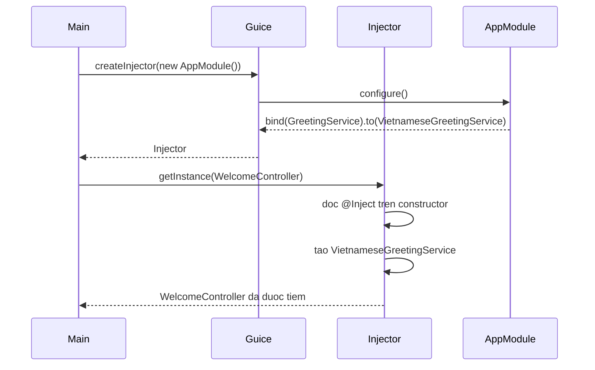

# Giới thiệu Google Guice - Dependency Injection Framework

Google Guice là một framework tiêm phụ thuộc (Dependency Injection) nhẹ, mã nguồn mở do Google phát triển. Nó tự động hóa việc tạo và lắp ráp các đối tượng phụ thuộc thông qua annotation và module, giúp bạn không phải viết tay phần wiring lặp đi lặp lại. Bài này giới thiệu khái niệm tổng quan và cách dùng cơ bản của Guice; phần chi tiết với ví dụ Java nằm bên dưới.

## Google Guice là gì?

**Google Guice** (đọc là "juice") là một **lightweight DI framework** (framework tiêm phụ thuộc nhẹ) mã nguồn mở do Google phát triển. Guice tự động hóa việc quản lý và tiêm phụ thuộc (**Dependency Injection**) trong Java, thay thế cho việc wiring thủ công bằng cách sử dụng **annotation** (chú thích) và **module** (mô-đun).

Guice ra đời năm 2007, là một trong những DI framework phổ biến nhất trong hệ sinh thái Java, đặc biệt được dùng rộng rãi trong các dự án nội bộ của Google.

## So sánh: Thủ công vs Guice

### Wiring thủ công (không có framework)

```java
// Phải tự tạo và lắp ráp tất cả — lặp đi lặp lại và dễ sai
public class App {
    public static void main(String[] args) {
        UserRepository repo    = new DatabaseUserRepository();
        EmailService   email   = new SmtpEmailService("smtp.gmail.com", 587);
        CacheService   cache   = new RedisCacheService("localhost", 6379);
        UserService    service = new UserService(repo, email, cache);
        UserController ctrl    = new UserController(service);

        ctrl.handleRequest("user-001");
    }
}
```

### Với Google Guice — gọn và tự động

```java
// Chỉ cần khai báo binding, Guice lo phần còn lại
public class Main {
    public static void main(String[] args) {
        Injector injector = Guice.createInjector(new AppModule());
        UserController controller = injector.getInstance(UserController.class);
        controller.handleRequest("user-001");
    }
}
```

## Thêm dependency vào dự án

### Maven

```xml
`<dependency>`
    `<groupId>`com.google.inject`</groupId>`
    `<artifactId>`guice`</artifactId>`
    `<version>`7.0.0`</version>`
`</dependency>`
```

### Gradle

```groovy
implementation 'com.google.inject:guice:7.0.0'
```

## Các khái niệm cốt lõi

| Khái niệm | Giải thích |
|---|---|
| `@Inject` | Đánh dấu constructor/field/setter cần được tiêm |
| `Module` | Lớp cấu hình, định nghĩa binding (ánh xạ) |
| `Injector` | Container quản lý vòng đời và tạo object |
| `Binding` | Quy tắc ánh xạ interface sang implementation |
| `Scope` | Kiểm soát vòng đời object (singleton, prototype, ...) |

## Ví dụ cơ bản đầy đủ

```java
import com.google.inject.*;

// Interface dịch vụ thông báo
public interface GreetingService {
    String greet(String name);
}

// Implementation cụ thể
public class VietnameseGreetingService implements GreetingService {
    @Override
    public String greet(String name) {
        return "Xin chào, " + name + "! Chào mừng bạn đến với hệ thống.";
    }
}

// Class cần được tiêm GreetingService
public class WelcomeController {
    private final GreetingService greetingService;

    @Inject // Guice sẽ tự động tiêm GreetingService
    public WelcomeController(GreetingService greetingService) {
        this.greetingService = greetingService;
    }

    public void welcome(String username) {
        String message = greetingService.greet(username);
        System.out.println(message);
    }
}

// Module — nơi khai báo "khi cần GreetingService, dùng VietnameseGreetingService"
public class AppModule extends AbstractModule {
    @Override
    protected void configure() {
        bind(GreetingService.class).to(VietnameseGreetingService.class);
    }
}

// Điểm khởi động
public class Main {
    public static void main(String[] args) {
        // Tạo Injector từ Module
        Injector injector = Guice.createInjector(new AppModule());

        // Guice tự tạo WelcomeController và tiêm GreetingService vào
        WelcomeController controller = injector.getInstance(WelcomeController.class);
        controller.welcome("Nguyễn Văn An");
        // Kết quả: Xin chào, Nguyễn Văn An! Chào mừng bạn đến với hệ thống.
    }
}
```

## Luồng hoạt động của Guice

```
Main.main()
  │
  ├─ Guice.createInjector(new AppModule())
  │     │
  │     └─ AppModule.configure():
  │           bind(GreetingService.class).to(VietnameseGreetingService.class)
  │
  └─ injector.getInstance(WelcomeController.class)
        │
        ├─ Guice thấy @Inject trên constructor WelcomeController
        ├─ Guice cần GreetingService → tra cứu binding → VietnameseGreetingService
        ├─ Guice tạo new VietnameseGreetingService()
        └─ Guice tạo new WelcomeController(greetingServiceInstance)
```

Sơ đồ tuần tự dưới đây minh họa cùng luồng đó theo góc nhìn tương tác giữa các thành phần — từ lúc tạo Injector đến khi Guice tự tiêm dependency vào constructor:



Guice tự phân tích đồ thị phụ thuộc và tạo sẵn các object cần thiết, nên phần code nghiệp vụ không phải viết tay việc lắp ráp.

## Ưu điểm so với wiring thủ công

- Tự động phát hiện và giải quyết dependency graph (đồ thị phụ thuộc).
- **Type-safe** (an toàn kiểu) — lỗi binding được phát hiện tại thời điểm khởi động, không phải runtime.
- Dễ thay đổi implementation — chỉ sửa binding trong Module.
- Ít **boilerplate** hơn Spring (không cần XML, ít annotation hơn).

## Nhược điểm

- **Magic** (phép màu) — khó debug khi dependency được tiêm tự động theo cách không rõ ràng.
- Lỗi chỉ xuất hiện tại runtime (khi `Injector` được tạo), không phải compile time.
- Ít tính năng hơn Spring (không có Web MVC, Data, Security tích hợp sẵn).

## Khi nào nên dùng Guice

- Ứng dụng backend thuần Java không cần full Spring ecosystem.
- Command-line tools, batch jobs cần DI nhẹ.
- Dự án đã có sẵn trong hệ sinh thái Google (ví dụ: Google App Engine).
- Muốn DI framework đơn giản, dễ học hơn Spring.
