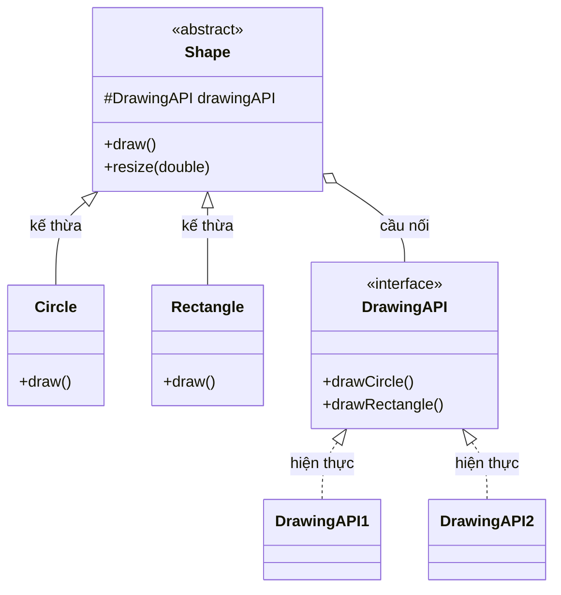

# Java Design Pattern - Bridge

Bridge (Cầu nối) là một mẫu thiết kế cấu trúc (structural) cho phép tách phần trừu tượng và phần triển khai của một hệ thống thành hai nhánh độc lập, để chúng có thể phát triển riêng rẽ. Nhờ đó bạn tránh được tình trạng số lượng lớp bùng nổ khi phải kết hợp nhiều chiều biến thể (ví dụ hình dạng và màu sắc). Bài này giới thiệu khái niệm tổng quan; phần chi tiết với ví dụ Java nằm bên dưới.

## Mục đích

Bridge (Cầu nối) là một **Structural Design Pattern** cho phép tách một class lớn hoặc một nhóm class liên quan thành hai hệ thống phân cấp (hierarchy) độc lập: **Abstraction** (phần trừu tượng) và **Implementation** (phần triển khai). Hai hệ thống này có thể phát triển độc lập với nhau.

## Vấn đề giải quyết

Giả sử bạn có class `Shape` với hai subclass là `Circle` và `Square`. Bạn muốn mở rộng để hỗ trợ màu sắc (Color) như `Red` và `Blue`. Kết quả là bạn cần tạo 4 tổ hợp: `RedCircle`, `BlueCircle`, `RedSquare`, `BlueSquare`.

Khi thêm một hình mới hoặc màu mới, số lượng class tăng theo cấp số nhân. Bridge Pattern giải quyết bằng cách chuyển từ kế thừa (inheritance) sang kết hợp (composition): tách `Color` thành một tầng riêng và kết nối qua một "cầu nối".

## Cấu trúc

- **Abstraction**: Class cấp cao, chứa tham chiếu đến Implementation.
- **RefinedAbstraction**: Mở rộng Abstraction, thêm hành vi cụ thể.
- **Implementor**: Interface định nghĩa các phép toán cơ bản cho Implementation.
- **ConcreteImplementor**: Các triển khai cụ thể của Implementor.

Sơ đồ dưới đây minh họa hai nhánh phân cấp độc lập của ví dụ Java bên dưới (`Shape` là Abstraction, `DrawingAPI` là Implementor):



Nhánh `Shape` (hình học) và nhánh `DrawingAPI` (cách vẽ) tách rời nhau; "cầu nối" là tham chiếu `drawingAPI` bên trong `Shape`, cho phép thêm hình mới hay API mới độc lập.

## Ví dụ Java

```java
// Implementor - tầng triển khai (vẽ hình theo từng nền tảng)
interface DrawingAPI {
    void drawCircle(double x, double y, double radius);
    void drawRectangle(double x1, double y1, double x2, double y2);
}

// ConcreteImplementor 1 - vẽ bằng API đồ họa thứ nhất
class DrawingAPI1 implements DrawingAPI {
    @Override
    public void drawCircle(double x, double y, double radius) {
        System.out.printf("API1 - Vẽ hình tròn tại (%.1f, %.1f) bán kính %.1f%n", x, y, radius);
    }

    @Override
    public void drawRectangle(double x1, double y1, double x2, double y2) {
        System.out.printf("API1 - Vẽ hình chữ nhật từ (%.1f, %.1f) đến (%.1f, %.1f)%n", x1, y1, x2, y2);
    }
}

// ConcreteImplementor 2 - vẽ bằng API đồ họa thứ hai
class DrawingAPI2 implements DrawingAPI {
    @Override
    public void drawCircle(double x, double y, double radius) {
        System.out.printf("API2 - Circle at (%.1f, %.1f) r=%.1f%n", x, y, radius);
    }

    @Override
    public void drawRectangle(double x1, double y1, double x2, double y2) {
        System.out.printf("API2 - Rect (%.1f, %.1f)-(%.1f, %.1f)%n", x1, y1, x2, y2);
    }
}

// Abstraction - tầng trừu tượng (hình học)
abstract class Shape {
    protected DrawingAPI drawingAPI; // "cầu nối" đến Implementation

    protected Shape(DrawingAPI drawingAPI) {
        this.drawingAPI = drawingAPI;
    }

    public abstract void draw();
    public abstract void resize(double factor);
}

// RefinedAbstraction - hình tròn
class Circle extends Shape {
    private double x, y, radius;

    public Circle(double x, double y, double radius, DrawingAPI drawingAPI) {
        super(drawingAPI);
        this.x = x;
        this.y = y;
        this.radius = radius;
    }

    @Override
    public void draw() {
        drawingAPI.drawCircle(x, y, radius);
    }

    @Override
    public void resize(double factor) {
        radius *= factor;
    }
}

// RefinedAbstraction - hình chữ nhật
class Rectangle extends Shape {
    private double x1, y1, x2, y2;

    public Rectangle(double x1, double y1, double x2, double y2, DrawingAPI drawingAPI) {
        super(drawingAPI);
        this.x1 = x1; this.y1 = y1;
        this.x2 = x2; this.y2 = y2;
    }

    @Override
    public void draw() {
        drawingAPI.drawRectangle(x1, y1, x2, y2);
    }

    @Override
    public void resize(double factor) {
        x2 *= factor; y2 *= factor;
    }
}

// Demo
public class BridgeDemo {
    public static void main(String[] args) {
        Shape circle1 = new Circle(1, 2, 3, new DrawingAPI1());
        Shape circle2 = new Circle(5, 7, 11, new DrawingAPI2());
        Shape rect = new Rectangle(0, 0, 10, 5, new DrawingAPI1());

        circle1.draw();
        circle2.draw();
        rect.draw();

        circle1.resize(2);
        circle1.draw(); // bán kính tăng gấp đôi, vẫn dùng API1
    }
}
```

## Ưu điểm

- **Open/Closed Principle**: Thêm hình mới hoặc API mới mà không ảnh hưởng lẫn nhau.
- Tránh sự bùng nổ class do kế thừa đa chiều.
- Client chỉ làm việc với Abstraction cấp cao, che giấu chi tiết Implementation.
- Có thể thay đổi Implementation tại runtime (lúc chạy chương trình).

## Nhược điểm

- Làm code phức tạp hơn vì phải tạo thêm các class và interface mới.
- Cần xác định rõ điểm tách (split point) giữa Abstraction và Implementation ngay từ đầu, nếu không dễ thiết kế sai.

## Khi nào nên dùng

- Khi muốn chia nhỏ một class lớn có nhiều chiều biến thể (variant).
- Khi cần chuyển đổi Implementation lúc runtime.
- Khi cần mở rộng class theo nhiều chiều độc lập nhau.
- Thường gặp trong các framework GUI (giao diện đồ họa) cần hỗ trợ nhiều nền tảng khác nhau.
