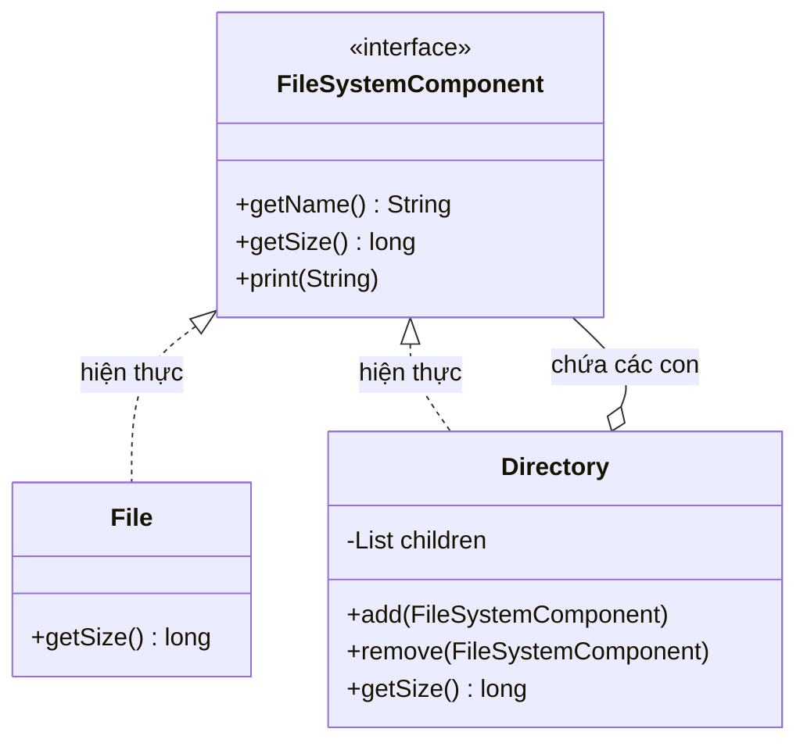

# Java Design Pattern - Composite

Composite là một mẫu thiết kế cấu trúc (structural) cho phép tổ chức các đối tượng thành cấu trúc dạng cây và làm việc với cả nhóm đối tượng lẫn từng đối tượng đơn lẻ theo cùng một cách. Mẫu này rất phù hợp với các cấu trúc phân cấp như hệ thống thư mục hay sơ đồ tổ chức. Bài này giới thiệu khái niệm tổng quan; phần chi tiết với ví dụ Java nằm bên dưới.

:::note[Ghi nhớ nhanh]

- ⭐ **`Composite`** — tổ chức đối tượng thành cấu trúc cây và cho client xử lý đối tượng đơn lẻ (`Leaf`) lẫn nhóm (`Composite`) đồng nhất qua cùng một interface.
- **4 thành phần** — `Component` (interface chung), `Leaf` (không có con), `Composite` (chứa các Component con, ủy thác và tổng hợp kết quả), `Client`.
- **Ví dụ** — `FileSystemComponent` với `File` (Leaf) và `Directory` (Composite); `getSize()` gọi giống nhau, `Directory` cộng dồn kích thước các con theo đệ quy.
- **Hợp cho** — cấu trúc "whole-part": cây DOM HTML, thư mục, menu nhiều cấp, cây biểu thức.

:::

## Mục đích

Composite là một **Structural Design Pattern** cho phép bạn tổ hợp các đối tượng thành cấu trúc dạng **cây (tree structure)** và làm việc với chúng như thể chúng là những đối tượng riêng lẻ. Pattern này xóa bỏ sự khác biệt giữa "đối tượng đơn lẻ" và "nhóm đối tượng" từ góc nhìn của client.

## Vấn đề giải quyết

Khi xây dựng ứng dụng có cấu trúc phân cấp như:
- Hệ thống tập tin: thư mục chứa file và thư mục con.
- Cấu trúc tổ chức: phòng ban chứa nhân viên và phòng ban con.
- Giao diện đồ họa: container chứa widget và container con.

Nếu không dùng Composite, client phải xử lý riêng lẻ với từng loại node (đối tượng), dẫn đến code phức tạp và khó bảo trì.

## Cấu trúc

- **Component**: Interface chung cho cả leaf (lá) và composite (nút nhánh).
- **Leaf**: Đối tượng đơn lẻ, không có con. Thực hiện công việc thực sự.
- **Composite**: Đối tượng chứa các Component con, ủy thác công việc cho con và tổng hợp kết quả.
- **Client**: Tương tác với tất cả thông qua Component interface.

Sơ đồ dưới đây thể hiện cấu trúc cây của ví dụ Java bên dưới (`FileSystemComponent` là Component, `File` là Leaf, `Directory` là Composite):



Điểm mấu chốt: `Directory` vừa **hiện thực** `FileSystemComponent` vừa **chứa** nhiều `FileSystemComponent`, nên cây có thể lồng nhau nhiều tầng và client gọi `getSize()` giống nhau cho cả file lẫn thư mục.

## Ví dụ Java

Mô phỏng hệ thống tập tin với file và thư mục:

```java
import java.util.ArrayList;
import java.util.List;

// Component - interface chung
interface FileSystemComponent {
    String getName();
    long getSize();
    void print(String indent);
}

// Leaf - file đơn lẻ
class File implements FileSystemComponent {
    private String name;
    private long size;

    public File(String name, long size) {
        this.name = name;
        this.size = size;
    }

    @Override
    public String getName() { return name; }

    @Override
    public long getSize() { return size; }

    @Override
    public void print(String indent) {
        System.out.println(indent + "📄 " + name + " (" + size + " KB)");
    }
}

// Composite - thư mục chứa các component khác
class Directory implements FileSystemComponent {
    private String name;
    private List<FileSystemComponent> children = new ArrayList<>();

    public Directory(String name) {
        this.name = name;
    }

    public void add(FileSystemComponent component) {
        children.add(component);
    }

    public void remove(FileSystemComponent component) {
        children.remove(component);
    }

    @Override
    public String getName() { return name; }

    @Override
    public long getSize() {
        // Tổng hợp kích thước từ tất cả con
        return children.stream()
                .mapToLong(FileSystemComponent::getSize)
                .sum();
    }

    @Override
    public void print(String indent) {
        System.out.println(indent + "📁 " + name + "/ (" + getSize() + " KB)");
        for (FileSystemComponent child : children) {
            child.print(indent + "  "); // in đệ quy với thụt lề
        }
    }
}

// Demo
public class CompositeDemo {
    public static void main(String[] args) {
        // Tạo cây thư mục
        Directory root = new Directory("root");

        Directory docs = new Directory("docs");
        docs.add(new File("readme.txt", 5));
        docs.add(new File("guide.pdf", 120));

        Directory src = new Directory("src");
        src.add(new File("Main.java", 15));
        src.add(new File("Utils.java", 8));

        Directory test = new Directory("test");
        test.add(new File("MainTest.java", 10));
        src.add(test); // thư mục lồng nhau

        root.add(docs);
        root.add(src);
        root.add(new File("build.gradle", 3));

        // Client dùng cùng một lệnh cho cả file lẫn thư mục
        root.print("");
        System.out.println("\nTổng dung lượng: " + root.getSize() + " KB");
    }
}
```

Kết quả in ra sẽ hiển thị cây thư mục với thụt lề rõ ràng, và `getSize()` hoạt động giống nhau dù gọi trên file hay thư mục.

## Ưu điểm

- **Open/Closed Principle**: Thêm loại component mới mà không sửa code client.
- Client xử lý cấu trúc phức tạp (cây) đơn giản như đối tượng đơn lẻ.
- Dễ dàng thêm mới các loại component.
- Hỗ trợ đệ quy (recursion) tự nhiên qua cây.

## Nhược điểm

- Khó ràng buộc kiểu dữ liệu: interface chung khiến không thể giới hạn loại component nào được thêm vào composite.
- Thiết kế có thể trở nên quá tổng quát, khó đọc khi cây có nhiều tầng.

## Khi nào nên dùng

- Khi cần biểu diễn cấu trúc phân cấp kiểu "whole-part" (tổng thể - bộ phận).
- Khi muốn client xử lý đồng nhất cả đối tượng đơn lẻ lẫn nhóm đối tượng.
- Phổ biến trong: cây DOM HTML, cấu trúc thư mục, menu nhiều cấp, cây biểu thức toán học.
