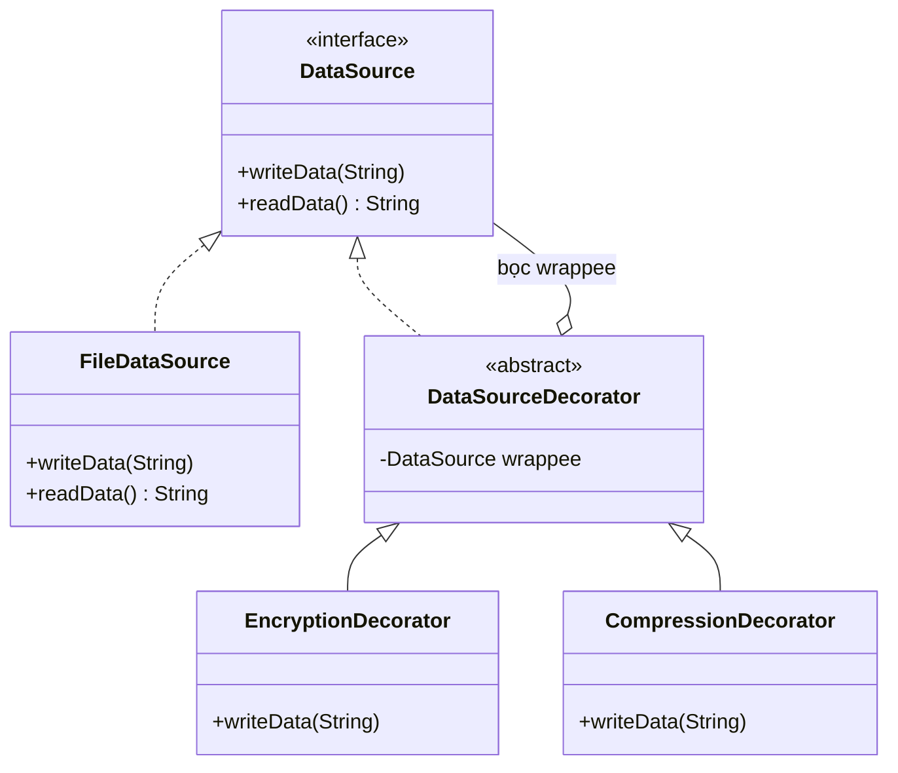

# Java Design Pattern - Decorator

Decorator là một mẫu thiết kế cấu trúc (structural) cho phép gắn thêm hành vi mới cho một đối tượng bằng cách "bọc" nó trong các lớp wrapper, thay vì dùng kế thừa. Cách này giúp bạn kết hợp nhiều tính năng một cách linh hoạt ngay tại lúc chạy mà không làm bùng nổ số lượng lớp con. Bài này giới thiệu khái niệm tổng quan; phần chi tiết với ví dụ Java nằm bên dưới.

:::note[Ghi nhớ nhanh]

- ⭐ **`Decorator` (Wrapper)** — gắn thêm hành vi bằng cách bọc đối tượng trong các wrapper, thay cho kế thừa; có thể xếp chồng linh hoạt tại runtime.
- **4 thành phần** — `Component`, `ConcreteComponent`, `BaseDecorator` (giữ tham chiếu `wrappee`), `ConcreteDecorator`.
- **Ví dụ** — `DataSourceDecorator` bọc `DataSource`; lồng `EncryptionDecorator` + `CompressionDecorator` quanh `FileDataSource`.
- **Lưu ý** — thứ tự bọc ảnh hưởng đến hành vi; sinh nhiều object nhỏ giống nhau nên khó debug.
- **Trong Java** — `BufferedInputStream` bọc `FileInputStream`, `Collections.unmodifiableList()`.

:::

## Mục đích

Decorator (hay còn gọi là Wrapper) là một **Structural Design Pattern** cho phép gắn thêm hành vi mới vào một đối tượng bằng cách đặt đối tượng đó vào trong các "wrapper" (lớp bao bọc) đặc biệt. Đây là một giải pháp thay thế linh hoạt cho kế thừa (inheritance) khi cần mở rộng tính năng.

## Vấn đề giải quyết

Tưởng tượng bạn có một hệ thống gửi thông báo. Ban đầu chỉ cần gửi email. Sau đó khách hàng yêu cầu thêm SMS, rồi Facebook, rồi Slack. Nếu dùng kế thừa, bạn sẽ cần tạo tổ hợp class: `EmailNotifier`, `SMSNotifier`, `EmailSMSNotifier`, `FacebookNotifier`, `EmailFacebookNotifier`... số lượng class tăng theo cấp số nhân.

Decorator giải quyết bằng cách "bọc" các tính năng lại, cho phép kết hợp linh hoạt tại runtime.

## Cấu trúc

- **Component**: Interface định nghĩa các phép toán có thể được trang trí thêm.
- **ConcreteComponent**: Class cơ bản, chứa hành vi gốc.
- **BaseDecorator**: Class trừu tượng implement Component, giữ tham chiếu đến Component được bọc.
- **ConcreteDecorator**: Thêm hành vi mới trước/sau khi gọi phương thức của Component bên trong.



Vì decorator vừa **implement** `DataSource` vừa **giữ** một `DataSource` bên trong, ta có thể lồng nhiều lớp (mã hoá rồi nén...) mà không cần tạo class tổ hợp.

## Ví dụ Java

Xây dựng hệ thống đọc dữ liệu với nhiều lớp xử lý (nén, mã hóa):

```java
// Component interface
interface DataSource {
    void writeData(String data);
    String readData();
}

// ConcreteComponent - đọc/ghi file thuần túy
class FileDataSource implements DataSource {
    private String filename;
    private String data;

    public FileDataSource(String filename) {
        this.filename = filename;
    }

    @Override
    public void writeData(String data) {
        this.data = data;
        System.out.println("Ghi vào file " + filename + ": " + data);
    }

    @Override
    public String readData() {
        System.out.println("Đọc từ file " + filename);
        return data;
    }
}

// BaseDecorator - lớp cơ sở cho tất cả decorator
abstract class DataSourceDecorator implements DataSource {
    protected DataSource wrappee; // component được bọc

    public DataSourceDecorator(DataSource source) {
        this.wrappee = source;
    }

    @Override
    public void writeData(String data) {
        wrappee.writeData(data);
    }

    @Override
    public String readData() {
        return wrappee.readData();
    }
}

// ConcreteDecorator 1 - thêm chức năng mã hóa (encryption)
class EncryptionDecorator extends DataSourceDecorator {
    public EncryptionDecorator(DataSource source) {
        super(source);
    }

    @Override
    public void writeData(String data) {
        String encrypted = encrypt(data);
        System.out.println("Mã hóa: " + data + " -> " + encrypted);
        super.writeData(encrypted);
    }

    @Override
    public String readData() {
        String data = super.readData();
        String decrypted = decrypt(data);
        System.out.println("Giải mã: " + data + " -> " + decrypted);
        return decrypted;
    }

    private String encrypt(String data) {
        // Đảo ngược chuỗi (minh họa đơn giản)
        return new StringBuilder(data).reverse().toString();
    }

    private String decrypt(String data) {
        return new StringBuilder(data).reverse().toString();
    }
}

// ConcreteDecorator 2 - thêm chức năng nén (compression)
class CompressionDecorator extends DataSourceDecorator {
    public CompressionDecorator(DataSource source) {
        super(source);
    }

    @Override
    public void writeData(String data) {
        String compressed = compress(data);
        System.out.println("Nén dữ liệu: " + data.length() + " -> " + compressed.length() + " chars");
        super.writeData(compressed);
    }

    @Override
    public String readData() {
        String data = super.readData();
        return decompress(data);
    }

    private String compress(String data) {
        // Minh họa đơn giản: loại bỏ khoảng trắng
        return data.replaceAll("\\s+", "_");
    }

    private String decompress(String data) {
        return data.replaceAll("_", " ");
    }
}

// Demo
public class DecoratorDemo {
    public static void main(String[] args) {
        String originalData = "Hello World Data";

        // Chỉ ghi file thuần túy
        DataSource plain = new FileDataSource("plain.dat");
        plain.writeData(originalData);

        System.out.println("---");

        // Bọc thêm mã hóa
        DataSource encrypted = new EncryptionDecorator(
                new FileDataSource("encrypted.dat"));
        encrypted.writeData(originalData);

        System.out.println("---");

        // Bọc cả nén lẫn mã hóa (kết hợp linh hoạt tại runtime)
        DataSource encryptedAndCompressed = new EncryptionDecorator(
                new CompressionDecorator(
                        new FileDataSource("secured.dat")));
        encryptedAndCompressed.writeData(originalData);
    }
}
```

## Ưu điểm

- **Single Responsibility Principle**: Mỗi decorator chỉ đảm nhận một trách nhiệm.
- **Open/Closed Principle**: Mở rộng hành vi mà không sửa class gốc.
- Kết hợp nhiều hành vi linh hoạt tại runtime bằng cách xếp chồng decorator.
- Tránh tạo quá nhiều subclass khi cần các tổ hợp tính năng khác nhau.

## Nhược điểm

- Kết quả là nhiều đối tượng nhỏ trông giống nhau, khó debug.
- Thứ tự bọc decorator ảnh hưởng đến hành vi, dễ gây nhầm lẫn.
- Khó xóa một decorator cụ thể khỏi giữa chuỗi bọc.

## Khi nào nên dùng

- Khi cần gán thêm hành vi cho đối tượng mà không muốn ảnh hưởng các đối tượng khác cùng class.
- Khi kế thừa là không khả thi (class bị đánh dấu `final`) hoặc tạo ra quá nhiều subclass.
- Ví dụ trong Java: `BufferedInputStream` bọc `FileInputStream`, `Collections.unmodifiableList()`, `HttpServletRequestWrapper`.
