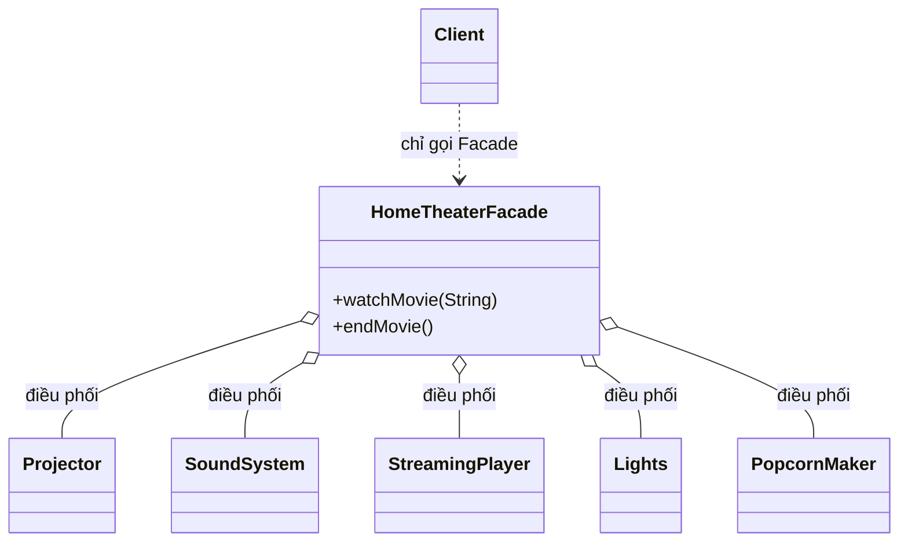

# Java Design Pattern - Facade

Facade là mẫu thiết kế cấu trúc giúp tạo ra một "cổng vào" đơn giản cho một hệ thống con phức tạp gồm nhiều class. Thay vì phải tự khởi tạo và phối hợp nhiều đối tượng, client chỉ cần gọi vài phương thức gọn gàng của Facade. Nhờ đó code dễ dùng, dễ bảo trì và bớt phụ thuộc vào chi tiết bên trong. Bài này giới thiệu tổng quan; phần chi tiết và ví dụ Java nằm bên dưới.

## Mục đích

Facade (mặt tiền) là một **Structural Design Pattern** cung cấp một interface đơn giản, gọn gàng cho một hệ thống con (subsystem) phức tạp. Pattern này không ẩn giấu subsystem mà chỉ tạo ra một "cổng vào" thuận tiện, giúp client không cần biết chi tiết bên trong.

## Vấn đề giải quyết

Khi làm việc với các hệ thống phức tạp (thư viện, framework, tập hợp nhiều class), client phải khởi tạo đúng thứ tự, truyền đúng tham số, và biết cách phối hợp nhiều class với nhau. Điều này dẫn đến:

- Code client phụ thuộc chặt vào chi tiết của subsystem.
- Khó bảo trì khi subsystem thay đổi.
- Khó onboard (đưa vào sử dụng) cho developer mới.

Facade tạo một class "mặt tiền" bọc toàn bộ sự phức tạp, chỉ lộ ra những phương thức cần thiết cho client.

## Cấu trúc

- **Facade**: Class cung cấp interface đơn giản, biết phải gọi đến subsystem nào và theo thứ tự nào.
- **Subsystem Classes**: Các class thực hiện công việc thực sự. Chúng không biết về Facade.
- **Client**: Chỉ giao tiếp với Facade, không biết chi tiết subsystem.

Sơ đồ dưới đây cho thấy Facade đứng giữa client và nhiều class subsystem trong ví dụ Java bên dưới (`HomeTheaterFacade` bọc toàn bộ hệ thống rạp phim tại nhà):



Client chỉ phụ thuộc vào một `HomeTheaterFacade`; toàn bộ việc bật/tắt và phối hợp năm thiết bị subsystem được giấu sau hai phương thức `watchMovie()` và `endMovie()`.

## Ví dụ Java

Mô phỏng hệ thống xem phim tại nhà (home theater):

```java
// Các class thuộc subsystem - hệ thống phức tạp
class Projector {
    public void on() { System.out.println("Máy chiếu: BẬT"); }
    public void off() { System.out.println("Máy chiếu: TẮT"); }
    public void setInput(String input) { System.out.println("Máy chiếu: Chọn nguồn " + input); }
}

class SoundSystem {
    public void on() { System.out.println("Hệ thống âm thanh: BẬT"); }
    public void off() { System.out.println("Hệ thống âm thanh: TẮT"); }
    public void setVolume(int volume) { System.out.println("Âm lượng: " + volume); }
    public void setSurroundMode() { System.out.println("Chế độ Surround Sound: BẬT"); }
}

class StreamingPlayer {
    public void on() { System.out.println("Trình phát: BẬT"); }
    public void off() { System.out.println("Trình phát: TẮT"); }
    public void play(String movie) { System.out.println("Đang phát: " + movie); }
    public void stop() { System.out.println("Dừng phát"); }
}

class Lights {
    public void dim(int level) { System.out.println("Đèn: Giảm xuống " + level + "%"); }
    public void brighten() { System.out.println("Đèn: Bật sáng"); }
}

class PopcornMaker {
    public void on() { System.out.println("Máy làm bắp rang: BẬT"); }
    public void pop() { System.out.println("Đang rang bắp..."); }
    public void off() { System.out.println("Máy làm bắp rang: TẮT"); }
}

// Facade - giao diện đơn giản cho toàn bộ hệ thống
class HomeTheaterFacade {
    private Projector projector;
    private SoundSystem sound;
    private StreamingPlayer player;
    private Lights lights;
    private PopcornMaker popcorn;

    public HomeTheaterFacade(Projector projector, SoundSystem sound,
                              StreamingPlayer player, Lights lights,
                              PopcornMaker popcorn) {
        this.projector = projector;
        this.sound = sound;
        this.player = player;
        this.lights = lights;
        this.popcorn = popcorn;
    }

    // Phương thức đơn giản bọc toàn bộ quy trình phức tạp
    public void watchMovie(String movie) {
        System.out.println("=== Chuẩn bị xem phim ===");
        popcorn.on();
        popcorn.pop();
        lights.dim(10);
        projector.on();
        projector.setInput("HDMI");
        sound.on();
        sound.setSurroundMode();
        sound.setVolume(8);
        player.on();
        player.play(movie);
        System.out.println("=== Thưởng thức phim! ===\n");
    }

    public void endMovie() {
        System.out.println("=== Tắt hệ thống ===");
        player.stop();
        player.off();
        sound.off();
        projector.off();
        lights.brighten();
        popcorn.off();
        System.out.println("=== Hẹn gặp lại! ===");
    }
}

// Client - chỉ cần biết Facade
public class FacadeDemo {
    public static void main(String[] args) {
        // Khởi tạo subsystem (thường do Facade hoặc DI container lo)
        HomeTheaterFacade theater = new HomeTheaterFacade(
                new Projector(),
                new SoundSystem(),
                new StreamingPlayer(),
                new Lights(),
                new PopcornMaker()
        );

        // Client chỉ cần 1 lệnh thay vì 10+ bước thủ công
        theater.watchMovie("Inception");
        theater.endMovie();
    }
}
```

## Ưu điểm

- Đơn giản hóa interface cho client, giảm phụ thuộc vào subsystem phức tạp.
- **Loose coupling** (giảm sự liên kết chặt) giữa client và subsystem.
- Dễ onboard developer mới: chỉ cần học Facade API.
- Có thể thay đổi subsystem mà không ảnh hưởng client (nếu Facade giữ nguyên interface).

## Nhược điểm

- Facade có thể trở thành "God Object" (đối tượng biết quá nhiều) nếu ôm đồm quá nhiều chức năng.
- Không hạn chế client truy cập trực tiếp vào subsystem khi cần tùy biến sâu.
- Có thể che giấu quá nhiều, khiến developer không hiểu được toàn bộ hệ thống khi cần debug sâu.

## Khi nào nên dùng

- Khi cần cung cấp interface đơn giản cho một subsystem phức tạp.
- Khi muốn chia code thành các layer (tầng), Facade định nghĩa điểm vào cho mỗi tầng.
- Khi cần giảm sự phụ thuộc giữa client và nhiều class của subsystem.
- Rất phổ biến trong ứng dụng enterprise: Service layer bọc Repository + Domain logic là một dạng Facade.
