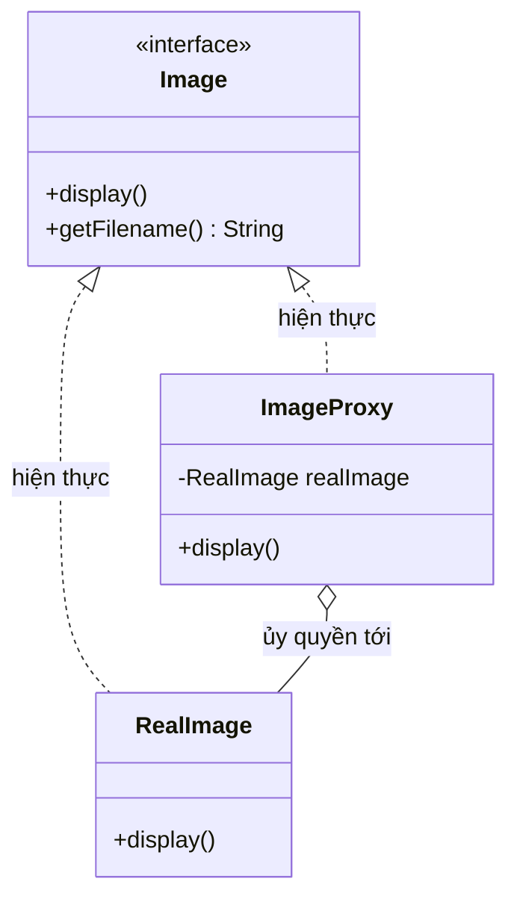
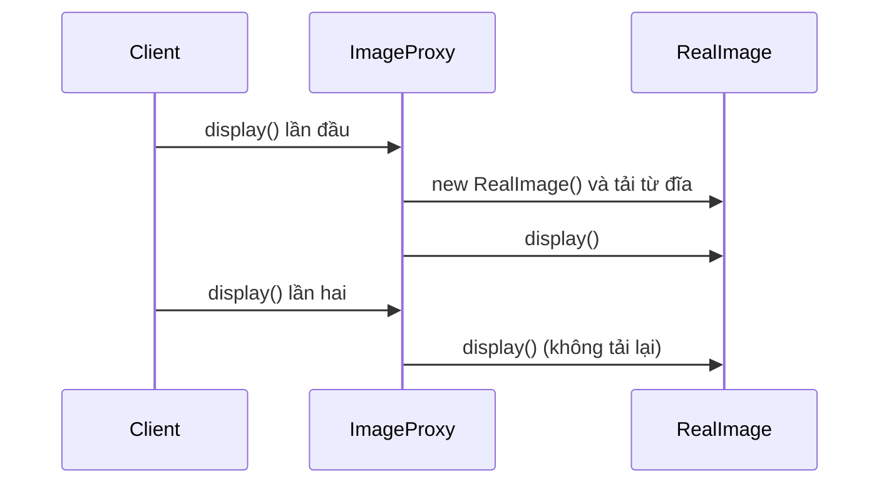

# Java Design Pattern - Proxy

Proxy là mẫu thiết kế cấu trúc dùng một đối tượng trung gian đứng thay cho đối tượng thật để kiểm soát việc truy cập tới nó. Proxy có thể làm thêm nhiều việc trước hoặc sau khi gọi đối tượng thật, ví dụ như tải dữ liệu chậm (lazy loading), kiểm tra quyền, cache hay ghi log. Đây là pattern xuất hiện rất nhiều trong Spring AOP và Hibernate. Bài này giới thiệu tổng quan; phần chi tiết và ví dụ Java nằm bên dưới.

:::note[Ghi nhớ nhanh]

- ⭐ **`Proxy`** — đối tượng trung gian cùng interface với đối tượng thật, kiểm soát truy cập và thêm logic trước/sau khi ủy quyền.
- **Các loại** — Virtual (lazy init), Protection (kiểm soát quyền), Caching, Logging, Remote proxy.
- **Ví dụ** — `ImageProxy` chỉ tạo `RealImage` khi `display()` gọi lần đầu; `DatabaseServiceProxy` chỉ cho role `ADMIN` gọi `execute()`.
- **Phân biệt với `Decorator`** — cùng cấu trúc, nhưng Proxy nhằm *kiểm soát truy cập*, Decorator nhằm *thêm hành vi*.
- **Trong Java** — `java.lang.reflect.Proxy`, Spring AOP, Hibernate lazy loading.

:::

## Mục đích

Proxy (đại diện/ủy quyền) là một **Structural Design Pattern** cung cấp một đối tượng trung gian thay thế cho đối tượng thực. Proxy kiểm soát việc truy cập đến đối tượng gốc, cho phép thực hiện các tác vụ bổ sung trước hoặc sau khi request (yêu cầu) được chuyển tiếp đến đối tượng thực.

## Vấn đề giải quyết

Đôi khi bạn cần kiểm soát truy cập đến một đối tượng vì nhiều lý do:
- **Lazy initialization**: Đối tượng rất nặng, chỉ nên khởi tạo khi thực sự cần.
- **Access control**: Chỉ cho phép client có quyền nhất định truy cập.
- **Caching**: Lưu kết quả để tránh tính toán/tải lại nhiều lần.
- **Logging**: Ghi log mọi request mà không sửa code gốc.
- **Remote proxy**: Đối tượng thực nằm trên server khác (RMI trong Java).

## Cấu trúc

- **ServiceInterface**: Interface chung mà cả RealService và Proxy đều implement.
- **RealService**: Class thực hiện logic nghiệp vụ chính.
- **Proxy**: Class cùng interface với RealService, giữ tham chiếu đến RealService, bổ sung logic trước/sau.
- **Client**: Làm việc với ServiceInterface, không biết đang dùng Proxy hay RealService.

Sơ đồ dưới đây thể hiện cấu trúc của Virtual Proxy trong ví dụ Java bên dưới (`Image` là ServiceInterface, `RealImage` là RealService, `ImageProxy` là Proxy):



Client cầm một `Image`, không phân biệt được là `ImageProxy` hay `RealImage`; proxy chỉ khởi tạo `RealImage` khi thật sự cần.

Luồng lazy loading khi `display()` được gọi hai lần diễn ra như sau:



Lần gọi đầu tiên mới tốn chi phí tải ảnh từ đĩa; các lần sau proxy dùng lại `RealImage` đã có nên rất nhanh.

## Ví dụ Java

### Virtual Proxy — Lazy Loading ảnh

```java
// ServiceInterface - interface chung
interface Image {
    void display();
    String getFilename();
}

// RealService - load ảnh thực sự (tốn tài nguyên)
class RealImage implements Image {
    private String filename;

    public RealImage(String filename) {
        this.filename = filename;
        loadFromDisk(); // Tốn thời gian!
    }

    private void loadFromDisk() {
        System.out.println("Đang tải ảnh từ đĩa: " + filename);
        // Mô phỏng tải ảnh nặng
        try { Thread.sleep(100); } catch (InterruptedException e) { Thread.currentThread().interrupt(); }
    }

    @Override
    public void display() {
        System.out.println("Hiển thị ảnh: " + filename);
    }

    @Override
    public String getFilename() { return filename; }
}

// Virtual Proxy - chỉ tải ảnh khi display() được gọi lần đầu
class ImageProxy implements Image {
    private String filename;
    private RealImage realImage; // null cho đến khi cần

    public ImageProxy(String filename) {
        this.filename = filename;
        System.out.println("Proxy tạo xong (chưa tải ảnh): " + filename);
    }

    @Override
    public void display() {
        if (realImage == null) {
            realImage = new RealImage(filename); // lazy init
        }
        realImage.display();
    }

    @Override
    public String getFilename() { return filename; }
}
```

### Protection Proxy — Kiểm soát quyền truy cập

```java
// ServiceInterface
interface DatabaseService {
    String query(String sql);
    void execute(String sql);
}

// RealService
class RealDatabaseService implements DatabaseService {
    @Override
    public String query(String sql) {
        return "Kết quả truy vấn: " + sql;
    }

    @Override
    public void execute(String sql) {
        System.out.println("Thực thi SQL: " + sql);
    }
}

// Protection Proxy - kiểm tra quyền trước khi cho phép
class DatabaseServiceProxy implements DatabaseService {
    private RealDatabaseService realService = new RealDatabaseService();
    private String userRole;

    public DatabaseServiceProxy(String userRole) {
        this.userRole = userRole;
    }

    @Override
    public String query(String sql) {
        // Tất cả role đều được đọc
        System.out.println("[LOG] User role=" + userRole + " query: " + sql);
        return realService.query(sql);
    }

    @Override
    public void execute(String sql) {
        // Chỉ ADMIN mới được ghi
        if (!userRole.equals("ADMIN")) {
            throw new SecurityException("Quyền bị từ chối: role " + userRole + " không thể thực thi SQL");
        }
        System.out.println("[LOG] Admin thực thi: " + sql);
        realService.execute(sql);
    }
}

// Demo
public class ProxyDemo {
    public static void main(String[] args) {
        System.out.println("=== Virtual Proxy (Lazy Loading) ===");
        Image[] gallery = {
            new ImageProxy("photo1.jpg"),
            new ImageProxy("photo2.jpg"),
            new ImageProxy("photo3.jpg")
        };
        // Chỉ hiển thị ảnh đầu tiên - chỉ ảnh đó mới thực sự tải
        System.out.println("\nChỉ hiển thị ảnh đầu tiên:");
        gallery[0].display();
        gallery[0].display(); // lần 2: không tải lại

        System.out.println("\n=== Protection Proxy (Access Control) ===");
        DatabaseService adminService = new DatabaseServiceProxy("ADMIN");
        DatabaseService userService = new DatabaseServiceProxy("USER");

        adminService.query("SELECT * FROM users");
        adminService.execute("DELETE FROM logs WHERE date < '2024-01-01'");

        userService.query("SELECT * FROM products");
        try {
            userService.execute("DROP TABLE users"); // Sẽ bị từ chối
        } catch (SecurityException e) {
            System.out.println("Lỗi bảo mật: " + e.getMessage());
        }
    }
}
```

## Ưu điểm

- **Open/Closed Principle**: Thêm proxy mới mà không sửa code client hay service.
- Kiểm soát vòng đời của service object (lazy init, cleanup).
- Hoạt động kể cả khi service chưa sẵn sàng (remote proxy, cache proxy).
- Dễ thêm cross-cutting concerns (logging, caching, security) mà không sửa business logic.

## Nhược điểm

- Thêm một lớp gián tiếp, có thể làm chậm response time nhẹ.
- Code phức tạp hơn.
- Có thể gây nhầm lẫn với Decorator Pattern (cùng cấu trúc nhưng khác mục đích).

## Khi nào nên dùng

- **Virtual Proxy**: Khởi tạo lazy cho đối tượng nặng (load file, kết nối database).
- **Protection Proxy**: Kiểm soát quyền truy cập theo role.
- **Caching Proxy**: Cache kết quả các phép tính hoặc query tốn kém.
- **Logging Proxy**: Ghi log request/response mà không sửa service.
- Trong Java: `java.lang.reflect.Proxy`, Spring AOP, Hibernate lazy loading đều dùng Proxy Pattern.
