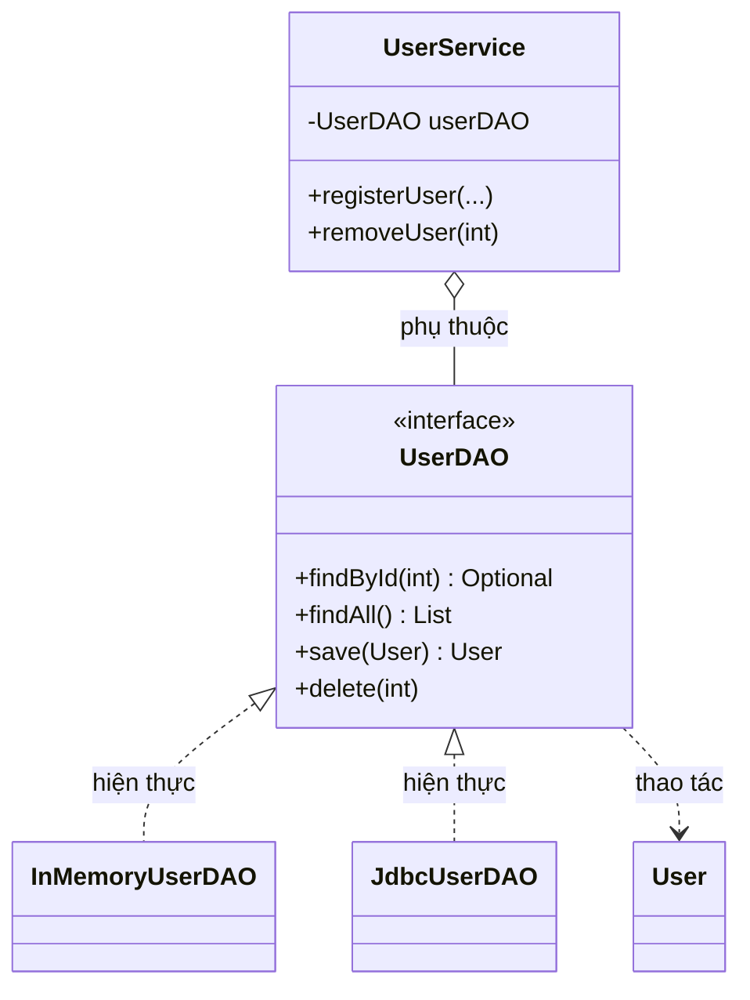

# Java Design Pattern - DAO (Data Access Object)

DAO là mẫu thiết kế giúp tách riêng phần code truy cập dữ liệu (truy vấn database, đọc file, gọi API) ra khỏi phần logic nghiệp vụ. Nhờ vậy khi đổi nguồn dữ liệu hay viết unit test, bạn không phải sửa khắp nơi. Đây là pattern nền tảng trong hầu hết ứng dụng Java enterprise, và chính `JpaRepository` của Spring cũng là một dạng DAO. Bài này giới thiệu tổng quan; phần chi tiết và ví dụ Java nằm bên dưới.

:::note[Ghi nhớ nhanh]

- ⭐ **`DAO` (Data Access Object)** — tách hoàn toàn logic truy cập dữ liệu khỏi business logic; mọi thao tác với nguồn dữ liệu đều đi qua lớp DAO.
- **Thành phần** — `Model` (POJO), `DAO Interface` (CRUD), `Concrete DAO` (JDBC/JPA/In-Memory), Service Layer, `DAOFactory` (tùy chọn).
- **Ví dụ** — `UserService` chỉ biết interface `UserDAO`; tráo `InMemoryUserDAO` (test) sang `JdbcUserDAO` (production) mà không sửa business logic.
- **Ưu điểm** — dễ đổi nguồn dữ liệu, dễ viết unit test, tập trung transaction/cache/logging tại một chỗ.
- ⭐ **Trong Spring** — `JpaRepository` (Spring Data JPA) chính là một dạng DAO được framework tự động implement.

:::

## Mục đích

DAO — viết tắt của **Data Access Object** (Đối tượng truy cập dữ liệu) — là một **Structural Design Pattern** tách biệt hoàn toàn logic truy cập dữ liệu (database queries, file I/O, API calls) ra khỏi business logic (logic nghiệp vụ). Mọi thao tác với nguồn dữ liệu đều thực hiện qua lớp DAO.

## Vấn đề giải quyết

Khi không dùng DAO, business logic và database code trộn lẫn nhau:

- Thay đổi database (từ MySQL sang PostgreSQL) buộc phải sửa khắp nơi trong code.
- Khó viết unit test vì business logic phụ thuộc trực tiếp vào database.
- Code bị lặp lại: nhiều nơi cùng viết SQL giống nhau.
- Không có điểm tập trung để thêm caching, logging, transaction management.

DAO tạo ra một lớp trừu tượng giữa business logic và nguồn dữ liệu.

## Cấu trúc

- **Model (Entity)**: Class đại diện cho dữ liệu (POJO — Plain Old Java Object).
- **DAO Interface**: Định nghĩa các phép toán CRUD (Create, Read, Update, Delete) và các query đặc thù.
- **Concrete DAO**: Triển khai cụ thể cho từng loại nguồn dữ liệu (JDBC, JPA, In-Memory...).
- **Service/Business Layer**: Sử dụng DAO Interface, không biết về implementation cụ thể.
- **DAOFactory** (tùy chọn): Tạo và trả về DAO implementation phù hợp.

Sơ đồ dưới đây minh họa cách Service Layer phụ thuộc vào DAO interface thay vì implementation cụ thể trong ví dụ Java bên dưới:



Vì `UserService` chỉ biết `UserDAO` interface, ta có thể tráo `InMemoryUserDAO` (cho test) sang `JdbcUserDAO` (cho production) mà không sửa business logic.

## Ví dụ Java

```java
import java.util.ArrayList;
import java.util.HashMap;
import java.util.List;
import java.util.Map;
import java.util.Optional;

// Model (Entity) - POJO đại diện cho dữ liệu
class User {
    private int id;
    private String name;
    private String email;
    private String role;

    public User(int id, String name, String email, String role) {
        this.id = id;
        this.name = name;
        this.email = email;
        this.role = role;
    }

    // Getters
    public int getId() { return id; }
    public String getName() { return name; }
    public String getEmail() { return email; }
    public String getRole() { return role; }

    @Override
    public String toString() {
        return String.format("User{id=%d, name='%s', email='%s', role='%s'}", id, name, email, role);
    }
}

// DAO Interface - định nghĩa contract (hợp đồng) truy cập dữ liệu
interface UserDAO {
    Optional<User> findById(int id);
    List<User> findAll();
    List<User> findByRole(String role);
    Optional<User> findByEmail(String email);
    User save(User user);      // tạo mới hoặc cập nhật
    void delete(int id);
    boolean exists(int id);
}

// Concrete DAO 1 - triển khai In-Memory (dùng cho testing)
class InMemoryUserDAO implements UserDAO {
    private Map<Integer, User> storage = new HashMap<>();
    private int nextId = 1;

    @Override
    public Optional<User> findById(int id) {
        return Optional.ofNullable(storage.get(id));
    }

    @Override
    public List<User> findAll() {
        return new ArrayList<>(storage.values());
    }

    @Override
    public List<User> findByRole(String role) {
        List<User> result = new ArrayList<>();
        for (User user : storage.values()) {
            if (user.getRole().equals(role)) {
                result.add(user);
            }
        }
        return result;
    }

    @Override
    public Optional<User> findByEmail(String email) {
        return storage.values().stream()
                .filter(u -> u.getEmail().equals(email))
                .findFirst();
    }

    @Override
    public User save(User user) {
        if (user.getId() == 0) {
            // Tạo mới
            User newUser = new User(nextId++, user.getName(), user.getEmail(), user.getRole());
            storage.put(newUser.getId(), newUser);
            System.out.println("[InMemory] Tạo user mới: " + newUser);
            return newUser;
        } else {
            // Cập nhật
            storage.put(user.getId(), user);
            System.out.println("[InMemory] Cập nhật user: " + user);
            return user;
        }
    }

    @Override
    public void delete(int id) {
        if (storage.remove(id) != null) {
            System.out.println("[InMemory] Đã xóa user id=" + id);
        }
    }

    @Override
    public boolean exists(int id) {
        return storage.containsKey(id);
    }
}

// Concrete DAO 2 - triển khai JDBC (giả lập, thực tế dùng Connection thật)
class JdbcUserDAO implements UserDAO {
    // Trong thực tế: private DataSource dataSource;

    @Override
    public Optional<User> findById(int id) {
        System.out.println("[JDBC] SELECT * FROM users WHERE id = " + id);
        // Thực tế: dùng PreparedStatement + ResultSet
        return Optional.empty(); // giả lập
    }

    @Override
    public List<User> findAll() {
        System.out.println("[JDBC] SELECT * FROM users");
        return new ArrayList<>(); // giả lập
    }

    @Override
    public List<User> findByRole(String role) {
        System.out.println("[JDBC] SELECT * FROM users WHERE role = '" + role + "'");
        return new ArrayList<>(); // giả lập
    }

    @Override
    public Optional<User> findByEmail(String email) {
        System.out.println("[JDBC] SELECT * FROM users WHERE email = '" + email + "'");
        return Optional.empty();
    }

    @Override
    public User save(User user) {
        if (user.getId() == 0) {
            System.out.println("[JDBC] INSERT INTO users (name, email, role) VALUES (...)");
        } else {
            System.out.println("[JDBC] UPDATE users SET ... WHERE id = " + user.getId());
        }
        return user;
    }

    @Override
    public void delete(int id) {
        System.out.println("[JDBC] DELETE FROM users WHERE id = " + id);
    }

    @Override
    public boolean exists(int id) {
        System.out.println("[JDBC] SELECT COUNT(*) FROM users WHERE id = " + id);
        return false;
    }
}

// Service Layer - chỉ biết UserDAO interface, không biết implementation
class UserService {
    private UserDAO userDAO; // dependency injection (tiêm phụ thuộc)

    public UserService(UserDAO userDAO) {
        this.userDAO = userDAO;
    }

    public User registerUser(String name, String email) {
        // Kiểm tra email đã tồn tại chưa
        if (userDAO.findByEmail(email).isPresent()) {
            throw new IllegalArgumentException("Email đã được sử dụng: " + email);
        }
        User newUser = new User(0, name, email, "USER");
        return userDAO.save(newUser);
    }

    public List<User> getAdmins() {
        return userDAO.findByRole("ADMIN");
    }

    public void removeUser(int id) {
        if (!userDAO.exists(id)) {
            throw new IllegalArgumentException("Không tìm thấy user id=" + id);
        }
        userDAO.delete(id);
    }
}

// Demo
public class DAODemo {
    public static void main(String[] args) {
        System.out.println("=== Dùng InMemory DAO (cho testing) ===");
        UserDAO inMemoryDAO = new InMemoryUserDAO();
        UserService service = new UserService(inMemoryDAO);

        User alice = service.registerUser("Alice", "alice@example.com");
        User bob = service.registerUser("Bob", "bob@example.com");

        // Thêm admin trực tiếp qua DAO
        inMemoryDAO.save(new User(0, "Admin", "admin@example.com", "ADMIN"));

        System.out.println("\nTất cả users:");
        inMemoryDAO.findAll().forEach(System.out::println);

        System.out.println("\nDanh sách Admin:");
        service.getAdmins().forEach(System.out::println);

        service.removeUser(alice.getId());
        System.out.println("\nSau khi xóa Alice:");
        inMemoryDAO.findAll().forEach(System.out::println);

        System.out.println("\n=== Chuyển sang JDBC DAO (không sửa service) ===");
        UserDAO jdbcDAO = new JdbcUserDAO();
        UserService jdbcService = new UserService(jdbcDAO);
        jdbcService.getAdmins(); // gọi đúng JDBC query
    }
}
```

## Ưu điểm

- **Separation of Concerns**: Business logic hoàn toàn tách khỏi data access logic.
- Dễ thay đổi nguồn dữ liệu (MySQL → MongoDB) mà không sửa business layer.
- Dễ viết unit test với In-Memory implementation hoặc mock.
- Tập trung quản lý transaction, connection pooling, caching tại một chỗ.
- Tái sử dụng query logic ở nhiều nơi.

## Nhược điểm

- Tăng số lượng class và interface trong dự án.
- Với dự án nhỏ, DAO có thể là over-engineering (phức tạp không cần thiết).
- Cần thiết kế DAO interface cẩn thận từ đầu để tránh phải sửa sau.

## Khi nào nên dùng

- Hầu hết các ứng dụng Java enterprise cần DAO để dễ bảo trì và test.
- Khi ứng dụng có thể cần thay đổi nguồn dữ liệu trong tương lai.
- Khi cần viết unit test cho business logic mà không kết nối database thật.
- Trong Spring Framework, các interface như `JpaRepository` (Spring Data JPA) chính là một dạng DAO được framework tự động implement.
