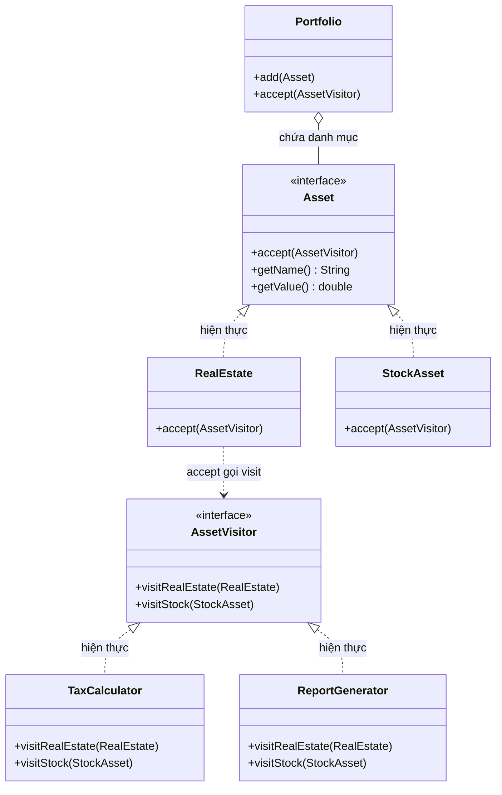

# Java Design Pattern - Visitor

Visitor là mẫu thiết kế hành vi giúp tách phần logic xử lý ra khỏi cấu trúc đối tượng. Nhờ vậy bạn có thể thêm thao tác mới (như tính thuế, xuất báo cáo) cho các lớp có sẵn mà không phải sửa chính các lớp đó. Pattern này phù hợp khi cấu trúc dữ liệu ít thay đổi nhưng hay phải thêm chức năng mới. Bài này giới thiệu tổng quan; phần chi tiết và ví dụ Java nằm bên dưới.

## Mục đích

**Visitor** (Khách thăm) là một mẫu thiết kế hành vi cho phép bạn tách biệt thuật toán ra khỏi cấu trúc đối tượng mà nó hoạt động trên đó. Bằng cách di chuyển logic xử lý vào một lớp Visitor riêng biệt, bạn có thể thêm hành vi mới cho các lớp hiện có mà không sửa đổi chúng.

## Vấn đề giải quyết

Khi bạn có một cấu trúc đối tượng ổn định (ít thay đổi) nhưng thường xuyên cần thêm các thao tác mới trên cấu trúc đó. Nếu thêm phương thức trực tiếp vào từng lớp, code sẽ bị phình to và vi phạm Single Responsibility. Ví dụ: tính thuế, xuất báo cáo, serialize — mỗi thao tác là một Visitor khác nhau.

## Cấu trúc

- **Visitor** (interface): khai báo phương thức `visit()` cho mỗi loại ConcreteElement.
- **ConcreteVisitor**: triển khai logic xử lý cụ thể cho từng loại Element.
- **Element** (interface): khai báo phương thức `accept(Visitor)`.
- **ConcreteElement**: gọi `visitor.visit(this)` trong `accept()`.
- **ObjectStructure**: tập hợp các Element, cho phép Visitor duyệt qua.

Sơ đồ lớp dưới đây tách hai hệ phân cấp: các Element (`Asset`) và các Visitor (`AssetVisitor`), nối với nhau qua phương thức `accept()`:



Muốn thêm thao tác mới (ví dụ định giá lại), chỉ cần viết thêm một ConcreteVisitor mà không phải sửa các lớp `Asset` sẵn có.

## Ví dụ Java: Tính thuế và xuất báo cáo cho các loại tài sản

```java
import java.util.ArrayList;
import java.util.List;

// Element interface
interface Asset {
    void accept(AssetVisitor visitor);
    String getName();
    double getValue();
}

// ConcreteElement: Bất động sản
class RealEstate implements Asset {
    private String name;
    private double value;

    public RealEstate(String name, double value) {
        this.name = name;
        this.value = value;
    }

    @Override
    public void accept(AssetVisitor visitor) {
        visitor.visitRealEstate(this);
    }

    @Override public String getName()  { return name; }
    @Override public double getValue() { return value; }
}

// ConcreteElement: Cổ phiếu
class StockAsset implements Asset {
    private String name;
    private double value;

    public StockAsset(String name, double value) {
        this.name = name;
        this.value = value;
    }

    @Override
    public void accept(AssetVisitor visitor) {
        visitor.visitStock(this);
    }

    @Override public String getName()  { return name; }
    @Override public double getValue() { return value; }
}

// Visitor interface
interface AssetVisitor {
    void visitRealEstate(RealEstate realEstate);
    void visitStock(StockAsset stock);
}

// ConcreteVisitor 1: Tính thuế
class TaxCalculator implements AssetVisitor {
    private double totalTax = 0;

    @Override
    public void visitRealEstate(RealEstate realEstate) {
        double tax = realEstate.getValue() * 0.02; // Thuế BĐS: 2%
        totalTax += tax;
        System.out.printf("  Thuế BĐS [%s]: %.0f VND%n", realEstate.getName(), tax);
    }

    @Override
    public void visitStock(StockAsset stock) {
        double tax = stock.getValue() * 0.001; // Thuế CK: 0.1%
        totalTax += tax;
        System.out.printf("  Thuế CK [%s]: %.0f VND%n", stock.getName(), tax);
    }

    public double getTotalTax() { return totalTax; }
}

// ConcreteVisitor 2: Xuất báo cáo tổng hợp
class ReportGenerator implements AssetVisitor {
    private StringBuilder report = new StringBuilder();

    @Override
    public void visitRealEstate(RealEstate realEstate) {
        report.append(String.format("  [BĐS] %s: %.0f VND%n",
                realEstate.getName(), realEstate.getValue()));
    }

    @Override
    public void visitStock(StockAsset stock) {
        report.append(String.format("  [CK]  %s: %.0f VND%n",
                stock.getName(), stock.getValue()));
    }

    public String getReport() { return report.toString(); }
}

// ObjectStructure: Danh mục tài sản
class Portfolio {
    private List<Asset> assets = new ArrayList<>();

    public void add(Asset asset) { assets.add(asset); }

    public void accept(AssetVisitor visitor) {
        for (Asset asset : assets) {
            asset.accept(visitor);
        }
    }
}

// Client
public class VisitorDemo {
    public static void main(String[] args) {
        Portfolio portfolio = new Portfolio();
        portfolio.add(new RealEstate("Căn hộ Quận 1", 5_000_000_000.0));
        portfolio.add(new StockAsset("VIC", 200_000_000.0));
        portfolio.add(new StockAsset("VNM", 150_000_000.0));
        portfolio.add(new RealEstate("Đất Bình Dương", 2_000_000_000.0));

        System.out.println("=== Tính Thuế ===");
        TaxCalculator taxCalc = new TaxCalculator();
        portfolio.accept(taxCalc);
        System.out.printf("Tổng thuế phải nộp: %.0f VND%n", taxCalc.getTotalTax());

        System.out.println("\n=== Báo Cáo Tài Sản ===");
        ReportGenerator report = new ReportGenerator();
        portfolio.accept(report);
        System.out.print(report.getReport());
    }
}
```

**Kết quả:**
```
=== Tính Thuế ===
  Thuế BĐS [Căn hộ Quận 1]: 100000000 VND
  Thuế CK [VIC]: 200000 VND
  Thuế CK [VNM]: 150000 VND
  Thuế BĐS [Đất Bình Dương]: 40000000 VND
Tổng thuế phải nộp: 140350000 VND

=== Báo Cáo Tài Sản ===
  [BĐS] Căn hộ Quận 1: 5000000000 VND
  [CK]  VIC: 200000000 VND
  [CK]  VNM: 150000000 VND
  [BĐS] Đất Bình Dương: 2000000000 VND
```

## Ưu điểm

- Dễ thêm hành vi mới (ConcreteVisitor) mà không sửa các lớp Element.
- Tập trung logic xử lý liên quan vào một Visitor, tránh rải rác code.
- Visitor có thể tích lũy trạng thái qua nhiều Element.

## Nhược điểm

- Khó thêm loại Element mới vì phải cập nhật tất cả Visitor.
- Vi phạm đóng gói nếu Visitor cần truy cập thành phần private của Element.

## Khi nào dùng

- Khi cấu trúc đối tượng ổn định nhưng cần thường xuyên thêm thao tác mới.
- Khi muốn thực hiện nhiều thao tác không liên quan trên cùng một cấu trúc đối tượng.
- Ví dụ thực tế: AST (Abstract Syntax Tree) trong compiler, tính toán trên DOM, xuất dữ liệu nhiều định dạng (XML/JSON/CSV).
