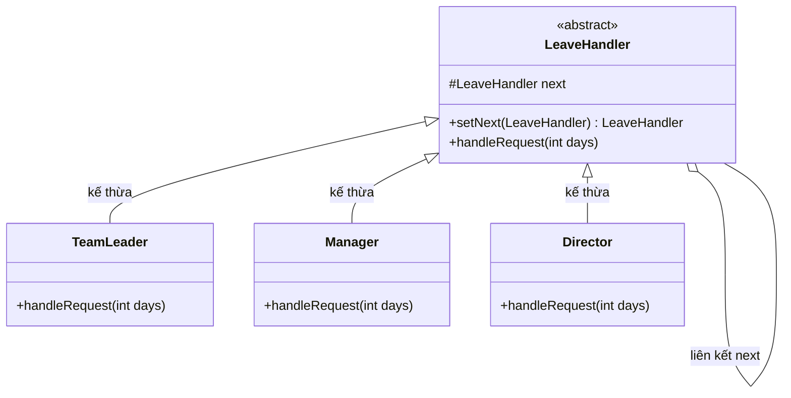
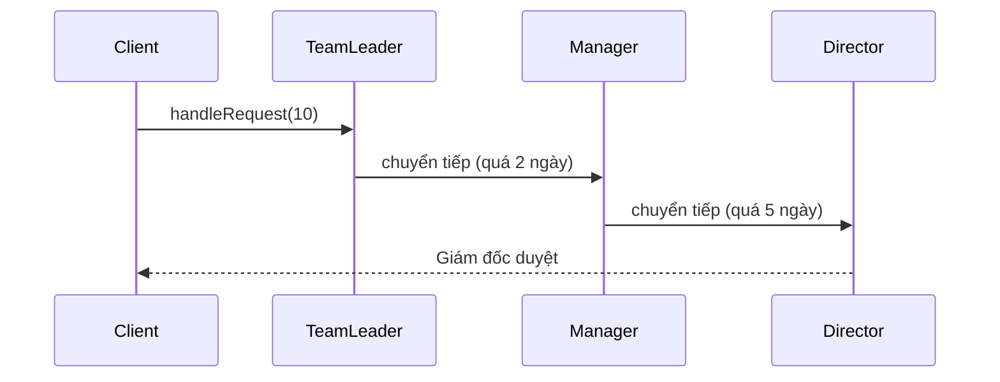

# Java Design Pattern - Chain of Responsibility

Chain of Responsibility là mẫu thiết kế hành vi cho phép một yêu cầu đi lần lượt qua một chuỗi các đối tượng xử lý, mỗi đối tượng tự quyết định xử lý hay chuyển tiếp cho người sau. Cách này giúp tách biệt người gửi yêu cầu khỏi người xử lý, dễ thêm bớt bước xử lý. Nó rất quen thuộc qua middleware web hay bộ lọc spam. Bài này giới thiệu tổng quan; phần chi tiết và ví dụ Java nằm bên dưới.

## Mục đích

**Chain of Responsibility** (Chuỗi trách nhiệm) là một mẫu thiết kế hành vi (Behavioral Pattern) cho phép bạn truyền một yêu cầu dọc theo một chuỗi các đối tượng xử lý (handler). Mỗi handler quyết định xử lý yêu cầu đó hay chuyển tiếp sang handler tiếp theo trong chuỗi.

## Vấn đề giải quyết

Khi có nhiều đối tượng có thể xử lý một yêu cầu, nhưng bạn không muốn gắn chặt (hard-code) logic chọn handler vào phía người gửi. Ví dụ: hệ thống duyệt đơn xin nghỉ phép — nhân viên gửi đơn, tùy số ngày nghỉ mà trưởng nhóm, quản lý, hay giám đốc mới có thẩm quyền phê duyệt.

## Cấu trúc

- **Handler** (interface/abstract class): khai báo phương thức xử lý và thiết lập handler kế tiếp.
- **ConcreteHandler**: xử lý yêu cầu nếu đủ thẩm quyền, ngược lại chuyển tiếp.
- **Client**: tạo chuỗi và gửi yêu cầu tới handler đầu tiên.

Sơ đồ lớp dưới đây mô tả quan hệ kế thừa giữa handler trừu tượng và các handler cụ thể, cùng liên kết `next` để tạo thành chuỗi:



Mỗi ConcreteHandler đều kế thừa `LeaveHandler` và giữ tham chiếu tới handler kế tiếp qua thuộc tính `next`, nên yêu cầu có thể trượt dọc theo chuỗi.

Sơ đồ tuần tự sau minh họa một yêu cầu nghỉ 10 ngày được chuyển tiếp qua chuỗi cho tới khi gặp handler đủ thẩm quyền:



Mỗi handler tự kiểm tra thẩm quyền; nếu không đủ thì đẩy yêu cầu sang người sau thay vì trả lỗi cho client.

## Ví dụ Java: Hệ thống duyệt đơn nghỉ phép

```java
// Handler trừu tượng
abstract class LeaveHandler {
    protected LeaveHandler next;

    public LeaveHandler setNext(LeaveHandler next) {
        this.next = next;
        return next;
    }

    public abstract void handleRequest(int days);
}

// Trưởng nhóm: duyệt tối đa 2 ngày
class TeamLeader extends LeaveHandler {
    @Override
    public void handleRequest(int days) {
        if (days <= 2) {
            System.out.println("Trưởng nhóm duyệt " + days + " ngày nghỉ.");
        } else if (next != null) {
            next.handleRequest(days);
        }
    }
}

// Quản lý: duyệt tối đa 5 ngày
class Manager extends LeaveHandler {
    @Override
    public void handleRequest(int days) {
        if (days <= 5) {
            System.out.println("Quản lý duyệt " + days + " ngày nghỉ.");
        } else if (next != null) {
            next.handleRequest(days);
        }
    }
}

// Giám đốc: duyệt tối đa 15 ngày
class Director extends LeaveHandler {
    @Override
    public void handleRequest(int days) {
        if (days <= 15) {
            System.out.println("Giám đốc duyệt " + days + " ngày nghỉ.");
        } else {
            System.out.println("Không thể duyệt " + days + " ngày nghỉ. Vượt quá giới hạn.");
        }
    }
}

// Client
public class ChainDemo {
    public static void main(String[] args) {
        LeaveHandler teamLeader = new TeamLeader();
        LeaveHandler manager = new Manager();
        LeaveHandler director = new Director();

        // Xây dựng chuỗi: TeamLeader -> Manager -> Director
        teamLeader.setNext(manager).setNext(director);

        teamLeader.handleRequest(1);   // Trưởng nhóm duyệt
        teamLeader.handleRequest(4);   // Quản lý duyệt
        teamLeader.handleRequest(10);  // Giám đốc duyệt
        teamLeader.handleRequest(20);  // Không ai duyệt được
    }
}
```

**Kết quả:**
```
Trưởng nhóm duyệt 1 ngày nghỉ.
Quản lý duyệt 4 ngày nghỉ.
Giám đốc duyệt 10 ngày nghỉ.
Không thể duyệt 20 ngày nghỉ. Vượt quá giới hạn.
```

## Ưu điểm

- Giảm sự phụ thuộc giữa người gửi và người xử lý yêu cầu.
- Tuân thủ nguyên tắc Single Responsibility — mỗi handler chỉ lo một loại xử lý.
- Dễ thêm/bỏ handler mà không ảnh hưởng client.

## Nhược điểm

- Yêu cầu có thể không được xử lý nếu chuỗi không có handler phù hợp.
- Khó debug khi chuỗi quá dài.

## Khi nào dùng

- Khi có nhiều đối tượng có thể xử lý một yêu cầu và thứ tự xử lý có thể thay đổi động.
- Khi muốn tách biệt logic chọn handler khỏi phía người gửi.
- Ví dụ thực tế: middleware trong web framework, bộ lọc spam email, hệ thống logging nhiều cấp.
