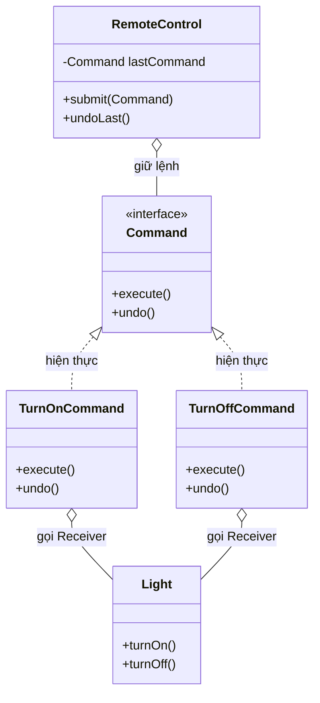
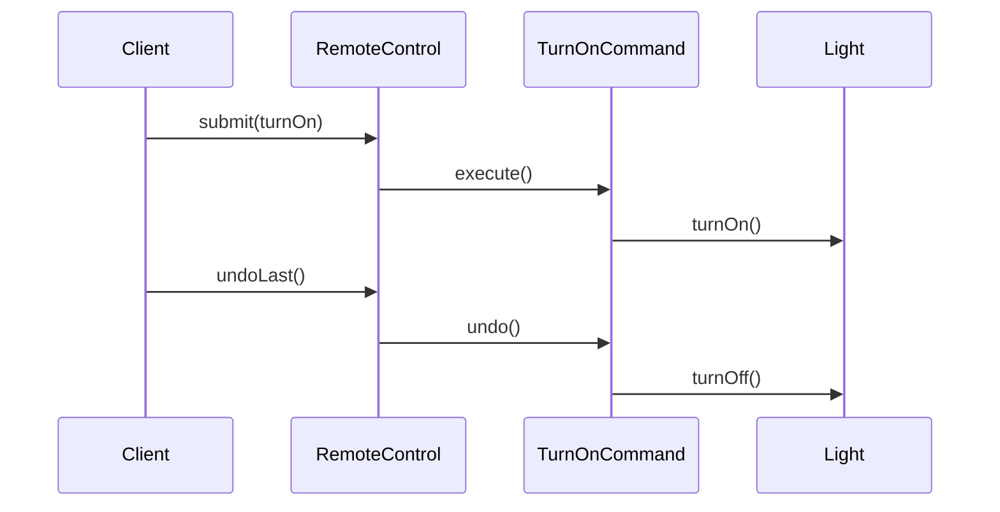

# Java Design Pattern - Command

Command là mẫu thiết kế hành vi đóng gói một yêu cầu thành một đối tượng riêng, chứa đầy đủ thông tin để thực thi. Nhờ vậy bạn có thể tách người ra lệnh khỏi người thực hiện, xếp hàng lệnh, ghi log và đặc biệt là hỗ trợ hoàn tác (undo/redo). Pattern này rất hữu ích cho nút bấm GUI hay trình soạn thảo. Bài này giới thiệu tổng quan; phần chi tiết và ví dụ Java nằm bên dưới.

## Mục đích

**Command** (Lệnh) là một mẫu thiết kế hành vi đóng gói một yêu cầu thành một đối tượng độc lập, chứa đầy đủ thông tin về yêu cầu đó. Điều này cho phép bạn tham số hóa các phương thức với các yêu cầu khác nhau, trì hoãn hoặc xếp hàng yêu cầu, và hỗ trợ hoàn tác (undo).

## Vấn đề giải quyết

Khi cần tách biệt đối tượng phát ra yêu cầu (invoker) khỏi đối tượng thực hiện yêu cầu (receiver). Ví dụ: nút bấm trong GUI có thể thực hiện nhiều thao tác khác nhau mà không cần biết thao tác đó là gì.

## Cấu trúc

- **Command** (interface): khai báo phương thức `execute()` và `undo()`.
- **ConcreteCommand**: triển khai lệnh cụ thể, lưu trạng thái để hỗ trợ undo.
- **Receiver**: đối tượng thực sự thực hiện công việc.
- **Invoker**: kích hoạt lệnh, không cần biết lệnh làm gì.
- **Client**: tạo ConcreteCommand và gán Receiver cho nó.

Sơ đồ lớp dưới đây thể hiện cách Command tách người ra lệnh (Invoker) khỏi người thực hiện (Receiver):



`RemoteControl` chỉ làm việc với interface `Command`, không cần biết lệnh cụ thể hay Receiver bên trong là gì.

Sơ đồ tuần tự sau minh họa luồng thực thi và hoàn tác một lệnh bật đèn:



Khi undo, Invoker gọi lại `undo()` trên lệnh vừa chạy, và chính lệnh biết cách đảo ngược thao tác trên Receiver.

## Ví dụ Java: Hệ thống đèn có Undo

```java
// Command interface
interface Command {
    void execute();
    void undo();
}

// Receiver
class Light {
    private String location;

    public Light(String location) {
        this.location = location;
    }

    public void turnOn() {
        System.out.println(location + ": Đèn đã bật.");
    }

    public void turnOff() {
        System.out.println(location + ": Đèn đã tắt.");
    }
}

// ConcreteCommand: Bật đèn
class TurnOnCommand implements Command {
    private Light light;

    public TurnOnCommand(Light light) {
        this.light = light;
    }

    @Override
    public void execute() {
        light.turnOn();
    }

    @Override
    public void undo() {
        light.turnOff();
    }
}

// ConcreteCommand: Tắt đèn
class TurnOffCommand implements Command {
    private Light light;

    public TurnOffCommand(Light light) {
        this.light = light;
    }

    @Override
    public void execute() {
        light.turnOff();
    }

    @Override
    public void undo() {
        light.turnOn();
    }
}

// Invoker: Remote control
class RemoteControl {
    private Command lastCommand;

    public void submit(Command command) {
        command.execute();
        lastCommand = command;
    }

    public void undoLast() {
        if (lastCommand != null) {
            lastCommand.undo();
        }
    }
}

// Client
public class CommandDemo {
    public static void main(String[] args) {
        Light livingRoomLight = new Light("Phòng khách");

        Command turnOn  = new TurnOnCommand(livingRoomLight);
        Command turnOff = new TurnOffCommand(livingRoomLight);

        RemoteControl remote = new RemoteControl();
        remote.submit(turnOn);   // Bật đèn
        remote.undoLast();       // Hoàn tác -> Tắt đèn
        remote.submit(turnOff);  // Tắt đèn
        remote.undoLast();       // Hoàn tác -> Bật đèn
    }
}
```

**Kết quả:**
```
Phòng khách: Đèn đã bật.
Phòng khách: Đèn đã tắt.
Phòng khách: Đèn đã tắt.
Phòng khách: Đèn đã bật.
```

## Ưu điểm

- Tách biệt hoàn toàn người gửi yêu cầu và người thực hiện.
- Dễ thêm lệnh mới mà không thay đổi code hiện có (Open/Closed Principle).
- Hỗ trợ undo/redo, macro command (nhóm nhiều lệnh), xếp hàng lệnh.

## Nhược điểm

- Tăng số lượng lớp (mỗi thao tác cần một ConcreteCommand riêng).
- Có thể phức tạp hóa code với các thao tác đơn giản.

## Khi nào dùng

- Khi cần hỗ trợ undo/redo (trình soạn thảo văn bản, Photoshop).
- Khi cần xếp hàng, lên lịch hoặc ghi log các yêu cầu.
- Khi cần tham số hóa đối tượng với các thao tác (nút bấm trong GUI).
- Khi muốn triển khai transaction (giao dịch) có thể rollback.
