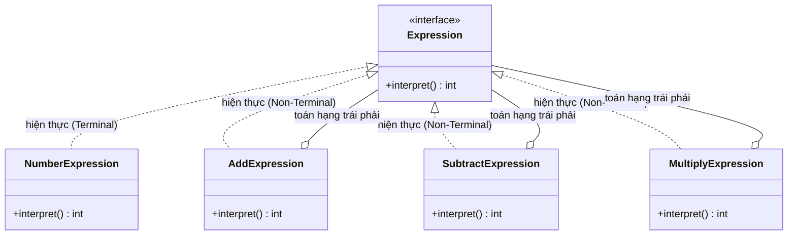

# Java Design Pattern - Interpreter

Interpreter là mẫu thiết kế hành vi giúp định nghĩa một ngôn ngữ nhỏ và cách phiên giải nó, bằng cách biểu diễn mỗi quy tắc ngữ pháp thành một lớp riêng. Nhờ vậy việc thêm hoặc thay đổi quy tắc trở nên dễ dàng. Pattern này phù hợp với các ngôn ngữ đơn giản như biểu thức toán học hay rule engine. Bài này giới thiệu tổng quan; phần chi tiết và ví dụ Java nằm bên dưới.

## Mục đích

**Interpreter** (Trình thông dịch) là một mẫu thiết kế hành vi định nghĩa một ngôn ngữ (hoặc ký hiệu) cùng với bộ phiên giải cho ngôn ngữ đó. Mỗi quy tắc ngữ pháp được biểu diễn thành một lớp, giúp dễ dàng mở rộng và thay đổi ngôn ngữ.

## Vấn đề giải quyết

Khi bạn cần xử lý các biểu thức thuộc một ngôn ngữ đơn giản — ví dụ: biểu thức toán học, câu truy vấn, cấu hình dạng DSL (Domain-Specific Language — ngôn ngữ đặc thù theo miền), hay biểu thức chính quy.

## Cấu trúc

- **AbstractExpression**: khai báo phương thức `interpret(Context)`.
- **TerminalExpression**: biểu thức không thể tách nhỏ hơn (lá trong cây cú pháp).
- **NonTerminalExpression**: biểu thức kết hợp nhiều biểu thức con.
- **Context**: chứa thông tin toàn cục cần cho quá trình phiên giải.

Sơ đồ lớp dưới đây cho thấy cách các biểu thức tổ hợp (Non-Terminal) chứa các biểu thức con cùng kiểu `Expression`, tạo thành cây cú pháp:



`NumberExpression` là lá không tách nhỏ được, còn các phép toán là nút cha gọi đệ quy `interpret()` trên các biểu thức con để tính kết quả.

## Ví dụ Java: Bộ đánh giá biểu thức toán học đơn giản

```java
// AbstractExpression
interface Expression {
    int interpret();
}

// TerminalExpression: Số nguyên
class NumberExpression implements Expression {
    private int number;

    public NumberExpression(int number) {
        this.number = number;
    }

    @Override
    public int interpret() {
        return number;
    }
}

// NonTerminalExpression: Phép cộng
class AddExpression implements Expression {
    private Expression left;
    private Expression right;

    public AddExpression(Expression left, Expression right) {
        this.left = left;
        this.right = right;
    }

    @Override
    public int interpret() {
        return left.interpret() + right.interpret();
    }
}

// NonTerminalExpression: Phép trừ
class SubtractExpression implements Expression {
    private Expression left;
    private Expression right;

    public SubtractExpression(Expression left, Expression right) {
        this.left = left;
        this.right = right;
    }

    @Override
    public int interpret() {
        return left.interpret() - right.interpret();
    }
}

// NonTerminalExpression: Phép nhân
class MultiplyExpression implements Expression {
    private Expression left;
    private Expression right;

    public MultiplyExpression(Expression left, Expression right) {
        this.left = left;
        this.right = right;
    }

    @Override
    public int interpret() {
        return left.interpret() * right.interpret();
    }
}

// Client
public class InterpreterDemo {
    public static void main(String[] args) {
        // Biểu diễn: (3 + 5) * (10 - 4)
        Expression expr = new MultiplyExpression(
            new AddExpression(new NumberExpression(3), new NumberExpression(5)),
            new SubtractExpression(new NumberExpression(10), new NumberExpression(4))
        );

        System.out.println("(3 + 5) * (10 - 4) = " + expr.interpret());

        // Biểu diễn: 20 - (4 + 3)
        Expression expr2 = new SubtractExpression(
            new NumberExpression(20),
            new AddExpression(new NumberExpression(4), new NumberExpression(3))
        );

        System.out.println("20 - (4 + 3) = " + expr2.interpret());
    }
}
```

**Kết quả:**
```
(3 + 5) * (10 - 4) = 48
20 - (4 + 3) = 13
```

## Ưu điểm

- Dễ mở rộng ngôn ngữ bằng cách thêm lớp biểu thức mới.
- Mỗi quy tắc ngữ pháp là một lớp riêng, dễ kiểm thử và bảo trì.
- Phù hợp với các ngôn ngữ đơn giản, ít quy tắc.

## Nhược điểm

- Ngữ pháp phức tạp dẫn đến quá nhiều lớp, khó quản lý.
- Hiệu năng kém với ngôn ngữ lớn — nên dùng parser/compiler chuyên dụng thay thế.

## Khi nào dùng

- Khi xây dựng DSL đơn giản (cấu hình, rule engine, expression evaluator).
- Khi ngữ pháp ngôn ngữ ổn định và không quá phức tạp.
- Ví dụ thực tế: biểu thức chính quy, SQL parser đơn giản, bộ đánh giá điều kiện trong rule engine.
