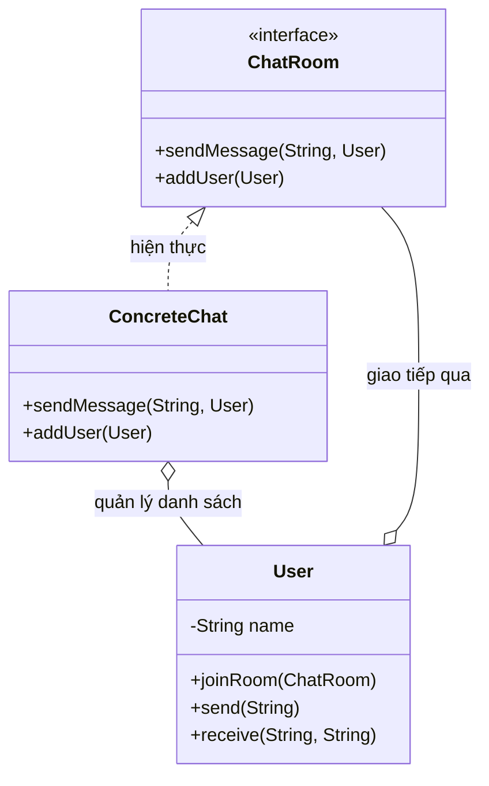
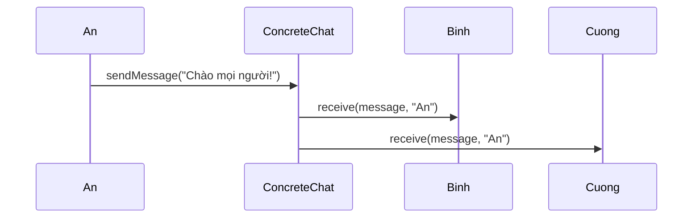

# Java Design Pattern - Mediator

Mediator là mẫu thiết kế hành vi giúp các đối tượng không giao tiếp trực tiếp với nhau mà thông qua một đối tượng trung gian điều phối. Nhờ vậy giảm được sự phụ thuộc chằng chịt giữa nhiều đối tượng, code dễ bảo trì và dễ mở rộng hơn. Ví dụ quen thuộc là phòng chat hay điều phối các thành phần trong một form GUI. Bài này giới thiệu tổng quan; phần chi tiết và ví dụ Java nằm bên dưới.

:::note[Ghi nhớ nhanh]

- ⭐ **`Mediator` buộc các đối tượng giao tiếp qua một trung gian thay vì trực tiếp** — giảm mạnh sự ghép nối (coupling) giữa chúng.
- ⭐ **Colleague chỉ biết đến Mediator** — trong ví dụ phòng chat, mỗi `User` chỉ gửi tin qua `ChatRoom`; Mediator lo phân phối tới đúng người nhận.
- **Ưu điểm** — tập trung logic điều phối vào một nơi, dễ thêm/bớt thành phần mà không ảnh hưởng thành phần khác.
- **Nhược điểm** — Mediator dễ phình thành "God Object" chứa quá nhiều logic, khó bảo trì.
- **Khi nào dùng** — hệ thống chat, GUI dialog, air traffic control, event bus.

:::

## Mục đích

**Mediator** (Trung gian) là một mẫu thiết kế hành vi giảm sự phụ thuộc hỗn loạn giữa nhiều đối tượng bằng cách buộc chúng giao tiếp thông qua một đối tượng trung gian thay vì trực tiếp với nhau. Điều này giúp giảm sự ghép nối (coupling) giữa các đối tượng.

## Vấn đề giải quyết

Khi các đối tượng trong hệ thống phụ thuộc lẫn nhau quá nhiều (tạo thành mạng lưới dày đặc), việc thay đổi một đối tượng sẽ ảnh hưởng dây chuyền đến tất cả các đối tượng liên quan. Ví dụ: hệ thống chat phòng — không ai nhắn tin trực tiếp với từng người, tất cả đều gửi qua server phòng chat.

## Cấu trúc

- **Mediator** (interface): định nghĩa phương thức giao tiếp giữa các thành phần.
- **ConcreteMediator**: triển khai logic điều phối, biết và quản lý các đối tượng tham gia.
- **Colleague**: mỗi đối tượng tham gia chỉ biết đến Mediator, không biết đồng nghiệp khác.

Sơ đồ lớp dưới đây cho thấy các Colleague (`User`) chỉ biết đến Mediator (`ChatRoom`) chứ không tham chiếu trực tiếp lẫn nhau:



Nhờ đi qua Mediator, việc thêm hay bớt một `User` không làm thay đổi các `User` khác.

Sơ đồ tuần tự sau minh họa một tin nhắn được trung gian phát tới các thành viên còn lại:



Người gửi chỉ đẩy tin cho Mediator; Mediator lo việc phân phối tới đúng những người nhận.

## Ví dụ Java: Phòng chat

```java
import java.util.ArrayList;
import java.util.List;

// Mediator interface
interface ChatRoom {
    void sendMessage(String message, User sender);
    void addUser(User user);
}

// Colleague
class User {
    private String name;
    private ChatRoom chatRoom;

    public User(String name) {
        this.name = name;
    }

    public void joinRoom(ChatRoom room) {
        this.chatRoom = room;
        room.addUser(this);
    }

    public void send(String message) {
        System.out.println("[" + name + " gửi]: " + message);
        chatRoom.sendMessage(message, this);
    }

    public void receive(String message, String senderName) {
        System.out.println("  -> " + name + " nhận từ " + senderName + ": " + message);
    }

    public String getName() {
        return name;
    }
}

// ConcreteMediator
class ConcreteChat implements ChatRoom {
    private List<User> users = new ArrayList<>();

    @Override
    public void addUser(User user) {
        users.add(user);
    }

    @Override
    public void sendMessage(String message, User sender) {
        for (User user : users) {
            // Không gửi lại cho người gửi
            if (!user.equals(sender)) {
                user.receive(message, sender.getName());
            }
        }
    }
}

// Client
public class MediatorDemo {
    public static void main(String[] args) {
        ChatRoom room = new ConcreteChat();

        User an    = new User("An");
        User binh  = new User("Bình");
        User cuong = new User("Cường");

        an.joinRoom(room);
        binh.joinRoom(room);
        cuong.joinRoom(room);

        an.send("Chào mọi người!");
        binh.send("Chào An!");
    }
}
```

**Kết quả:**
```
[An gửi]: Chào mọi người!
  -> Bình nhận từ An: Chào mọi người!
  -> Cường nhận từ An: Chào mọi người!
[Bình gửi]: Chào An!
  -> An nhận từ Bình: Chào An!
  -> Cường nhận từ Bình: Chào An!
```

## Ưu điểm

- Giảm mạnh sự ghép nối giữa các thành phần — mỗi thành phần chỉ phụ thuộc vào Mediator.
- Tập trung logic điều phối vào một nơi, dễ hiểu và bảo trì.
- Dễ thêm/bỏ thành phần mà không ảnh hưởng đến các thành phần khác.

## Nhược điểm

- Mediator có thể trở thành "God Object" (đối tượng toàn năng) nếu chứa quá nhiều logic.
- Khi hệ thống phức tạp, Mediator có thể trở nên khó bảo trì.

## Khi nào dùng

- Khi nhiều đối tượng giao tiếp theo cách phức tạp tạo ra sự phụ thuộc chồng chéo.
- Khi muốn tái sử dụng thành phần nhưng không thể vì chúng phụ thuộc lẫn nhau.
- Ví dụ thực tế: hệ thống chat, GUI dialog (các thành phần tương tác qua form), air traffic control (điều phối không lưu), event bus trong ứng dụng.
