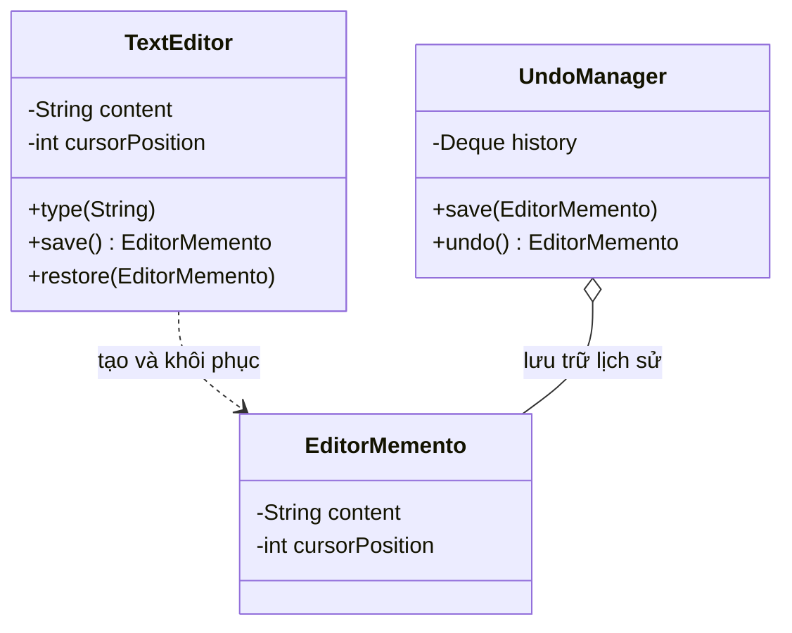
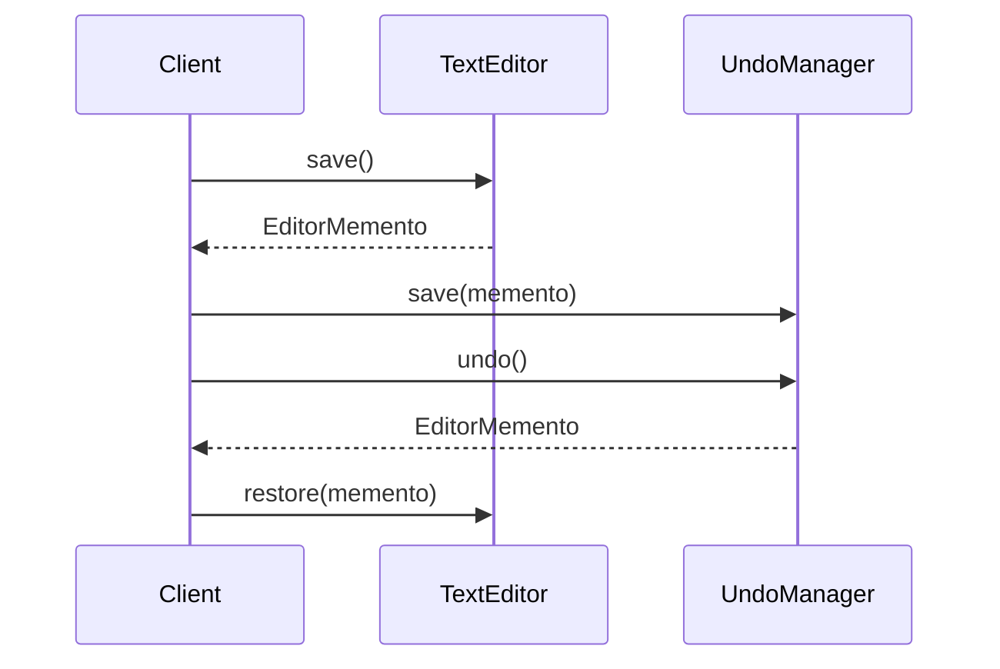

# Java Design Pattern - Memento

Memento là một mẫu thiết kế thuộc nhóm hành vi, giúp lưu lại trạng thái của một đối tượng để sau này có thể khôi phục lại mà không làm lộ chi tiết bên trong của nó. Đây chính là nền tảng để làm tính năng Undo/Redo (Ctrl+Z) hay lưu game, rollback giao dịch. Bài này giải thích mục đích, cấu trúc và kèm ví dụ Java cho người mới; chi tiết nằm bên dưới.

## Mục đích

**Memento** (Kỷ niệm / Ảnh chụp trạng thái) là một mẫu thiết kế hành vi cho phép lưu và khôi phục trạng thái trước đó của một đối tượng mà không vi phạm tính đóng gói (encapsulation). Đây là nền tảng cho tính năng Undo/Redo.

## Vấn đề giải quyết

Khi bạn cần lưu "ảnh chụp" trạng thái của đối tượng để sau này có thể quay lại trạng thái đó — ví dụ tính năng Ctrl+Z trong trình soạn thảo, lưu game, hay rollback giao dịch — mà không để lộ chi tiết nội bộ của đối tượng ra bên ngoài.

## Cấu trúc

- **Originator** (Người tạo): đối tượng có trạng thái cần lưu, tạo và sử dụng Memento.
- **Memento**: lưu trữ trạng thái của Originator. Chỉ Originator được phép đọc dữ liệu bên trong.
- **Caretaker** (Người quản lý): lưu trữ Memento nhưng không đọc nội dung bên trong nó.

Sơ đồ lớp dưới đây mô tả ba vai trò: Originator tạo/khôi phục Memento, còn Caretaker chỉ lưu trữ mà không đọc nội dung:



`UndoManager` chỉ giữ các `EditorMemento` như hộp kín, không truy cập được trạng thái bên trong nên không phá vỡ tính đóng gói.

Sơ đồ tuần tự sau minh họa luồng lưu ảnh chụp rồi hoàn tác:



Khi cần undo, client lấy Memento cũ từ Caretaker rồi đưa lại cho Originator khôi phục.

## Ví dụ Java: Trình soạn thảo văn bản với Undo

```java
import java.util.ArrayDeque;
import java.util.Deque;

// Memento: Lưu trạng thái văn bản
class EditorMemento {
    private final String content;
    private final int cursorPosition;

    public EditorMemento(String content, int cursorPosition) {
        this.content = content;
        this.cursorPosition = cursorPosition;
    }

    // Chỉ Originator mới gọi các phương thức này
    String getContent() { return content; }
    int getCursorPosition() { return cursorPosition; }
}

// Originator: Trình soạn thảo
class TextEditor {
    private String content = "";
    private int cursorPosition = 0;

    public void type(String text) {
        content = content.substring(0, cursorPosition)
                + text
                + content.substring(cursorPosition);
        cursorPosition += text.length();
    }

    public void deleteLast(int count) {
        if (cursorPosition >= count) {
            content = content.substring(0, cursorPosition - count)
                    + content.substring(cursorPosition);
            cursorPosition -= count;
        }
    }

    // Tạo ảnh chụp trạng thái hiện tại
    public EditorMemento save() {
        return new EditorMemento(content, cursorPosition);
    }

    // Khôi phục trạng thái từ ảnh chụp
    public void restore(EditorMemento memento) {
        this.content = memento.getContent();
        this.cursorPosition = memento.getCursorPosition();
    }

    public void show() {
        System.out.println("Nội dung: \"" + content + "\" | Con trỏ: " + cursorPosition);
    }
}

// Caretaker: Quản lý lịch sử undo
class UndoManager {
    private Deque<EditorMemento> history = new ArrayDeque<>();

    public void save(EditorMemento memento) {
        history.push(memento);
    }

    public EditorMemento undo() {
        if (!history.isEmpty()) {
            return history.pop();
        }
        return null;
    }
}

// Client
public class MementoDemo {
    public static void main(String[] args) {
        TextEditor editor = new TextEditor();
        UndoManager undoManager = new UndoManager();

        // Lưu trạng thái trước khi gõ
        undoManager.save(editor.save());
        editor.type("Xin chào");
        editor.show();

        undoManager.save(editor.save());
        editor.type(" thế giới");
        editor.show();

        undoManager.save(editor.save());
        editor.type("!!!");
        editor.show();

        System.out.println("\n--- Undo ---");
        editor.restore(undoManager.undo());
        editor.show();

        editor.restore(undoManager.undo());
        editor.show();
    }
}
```

**Kết quả:**
```
Nội dung: "Xin chào" | Con trỏ: 8
Nội dung: "Xin chào thế giới" | Con trỏ: 17
Nội dung: "Xin chào thế giới!!!" | Con trỏ: 20

--- Undo ---
Nội dung: "Xin chào thế giới" | Con trỏ: 17
Nội dung: "Xin chào" | Con trỏ: 8
```

## Ưu điểm

- Lưu và khôi phục trạng thái mà không vi phạm tính đóng gói.
- Đơn giản hóa Originator — không cần quản lý lịch sử, Caretaker lo việc đó.
- Hỗ trợ undo/redo đa cấp.

## Nhược điểm

- Tốn bộ nhớ nếu lưu quá nhiều ảnh chụp trạng thái lớn.
- Caretaker cần biết khi nào nên hủy Memento cũ để tránh rò rỉ bộ nhớ.

## Khi nào dùng

- Khi cần tính năng undo/redo (trình soạn thảo, vẽ đồ họa, IDE).
- Khi cần lưu checkpoint để rollback (lưu game, giao dịch ngân hàng).
- Khi cần tạo snapshot của trạng thái hệ thống để khôi phục sau sự cố.
