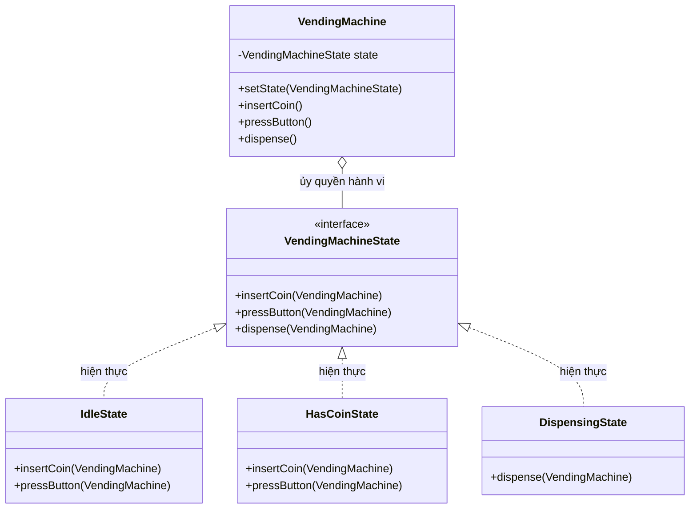
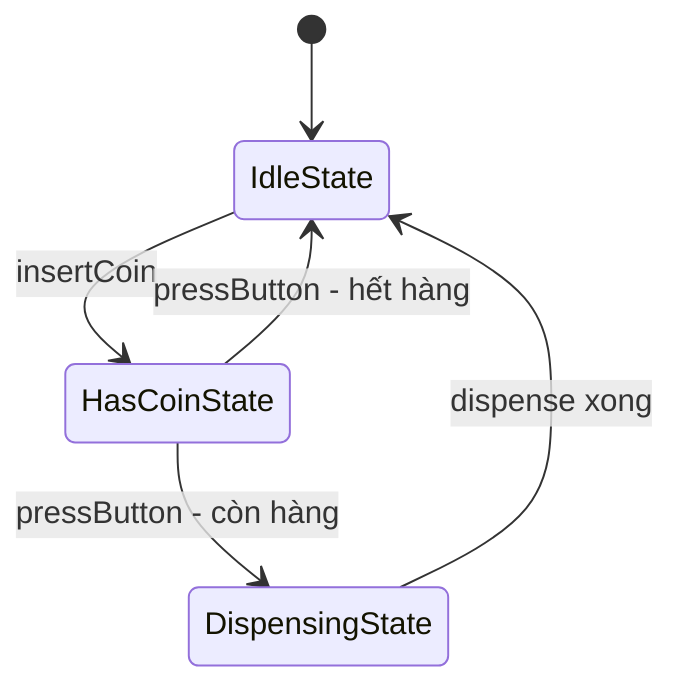

# Java Design Pattern - State

State là một mẫu thiết kế hành vi cho phép một đối tượng thay đổi cách hành xử khi trạng thái bên trong của nó thay đổi, nhìn từ ngoài cứ như nó đổi hẳn sang một lớp khác. Mẫu này giúp dọn sạch những khối if-else hay switch-case rối rắm liên quan đến trạng thái. Bài này giải thích cách dùng kèm ví dụ máy bán hàng tự động; chi tiết nằm bên dưới.

:::note[Ghi nhớ nhanh]

- ⭐ **`State` cho phép đối tượng đổi hành vi khi trạng thái nội tại thay đổi** — nhìn từ ngoài như đối tượng đã đổi lớp.
- ⭐ **Loại bỏ các khối `if-else` / `switch-case` phức tạp** — `Context` (`VendingMachine`) ủy quyền hành vi cho đối tượng `State` hiện tại (`IdleState`, `HasCoinState`, `DispensingState`).
- **Logic chuyển trạng thái nằm trong từng `ConcreteState`** — chính state tự gọi `setState()` để chuyển Context sang trạng thái kế tiếp.
- **Ưu điểm** — mỗi state một Single Responsibility, dễ thêm trạng thái mới.
- **Nhược điểm** — tăng số lượng lớp, logic chuyển trạng thái phân tán khó theo dõi.

:::

## Mục đích

**State** (Trạng thái) là một mẫu thiết kế hành vi cho phép một đối tượng thay đổi hành vi khi trạng thái nội tại của nó thay đổi. Từ bên ngoài trông như đối tượng đã đổi lớp. Pattern này loại bỏ các khối `if-else` hoặc `switch-case` phức tạp liên quan đến trạng thái.

## Vấn đề giải quyết

Khi hành vi của đối tượng phụ thuộc vào trạng thái và phải thay đổi tại runtime. Ví dụ: máy bán hàng tự động — khi "chưa có tiền" thì nhấn nút mua không có tác dụng; khi "đã bỏ tiền" thì nhấn nút mua mới lấy được hàng.

## Cấu trúc

- **Context**: đối tượng chính, lưu tham chiếu tới trạng thái hiện tại, ủy quyền hành vi cho State.
- **State** (interface): khai báo các phương thức ứng với hành vi của Context.
- **ConcreteState**: triển khai hành vi cụ thể cho từng trạng thái, có thể chuyển Context sang trạng thái khác.

Sơ đồ lớp dưới đây cho thấy Context (`VendingMachine`) ủy quyền hành vi cho interface `VendingMachineState`, mỗi trạng thái là một lớp riêng:



Máy không tự chứa các khối `if-else`, mà chuyển việc xử lý cho đối tượng trạng thái hiện tại.

Sơ đồ trạng thái dưới đây minh họa cách máy chuyển giữa các trạng thái khi nhận thao tác:



Chính các ConcreteState tự quyết định chuyển Context sang trạng thái kế tiếp, nên logic chuyển trạng thái nằm gọn trong từng lớp.

## Ví dụ Java: Máy bán hàng tự động

```java
// State interface
interface VendingMachineState {
    void insertCoin(VendingMachine machine);
    void pressButton(VendingMachine machine);
    void dispense(VendingMachine machine);
}

// Context
class VendingMachine {
    private VendingMachineState state;
    private int itemCount;

    public VendingMachine(int itemCount) {
        this.itemCount = itemCount;
        this.state = new IdleState();
    }

    public void setState(VendingMachineState state) {
        this.state = state;
    }

    public int getItemCount() { return itemCount; }
    public void decreaseItem() { itemCount--; }

    public void insertCoin()  { state.insertCoin(this); }
    public void pressButton() { state.pressButton(this); }
    public void dispense()    { state.dispense(this); }

    public void showStatus() {
        System.out.println("Trạng thái: " + state.getClass().getSimpleName()
                + " | Hàng còn: " + itemCount);
    }
}

// ConcreteState: Chờ (chưa có tiền)
class IdleState implements VendingMachineState {
    @Override
    public void insertCoin(VendingMachine machine) {
        System.out.println("  Đã nhận tiền xu.");
        machine.setState(new HasCoinState());
    }

    @Override
    public void pressButton(VendingMachine machine) {
        System.out.println("  Vui lòng bỏ tiền trước.");
    }

    @Override
    public void dispense(VendingMachine machine) {
        System.out.println("  Không có giao dịch nào đang thực hiện.");
    }
}

// ConcreteState: Đã có tiền
class HasCoinState implements VendingMachineState {
    @Override
    public void insertCoin(VendingMachine machine) {
        System.out.println("  Đã có tiền rồi. Không nhận thêm.");
    }

    @Override
    public void pressButton(VendingMachine machine) {
        if (machine.getItemCount() > 0) {
            System.out.println("  Đã chọn hàng. Đang phát hàng...");
            machine.setState(new DispensingState());
            machine.dispense();
        } else {
            System.out.println("  Hết hàng! Trả lại tiền.");
            machine.setState(new IdleState());
        }
    }

    @Override
    public void dispense(VendingMachine machine) {
        System.out.println("  Nhấn nút để chọn hàng.");
    }
}

// ConcreteState: Đang phát hàng
class DispensingState implements VendingMachineState {
    @Override
    public void insertCoin(VendingMachine machine) {
        System.out.println("  Vui lòng đợi đang phát hàng.");
    }

    @Override
    public void pressButton(VendingMachine machine) {
        System.out.println("  Đang phát hàng, vui lòng đợi.");
    }

    @Override
    public void dispense(VendingMachine machine) {
        machine.decreaseItem();
        System.out.println("  Hàng đã được phát. Cảm ơn!");
        machine.setState(new IdleState());
    }
}

// Client
public class StateDemo {
    public static void main(String[] args) {
        VendingMachine machine = new VendingMachine(2);
        machine.showStatus();

        System.out.println("\n-- Giao dịch 1 --");
        machine.pressButton();  // Chưa có tiền
        machine.insertCoin();
        machine.pressButton();
        machine.showStatus();

        System.out.println("\n-- Giao dịch 2 --");
        machine.insertCoin();
        machine.insertCoin();   // Tiền dư
        machine.pressButton();
        machine.showStatus();
    }
}
```

**Kết quả:**
```
Trạng thái: IdleState | Hàng còn: 2

-- Giao dịch 1 --
  Vui lòng bỏ tiền trước.
  Đã nhận tiền xu.
  Đã chọn hàng. Đang phát hàng...
  Hàng đã được phát. Cảm ơn!
Trạng thái: IdleState | Hàng còn: 1

-- Giao dịch 2 --
  Đã nhận tiền xu.
  Đã có tiền rồi. Không nhận thêm.
  Đã chọn hàng. Đang phát hàng...
  Hàng đã được phát. Cảm ơn!
Trạng thái: IdleState | Hàng còn: 0
```

## Ưu điểm

- Loại bỏ các điều kiện `if-else` / `switch-case` phức tạp liên quan đến trạng thái.
- Tuân thủ Single Responsibility: mỗi ConcreteState chỉ xử lý một trạng thái.
- Dễ thêm trạng thái mới mà không ảnh hưởng Context và các trạng thái hiện có.

## Nhược điểm

- Tăng số lượng lớp khi có nhiều trạng thái.
- Logic chuyển trạng thái phân tán trong các ConcreteState có thể gây khó theo dõi.

## Khi nào dùng

- Khi đối tượng có nhiều trạng thái và hành vi phụ thuộc vào trạng thái đó.
- Khi code có quá nhiều `if-else` kiểm tra trạng thái.
- Ví dụ thực tế: máy bán hàng, đèn giao thông, trình phát nhạc (playing/paused/stopped), quy trình xử lý đơn hàng.
